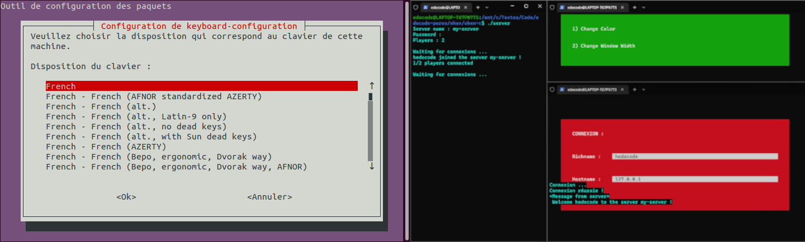
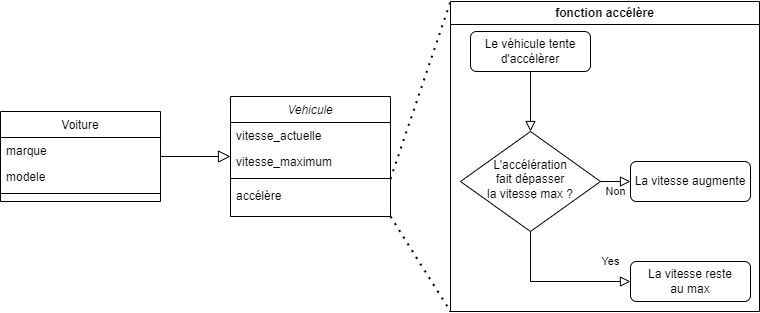
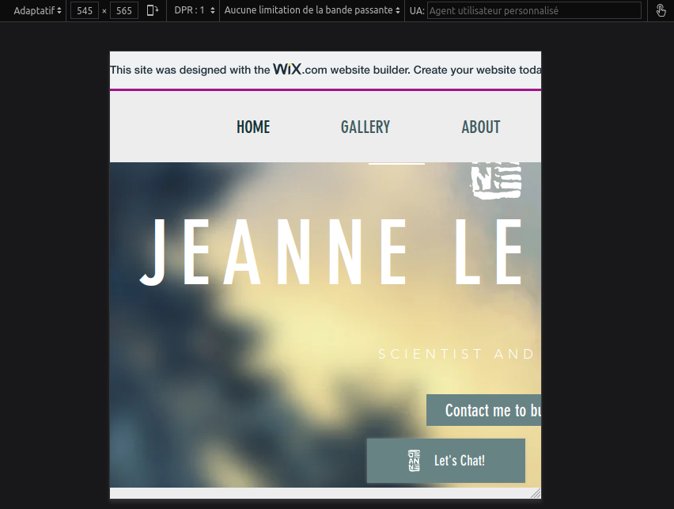

# Histoire et Philosophie de l'Information

Dorian Blanchard

Mémoire de fin d'étude pour la validation du diplôme résultant de mon parcours en Administration des systèmes d'information.


## Résumé

Cet ouvrage, conformément à son titre et aux recherches qu'il a nécessité, énonce le passé, le présent, et ma pensée sur le futur de la gestion de l'information. L'étude des connaissances existantes sur ce sujet vous replongera sûrement dans vos cours d'Histoire, elle mettra en situation le présent avec un abrégé allant de la préhistoire, jusqu’à l'état actuel du monde scientifique, et plus particulièrement de l'informatique. Cette discipline récente permet désormais de solutionner et automatiser beaucoup de tâches pénibles, mais sa pratique en elle même reste fastidieuse. C'est pourquoi j'en ai fait le cœur de ma problématique, que je l'analyse pour la repenser dans un essai philosophique, et que la dernière partie se nomme "Comment repenser la gestion de l'information pour moderniser l'expérience développeur ?". À l'aide des parties précédentes analysant son origine, la conclusion proposera ainsi une solution informatique innovante, combinant des technologies et pratiques existantes pour se simplifier elle même en utilisant de la rétro-action, et de la méta-programmation à travers une interface graphique simple et agréable.

<div style="page-break-after: always;"></div>

## Préface

Avant de vous raconter l'histoire de l'information, je vais brièvement vous parler de la mienne en toute vulnérabilité car pour comprendre et pouvoir juger l'identité de quelqu'un, il faut d'abord appréhender ses difficultés, appétences, habitudes, et plus globalement son vécu composé de l'accumulation de ses perceptions et actions marquantes.

Après l'obtention de mon Baccalauréat scientifique en 2016, débarquant alors en DUT informatique, je n'avais programmé qu'en BASIC sur une calculatrice Texas Instrument. A cette époque je n'étais qu'un gamin ayant sauté la grande section et le cours primaire pour avoir su lire à 2 ans et demi grâce au logiciel éducatif Lapin malin, qui débarque donc à Clermont-Ferrand du haut de ses de 17 ans, découvrant l'indépendance dans un 9m2 fibré du CROUS, dans lequel j'ai utilisé pendant 3 ans un réseau privé virtuel (VPN) pour contourner les limitations du réseau Renater, et pouvoir ainsi jouer à League Of Legends avec 5 millisecondes de latence.

Je n'avais alors jamais vraiment travaillé de ma vie, je ne faisait pas mes devoirs, et malgré cela obtenais toujours la moyenne tant bien que mal, voyant cette dernière chuter année après année. Je n'était évidement pas prêt à la complexité et la rigueur du C ou de Bash. Jusque là mon apprentissage de la discipline sur ma calculatrice était purement empirique, l'enseignement de la programmation nous a quant à lui été introduit sur papier, en commençant par les concepts, nous permettant d'avoir la théorie pour comprendre la pratique, j'ai donc été noyé par la quantité d'information et ne les comprenais souvent qu'après les contrôles, lors de la correction, me rendant compte de mes erreurs et réajustant ma version de ce qui était correct en fonction. J'étais tellement largué en contrôle que lorsque j'ai réalisé mon premier projet de C, comprenant alors pleinement la théorie en me l'appropriant par la pratique, réalisant 80% du projet par moi même, le professeur en question m'a mis une note bien moindre qu'au camarade ayant réalisé les 20% restants, donnant malgré tout la moyenne au dernier de notre trinôme.

[Ce projet est toujours disponible sur mon GitHub](https://github.com/hedocode/StudentResidenceManager), il s'agissait d'un gestionnaire de résidence étudiante, et moi qui haïssait alors la ligne de commande toute moche et très peu conviviale ou facile à utiliser, j'étais alors le seul étudiant de la promo à avoir réalisé tout l'affichage en changeant la couleur de fond et du texte, dans le but de simuler une interface graphique, à l'instar des premiers BIOS et des interfaces console interactives que l'on peut avoir encore aujourd'hui, comme `dpkg-reconfigure` sur linux, qui est soit y en passant car j'ai eu le cas récemment, le meilleur moyen de changer la langue de son clavier pour passer de QWERTY à AZERTY de façon permanente en utilisant la ligne de commande.



J'ai rapidement découvert les compilateurs, qui indiquent les erreurs tant bien que mal, qui ont parfois eux même des erreurs ou manques de précisions, nécessitant de comprendre pleinement son fonctionnement et son propre code pour arriver à trouver et corriger le problème. Cela peut être décourageant pour beaucoup, et c'est d'ailleurs certainement une des raisons pour lesquelles une bonne partie des élèves abandonnent en première année.

En deuxième année, j'ai dirigé et développé en grande partie un projet libre de fin d'année. Comme beaucoup d'étudiant en informatique je voulais réaliser un jeu, et me suis lancé dans son développement en C#, en utilisant MonoGame, un outil logiciel facilitant la création d'un jeu en fournissant de quoi afficher des rectangles, remplis de couleurs ou d'images, et quelles règles leur appliquer à chaque itération, avant mise à jour de l'affichage.

Après l'obtention de mon DUT, je n'ai pas trouvé d'alternance et donc pas été pris en licence pro. Je me suis donc dirigé vers une deuxième année de licence en informatique dans le but de réaliser un master par la suite. Lors de cette année, il nous a été demandé de réaliser un projet de client-serveur employant des sockets pour une communication en temps réel, j'ai pu réutiliser mon projet de C et les connaissances de mon DUT avec bien entendu la technique pour simuler une interface graphique dans un environnement console, créant avec succès [Ohen, un jeu multijoueur en ligne](https://github.com/hedocode/ohen/blob/master/ohen-c/README.md).

Pour autant, je me suis vite rendu compte qu'il me manquait des bases pour allez au bout de ce cursus, notamment le vocabulaire mathématique enseigné dans la première année de licence que je n'avais pas réalisé, et la motivation nécessaire pour réussir dans cette formation plus théorique, nécessitant d'entrer en Master après pour aboutir un Bac + 5. J'ai donc abandonné. En attendant la fin de l'année, j'ai failli être défaillant dans la seule matière qui me plaisait. Me rendant compte de cela, j'ai travaillé intensément pendant une semaine pour effectuer le projet demandé, codant ainsi le [Jeu de la vie de Conway](#John-Horton-Conway) en utilisant Monogame et C#, deux outils que je maîtrisait bien. J'ai alors pu retourner voir le professeur de cette matière avec un projet fini, bien que rendu en retard, et n'ai ainsi pas été considéré défaillant. Ce projet est également disponible sur mon GitHub dans une [compilation de mes projets MonoGames](#https://github.com/hedocode/MyMonoGames/tree/main), avec un [installeur Windows](#https://github.com/hedocode/MyMonoGames/releases/tag/v0.0.0).

Cette année à été à la fois la pire et la meilleure de ma vie, une fois que j'eus abandonné, j'étais complètement perdu mais résolu à trouver une solution et aller de l'avant. J'avais du mal à savoir ce que j'allais faire, j’étais atterré par mon échec ainsi que le manque de soutien et de volonté qui aurait pu me permettre de rattraper les lacunes de la première année de licence informatique que je n'avais pas réalisé. Je suis content d'avoir eu la jugeote nécessaire, ainsi qu'un bon ami qui m'a permis d'avoir une alternance en tant que Développeur Full-Stack chez l'éditeur de logiciel CRM SoEMan Group, et ainsi finir par intégrer la licence professionnelle web, après un an d'incertitude et de remise en question. Cette première alternance m'a permit de mieux comprendre SQL et PHP que pendant de mes cours, j'ai même pu reprendre un projet de refonte graphique de l'affichage de l’application web pour la rendre fonctionnelle sur toutes tailles d'écrans, ce projet a lui même été repris et aboutit par la suite.

Durant cette année de Licence professionnelle web, que j'ai obtenu en bout de course avec un minable 9.96, j'ai eu l'idée d'un projet informatique qui me permettrait de réaliser tout les autres plus facilement. J'ai donc, le 27 octobre 2019, commencé un prototype de logiciel d'environnement de développement intégré (IDE) alors nommé KIDE.

Après obtention de mon diplôme de niveau Bac + 3, j'ai été embauché le 25 décembre 2019 par l'agence web clermontoise De Bussac Multimédia, en tant que développeur Front-End. J'y ai travaillé pendant 2 ans et 6 mois, finissant Lead Développeur Front-End sur un projet React important et complexe. Ce premier CDI m'a permit d'apprendre à maîtriser des compétences qui ne nous avait pas été enseignées lors de mon cursus plus orienté Back-End. Les dates limites et l'exigence du rendu y était très importantes, j'ai du améliorer ma productivité et ma rigueur pour arriver à mes objectifs. Sans cette expérience je n'aurais pas connu l'École Hexagone ni eu la volonté et rigueur nécessaire à aboutir cette fin d'étude que j'ai réalisée en alternance chez ABGX en tant que développeur Full-Stack, continuant mon apprentissage et aboutissant ainsi un Bac + 5 avec la réalisation de ce mémoire.

Depuis le 27 octobre et durant toutes ses années, ma détermination à développer un IDE convivial et intuitif n'a cessé de grandir. À l'issue de mon contrat d'alternance, je sais d'or et déjà que je vais créer une entreprise et réaliser des missions de prestations pour financer la réalisation de ce projet. Le problème auquel il répondra sera celui de ce mémoire.

## Remerciements

Je ne remercierai jamais assez mes parents et grand parents, qui ont eu la chance d'être propriétaires d'ordinateurs, et d'une connexion d'internet, avant ma naissance en 1999. Grâce à cela il ont eu la démarche raisonnée de m'introduire à cette technologie, sur des logiciels éducatifs qui m'ont permis de savoir lire à l'âge de 2 ans.

Merci à toutes les personnes et enseignants des entreprises et écoles qui m'ont accueillis, lors de ma scolarité, et de mon début de carrière, me transmettant une majeure partie ce que je sais aujourd'hui, et ce dans la bienveillance, grâce à des processus itératifs d'amélioration continue.

Merci aux logiciels libres, à l'open source, à Wikipédia et tout leurs contributeurs.

Merci à toutes et tous, car nos métiers et découvertes ne sont que rarement le fruit d'un génie isolé, mais bien d'une collaboration et de l'amélioration d'idées antérieures.

Enfin, merci à toute personne qui lit actuellement ce texte.


## Introduction

La transmission d'information s'est fiabilisée au fil des époques, avec l'usage d'outils physique ; notamment des tablettes, plaques permettant de dessiner, d'écrire, lire, compter ; et ce jusqu'à pouvoir automatiser son traitement et son stockage, à l'aide de l'informatique, dont l'histoire ne commence concrètement qu'à la fin du 19 ème siècle.

De nos jours, nous interagissons quotidiennement avec des ordinateurs, que ce soit à l'aide de la programmation, ou des interfaces hommes-machines qui en sont issues. Pourtant, la grande majorité des utilisateurs, et même des personnes travaillant dans le domaine des Technologies de l'Information et de la Communication, ne connaissent pas la plupart des événements majeurs de son histoire.

Moi même n'ayant pas cette connaissance lorsque j'ai entrepris la rédaction de ce mémoire, j'ai décidé de me documenter et de rédiger un format accessible, avec ce qui m'a semblé être nécessaire pour comprendre le sujet, et ainsi le partager à vous, lecteurs de cet ouvrage.

Pour la rédaction de ce dernier, j'ai acquis 4 livres : 

- la 4e édition de "Computer, A History of the Information Machine" de Martin Campbell-Kelly, professeur émérite britannique, spécialisé dans l'histoire de l'informatique. Coécrite avec William F.Aspray, Jeffrey R. Yost, Honghong Tinn, et Gerardo Con Diaz.
- "The history of the computer : people, inventions, and technology that changed our world" de Rachel Ignotofsky
- "Histoire illustrée de l'informatique" d'Emmanuel Lazard et Pierre Mounier-Kuhn.
- "Transmettre" de Christophe André, Céline Alvarez, Catherine Gueguen, Matthieu Ricard, Frédéric Lenoir, Ilios Kotsou, Caroline Lesire

Les trois premiers livres ont chacun leurs avantages grâce à une approche différente d'un même sujet, sur lequel je m'attendais à trouver plus de bibliographie. Contrairement à ceux-ci, j'ai essayé d'avoir une démarche plus globale que l'informatique et l'ordinateur, qui sont des concepts très récent. Et ce en abordant le thème général qu'est l'information, tout en y ajoutant de la philosophie, ainsi que mon humble analyse subjective car j'aime penser, et que l'apprentissage des mathématiques et de l'informatique ont changé ma manière de concevoir le monde dans lequel nous vivons. Ce sont selon moi des philosophies à part entière, apportant des syntaxes et un vocabulaire, nécessitant un apprentissage constant de schémas de pensés dignes d'un logicien.

Dans ce mémoire, je vais donc revenir aux racines les plus ancestrales de la gestion de l'information, au vocabulaire et champ lexical qui y sont liés ou en découlent, ainsi qu'a leurs étymologies à travers leur [Histoire](#Histoire), qui représente toute la première partie de ce livre. J'y présenterai beaucoup de philosophes, scientifiques et de penseurs variés. De l'Antiquité aux époques plus modernes, les idées qu'ils ont amenées ont permis des inventions et progrès technologiques avec un développement de plus en plus rapide. Pourtant, les inventions qui ont le plus impacté l'humanité, resteront toujours les plus anciennes, avec au sommet d'entre elles, l'écriture.

J'aborderai aussi un sujet qui m'est cher, la programmation. Elle n'est pas forcement liée à l'informatique, c'est l'art de planifier et mettre en œuvre des étapes à suivre pour obtenir un résultat. Cela dit, elle passe inévitablement par de la gestion de l'information, à l'aide d'écriture, lecture, chiffrement, déchiffrement, émission, et réception.

Je m’intéresserai également à l'apprentissage qui représente l’acquisition et l'assimilation d'une information ou d'un système, très présent dans les technologies comme l'intelligence artificielle ; ainsi qu'à la pédagogie, propre à "l'animal social émotionnel" qu'est l'humain ; et à la compréhension du rapport maître / élève permettant la transmission de compétences.

L'ensemble de ses sujets, et l'information en général, prends une place de plus en plus importante dans nos quotidien, cela s'accompagne d'un volume exponentiel d'informations mondialement échangées. Nous avons développer une relation symbiotique avec la technologie, qui nous permet aujourd'hui de communiquer et de jouer presque instantanément au niveau mondial, améliorant même parfois  les conditions de vie et la santé, on parle d'ailleurs désormais de télé-santé. Pour autant, comme toutes les technologies récentes ayant un impact majeur, vient un rejet et une techno-phobie d'une certaine partie de la population pas encore convertie à son usage.

Avec mon point de vue de développeur web, je dresserai ensuite un [bilan de l’état actuel de l'informatique](#Pratiques-actuelles), de son marché, ses opportunités, ainsi qu'une étude de sa pratique moderne ; et ce afin d'en [identifier les problèmes](#Comprendre-la-problématique) que l'on y rencontre pour en dégager de possibles solutions, dressant ainsi un [essai](#Essai) philosophique expliquant ma projection en tant qu'acteur et éditeur de logiciels, pour [le futur de cette discipline](#EditIDE-ou-"Comment-repenser-la-gestion-de-l'information-pour-moderniser-l'expérience-développeur-?"), plus particulièrement la pratique que je souhaite en avoir en tant que créateur de services et contenu web.


Notes :

- L’Histoire ne se souvient que rarement de la première occurrence d’une invention, ce qu'il en reste est généralement sa démocratisation.
- Il est évident que tout les concepts scientifiques ne sont que des formulations écrites de théories issues de la raison, qui étaient déjà connues par certaines personnes de manière empirique.
- La majorité des mots sont poly-sémantiques, ils n'ont pas de signification unique. Ils ont même parfois des usages dont le sens dévie de son usage originel.
- Le savoir est magie pour les idiots, et secret de polichinelle pour les érudits.


## Comprendre la problématique

L'informatique, étymologiquement "automatisation de la gestion de l'information", est un domaine récent et complexe, qui soulève beaucoup d'avancés technologiques mais également de craintes et de questionnements. En 2022, la programmation à l'origine des logiciels qui nous permettent d'utiliser le matériel informatique, n'était pratiquée que par 0.35% de la population. Elle requiert une rigueur suffisante pour dans un premier temps passer la compilation si elle a lieu, puis l'exécution du programme en résultant, et enfin les tests du comportement voulu dont le but est de vérifier que l'on a correctement implémenté la solution à notre problème informationnel. Une fois que tout cela est satisfait, il faut rendre le programme robuste afin d'assurer sa pérennité tout au long du développement des nouvelles fonctionnalités qui s'accumuleront inexorablement, et ce afin que toutes les existantes restent fonctionnelles, ce que l'intégration et le développement continu solutionne, permettant d'assurer la qualité d'un logiciel au fil de son développement.

Dans la deuxième partie de ce mémoire, je montrerai ainsi les avantages et inconvénients des outils de développeurs actuels et les biais introduits dans leurs pratiques, constituée des étapes décrites précédemment, avec des pistes de solutions. Actuellement, l'apprentissage de ces étapes et les coût de formation d'un nouvel employé en informatique sont importants. Simplifier la prise en main d'un projet informatique me semble être une opportunité technologique intéressante, qui permettrait à l'industrie informatique de se concentrer sur les réelles problématiques. Dans cette dernière, la matière première est la pensée du développeur, c'est l'acteur principal à l'origine des algorithmes qui régissent la gestion de l'information. Les développeurs réalisent des logiciels pour de multiples industries et sont pourtant, selon moi, les cordonniers les plus mal chaussés. On parle souvent d'expérience utilisateur, mais l'expérience développeur reste à désirer, voire archaïque. D'après moi, nous sommes au moyen âge du logiciel. La question fondamentale à laquelle je répondrait dans le troisième chapitre sera donc "*Comment repenser la gestion de l'information pour moderniser l'expérience développeur ?*".

Mais avant de parler des méthodes modernes et répondre à cette question, il me semble important de comprendre l'évolution de la pensée, des outils, des machines et de la technologie, ainsi comment l'humanité en est arrivée là, et surtout, comment faisait-on pour calculer, automatiser des actions, et gérer l'information avant l'invention des ordinateurs ?


[Retour](#Introduction)

## Histoire

La première manière pour un être vivant de marquer l'histoire est universelle, c’est celle des fossiles et des dinosaures, celle d’avoir existé et laissé une trace, une information, stockée sur un support physique, sur notre Terre.

La deuxième est l’art de sculpter des outils, actuellement estimé 3 millions d’années avant notre ère.  

La troisième est le dessin au travers de la peinture ou de la gravure, dont les plus anciennes preuves sont rupestres, et âgées de 65 millénaires.

Relativement aux dates précédentes, l’écriture ne vient que récemment, elle a été attestée en Mésopotamie il y a 5 millénaires. Pourtant, c'est elle qui nous permettra à nous, humains, d'écrire notre Histoire, de transmettre des volumes d'informations variées, véridiques comme les faits ou de qualité comme des idées. Écrire permet de faire naître une information et potentiellement de la rendre éternelle. Les paroles s’envolent les écrits restent, c'est pourquoi la littérature est importante.

D'un point de vue Historique, notre génération laissera toujours une trace. Que ce soit sur un disque dur quelque part dans un grenier, dans un datacenter ou une web archive. Et même si tout disparaissait, il y aurait une preuve immuable et indestructible à échelle de la Terre. Les isotopes lourds que nous avons créés avec l'apparition des industries nucléaire seraient, même dans le cas d'un retour à l'âge de pierre causant un rude hiver civilisationnel, la preuve de l'existence de la nôtre.


### Préhistoire

Avant même la naissance de l'écriture qui marque la fin de la préhistoire, les humains avait déjà besoin d'informations quantitatives, c'est à dire de compter et d'effectuer des calculs. Le premier réflexe à sûrement été de compter sur ses doigts, raison pour laquelle la base 10 est si présente dans l'histoire. Pour des nombres plus importants, il a fallu inventer d'autres stratagèmes et outils.


#### Abaques

Un abaque est un instrument facilitant le calcul. C'est un outil mnémonique utilisant la numération et permettant d'enregistrer un nombre pour se libérer de la mémoire. Son étymologie est un mélange de grec et d'hébreu, elle explique bien sa représentation et son usage. La poussière (de l'hébreu abaq), et la tablette (du grec akos), servaient de support pour l'écrit. Même sans dépôt de poussière naturelle, il est possible de volontairement recouvrir une tablette, et ainsi réécrire à volonté avec du sable, ou toute autre poudres.

À la préhistoire, ce mot n'existait pas, les humain n'avait pas encore de tablettes, de nombres ni de textes leurs permettant de représenter une quantité. Le plus vieux système de quantification connu est le bâton de comptage, daté à **-40000**. C'est un système unaire, il permet de quantifier des unités, représentées par la répétition d'un symbole, généralement un trait, aussi appelé marque de dénombrement. Le plus ancien est l'Os de Lebombo. L'ensemble d'Os d'Ishango est cependant plus connu. Il serait hypothétiquement une des premières preuves de connaissance humaine des mathématiques et de l'arithmétique. Sur un des os, les 4 nombres premiers entre 10 et 20 sont présent, soit 11, 13, 17, et 19 ; un autre semble démontrer les additions et les multiplication, notamment la duplication, avec la juxtaposition des nombres 3 et 6 puis 4 et 8.

Cette méthode unaire est longtemps restée, à l'époque, un berger pouvait s'assurer que l'intégralité de son troupeau était rentré en comparant deux comptages, à l'aide de cailloux par exemple, chacun représentant une bête. De nos jours elle à été mécanisée pour approximer par groupes de dix les manifestants a l'aide de compteurs manuels.

J'ai également eu l'opportunité de visiter la grotte de Thaïs, où a été retrouvé un os de quelques centimètres aux multiples gravures. Daté en **-12 500**, il a été nommé Os coché. En 1991, l’archéologue américain Alexander Marschack, démontra qu’il ne s’agit pas comme les historiens le pensait alors, d’une représentation décorative, mais d’un système d’enregistrement du temps, possiblement un calendrier basé sur des observations astronomiques. Cette hypothèse est actuellement, en 2024, le sujet d'une étude européenne menée par un groupe de chercheur à l'université de Bordeaux.

L'homme préhistorique avait donc sûrement déjà des systèmes de comptage des unités et du temps, bien qu'il ne nous en reste que peu de traces, ne permettant donc pas d'affirmer cela avec certitude.


#### Premières villes et sociétés

Jusqu'alors, l'humain était un chasseur-cueilleur nomade, et contrairement à ce que l'on pourrait croire, il aurait rarement été hostile à ses congénères lorsqu'il les croise, ayant déjà bien assez de problèmes avec la nature. La sédentarisation prends place en **-9000**, l'agriculture apparaît à la même période, au Proche et Moyen Orient actuel, dans le *croisant fertile*, avec par conséquent un besoin de stockage grandissant, auquel répondra la démocratisation de la vannerie, du tissage et surtout de la poterie, alors que la terre cuite était principalement utilisée pour des figurines décoratives. À partir de **-7000** fleurirons alors villes et cités comme Urkesh, Ninive, ou Assur ; capitale Assyrienne, et Guzana capitale du royaume autagoniste Araméen. Suivis par Uruk et Lagash vers **-5000**, puis Ur vers **-4000**. Les premières civilisation apparaîtrons plus tard comme celle de Sumer vers **-3500**, ou celle de la vallée de l'Indus (à qui l'humanité doit entre autre les égouts) vers **-2600**, bien que son développement ai commencé à l'apparition des premières villes et cités. L'arrivé du stockage de biens a causé l’apparition des premiers conflits d'envergure. Avant cela, les humains avait une densité de population trop faible pour que cela n'arrive, le rapport gain / perte n'en valant que rarement le coût. L'humanité à donc du, suite à la sédentarisation, trouver des moyen de réguler son jeu de la vie humaine, et trouver des systèmes composés de règles, permettant de conserver l'ordre et éviter la discorde.


#### Bulle enveloppe

Il y a presque 6000 ans de cela, en Mésopotamie, vers l'an **-3900**, étaient utilisées des sphères d'argile appelées bulles enveloppe, ou bulle comptable. Des des calculs, du latin "calculus", signifiant petit cailloux, étaient stockés en son sein, pour en comptabiliser le contenu. La signature se faisait en déroulant un sceau-cylindre, orné de motifs représentant des dieux ou le pouvoir. Il servait à imprimer les motifs creusés dessus afin de pouvoir les imprimer sur de l'argile. Ce motif indiquait généralement le possesseur à la manière d'une signature. Certains étaient en matériaux plus ou moins précieux, et comportait parfois des écritures cunéiformes.

L'humain avait à ce moment inventé un système permettant de garantir le transport et l'échange de marchandise par un transporteur, tout en garantissant sa provenance et la quantité de marchandise. En effet, un destinataire pouvait ainsi faire confiance à un transporteur concernant la provenance, grâce à la signature ; et la quantité, en comparant le nombre de marchandises au nombre d'unités présente dans la bulle après l'avoir cassé. Si elle l'était avant sa livraison, alors celle ci pouvait alors être invalidée.


### Antiquité

Marquée par l'invention la plus importante de notre histoire, en **-3250** dans la région de la Mésopotamie ; la naissance de l'écriture a permis une transmission d'informations complexes sur un support théoriquement permanent. Des lois, qu'elles soient juridiques, mathématiques, ou autres, ont alors pu être rédigées et transmises de manière plus fiable que par la transmission orale, pratiquée jusque là en plus du dessin.

Malgré cela, beaucoup de penseurs ont transmis leurs savoir exclusivement à l'oral, n'ayant donc jamais rien écrit de leur vivant. Bien que des gens l'aient fait pour eux, comment être sûrs que les informations de leurs discours n'ont pas été déformés, par des siècles de copies et réécriture, de ragots et légendes. Pour autant, ce qu'il en reste est une facette de la réalité, c'est ce qui a persisté jusque là grâce à ce que les personnes ont jugés important de transmettre.

Cette période se finira en 450 par la chute de l'Empire Romain.


#### Prémices de l'Algèbre

Dès l’Antiquité, les égyptiens et les babyloniens avait déjà rédigés des textes comportant des problèmes, et des manières mathématiques pour les solutionner, tels que le Papyrus Rhind, qui explicite notamment des opérations comme la division, la multiplication.

L'algèbre babylonienne vers **-3000**, utilisait un système sexagésimal, potentiellement emprunté aux sumériens, de base 10 et 60. Encore utilisé de nos jours pour le temps, ou les angles, avec bien plus de distinctions d'opérations, que l'on peut aujourd'hui retrouver en programmation.

- Deux pour l'addition :
  - L'empilement qui donne un troisième nombre à partir de deux autres. `a = b + c`
  - L'ajout par fusion d'un autre nombre, à un premier. `a += b` qui équivaut à l'empilement `a = a + b`
- Idem pour la soustraction : 
  -  `a = b - c`
  -  `a -= b` qui équivaut à `a = a - b`
  -  avec en plus la notion de comparaison et d'équation
     -  si après la soustraction `a - b` il reste `c` , alors `a > b` car `a = b + c`

La division se pratiquait avec la multiplication par l'inverse, les archéologues ont retrouvé de multiples tables d'inverse en Mésopotamie.

La racine carrée était obtenue grâce aux tables de carrés, pour celles manquante, l'humain pratiquait une approximation par interpolation linéaire, estimation de la valeur sur une courbe entre deux points connues.

Cette discipline qu'est l'Algèbre est à ce moment de l'histoire avérée, mais pas encore nommée, du moins pas en tant que telle, il faudra attendre le moyen âge pour cela.


#### Quipu

Cet outil utilisé par les incas signifie "nœud", ou "compte" en quechua, il est en effet possible de faire un nœud simple avec plusieurs boucles, permettant ainsi d'enregistrer un chiffre, et donc des nombres, en base 10. Le plus ancien connu à été retrouvé sur le site archéologique de Caral, au Pérou, il est daté vers l'an **-2500** ; le climat chaud et sec a contribuer sa bonne conservation.

L'empire Inca ayant été constitué de plus de 12 millions d'individus, cet outil a été au cœur de son administration et a permis de recenser la population et gérer l'économie. Des experts du quipu comme Gary Urton, professeur d'Anthropologie américain spécialisé en civilisation pré-colombienne, se sont même rendus compte que plus d'un tiers comportaient des informations autres que des chiffres, aussi appelées informations qualitatives, en opposition aux informations quantitatives. Cet outil à donc également servi à transmettre des messages, composé d'un vocabulaire créé à partir de différentes couleurs, types de fils, de nœuds, ainsi que leurs positions et orientations.

Notez qu'en mathématique il existe une branche très intéressante appelée une théorie des nœuds, elle fait partie de la sous branche de la topologie, c'est à dire l'étude de la déformation d'un objet sans arrachage ni recollage. Cet outil nous montre qu'a travers la manipulation des fils et des nœuds, certaines civilisations ont pu écrire, autrement qu'en inscrivant des symbole sur une surface.


#### Boulier

Le boulier ayant été utilisé par de nombreux peuples séparés, il voit le jour possiblement vers l'an **-2000**, utilisant le système de numération décimale (10), ou en base alternée (5, 2) pour certains modèles. Il permet un calcul rapide, même récemment. Bien utilisé, il arrive en tête de compétitions contre des opérateurs électroniques. Cet outil répandu à été démocratisé dans de multiples peuples. Romains, chinois, japonais, russes, mexicains, français, et bien d'autres l'utilisent, et l'enseignent.


#### Code de Hammurabi

Ce texte babylonien daté vers **-1750**, est à ce jour le texte de loi connu le plus complet de la Mésopotamie Antique. Il démontre l'existence de lois, notamment concernant les salaires, indiquant qu'il existait des corps de métiers bien définis ; mais aussi sur le droit de la famille, la propriété, le système judiciaire, et bien d'autres. Ces lois décrivent des situation problématique auxquelles elles proposent des solution, ont dit qu'elle sont casuistique.

À l'époque où Hammurabi succède à son père, il possède un petit territoire comportant tout de même des grandes villes, mais il est entouré de puissants royaumes, qu'il finira par vaincre et annexer, pour finir par dominer la région et fonder le royaume babylonien tel qu'on le connaît en tant que puissance culte du Proche Orient. La politique rédigée à sa gloire à l'aide ce code à donc certainement eu un rôle dans le développement de la société babylonienne jusqu’à son apogée, lui donnant à l'époque l'image d'un roi guerrier de justice, manifestation d'un dieu soleil sur terre.


#### Grèce antique

Les premiers écrits de référence sur les mathématiques, la physique, l'astronomie, et bien entendu la philosophie nous viennent de cette période. Le 5 ème siècle sera souvent décrit comme celui de Périclès, qui débuta sa carrière politique en 470 à l'âge de 25 ans. Il fera construire l’Acropole, son Parthénon, et commanda de multiples sculpture à Phidias. Athènes sera décrite comme la capitale intellectuelle, artistique et politique de la Grèce antique. La guerre du Péloponnèse opposera Spartes à Thèbes et Athènes, Socrate première figure philosophique à l'influence ayant marqué un avant et un après, aura vécu à cette période et été enrôlé en tant qu'hoplite lors de ce conflit.


##### Thalès

Né vers l'an **-620**, Thalès fut un philosophe et mathématicien grec si important, que tous furent d'accord pour dire qu'il était l'un des plus grands sages de la Grèce antique. Il eu vécu et étudié en Égypte où il détermina la hauteur de pyramides, prédit des éclipses, et théorisa les crues du Nil. Il exporta la science de la géométrie en Grèce et deux des plus vieux théorèmes géométrique qui portent son nom, encore étudiés aujourd'hui, bien que leurs démonstration n'ai été avérée que plus tard.

Il est aussi l'un des fondateurs de astronomie, il travailla sur des éphémérides grâce auxquelles il a conseillé à des marins de se guider à l'aide de la petite ourse. Les tables de navigations encore utilisées de nos jours, et que les pionniers de l'informatique tenteront d'automatiser, trouvent donc leurs racines dans l'Antiquité, sûrement même avant Thalès.

Par ailleurs, il est le premier à avoir découvert qu'une année, qui à l'époque était pensée comme une révolution du soleil autour la Terre, ne prenait pas 365 jours mais 365 jours et un quart, d'où les années bissextiles. Il est également le premier à avoir pris connaissance de l'électricité, grâce à l'ambre qui attire un tissu, ou les propriété d'aimantation de l'oxyde de fer ; ce qui lui vaut d’ailleurs d'être considéré comme le premier physicien. Enfin, il fonda l'école milésienne, qui inspirera les personnalités antiques qui suivent ce récit.


##### Encryption

Depuis longtemps, les humains ont eu besoin de communiquer des messages à de longues distances, sans qu'ils ne se fassent intercepter, et encore moins décoder et lus, voire pire, compris.

Le plus ancien système d'encryption connu est la scytale spartiate vers **-600**. Utilisée pour transmettre des messages chiffrés par transposition sur un bande, généralement une ceinture en cuir portée pendant le transport, que l'on enroule autour d'un bâton pour l'écriture et la lecture. Le diamètre du bâton étant ainsi la clé d'encryption. Les lettres correspondait encore à leur propre valeur, et leur ordre dans le mot était conservé, malgré la présence de lettre entre chacune d’entre elles. Ces dernières étaient simplement mélangées, et l'enroulage permettait de les réaligner afin d'en permettre la lecture.

Quelques années avant Jésus Christ, Jules César encodait ses messages en utilisant un code éponyme. Cette encryption simple utilisait un décalage d'un certain nombre de lettres de l'alphabet. A vaut D, B vaut E, Z vaut C, etc...

On remarque que l’encryption était dès le début utilisée pour transmettre des messages sensibles, notamment liés à la guerre. Cet outil a d'ailleurs été considéré comme arme de guerre jusqu’à récemment, où la plupart des techniques de cryptographies issues du domaine militaire sont devenues publiques. Malgré cela, encore aujourd'hui, les gouvernements appellent à retirer l'anonymat sur internet ou à avoir des portes dérobées dans les chiffrements afin d'en permette la lecture par une autorité en cas de besoin.


##### Pythagore

Né vers l'an **-580**, Pythagore, fonda lui aussi un établissement d'enseignement, l'école Pythagoricienne, qui deviendra progressivement une confrérie, voire une sorte de secte, à la fois religieuse et scientifique, où les femmes et les étrangers auraient étaient admis, sous réserve de passer de multiples paliers.

On y étudiait notamment 4 matières : l'arithmétique, la musique, la géométrie, et l'astronomie.

Il aurait été le premier à dire que la Terre était ronde, à découvrir les lois harmoniques en musique, et même la première personnalité connue adepte du végétarisme, qu'il associait à une volonté de ne pas consommer la vie animale, que l'on doit ôter avec abomination, pour "qu'un corps s’engraisse d’un autre corps".

Le théorème de Pythagore, bien qu'il porte son nom, était déjà connu du temps de la Mésopotamie, plus d'un millénaire avant lui. Il l'a malgré tout sûrement popularisé et fait entré dans les communautés scientifique de l'époque, et de celles qui suivent. Euclide en fera la plus ancienne démonstration connue, trois siècles après.

Il est le premier à avoir, à travers sa philosophie et son enseignement, conçu le monde à l'aide des mathématiques, pour lui, toute chose est nombre. La quantification a en effet permis à l’humanité de comprendre et expliquer le monde qui l'entoure.


##### Dialectique

La Dialectique est étymologiquement l'art de parler en conservant et distinguant sa parole de celle de son interlocuteur. Elle repose sur un dialogue où les deux participants tentent de se convaincre mutuellement dans le but de se rapprocher de la vérité. La première personne connue à l'avoir mis en évidence est le philosophe présocratique Zénon d'Élée, né en **-490**. 

C'est devenu une technique classique de raisonnement au Moyen Âge, qui se structure généralement en une thèse, une antithèse, et une synthèse, qui tends généralement vers un compromis, ou du moins un dépassement du manichéisme et de ses stéréotypes. C'est une structure philosophique basique, que l'on enseigne encore aujourd'hui.

J'apprécie personnellement la définition de Platon, qui résume bien la chose dans sa vision de l'usage du dialogue, il décrit la dialectique comme reposant sur la confrontation de plusieurs positions de manière à dépasser l'opinion, afin que chacun se rapproche un peu de la vérité.


##### Rhétorique

La rhétorique quand à elle, est l'art d'impacter les esprits par son discours, son but est l'efficacité, voire la persuasion. Intimement liée à l'éloquence, elle a d'abord été pratiquée à l'oral, mais elle l'est plus généralement en trouvant des mots et arguments mémorisables, ordonnés, et transmit à autrui.

Elle s'est ensuite détachée de la persuasion pour devenir pour plus globalement l'art de bien dire et de l'argumentation, ayant malgré tout pour objectif le vraisemblable plus que la vérité.


##### Sophistes et Sophismes 

Né en **-490**, Protagoras est un philosophe pré-socratique considéré comme sophiste, qui ont été une opposition forte aux philosophes de la suite de ce récit. Les raisons les plus probables sont qu'il était une personnalité forte, célèbre et critiquée du fait qu'il était un enseignant itinérant, cherchant un salaire ainsi qu'un statut toujours plus élevé contre son enseignement, alors que monnayer son savoir était à l'époque interdit. Il serait également à l'origine de *l'éristique*, l'art de la discorde, de la dispute et plus globalement du débat ; variante proche de la rhétorique, qu'il a également enseigné.

Les sophistes ont par conséquent étés perçus comme des gens avides, prêts à tout pour monnayer leur savoir à des prix toujours plus fous, au détriment même de la vérité, usant de la rhétorique de manière perverse et fallacieuse, ce qui à donné naissance au mot et à la pratique qu'est le *sophisme*. Tout raisonnement, même si la finalité est véridique, peut être considéré comme tel dès lors qu'il n'est pas logique, valide, s'appuie sur un biais, ou use de stratagème visant à prouver la véridicité de ses dires, en jouant sur la crédibilité ou les émotions (ethos et pathos), plus que sur la la raison  ou le discours en lui même (logos).

Pour beaucoup de personnalités de temps aussi éloignés, il est compliqué de démêler le vrai du faux, il aurait commencé sa vie comme modeste porteur de fardeau, bien qu'ayant potentiellement de la famille ou des proches aisés et dont il se serait visiblement rapproché au fil du temps.

Il est entre autre connu pour avoir été agnostique, disant des dieux, qu'il "ne savais ni s'ils sont ni s'ils ne sont pas", ce qui lui aurait potentiellement valu, comme beaucoup d'autres à cette période, une condamnation pour impiété. Il a également déclaré que "l'homme est la mesure de toute chose", introduisant le principe fondamental du relativisme, soit le fait qu'une vérité énoncée n'est jamais objective, donc biaisée et conçue qu'au travers de la subjectivité et de la perception de celui qui l'affirme.


##### Socrate

L'Athénien Socrate est né vers **-470**, il est fils d'une sage-femme, et créateur de la maïeutique, l'art de faire accoucher les âmes. En questionnant un sujet, il pouvait lui faire prendre conscience d'une connaissance enfouie en lui. Il est également le père d'une méthode de réfutation nommée *elenchos*, consistant à challenger la thèse de son adversaire en la poussant à l'absurde, dans le but d'y révéler son côté irréel.

Marcheur parleur, il n'a jamais écrit, ses dires ont été relatés par ses disciples. Il a étudié la nature, puis sa pensée s'est concentrée sur l'homme, qui doit selon lui s'étudier lui même tel un anthropologue.


Cicéron dira que "Socrate le premier invita la philosophie à descendre du ciel, l'installa dans les villes, l'introduisit jusque dans les foyers, et lui imposa l'étude de la vie, des mœurs, des choses bonnes et mauvaises". En effet, après Pythagore qui n'enseignait pas la philosophie, c'est la plus ancienne des personnalité connues à avoir eu une influence si importante grâce à un enseignement public et gratuit de cette discipline.

Selon lui : "Les sages sont en fait des gens qui pensent l'être, ils s'imaginent des connaissances et ignorent ce qu'ils ne savent point", cela rejoint à la fois la maïeutique et son opposition avec les sophistes, dont son ancien maître Protagoras.

Il avait un sens exacerbé du bien et du mal, ainsi que de la justice. Il a défendu des généraux accusés de ne pas avoir récupéré des corps de leurs soldats mort, à cause d'une tempête, et ce seul contre l'opinion publique, en faveur de ce qui lui paraissait juste. Il était également contre la loi du talion, insistant sur le fait que l'on ne doit pas répondre à l'injustice par l'injustice, et au mal par le mal.

Longtemps accusé d'avoir des croyances différentes et déviantes de la religion de l'époque, il fut condamné pour l'impiété et corruption de la jeunesse. Accusé à tord, il fit malgré tout preuve d'une arrogance qui causera sa perte, contre-plaidant à la peine de mort en disant qu'il devrait manger gratuitement jusqu’à la fin de ses jours. Cela n'a vraisemblablement pas plu au jury, qui le condamna à la ciguë, alors poison d'état, qu'il finira par boire, acceptant pleinement son jugement, bien qu'injuste. 

La légende dit même qu'il aurait pu s'évader mais qu'il a préféré accepter l'injustice que de la commettre. Il aurait également été contre la démocratie, qui "n'accorde pas assez d'importance au savoir et à ceux qui la détiennent". En effet, la majorité bien qu'elle permet souvent de se rapprocher de la vérité, peut aussi avoir tord, notamment sur des sujets précis nécessitant la connaissances d'experts.

https://www.youtube.com/watch?v=yp_UUPR6gfg

https://www.youtube.com/watch?v=xqqzMjfFa10


##### Atomisme

À cette période né la pensée d'une unité indivisible avec le concept d'atome, élément microscopique que l'on pensait insécable, composant la matière. Le philosophe présocratique Leucippe, élève de Zénon d'Élée et influencé par Pythagore, invente donc la philosophie atomiste vers **-440**, Démocrite puis Épicure et Lavoisier vont par la suite participer à l'évolution ce mouvement, dont la réalité ne serait formée que de plein, de vide et de mouvement. Cette pensée émane à un moment où les mythes, fables et religions sont doucement mises en doute. Plusieurs philosophes dont Socrate, seront jugés pour impiété, cette période marqua donc la naissance d'un courant de pensé qui se lia rapidement avec l'apprentissage de la mort, et son rôle dans la vie de l'être réel, que l'on retrouvera dans le stoïcisme et l'épicurisme.


##### Cynisme

Né en **-440** à Athènes, Antisthène fut sophiste avant de suivre l'enseignement de Socrate et finir par fonder l'école cynique vers -390. Les cyniques enseignaient la désinvolture et l'humilité, l'étymologie signifiant littéralement chien, ce mode de pensée revient en grande partie à se considérer comme un simple animal domestique vivant en société.

Diogène de Sinope, un des cyniques les plus connus, aurait même déclaré vouloir être "enterré comme un chien", montrant ainsi son désintérêt pour la sépulture ou les funérailles, et indirectement pour sa propre personne. A l'instar de Socrate, il se considérait citoyen du monde, à cet effet il forgea l'usage du mot *cosmopolite*. Pour eux la matière prévaut sur les idées, faisant d'eux des matérialistes anticonformistes en opposition avec les idéalistes de l'époque. Ils pratiquent notamment la contestation et l'ironie, dans le but de démontrer que les règles sociales et les interdits ne sont pas essentiels, pour eux, seul l'éthique naturelle et universelle qu'est la vertu importe. Ce genre de comportements et mode de pensée inspirera beaucoup les stoïciens par la suite, notamment dans la rapport à la mort et aux événements marquants.


##### Platon

Né à Athènes peu après la mort de Périclès vers -**428**, Platon faisait la distinction entre le monde intelligible et sensible, il est pour cela parfois considéré comme idéaliste. Ce mouvement est caractérisé par l'axiome que toute réalité est liée à une idée, ou états d'esprit des observateurs, sans lequel le monde n'existe pas de manière autonome, n'étant qu'une représentation que l'on en fait. Plaçant la pensée au dessus, et comme plus importante que le monde matériel, à l'inverse du matérialisme qui ne sera en réalité explicité que bien plus tard, au 18 ème siècle, prônant que l'esprit et la conscience ne sont le résultat d’interactions matérielles.

Cependant Platon déclare que les deux mondes forment une dualité ontologique "de ce qui est". Dans la théorie des formes et des idées qu'il formula, il soutient que l'esprit forme des abstractions intelligibles de ce que nous percevons du réel à travers notre sensibilité, des modèles, ou archétypes, permettant d’assimiler une information, et ainsi de la reconnaître, voire la comprendre. Les idées existent donc au delà de la pensée, elles sont immuables et universelles.

Il émettra pour cela l'analogie de la ligne qui définit une hiérarchie qui se veut épistémologique, c'est à dire un discours sur la science de la connaissance. Cette hiérarchie classe les pensées allant de l'intellect reconnaissant des formes ou modèles, à la pensée visualisant des hypothèses, puis quittant le monde des réalités intelligibles scientifique ; rejoints les opinions, composés des croyances et des conjectures, à l'origine de la théorie de la caverne et de ses ombres projetés, formant des images.

Il fonda l’Académie, à Athènes, basée sur l'école Pythagoricienne, qui forma nombre de philosophes jusqu’à l'an -86.

Vers l'an -407 il fut introduit à Socrate, avec qui il partages bien d'idées, notamment concernant la démocratie, déclarant qu'un dirigeant doit être philosophe, avoir conscience de ses actes et du monde qu'il entoure, du bien et du mal. Il fut d'ailleurs impliqué en politique avant de la fuir lorsque le gouvernement despotique des Trente tyrans commit nombre d’exécutions et actes injustes.

Simone Weil à dans son livre *La Source grecque* rapporté de lui qu'il affirmait et répétait ne rien avoir inventé, ne suivant qu'une tradition et s'inspirant des autres penseurs le précédent, notamment les Pythagoriciens.


##### Mathématiques

Étymologiquement, ce mot signifie en latin « qui aime apprendre », ou en grec, « qui provient d’une leçon », autrement dit : du savoir d’autrui.

Sa définition moderne, présente dans le Larousse, comme sur Wikipédia, vient corroborer cette étymologie, indiquant que c’est un ensemble de connaissances abstraites résultant de raisonnements logiques, appliqués à des objets tangibles, telles que les formes physiques, les structures qu’elles constituent, et leurs transformations possibles à l’aide des relations existantes entres ces objets.

Ces connaissances abstraites, ce sont les nombres, ainsi que les opérations, formules et théorèmes qui nous permettent de les utiliser.

Cette abstraction que sont les mathématiques, basée initialement sur des axiomes tangibles, règles que l'on admet comme vraies, s’est petit à petit détachée de toute contrainte physique, et à ainsi donner naissances à deux disciplines, les mathématiques appliquées, et les mathématiques pures. 

**400 ans avant J.-C.**, Platon à contribué à cette distinction dans la Grèce Antique, séparant la technique de calcul ; "appropriée pour l’homme d’affaire et de guerre", qui doit quantifier et gérer ses troupes, gains et pertes ; de la théorie des nombre "nécessaire au philosophe pour surplomber la mer des changements et s’emparer de ce qui est véritable".

Les mathématiques pures, tendent à la généralité, ou en langage de mathématicien, vers la factorisation, c’est à dire la simplification d’un concept sous une forme plus courte, et facile à comprendre, et donc à transmettre et réutiliser. Notez que c'est également une notion très utilisée en programmation, la refactorisation. Elle fait parti des bonnes habitudes et de l'amélioration continue.


##### Sténographie

Ce processus de réécriture syntaxique, trouve ses plus vieilles traces connues à la même période, le langage SMS à été avéré grâce au bibliographe et doxographe, Diogène Laërce, les premières traces remontent ainsi à **405 avant J.-C**., date à laquelle Xénophon, élève de Socrate, a usé de *sténographie* pour transcrire les discours de son maître, face au besoin d'écrire rapidement et idéalement à la vitesse de la parole.[^1] La sténographie, du grec ancien "écriture courte", est un procédé de tachygraphie signifiant "écriture rapide".

Les mathématiques appliquées, quand à elles, utilisent ces concepts sur des domaines très spécifiques, pour exemple, la géométrie, étymologiquement "science de la mesure du terrain", à été développée dans l’Égypte antique pendant **les trois siècles avant J.-C.** , à partir du besoin de mesurer la superficie d’un champ, aussi appelée arpentage.

[^1]: https://gallica.bnf.fr/ark:/12148/btv1b84470700/f95.item.zoom


##### Géométrie Euclidienne

Vers la fin du 4 ème siècle avant J.-C. qu'Euclide rédige *Éléments[^1]*, un traité de mathématique sur la géométrie et l’arithmétique, qui a posé les bases de ces discipline. Cet ouvrage à été réédité de multiples fois et traduit par de nombreux savants, dont certains cités quelques paragraphes plus loin. Il est a l'origine de la méthode de calcul du PGCD qui est nommée algorithme d'Euclide, la division Euclidienne, et bien sur sa géométrie.

En définitive, cette discipline que sont les mathématiques est une philosophie en soit, c'est a dire un système d'idées permettant de conceptualiser et visualiser le monde tout en le quantifiant. Même étymologiquement il y a une proximité entre les deux mots pour le savoir, par le partage de connaissance, dispensé lors d'une leçon d'autrui.

[^1]: https://gallica.bnf.fr/ark:/12148/bpt6k68013g/f3.item


##### Aristote

Né en **-384** dans la ville Macédonienne de Stagire, Aristote étudia 20 ans à l’Académie de Platon, et fonda par la suite le Lycée. Il est à l'origine des syllogismes, étymologiquement ensemble de discours logiques. Ce sont des raisonnements logiques constitués d'au moins trois propositions, la dernière étant une conclusion déduite, précédée de prémisses qui doivent s'avérer vraies pour que la conclusion le soit également. L’exemple le plus connu étant "Tout les hommes sont mortels, or Socrate est un homme, donc Socrate est mortel".

La science de la biologie est née grâce à Aristote et Théophraste, respectivement en charge de documenter la faune et la flore. Aristote s'intéressa donc logiquement à la nature, déclarant que tout être vivant possède une âme, bien que hiérarchisant ce propos à la manière de Platon et son analogie de la ligne ; disant que les plantes n'ont qu'une âme végétative, que les animaux l'ont en plus d'une âme sensitive, et que l'homme à également une âme intellectuelle en plus des deux premières. Il à également défendu l'idée d'une terre sphérique, justifiée par la courbure des éclipses de lunes et la force centripète, bien qu'il pensait être dans un système géo-centré avec l'ensemble des astres tournant autour de la Terre. Il était confiant en la sensation, qui permet la perception et la cognition du monde réel, et ne nécessite selon lui pas un scepticisme constant, mais nuança son propos en disant que c'est une première ouverture vers le savoir, qu'il faut mélanger avec le savoir d'autrui, de gens sérieux, expert du domaine, et sans prendre ce qui est dit pour véridique, mais pour tester leur capacité à se rapprocher du réel et d'une vérité universelle.

Aristote émettra l'idée d'une vertu éthique qui sera reprise par les stoïques, équilibrée entre les deux excès, prônant la mesure et la prudence, à la manière de Platon qui la reprenait lui même de Socrate. Il a également inventé le terme de *doxographie*, signifiant opinion écrite, et se considérait ainsi, au même titre que les autres philosophes, comme un doxographe, retranscrivant les opinions soutenues par d'autres ou le plus grand nombre en accord avec son système de pensée. Il aurait dit que le philosophe doit faire preuve de métacognition, afin de se rendre compte des informations qu'il à sa disposition, et de qu'elles déductions en tirer, toujours dans l'idée d'accumuler du savoir et de s'élever tel un érudit vertueux.

Sa philosophie connaîtra malgré tout cela plusieurs siècles d'oubli jusqu'à ce qu'il fut redécouvert à la fin de l'Antiquité, imprégnant l'enseignement théologique chrétien du moyen âge nommé scolastique, étymologiquement école et loisir, indiquant qu'apprendre est un privilège des gens ayant du temps libre.


##### Stoïcisme

Zénon de Kition, posa les bases du stoïcisme en l'an **-301**, pour les stoïques, la mort est une *indifférence*, qui n'est ni un *mal*, ni un *bien*, ces trois choses formant le monde selon lui l'existence du monde réel. Il existe cependant des indifférences préférables, le stoïcien préférera par exemple la maladie à la mort.

Nos désirs et nos craintes sont causés par nos représentations, lesquelles peuvent être changées, pour autant, le stoïcisme n'appelle pas à se persuader du contraire ni de s'auto-détourner-cognitivement (gasligher), mais à prendre en compte les choses telles qu'elle sont et s'en détacher, afin de se rapprocher de la vertu et s'éloigner des émotions, surtout celles négatives. Cela revient à une certaine apathie constante, du latin *apatheia* qui signifie absence de passions, et qui est généralement synonyme d’impassibilité et d'indifférence à l'émotion, d'où l'expression "rester stoïque". C'est le seul moyen selon eux d'être exempt de troubles et d'atteindre la tranquillité de l'âme, aussi appelée *ataraxie*.

Ce qui importe le plus pour les stoïciens est la vertu, qu'elle soit physique, éthique ou logique. Indissociable du bien, être vertueux ne reposerai selon eux que sur la tempérance et la prudence. Le sage doit avoir un recul sur les choses, être rationnel, ses activités ne doivent pas s'arrêter pour autant, elles doivent cependant être à l'origine de la raison et non de l'envie.

Concernant la théologie, pour les stoïciens Dieu est tout, mais pas dans le sens d'une divinité omnisciente qui aurait un impact sur le monde. Sénèque dira même que "La nature ne peut pas plus exister sans Dieu, que Dieu sans la nature. L'un et l'autre sont une même chose", ce concept de "Dieu est tout" corresponds au *panthéisme*, et sera repris plus tard par d'autres philosophes comme Spinoza.

La philosophie stoïque sera également reprise par beaucoup de personnalités par la suite, comme Cicéron, Épictète ou Marc Aurèle, mais aussi par des œuvres de pop cultures plus récentes, dans Star Wars, les jedis sont stoïciens, Maitre Yoda prononçant des phrases telles que "exerce ta volonté à renoncer à tout ce que tu craint de perdre un jour".

https://www.youtube.com/watch?v=iE08wLRGPcQ


#### Égypte antique

En **-336**, un disciple d'Aristote que l'on connaît sous le nom d'Alexandre le Grand, hérite alors, à l’instar d'Hammurabi, du puissant royaume macédonien avec sa forte armée qui lui permettront de devenir l'un des plus grand conquérant. Il s'emparera de l'Empire Perse et arrivera jusqu'en Égypte où il sera proclamé pharaon. Véritable Roi-bâtisseur, il a fondé une vingtaines de cités nommées Alexandrie, dont la plus connue et importante sera celle d’Égypte, fondée en **-331 **. Il décédera en **-323**, et on assistera alors à une transmission des informations de la culture Grecque en Égypte.


##### Bibliothèque d'Alexandrie

Dans l'Égypte antique, après la mort d'Alexandre le grand, marquant le début de la période hellénistique, apparaissent des Mouseîon, institutions considérés comme des sanctuaires consacrés aux muses, déesses des arts. Celle d'Alexandrie restera la plus célèbre et abritera une bibliothèque éponyme fondée vers **-288**, c'est également la plus célèbre des bibliothèque, qui réunissait à son apogée environ 400 000 des plus importants ouvrages antiques, sous la forme de rouleaux de papyrus. Peu de personnes, incluant Vitruve dont je reparlera plus tard, auront l'honneur de relater la vie qui été menée au Mouseîon et sa bibliothèque, avant qu'ils ne soient gravement endommagés vers  -47 et avérés intégralement détruit après l'an 642.

Bien qu'une partie des œuvres ai été achetées, Ptolémée Ier qui succède alors à Alexandre le grand, aurai demandé à tout les navires arrivant à Alexandrie de transmettre les ouvrages qu'il transportait pour recopie, gardant l'original à la bibliothèque d'Alexandrie. Ce mode d’acquisition de l'information est l'ancêtre du dépôt légal incitant ou obligeant les producteurs et diffuseurs de déposer leurs œuvres pour les compiler dans le bien commun. Par la suite Ptolémée II demandera aux rois et grands de ce monde de transmettre leurs œuvre. Enfin, Ptolémée V interdira l'exportation d’œuvres afin que la bibliothèque d’Alexandrie en ai l'exclusivité. C'est une preuve flagrante que l’acquisition et la rétention d'information est un pouvoir à part entière.


##### Origines de la logique mécanique

Archimède de Syracuse est né en **-287**, il fut élève d'Euclide. Il a rédigé le fameux théorème de la poussée du même nom et l'explication du principe du levier, mais aussi la vis d'Archimède, ou le palan qui permet de soulever des charges à l'aide d'un double système de poulies. Considéré comme le plus grand mathématicien de l'Antiquité, il a apporté beaucoup à la géométrie pour laquelle il a étudié et rédigé des traité sur les cônes, spirales, cylindres, paraboles, et cercles ; mais aussi à la mécanique. Il est également à l'origine du fameux "Eureka !" signifiant "J'ai trouvé !" ou le "Donnez-moi un levier, un point fixe, et je soulèverai la Terre."

Moins connu mais pas des moindres, Ctésibios est un ingénieur né en **-284** à Alexandrie, où il aurait fondé l'école des mécanicien. Il s'intéressa dès son plus jeune âge à la mécanique et aux machines hydrauliques, à seulement seize ans, il inventa un monte-charge hydraulique. Fils de barbier, il utilisa la pneumatique pour réaliser un miroir ajustable à souhait, cette technologie est encore utilisée aujourd'hui dans les ressorts de rappels pour la fermeture des portes. Il a également perfectionné la clepsydre, en ajoutant un réservoir intermédiaire maintenu à un niveau constant permettant un flux qui l'est aussi, offrant une mesure du temps plus précise. S'ajoute à cela l'invention du premier orgue de l'histoire, à l'aide des pistons, soupapes et claviers dont il est aussi à l'origine, à une époque ou les moyens techniques sont pourtant limités. Enfin, il a également travaillé sur le canon à eau, capable d'envoyer des projectiles par dessus des remparts, et perfectionner le système de distribution d'eau dans la ville d'Alexandrie.

Né en **-280**, Philon de Byzance est le plus ancien mécanicien dont les historiens ont retrouvés la majorité de l’œuvre, ses travaux vont être utilisé de l'Empire romain au 10 ème siècle. Il rédigera moult traités, sur les leviers, pneumatiques, automates, clepsydres, constructions, roues et machines de guerres. Il a documenté beaucoup de choses dans ses domaines et c'est grâce à lui que l'on connaît les réalisations de Ctésibios. Il est également inventeur, ou du moins a été le premier à décrire le thermoscope, permettant de visualiser les différences de températures. Il réalisera également des automates sonores et systèmes d'approvisionnement automatiques de liquide, dont un automate de servante, permettant à l'utilisateur d'y déposer un verre, déclenchant un système faisant s'écouler du vin puis de l'eau, avec la possibilité de retirer son verre avant ou pendant l'écoulement de l'un ou de l'autre pour stopper le mécanisme. 


##### Calculateurs analogiques

Le plus ancien calculateur analogique attesté est l'Anticythère daté vers **-150**, c'est le plus vieux mécanisme à engrenage connu. Réalisé en bronze, il servait à prédire les éclipses solaires et lunaires.  Il est constitué notamment d'un cadran de 233 positions correspondant au nombre de mois espaçant deux éclipses, soit un cycle nommé Saros ; d'un cadran métonique pour indiquer le mois et l'année ; et d'un cadran de 365 positions, correspondant au nombre de jours d'une année civile du calendrier Égyptien, décrit dans le Papyrus Rhind. Ainsi, en actionnant les engrenages à l'aide d'une potentielle manivelle non retrouvée sur l'Anticythère, l'utilisateur pouvait retrouver les différentes dates des éclipses. L'existence d'un artefact aussi unique et complexe que celui ci reste un mystère pour les historien sachant que la maitrise de la forge de précision ne sera avérée qu'à la fin du Moyen âge.

À cette même période, à partir de **-130** se développe l'une des voie de transport et d'échange de marchandises les plus importantes de l'histoire, elles seront cruciales jusqu'en 1450 et ont également permis des échanges culturels et scientifiques. Ce réseau passant par l'Europe, le Moyen-Orient, l'Asie et l'Afrique de l'est


##### Vitruve

Marcus Vitruvius Pollio est un architecte romain qui a œuvré pendant le **1er siècle avant J.-C.** Il a étudié et relaté les travaux architecturaux de l'Egypte antique, notamment la construction d'Alexandrie par Dinocrate [^1] , compilant les travaux des savants de cette période. Bien qu'il ne soit pas de l'Egypte Antique, sans lui l'humanité aurait perdu beaucoup d'informations de cette époque. A travers ses recherches et réalisations, il a œuvré à l'essor de la Rome Antique qui a financé ses travaux à l'aide de fonds publics [^2] 

Il nous a transmis beaucoup d'informations liées à Archimède, il aurait rapporté l'anecdote où ce dernier détecte une supercherie dans la composition d'une couronne royale prétendument en or massif, en la comparant avec une masse d'or identique en immersion dans un volume d'eau, afin d'en comparer le rapport avec le volume. Il a également décrit comment construire une vis d'Archimède, qui était très utile pour drainer de l'eau. Il eu également décrit multitudes de machines utilisées de son temps pour la construction, telles que les palans, grues, et poulies qui ont vues le jour grâce aux travaux d'Archimède, mais aussi des machines de guerres, comme la catapulte, la baliste, et bien d'autres comme les prémices d'une machine à vapeur.

Son travail sur les aqueducs a été décrit avec une grande précision, détaillant les siphons et la pression importante qui en résultait. Faisant de lui une référence pour les hauts placés de l'Empire Romain comme Frontin, un général qui fut chargé d'administrer les aqueducs de Rome. Il a longtemps milité pour ne pas transporter l'eau à l'aide de tuyaux en plomb, prônant l'utilisation de la terre, après avoir remarqué que les ouvriers de fonderies de plomb étaient souvent malades.

Toujours en rapport avec la construction et l'eau, il décrira le chorobate, un niveau à eau utilisé pour s'assurer que les aqueducs aient la bonne inclinaison et véhiculent correctement l'eau, ainsi que l'agencement idéal de bains chaud à côté de bains tièdes, suivis par les bains froids, afin d'avoir une meilleure efficacité thermique, avec l'aide de ventilations manuelles. Il a également développé l'un des premiers odomètre permettant un comptage kilométrique, et des roues à aubes. Enfin il eu décrit des constructions marines telles que les brise-lame, les jetées et les quais.

D'un point de vue de l'information, Vitruve a réalisé un travail de recherche et de retransmission très efficace dans le domaine de la construction liée à l'eau. Son livre "*De architectura*" est le seul qui nous reste sur l’architecture de l’Antiquité classique. Malgré ses quelques innovations il a surtout posé les codes de l'architecture et de la construction, devant être solide, utile et belle. 

Les six principes théoriques qui les régissent étant l'ordonnance, la disposition, l'harmonie, la symétrie, la convenance, et la distribution. En effet pour mener de telles réalisations architecturales à bien, il fallait naturellement que la création soit bien disposée dans son environnement, afin d'avoir une certaine harmonie et un design symétrique, autant par praticité que pour la beauté et imitation de la nature. Enfin, l'ordonnance, la convenance, et la distribution, sont nécessaires pour gérer les équipes travaillant sur un projet, afin que tout le monde y trouve son compte dans sa réalisation.

[^1]: https://www.ancientportsantiques.com/wp-content/uploads/Documents/AUTHORS/Vitruve-Maufras%20-%20Edit%20Panckoucke%201848-Livres%20I%C3%A0V.pdf
[^2]:  https://hal.science/hal-01609504


##### Compilateurs d'Alexandrie

Originaire d'Alexandrie, Héron serait né et aurait vécu pendant le **premier siècle après J.-C**. Les historiens lui attribuent la création de la première machine à vapeur, l'Éolipyle, qui servait uniquement à distraire ses utilisateurs, l'énergie dégagée étant négligée. Pour autant, Vitruve aurait déjà eu mentionné de telles machines à l'époque, et il s'est avéré par la suite qu'Héron était postérieur à ce dernier qui décéda en -20. Il a donc potentiellement abouti ou juste démocratiser ce genre de machine à eau et à vapeur, qu'il aurait, selon ses explications dans son livre *Pneumatica*, perfectionné au point de pouvoir ouvrir les portes d'un temple, à la force de la vapeur, obtenue en chauffant de l'eau à l'aide du feu d'un autel. Il à également réalisé de multiples automates pour des pièces de théâtre.

Né vers l'an **70**, également dans la ville d'Alexandrie, Ménélaos était un mathématicien et astronome à qui on doit des notions de géométries, notamment concernant les sphères, comme la géodésique, qui représente une ligne droite sur une surface courbe, qui dans le cas d'une sphère représente un trait droit suivant la courbure de la sphère, jusqu’à retourner à son origine, formant une droite correspondant à un grand cercle. Cette ligne est très liée à la distance minimale entre deux points d'une surface, qui est toujours une ligne droite, correspondant à la géodésique.

Claude Ptolémée, est un astronome, astrologue, mathématicien, et géographe grec né vers l'an **100** qui a vécu à Alexandrie. Tout comme Aristote, il pensait que nous étions dans un système géocentrique, ou les planètes et le soleil tournerait autour de la Terre. Malgré cela, son traité d'astronomie L'*Almageste* est le seul ouvrage complet de connu de l'Antiquité, il eu décliné cette œuvre en rédigeant "les tables faciles" très utilisés à l'époque, elle permettait de calculer la position des astres et les éclipses avec une précision alors suffisante. Il faudra par la suite attendre Copernic pour que ses travaux soient remis en question et ne fassent plus référence.


[Retour](#Sommaire)

### Moyen-Âge

Les civilisations antiques ont alors introduit le calcul et la gestion de l'information à travers l'écrit de multiples textes, certains se perdant au fil du temps, d'autres étant conservés grâce à des personnalités qui les ont repris et fait vivre en les appliquant voire les améliorant. Les différents penseurs de l'Antiquité ont donc défini, catégorisé et classifié les information de la connaissance humaine en modules. Ce concept omniprésent a permis une standardisation des idées et une base permettant d'avoir un langage commun. À l'aube du Moyen âge, les savant ont alors découvert et transmis les règles fondamentales de la physiques, de l'eau et la vapeur, permettant l'amélioration de l'approvisionnement en eau, de l'agriculture, ou encore la création d'automates et des machines de guerre.

En -47, Jules César ordonne d'incendier la flotte d'Alexandrie. Détruisant une grande quantité de richesses et hypothétiquement de savoir contenu dans la bibliothèque ou dans ses alentours. Sous la Rome Antique, les maîtres artisans n'enseignaient qu'à leurs apprentis pour minimiser la surface d'impact sur leur systèmes de connaissances, et ainsi avoir de la renommée. C'est également pour cela que les textes de Vitruve ont été si précieux pour les historiens de cette période. 

Bien que le début du Moyen-Âge soit marquée par un déclin avec la chute de l'Empire romain en 450, il se passera bien des choses dans le domaine des mathématiques, de la cryptographie et de l'imprimerie. Ce sera par ailleurs l'âge d'or de l'islam du 8ème au 13ème siècle, j'introduirait plusieurs savant arabes de cette époque qui ont eu accès aux textes antiques grâce à la conquête d'Alexandrie, ou d'Antioche vers 650. Ils transmettrons et développeront les sciences à la manière de leurs prédécesseurs, jusqu’à ce que les espagnols reprennent peu à peu leurs territoires lors de la reconquista.

D'un point de vue social et économique, l'humanité a connue une forte croissance démographique à cette période, avec un doublement de la population passant de 35 à 80 millions d'individus entre l'an 1000 et  1350, malgré la grande famine de 1316 et la peste noire de 1347. Ce développement a été en grande partie du à un climat plus favorable et à l'agrandissement des surfaces cultivés, qui a été accompagné par le développement des techniques agricoles comme la rotation des cultures ou l'apparition de la charrue.

L'élevage des moutons à laine longue se développera, avec l'introduction en Europe du rouet inventé en Chine lors du premier siècle. Des boutons existants depuis l'apparition des premières villes permettront la réalisation de textiles de meilleure qualité. Les moulins à vents et à eau vont également proliférer, permettant une automatisation et la réduction de l'utilisation de force manuelle au profit des forces hydrauliques, thermiques, éoliennes et animales.

Les techniques navales vont également se développer avec les coques bordées en clin à la manière des tuiles d'un toit, puis à franc bord ou les planches sont jointes, formant une courbe plus droite ; mais aussi avec la popularisation des voiles latines triangulaires et des gouvernails d'étambot articulés. La réalisation de cathédrales et de châteaux va accélérer le développement des techniques de construction, des armures, et des armes, notamment de siège. Les hauts fourneaux permettant une meilleure production et qualité de fer apparaîtra en Suède, un peu avant la poudre à canon et les armes à feu qui arriveront vers la fin du 13 ème siècle.

Le passage à l'époque moderne se fera en 1492, année de la découverte occidentale des Amériques par Christophe Colomb.


#### Aryabhata

Mathématicien et célèbre astronome indien né en **476**. Contrairement à Aristote, Ptolémée, et aux autres philosophes de l'époque précédente, pensants que la terre serait immobile ; Aryabhata quand à lui, affirma la rotation de la Terre. Dans son traité de mathématiques nommé *Aryabhatiya*, il explicite des algorithmes permettant de trouver la racine carrée et cubique, découvert par Héron auparavant. Il serait aussi le premier à avoir utilisé la demi-corde, ancêtre du sinus, pour le calcul d'angles dans un triangle, calculs grâces auxquelles il format une table de calcul trigonométriques précise de 0 à 90 degré.


#### Algèbre et Algorithme

L'algèbre est l'ensemble de règles qui permet d'écrire des formules et équations mathématiques afin de structurer un problème en un système calculable. Un algorithme quant à lui est une suite finie et claire de tâches à réaliser pour résoudre un problème. Le le plus ancien connu est la recette de cuisine. Les premières recettes « publiées » datent de l'époque babylonienne : trois tablettes, conservées à l'université Yale et datant d'environ 1600 ans avant J.-C. ; elles comportent de manière plus ou moins précise une série de recettes. De la même manière, les mathématiques de l'époque ont également détaillé des procédures permettant de résoudre des problèmes étapes par étapes.

Il a fallu cependant attendre le IX siècle, vers l'an **800**, pour que Al-Khwarizmi définisse l’algèbre, qui signifie réparer une fracture, et sert par définition à la résolution d’un problème ; Le livre qu'il a écrit, "Abrégé du calcul par la restauration et la comparaison" avait pour vocation d'apporter des solutions à l’héritage, l'arpentage, et les échanges commerciaux.

Il a également démocratiser le concept d’équation, égalité entre deux expressions mathématiques, ainsi que sa manière de les rédiger en langage mathématiques, permettant la traduction d’un problème en une formule courte, avec la solution représentée en tant que variable inconnue.

La résolution de l’équation passe par une suite d’opération, résultant idéalement en un ensemble ou système d'équations de la forme `variable_inconnue = [résultat_numéraire]`.

Le mot Algorithme est né d'une longue déformation du nom "Al-Khwarizmi" par les traducteurs latin en "Algoritmi" au 12e siècle. Ensuite, avec l'influence grecque "arithmos", signifiant "nombre", aurait été obtenu le terme "algorithmus". Suivre les règles de l'Algèbre sera alors la pratique de l'algoriste qui algorisme.


#### Système de numération indo-arabe

Les chiffres tels qu'on les connaît aujourd'hui proviennent du monde Arabe oriental, qui à partir de la fin du 7 ème siècle, entreprends un mécénat scientifique s’intéressant principalement aux sciences indiennes. Des bibliothèques se forment alors, et beaucoup de textes anciens sont alors traduits. Parmi eux, des tables de calculs, astronomiques, et même celles d'Aryabhata. Al-Khwarizmi aurait à cette occasion réécrit un système de symbole représentant les 10 chiffres, ressemblant fortement à ceux utilisés de nos jours.


#### Compilateurs Arabes

Trois frères, appelés Banou Moussa, étymologiquement fils de Moïse, sont des savants arabes ayant étudier les mathématiques, l'architecture, la mécanique et l'astronomie. Deux de leurs ouvrage nous sont parvenus, le *Livre sur la détermination des surfaces des figures planes et sphériques*, ainsi que le *Livre des mécanismes ingénieux*, qui ont été publiés à la *Maison de la sagesse* ouverte en **832** à Bagdad. Cet établissement sera à l'origine du mécénat scientifique évoqué précédement.

Pendant le 9 ème siècle, plusieurs savants y travaillerons dont Al-Kindi. Ayant travaillé avec Al-Khwarizmi et les frères Banou Moussa sur la traduction du multiples œuvres grecques en arabe, il sera imprégné par la pensée aristotélicienne. Son œuvre la plus notable est son *Manuscrit sur le déchiffrement des messages codés*, première œuvre connue à traiter le sujet de la cryptanalyse. Il y indiquera notamment l'analyse de fréquence d'un caractère, permettant de facilement retrouver la clé d'un chiffrement par décalage comme le Code César.

Par la suite, Al-Battan, un astronome et mathématicien Arabe souvent considéré comme le Ptolémée des Arabes. Il a en effet repris ses travaux qu'il a complété pour constituer des tables de calculs pour le Soleil et la Lune, et ce en usant de la trigonométrie à l'instar d'Aryabhata, dont il est peu probable qu'il ai connu les travaux. Ses tables ont longtemps été utilisées et ont influencé l'astronomie européenne, y compris les travaux de Kepler, Copernic et Galilée. Il a autre autre découvert le mouvement de l'apogée du Soleil, recensé plus de 500 étoiles, calculé les équinoxes et l'inclinaison de l'axe terrestre,  démontré que la distance entre le Soleil et la Terre varie lors d'une révolution, et affiné les calculs de Thalès en montrant qu'une année est constituée de 365 jours, 5 heures, 48 minutes, et 24 secondes.

Apprenti forgeron né à Tolède en **1027** et mort en 1087 à Cordoue, Al Zarqali s'intéressera à l'astrologie et gravera des calculateurs analogiques permettant de mesurer la hauteur des étoiles, aussi appelés astrolabes. Il effectue alors des observations du ciel de Tolède et réalise des tables sur le mouvement des planètes nommées Tables Tolédanes. La précision de ses tables permettait la prédiction d'éclipses. Il aurait également repris les travaux de Ptolémée et Al Khawarizmi pour en corriger leurs résultats, montrant que la largeur de Méditerranée est de 42 degrés au lieu de 62. 200 ans après sa mort, Alphonse X de Castille ordonnera la traduction de toutes ses œuvres littéraires et commandita la réalisation de tables alphonsines permettant le calcul de la position des astres tels que le Soleil, la Lune et les planètes. Ces travaux seront également repris par Copernic.

Né en **1126**, Averroès était un médecin philosophe, très influence par Aristote, il sera un fervent défenseur de la pensée logique et de Galien qui déclarait lui même s'appuyer à la fois sur la raison et l'expérience qu'il surnommait comme « ses deux jambes ». A la manière de ce dernier, il rédigera des traités dont un de pharmacologie, mais surtout beaucoup de commentaires de textes antiques pour lesquelles il sera considéré de compilateur commentateur. Il succède à Avicenne, un autre philosophe médecin perse qui rédigera trois encyclopédies, une de philosophie, de sciences, et de médecine. Ses travaux seront repris en tant que livres de connaissances, et ceux d'Averroès comme des livres d'exercices car ses commentaires était remplis de questions pouvant servir d’entraînement.

Comme beaucoup, les historiens ne savent pas grand chose de sa vie, mais ils savent qu'Al-Jazari a été actif vers **1206**, où il aurait écrit, après 25 ans d'études, le "Livre de la connaissance des procédés mécaniques", à la demande de Nasir Al-Din Mahmoud, le prince artukide de l'époque. Sûrement inspiré du *Livre des mécanismes ingénieux* des frères Banou Moussa, eux même inspirés des travaux des mécaniciens de l'Antiquité ; il transmettra à travers ce qui sera le traité de mécanique le plus important du monde arabe, des informations sur les pompes et machines hydrauliques, les automates, la manivelle, et bien d'autres ; illustré notamment avec un automate verseur de vin, qui n'est pas sans rappeler la servante de Philon de Byzance.


#### Occidentalisation des savoirs de l'Âge d'or arabes

Sylvestre II, né en **950** et mort en 1003, aussi connu sous le nom de Gerbert d'Aurillac, aurait demandé à l'astronome Lupitus de Barcelone, un traité sur les astrolabe. Les historiens ne savent pas si elle lui est parvenue mais il a introduit des concepts de la science arabe en Occident. Lors d'un séjour de 3 ans en Catalogne, il aurait en effet consulté des manuscrits traduits de l'arabe, dans lesquels il aurait pu avoir pris connaissances des chiffres indo-arabes, ainsi que l'écriture décimale positionnelle. Il a inventé un abaque, fonctionnant de la même manière que l'on poserai une addition sur papier, dont une version pourrait avoir été réalisé avec cette notation des chiffres.

Hermann Contract, né en **1013** et mort en 1054, aboutira les travaux de Gerbert sur l'Astrolabe et en concevra même un. Malgré une paraplégie spastique familiale, handicap de naissance affectant sa parole et sa lecture tout en l'empêchant de marcher, il a permis, à l'instar de Vitruve, la transmission de beaucoup d'informations concernant autant la musique, que l'histoire, les mathématiques, l'astronomie et la poésie.

De 722 à 1100 l'Espagne reprends jusqu'à la moitié de ses territoires occupés jusque là par les Arabes. Probablement né en **1070**, Abraham bar Hiyya Hanassi y a vécu jusqu'au début du 12 ème siècle et s'y éteindra vers l'an 1140. Rabbin, mathématicien, astronome et philosophe, il est parfois considéré comme le véritable pionnier des sciences mathématiques en Europe. Il a traduit l'*Algèbre* d'Al Khawarizmi en latin, avec l'aide de Platon de Tivoli, dans une œuvre nommée *Liber embadorum*, qui servira à Fibonacci.

Ayant vécu de **1170** à **1250**, Leonardo Fibonacci est le "chaînon manquant", qui aurait importé la notation indo-arabe aux mathématiques occidentales à une période où les chiffres romains prédominent. Il a en effet été éduqué à Béjaïa en actuelle Algérie, et aurait ramené entre autre cette fameuse notation à Pise, où son père était marchant et notaire public des douanes. Il est également réputé pour sa fameuse suite, liée au nombre d'or, proportion qu'il n'a pas évoquée mais que l'on retrouve dans beaucoup de choses y compris des structures produites par la nature.

Opposé à Averroès, le philosophe espagnol Ramon Llull, né en **1234**, est parfois considéré comme un illuminé. Il dira avoir rencontré Dieu, qui lui aurait donné un système lui permettant de mémoriser l'ensemble de sa connaissance. Ce système utilise des roues développant une création épistémologique relationnelle, basé sur des paires et des triples. 36 combinaisons, de neuf éléments pris deux à deux et un tableau de combinaisons ternaires, donnant lieu à 252 triplets possibles. Leibniz adoptera 300 ans plus tard son idée qu'il repensera comme un « alphabet de la pensée logique », ce même alphabet sera repensé en binaire par George Boole au 19ème siècle. Il découvrira beaucoup d'idées reprises dans l'informatique comme la théorie des graphes, l'alphabet et ses logiques combinatoires. En 2001, la découverte des manuscrits perdus *Ars notandi*, *Ars eleccionis* et *Alia ars eleccionis*, sera reconnu comme l'origine du paradoxe de Condorcet qui ne sera popularisé qu'au 18 ème siècle par le marquis du même nom.


#### Typographie

Le mot *typographie* se compose de « type » qui signifie « empreinte », et de « graphie » qui signifie « écriture ». C'est l’art d’assembler des caractères mobiles afin de créer des mots, des phrases, et de les imprimer. Cette technique a été détaillée vers **1440** par Gutenberg, qui n’a pas inventé l’imprimerie en soit mais l'a popularisée avec l'ensemble des techniques mécaniques qui y sont liées.

En effet, les caractères mobiles existait depuis leur invention en 1040 par un inventeur chinois nommé Bi Sheng ; et la xylographie permettait déjà l'impression à l'aide de gravures sur bois, malgré son usure après plusieurs utilisations.

La popularisation de l'imprimerie a permis l'automatisation d'une transmission écrite qui était alors manuelle, baissant les coûts et améliorant la vitesse de production et de diffusion des informations. La lecture qui était alors un privilège réservé aux plus riches devient alors accessible, la transmission orale ne prévaut plus et chacun peut avoir un libre examen des œuvres littéraires.


#### Inventions italiennes

Le polymathe italien Leon Battista Alberti est considéré par certains comme le père de la cryptographie occidentale, il a en effet étudié et inventé un système de chiffrement par substitution, le cadran chiffrant, et rédigé un texte prouvant que l'analyse de fréquence des lettres dans les textes en permet le déchiffrement. Il finira donc logiquement par inventer le sur-chiffrement codique, l'innovation cryptographique la plus significative depuis la période de César. Cette méthode consiste à utiliser plusieurs alphabets désordonnés en alternant entre eux lors du chiffrement. Il aurait également imaginé le premier anémomètre permettant d'évaluer précisément la force du vent, et finira par décéder en **1472** à Rome.

A la fin du 15 ème siècle, un autre habitant de Rome nommé Luca Pacioli, vulgarise les mathématiques et reprends le concept de nombre d'or dans un livre qui participera au mythe qui lui est lié. Cette œuvre appelé "De divina proportione" sera illustrée par le peintre polymathe Leonard de Vinci qui réalisera plusieurs machines de théâtre comme de guerre, transmettant par la même occasion des prototypes de premières machines volantes. Pacioli est d'ailleurs le fondateur de la comptabilité par partie double que l'on utilise aujourd'hui dans en entreprises. Il a également traduits Éléments d'Euclide en Latin, et publier un résumé d’arithmétique, de proportion et de géométrie à Venise en 1492. 


[Retour](#Sommaire)

### Époque moderne

Le début en étant marqué par la découverte occidentale d'un nouveau continent en **1492**, cette période sera notamment celle du développement des empires coloniaux et des grandes découvertes maritimes, permis par les développement technologiques du moyen âge, notamment concernant la navigation, la cartographie, l'imprimerie et les techniques agricoles. L'import de la pomme de terre américaine permettra d’atténuer le problème des famines. 

Dans cette période s'amorce un changement social, avec le très lent déclin des monarchies, du clergé et de la noblesse, au profit de la bourgeoisie qui développa le commerce, notamment dans les villes et leurs abords, causant une urbanisation progressive. L'Église perd de son pouvoir et ses biens entrent progressivement dans le domaine public grâce à la sécularisation. Les États-Unis finiront par déclarer leur indépendance en 1776. L'époque contemporaine lui succédera à partir de la révolution française de 1792.


#### Héliocentrisme

Aristarque de Samos fut vers -280 la première personne connue à envisager que la Terre tourne autour du soleil mais c'est Nicolas Copernic qui vers **1513** proposa un modèle héliocentrique. Par la suite, Johannes Kepler a étudié et complété ce système en ajoutant que les trajectoires des planètes autour du soleil sont en réalités elliptiques. Il rédigera également trois lois éponymes régissant les orbites, les aires, et les trajectoires. L'héliocentrisme à ensuite été confirmé par Galilée qui réalisa les observations nécessaires grâce à des lunettes astronomiques qu'il a perfectionné, et à partir desquelles il rédigea les premiers principes mécaniques permettant de justifier ce système. Enfin, dans son ouvrage *Philosophie naturelle et principes mathématiques[^1]* créé en 1680 et paru en 1687, Isaac Newton a abouti les travaux de Copernic, Kepler, et Galilée et élabora ainsi les lois de la gravitations universelle. C'est ainsi le fondateur de la mécanique classique et des trois lois portant son nom, il prouvera également la décomposition de la lumière et ainsi son spectre lumineux à l'aide d'un prisme[^2]. Après cela il faudra attendre 1757 pour que trois calculateurs français, Alexis Clairaut, Jérôme Lalande, et Nicole Lepaute aboutissent le travail d'un polymathe Anglais, Edmond Halley, qui expliqua dans un livre que ce que l'on croyait être des comètes distinctes n'en sont en réalité qu'une seule, ayant une périodicité de 76 ans pour effectuer une révolution autour du soleil. Ce travail conjoint à permis l'abandon définitif de la théorie des tourbillons de Descartes au profit de la mécanique Newtonienne.

Copernic est ainsi à l'origine du mouvement philosophique des Lumières, dont feront parti la plupart les philosophes lui succédant comme Descartes, Spinoza, Newton, etc... Ce mouvement a donné lieu au siècle des Lumières, qui a vu émerger beaucoup d'innovations technologiques, avec un détachement de la croyance et des superstitions au profit de la raison.

[^1]: https://archive.org/details/newtonspmathema00newtrich/page/n7/mode/2up
[^2]: https://archive.org/details/optickstreatise00newta/page/n9/mode/2up


#### Philosophes modernes

Né au début de la période moderne, François Rabelais consacra la première partie de sa vie à la religion avant de commettre le crime d'abandonner son habit de moine, devenant apostat et entament des études qui le feront d'abord devenir médecin, après quoi il devint écrivain. Bon vivant, il sera connu pour ses banquets et sera également passionné par le gigantisme. À cet effet, il inventera Pantagruel et Gargantua, respectivement en **1532** et **1534**, pour lesquels on lui doit également Panurge et ses moutons. Naturellement épicurien, mais aussi influencé par le stoïcisme, le scepticisme et le cynisme, il est écrivain érudit polyglotte proche du peuple, mêlant le sérieux au comique. C'est une énième personnalité à être censuré, et à s'attirer des condamnation pour sacrilèges comme ne pas croire en l'immortalité de l'âme ou amoindrir la crainte de Dieu. Pour autant, le succès de ses premières œuvres lui feront réaliser un almanach se riant des superstitions. Les géants présents dans ses œuvres sont également une caricatures de la royauté, de l'Église et de son enseignement scolastique, qu'il combattra en usant de raillerie paillarde et de culture populaire, usant de situations très imagées et exacerbées.

Né en 1533 entre la parution des deux premières œuvres de Rabelais, Montaigne était un épicurien sceptique qui eu écrit multitudes d'essais qui inspireront bien des philosophes après lui, vers **1570** il commença par écrire deux essais stoïques pour prouver "*que le goût des biens et des maux dépend de l’opinion que nous en avons*" et "*que philosopher c’est apprendre à mourir*" mais s'en écarta rapidement, indiquant qu'il "*est certain qu’à la plupart des savants, la préparation à la mort, a donné plus de tourment que la mort ne fait de souffrance*". Il en garda pour autant la vertu, se dirigeant dans le scepticisme avec la plus grande prudence et tempérance, ne prononçant un jugement qu'une fois qu'il a bien analyser la situation, et indiquant se méfier des gens qui prétendent détenir la vérité. Ce décrivant lui même comme n'étant pas un sage, ni même n'ayant grande estime de lui. Son humilité en fera quelqu'un de très apprécié et accessible auquel le commun des mortels s'identifie plus facilement qu'a un "grand sage". Il dira également que la philosophie est la science qui nous apprends à vivre, confrontant la pensée à l'essentiel des expériences que l'on rencontre de notre vivant et à soi même. Au fil du temps sa recherche du bonheur le reprochera de l'épicurisme, qui finira par lui faire compléter ses propos en déclarant que "philosopher c'est apprendre à vivre le plus heureusement possible", et qu'il "passe le temps quand il est mauvais et désagréable ; quand il est bon, il ne veux pas le passer, il le goûte à nouveau, s’y arrête. Il faut passer le mauvais en courant et s’arrêter au bon", preuve d'un hédonisme raisonné.

Giambattista della Porta était un écrivain polymathe fasciné par l'ésotérisme derrière les miracles et mystères de la nature. Il œuvra à les opposer au divinatoire, et ainsi convertir des croyances en savoirs scientifique. Comme beaucoup de philosophes et esprits polymathes, sa pensée est dirigée par les principes préscientifiques de la *théorie des analogies et de la correspondance*. Il eu étudié l'optique et le magnétisme, à travers les lentilles et l'attraction du fer sur un aimant, ainsi que la propriété de nombreux métaux. Egalement cryptographe, il rédigea en **1563** un ouvrage[^1] détaillé résumant les connaissances de cryptanalyses connues à l'époque, traitant du chiffrement et déchiffrement de messages, avec quelques ajouts de sa part, comme le système littéral à double clef qui sera longtemps utilisé, et dont il est potentiellement l'inventeur. Il a également aidé à aboutir les travaux d'[Alberti](#Inventions italiennes) pour en faire un système complet. Il s'intéressa également à la psychologie et notamment la mémoire, domaine qu'il étudia jusqu’à concevoir des astuces mnémoniques utilisées par les acteurs de théâtre pour mémoriser leurs textes.

[ ^1]: https://books.google.fr/books?id=DcI9AAAAcAAJ&pg=GBS.PT3&printsec=frontcover&redir_esc=y#v=onepage&q&f=false

Francis Bacon après une carrière de droit et de politique, contribua à la science et la philosophie en proposant une théorie empiriste de la connaissance et des règles de la méthode expérimentale, faisant de lui l’un des pionniers de la pensée scientifique moderne, et lui valant d'être considéré comme le fondateur du mouvement l'empiriste. Dans son oeuvre *Novum organum*[^1] parue en **1620**, il dira que "la connaissance se fonde sur l'accumulation d'observations et de faits mesurables, dont on peut extraire des lois générales par un raisonnement inductif, allant par conséquent du concret à l'abstrait." définissant ainsi l'empirisme. Dans cette même œuvre il indiquera également que les préjugés sont des illusions voire des sophismes, qu'il représentera selon quatre idoles. Celle de la tribu représente la déformation de l'information pure et véridique par son interprétation subjective, biaisé par la nature humaine et ses opinions sur les apparences perçues (doxa). L'idole de la caverne traite des biais transmis par l'éducation, l'environnement ou les habitudes qui en découlent, forgeant une vision personnelle refusant de voir la lumière et se contentant des ombres qu'elle projette. Vient ensuite celle du forum, qui est peut être la plus complexe, elle indique que les hommes n'ont pas la même définition des mots, qui sont elles même constitué de mots, formant un débat sans fin à la manière d'acheteurs et vendeurs qui négocieraient sans fin, indiquant que seules la définition d'information et de règles définies comme vraies, soit des axiomes, solutionne partiellement ce problème. Et enfin, les idoles du théâtre, où une autorité présentant un discours déclencherai de multiples croyances qui imprègnent dans la société comme l'orphisme, découlant du mythe d'Orphée qui à influencé Pythagore, la physique d'Aristote qui à longtemps fait référence ou encore les textes religieux. Tous présentent les biais détournant l'humanité de la vérité que propose la science à l'aide d'une démarche logique et construite à partir de définition d'axiomes précis.

[^1]: https://archive.org/details/1762novumorganum00baco/page/n3/mode/2up

Thomas Hobbes, né en 1588, a rédigé *Léviathan* qu'il publiera en **1651**. Cette œuvre matérialiste et rationaliste se veut critique des États, de la souveraineté et des religions, bien qu'elle soit ironiquement une référence biblique. Hobbes a suivi des raisonnements déductifs inspirés des mathématiques, plus précisément de la géométrie, pour établir une théorie scientifique et anthropologique de la morale et des organisations autoritaires. Pour lui l'humain est naturellement mauvais et violent, il n'inhiberai ce comportement qu'en faveur d'une autorité dont il craindrait la sentence. Le Léviathan représente cette autorité indiscutable, terrifiante, métaphore des dictatures qui régneront après la destitution de Charles I en 1646. Fermement opposé à la religion et à la scolastique, philosophie religieuse enseignée au moyen âge dans les universités, il serait le premier le premier à préconiser qu'une "société athée ou a-religieuse constitue la solution au problème social ou politique". Comme beaucoup de matérialistes, il adhérera à la philosophie nominaliste indiquant que les idées et concepts sont des constructions de l'esprit, niant la théorie des formes des philosophes antique. Il conçoit également la raison comme un système de traitement de l'information, comparant la pensée à un calcul. Cela revient à penser que les idées et mots ne sont que des étiquettes liés à des réalités subjectives, qui ne représentent en aucun cas une réalité absolue. Cette subjectivité indique naturellement un certain empirisme, toute connaissance provient initialement des sensations. En effet, Hobbes déclarera en autre que "l'esprit humain ne conçoit rien qui n'ait d'abord été, en totalité ou en partie, engendré par les organes des sens", ou que "L'usage général de la parole est de transformer notre discours mental en discours verbal, et l'enchaînement de nos pensées en un enchaînement de mots", formant un pont entre l'esprit et son expression dans le contexte social. Il compare ainsi l'homme à une machine, disant que tout n'est que signaux perçus et réponses créées par un dispositif physiologique nerveux. Assimilant également le Léviathan à un être doté de souveraineté et donc d'une âme, bien qu'il soit un concept abstrait immatériel composé d'individus réels le représentant. Ces positions lui vaudront des accusations d’athéismes, ainsi qu'une querelle avec René Descartes, qui contrairement Hobbes, considérait que seuls les humains ont une âme, que les animaux serait dénues de conscience et de pensée, et ce malgré le fait que Descartes ai émit l'idée d'une substance spirituelle ou immatérielle, qui n'est pas partagée par le matérialiste rigide et cynique qu'est Hobbes.

René Descartes est né moins de dix ans après Hobbes, en 1596, et sera actif pendant la même période. Il s'opposa lui aussi à la scolastique, il est le fondateur de la géométrie analytique et du mécanisme, qui donnera lieu à des automates comme ceux de Vaucansson, à la causalité et  au fonctionnalisme, indiquant que de mêmes causes auront les mêmes conséquences. Comme dit précédemment, il exposa la dualité entre l'âme est le corps, qu'il considérait comme propre à l'humain, réduisant les autres animaux à une bête machine guidée par ses instincts et incapable de pensée ou de conscience. Digne héritier du scepticisme, ses réflexions étaient guidées par un doute méthodique qui lui est propre et que l'on dira cartésien. Tout ce qui parait évident doit être remis en question, en mettant de côté son jugement selon le concept sceptique nommé épochè. Il insistera également sur l'importance de ne pas faire confiance aux sensations, qui peuvent nous tromper comme par exemple, dans le cas des illusions d'optiques, qui sont en réalité des illusions de nos cerveaux. Tentant de chercher une vérité dont il ne puisse douter, il fini par trouver sa phrase culte : "cogito ergo sum", signifiant : "je pense donc je suis". À l'inverse de Thomas Hobbes, Descartes semblait croire en l'existence de Dieu, existence qu'il déclarera avec le syllogisme disant que "tout effet à une cause réelle, et que l'infini ne peut être causé par quelque-chose d'imparfait, et donc qu'un Dieu parfait doit exister". C'est une affirmation à nuancer par le fait qu'il semble avoir eu la plus grande prudence pour éviter la censure, notamment lorsqu'il à accepté le système cosmologique héliocentrique de Copernic, de la même manière que Galilée qui fut pour cela condamné.

Baruch Spinoza né en 1632, est un philosophe rationaliste juif d'origine portugaise. Il s'est fait bannir de la communauté juive pour s'être petit à petit écarté de la religion au fur et à mesure qu'il se rapprochait de la science, qu'il étudiera en travaillant à côté dans la taille de lentilles optiques. Selon lui il n'existe dans la nature qu'une seule substance qui est Dieu, rejoignant le panthéisme stoïcien. Einstein lui même dira qu'il croyait "au Dieu de Spinoza, qui se révèle dans l'harmonie de tout ce qui existe, et non en un dieu qui se préoccupe du sort et des actions des êtres humains. Il a établi à la manière de Platon, une théorie de la connaissance et différents degrés de cette dernière. Cette théorie et ces œuvres comme traitant de éthique ou de la liberté se basent sur des définitions, axiomes, postulats et démonstrations en utilisant la déduction. Le niveau un de la connaissance corresponds aux ouï-dire, information isolés perçue et interprétée sans confirmation. Le niveau suivant est la connaissance empirique que l'on a pas prouvé mais pas réussi à invalider par expérience ou opinion d'autrui pour autant. Le troisième niveau est la déduction, permettant d'avérer un fait de manière cohérente et rationnelle sans forcement pleinement comprendre ce dernier. Enfin il y a la connaissance première ou l'on est témoin du fait et peut en saisir l'essence. Je rajouterai qu'au dessus de cela devrait se situer l'action de réaliser un fait, que l'acteur seul peut pleinement comprendre.


Né en **1712** Jean-Jacques Rousseau était un philosophe autodidacte, il a appris grâce à ses lectures de Descartes, Malebranche, Leibniz, et bien d'autres. Sa pensée philosophique est fortement inspiré par Hobbes, mais à l'inverse de ce dernier, il dira dans son essai *Discours sur l'origine et les fondements de l'inégalité parmi les hommes*[^1] paru en **1755** que l'humain est naturellement bon mais que la société et les règles qui en émanent viennent le corrompre, renonçant à sa liberté naturelle au profit de la liberté civile. Malgré cela il affirme que le peuple est souverain, et qu'il doit converger vers l’intérêt commun, qu'il appela *volonté générale*. Rousseau publiera *Du contrat social* en **1762**, inspiré du *Léviathan* de Hobbes avec l'ajout de sa notion de volonté générale. Cette œuvre lui vaudra une condamnation par l’Église et la république de Genève qu'il déclare être corrompues. Suite à cela il passera une vie d'errance accompagnée d'un sentiment de persécution. Dans cet ouvrage il traitera également de l'esclavage, de la peine de mort, des gouvernements, des rapports de forces et de la place de l'autorité, déclarant que la "force ne fait pas droit, et qu'on n'est obligés d'obéir qu'aux puissances légitimes". En effet, depuis la sédentarisation et l'apparition des premières lois remplaçant celle du plus fort physiquement, l'Homme apprends de plus de ses différents pairs et doit collaborer avec eux afin de trouver des solutions communes. Il y indiquera également qu'en devenant adulte, l'enfant "devient son propre maître", et qu'à l'inverse, un individu peut aliéner sa liberté et se rendre esclave d'un tiers. Selon lui, l'obéissance à une autorité n'est pas néfaste que si, malgré la fin qui justifie les moyens, l'individu ne s'engage à rien envers son supérieur. Un contrat sans échange équivalent entraînant la perte de sens et sa propre nullité par l'injustice. Toujours en 1762, il publiera également *Emile* ou *De l'éducation*, posant les bases de la pédagogie moderne. Il y explique que les enfants de moins de 12 ans doivent être guidés mais laissés libre d'expérimenter eux même le monde qui les entoure par la sensation et d'en déduire eux même des vérités à confirmer par un mentor. Après cet âge il prône l’apprentissage d'un métier manuel  permettant de s'initier au monde du travail en créant des choses de ses propres mains. Enfin, à notre ère, Levi-Strauss déclarera qu'il est le fondateur de l'anthropologie, étude de l'être humain et de ses groupes sous tous leurs aspects qu'ils soient physiques ou culturels.

[^1]: http://classiques.uqac.ca/classiques/Rousseau_jj/discours_origine_inegalite/discours_inegalite.pdf


Né en 1724, Kant est le fondateur du criticisme et de l'idéalisme transcendantal. Il a été une grande influence pour la philosophie moderne et la pensée critique. Grand adepte de la connaissance pratique et esthétique, il axa sa philosophie sur la capacité à savoir quoi faire ou espérer en fonction de cette dernière. Il invite donc à être raisonnable, tout en faisant preuve de rigueur et ainsi n'accepter que la connaissance démontrable résistante à la critique. Il a également affirmé que la connaissance trouve son origine dans le sujet humain et non pas dans l'objet étudié. C'est à dire que la construction de la vérité subjective ne sera jamais pleinement représentative de l'objet d'étude, mais un long apprentissage itératif de l'humain afin de s'en rapprocher assez pour le connaître. Il traitera également beaucoup la question du dogme, indiquant que l'athéisme est une croyance au même titre que les autres, et qu'il faut malgré tout savoir limiter son savoir pour laisser une place à la croyance, sans laquelle, l'humain ne peut concevoir le monde et émettre des hypothèses.

A cette période les philosophes ont donc redéfinit leur pensée en se rapprochant petit à petit de la science. Ils populariseront l'idée que les sensations comme la douleurs sont liés à des fibres qui s'avéreront faire parti du système nerveux évoqués par Descartes dans le "Traité de l'homme" de 1664.


#### Binaire

Le binaire est pratiqué depuis l'an -750 avec les hexagrammes chinois. Vers l'an **-200**, le poète et mathématicien indien Pingala qui rédigera *Chandahsastra*, étymologiquement "Code de la prosodie". Il y étudiera mathématiquement la construction des phrases des poèmes sanskrits, par combinaisons de syllabes longues ou brèves. Formulant ainsi le texte connu le plus ancien traitant des nombres binaires, et de la métrique ou versification poétique. Il aurait également découvert la suite de Fibonacci et le triangle de Pascal. Il faudra attendre le 17 ème siècle pour que Juan Lobkowitz, né en 1606 soit considéré comme le fondateur de la mathématique binaire, mais le concept et ses opérations tel qu'on les utilise aujourd'hui, n'ont étés formalisées qu'en **1690** par Leibniz Wilhelm Gottfried. Il a popularisé ce système en démontrant sa facilité d'écriture et d'usage, notamment pour la division qui était à ce moment compliquée à automatiser. Il a également projeté son utilisation future en émettant l'idée que des machines plus élaborées puissent en tirer pleinement profit. Ces travaux ont permis à d'autres chercheurs de déchiffrer les codes binaires utilisés par les hexagrammes en -750.

À la manière de René Descartes et Baruch Spinoza, Leibniz était rationaliste, par définition s'opposait donc à l'empirisme. C'était également un grand polymathe allemand qui traitera de beaucoup de sujets comme la Géologie, Biologie, Médecine, Physique, Philosophie, Logique et les Mathématiques. Son invention la plus notable lié à l'information le cylindre cannelé, élément mécanique strié avec des barres longitudinales de plus en plus grandes, plus il est enfoncé, plus il y a de barres qui s'enclencheront dans la roue qui y est juxtaposée, servant ainsi de mémoire pour stocker un nombre qui servira de multiplicateur.


#### Chiffrement de Vigenère

Blaise de Vigenère, né le 5 avril 1523 à Saint-Pourçain-sur-Sioule, était secrétaire d’ambassade, il n'a pas inventé le code portant son nom, qui a été introduit par Giovan Battista Bellaso. Vigenère le popularisa dans son *traité des chiffres* publié en **1586**, décrivant précisément son chiffrement avec une table qui sera également utilisée pour déchiffrer les messages, jusqu'à ce que le code ne soit rendu obsolète par le major prussien Friedrich Kasiski qui l'a cassé dans une publication datée en 1863. Au lieu d'utiliser un simple décalage comme le ferais un code de césar, une mot-clé est utilisé pour chiffrer le message en associant un chiffre à chaque à un caractère du mot, indiquant le décalage à réaliser. Cette suite de décalage obtenue à partir du mot-clé cryptographique est ainsi répétée pour chiffrer l'intégralité du texte.


#### Premières machines à calculer

Le terme "computer" à été écrit pour la première fois par le poète Richard Brathwaite dans le livre The Yong Mans Gleanings en **1613**, sauf que le terme ne faisait pas référence à une machine, vous devriez pouvoir à ce stade de la lecture, constater que les ordinateurs d'antan étaient des gens, qui calculaient et rédigeai des tables de calcul (logarithmiques, trigonométriques, etc...), et ce à fin de pouvoir avoir la réponse à un calcul de manière directe (avec une complexité en O^1). 

En **1617** John Napier invente un abaque du même nom nommé Bâtons de Napier. Il facilite le calcul des produits, quotients, puissances et racines. John Napier est un mathématicien écossais qui à notamment donné son nom au logarithme népérien. Cet outil permet, à l'aide d'un tableau ayant pour lignes les chiffres de 1 à 9, et pour colonnes les chiffres du nombre sur lequel on désire faire une opération, d'obtenir une liste de cases donnant le résultat de l'opération sur des cases séparant les dizaines, situées en haut à gauche, des unités, placées en bas à droite, toutes deux séparées par un trait. On obtenais ainsi le résultat de l'opération avant application des retenues, il suffisait alors d'additionner les nombres situés dans les mêmes diagonales pour finir le calcul. Sur la figure ci-dessous, on multiple 46 785 399 par 7 et obtient ainsi 327 497 793.


Wilhelm Schickard inventa au début du 17 ème siècle, une horloge à calculer avec l'aide des travaux de Napier à qui il dédia un éphéméride. Malheureusement, lors de sa conception un incendie vint détruire ses avancés, et une reproduction fonctionnelle montra qu'il manquait certains moyens technique pour finaliser son œuvre et la rendre opérationnelle.

Pour clôturer la présentation d'abaques, en **1621** William Oughtred, qui est a l'origine de la notation de π et "x" pour la multiplication, se base sur les travaux de Napier et invente une règle coulissante destinée à calculer des multiplications, divisions et également des exponentielles, racines, puissances et calculs trigonométriques, laissant l'addition et la soustraction à de plus simples abaques. Aujourd'hui obsolètes, elles ont pendant longtemps été, à la manière des tables de calcul était une solution suffisamment précise, abordable et facile à créer.

En **1650**, le clermontois polymathe Blaise Pascal, invente la Pascaline trois ans après son traité de géométrie projective, alors qu'il 19 ans, cette outil est aujourd'hui considéré comme la première machine à calculer. Elle a été réalisé ans la volonté de soulager le travail de son père, nommé premier président à la Cour des aides de Normandie à Rouen, cette machine a permis de réaliser additions, soustractions, et multiplication, ainsi que divisions, par répétitions. C'était la seule machine à calculer fonctionnelle au 18è siècle, elle marque le début d'une période de développement de machines à calculer de plus en plus sophistiquées, qui seront présentées dans la suite de cet ouvrage. C'est la première fois que l'on remarque un impact de l'automatisation notable sur l'emploi et la société, associée à une technophobie, bien que de nombreuses peurs ai eu étées justifiées par la création de machines de guerres par le passé.

hexagrammes mystique de Pascal

Les cartes perforées sont des morceau de papiers rigide dont la présence ou absence de trou corresponds à une information binaire. La plus ancienne utilisation des cartes perforée est avérée dès 1502 avec la première orgue de Barbarie, ancêtre de la boite à musique. A partir du 16e siècle, que des automates sont réalisés avec. En **1725**, le lyonnais Basile Bouchon, met au point le premier système de programmation d’un métier à tisser à l'aide d'un ruban perforé. En 1728, son assistant nommé Jean-Baptiste Falcon, à l'idée de remplacer le ruban par une série de cartes perforées reliées entre elles. Jacques de Vaucanson, célèbre Grenoblois inventeur d'automates musicaux et à objectif de divertir, réutilise ce concept en remplaçant ruban et cartes perforées par un cylindre métallique à pointes. Enfin Joseph Marie Jacquard à mis en œuvre les procédés déjà existants pour réaliser un métier à tisser éponyme en **1801**, date à partir de laquelle il passe une bonne dizaine d'année à démocratiser et perfectionner la machine programmable. Programmer avec des cartes perforées demandais déjà une rigueur importante car l'ordre des cartes était très importantes et qu'un simple coup de vent ou inadvertance pouvait mettre des jours de travail a la poubelle.


#### Pédagogie moderne

Né en **1746**, Johann Heinrich Pestalozzi, est un pédagogue, éducateur et penseur d'origine suisse qui a été pionnier de la pédagogie moderne, tout comme Rousseau qui l'as inspiré et dont il a tenté d'appliquer les principes présents dans l'Emile. Il dédia sa vie à l'éducation des enfants pauvres, fonda des orphelinats, et écrivit *Leonard et Gertrude* en **1781** puis l'essai *Comment Gertrude instruit ses enfants* en **1801**, indiquant les bienfaits d'une éducation bienveillante et mutuelle. Parmi ses principes, l'enseignement doit partir du concret pratique pour aller à l'abstrait théorique, allant progressivement du simple et universel au complexe et particulier. Ses travaux inspireront le franciscain Grégoire Girard, un autre pédagogue suisse qui a promu les écoles mutuelles dans leur pays à partir de 1816. À la même période, Andrew Bell importe également  l'enseignement mutuel de l'Inde, où il l'appliqua dans une école de Madras, avant de revenir à Londres où il publiera *Expériences sur l'éducation faire à l'école des garçons de Madras* en **1789**. Ces travaux seront repris par Joseph Lancaster qui rédigera *Improvement in Education* en 1803, sa méthode est devenue très populaire mais fut rapidement abandonnée suite à des résultats peu satisfaisants et aux révélation montrant que Lancaster avait flagellé des étudiants, lui valant une exclusion de la Société promouvant son enseignement pour l'éducation des pauvres. Contrairement à Pestalozzi, Lancaster utilisait cette méthode d'éducation pour des raisons principalement financières, malgré sa démocratisation, introduction de dérives à décrédibiliser cette pratique.

Encore une fois, il est évident que ce concept existait avant mais qu'il a été popularisé à cette période, avant eux un prêtre chrétien précurseur dans ce domaine nommé Charles Démia, a écrit le *Règlements pour les écoles de la ville et diocèse de Lyon* en 1674. Il y expliquait déjà comment le maître d'école pouvait déléguer une partie de son travail aux élèves studieux pour faire réciter les leçons, aider ou corriger les fautes des plus jeunes ou des élèves en difficultés.

Philosophie de l'éducation et axiologie, qu'elle est la valeur de l'éducation et de l'enseignement aujourd'hui ? Des études montrent désormais que l'apprentissage se fait mieux par la récompense que la punition.[^1] Il est plus productif d'encourager un bon comportement que de réprimander un mauvais, bien que cela est parfois nécessaire, il faut toujours mieux orienter sa pédagogie de manière positive. 

[^1]: https://www.inshs.cnrs.fr/fr/cnrsinfo/apprentissage-par-recompense-ou-par-punition-quelles-differences


#### Théorie générale des systèmes

De 1751 à 1772, Diderot et Alembert ont rédigés l'*Encyclopédie* ou le *Dictionnaire raisonné des sciences des arts et des métiers*. On y retrouve l'une des première personnalité connue à inventer une nouvelle signification au mot système. Mort en 1707, Sébastien Le Prestre, plus connu sous le nom de Vauban, dont il était le marquis, à établi le système dans le sens de l'art militaire, le décrivant comme l'arrangement d'une armée ou la disposition de toutes les parties d'une fortification par un général ou un ingénieur[^1]. De manière générale, l'étude des systèmes est celle des ensembles complexe d'interactions entre des sous groupes. Dans cette même Encyclopédie, on retrouve également les définitions du système en anatomie, poésie, musique et en finance. Après Vauban, Étienne Bonnot de Condillac a définit les prémices de l'approche systémique dans le cadre de la science politique à l'aide de son *Traité des Systèmes* en **1749**, repris par la suite par Vilfredo Pareto qui l'appliqua à l'économie politique au début du 20ème siècle.

https://gallica.bnf.fr/ark:/12148/bpt6k505471/f682.item


### Époque contemporaine

C'est la période actuelle, le début est défini par la révolution industrielle qui a commencée en **1760** au Royaume-Unis, le besoin de calcul, de gestion et d'automatisation est alors grandissant. La France aboli la monarchie en 1792, les États deviennent pour la plupart des républiques, l'ancien régime et les empires coloniaux prennent fin, l'esclavage est aboli, et les deux guerres mondiales prendront lieu par la suite. Dans le monde anglo-saxon, cette période ne commence qu'en 1945 à la fin de la seconde guerre mondiale.


#### Philosophie contemporaine

Georg Wilhelm Friedrich Hegel, né en **1770**, dialectique du maître et de l'esclave. Travailler pour un maître fait acquérir de plus en plus de compétences à l’esclave, et le maître à force de se faire servir perd de ses compétence, l’esclave à alors l'opportunité de devenir maître à son tour voire effectuer une inversion de contrôle. Le travail serait donc un facteur d'émancipation et de libération, et un vrai maître doit continuer d'apprendre et ne pas se reposer sur ses sous-fifres, en plus de faire preuve d'une reconnaissance sincère nécessaire à la sanité de leur relation.

Carl Friedrich Gauss, Né en **1777**

Friedrich Fröbel, né le 21 avril **1782**


#### Premières machines de saisie

La dactylographie, est comme son étymologie grecque l'indique, écrire avec les doigts. En 1714, Henry Mill breveta la première machine à écrire mais on ne sait si elle a été construite et utilisée. Par la suite, en 1829 William Austin Burt créé The Typographer mais je n'ai trouvé que peu d'information la dessus, il faudra attendre 1837, année à laquelle un italien nommé Guiseppe Rivezza réalise le clavesin scribe. Cette machine inspirée des pianos sera la plus complète jusqu'à l'apparition de la Remington. Entre temps Jean Claude Pingeron et François Pierre Foucaut qui est un ami de Louis Braille, vont respectivement en 1780 et 1839, inventer des machines permettant aux aveugles de taper des textes raphigraphique avec leurs doigts. Permettant de faciliter le dialogue entre les non voyant et des voyants, notamment des membres de leurs familles. Les aventures de Tom Sawyer de Mark Twain, sera la première œuvre littéraire à être écrite intégralement sur machine à écrire lors de sa publication en 1872. Par la suite, l'entreprise Remington Arms créée en 1816 et qui sera renommée E.Remington and Sons, fabriquait initialement, comme son nom l'indique, des armes à feu, puis du matériel agricole et des machines à coudre. En **1874** cette entreprise créera la "type-writter" Remington, elle nous à apporter les claviers QWERTYUIOP, et la suite alphabétique présente sur beaucoup de claviers, FGHJKL.   Une vingtaine d'années plus tard, la pratique sera assez démocratisée pour que Georges Buisson alors sténographe à l'Assemblée Nationale, organise et réalise des concours de vitesse dactylographique.


#### Améliorations des calculateurs

Depuis **1766**, Almanach nautique est éditée chaque année, cette bible du marin est le premier projet de table permanent. Avant d'être automatisée, elle était calculée par deux personnes différentes et validée par un dernier qui comparait les résultats. Lorsque deux des auteurs principaux, les astronomes Malachy Hitchins et Nevil Maskelyne meurent respectivement en 1809 et 1811, l'ouvrage sombre pendant 20 ans, croulant sous les erreurs. 

L'arithmomètre développée par Thomas de Colmar en **1820**, sera la première machine à addition commercialisée. Elle n'a cependant jamais été produite en grande quantité car elle était réalisé à la main à raison d'un ou deux exemplaires par mois. De plus, le procédé de calcul était très lent, la plupart des utilisateur ni voyait pas de gain de temps lors de petit calculs, rendant son utilisation quasiment exclusive aux assurances et ingénieurs, qui utilisent des calculs mettant en œuvre des grand nombres supérieur au million. Malgré son bas coût de 150$, la demande pour ce produit resta donc faible.

La première personne à avoir automatiser l'édition de tables de calcul est Charles Babbage, qui a initialement travaillé avec des calculateurs humains, "computers"  en anglais. La conception de telles tables étaient fastidieuses à superviser et encore plus à calculer et réaliser. Il a œuvré à développer une machine basée sur les méthodes de calcul de l'époque, réalisées par des gens qui étaient coiffeurs, ayant perdu leur travail suite à la révolution française, période après laquelle la coiffure étant vue comme symbole de l'aristocratie, à été délaissé. Ils effectuaient essentiellement des additions et des soustraction, sous la supervision de mathématiciens qui leurs prépareraient les formules d'après la méthode des différences finies. D'où le nom de la machine qu'il a inventé en **1834**, la machine a différences. Ayant l'expérience du milieu, il voulait réaliser un système fiable, résilient a l'erreur. Cette dernière pouvait provenir du calcul, mais arrivant le plus souvent lors de l'impression, il à donc fait en sorte, dès la phase de design, que sa machine prépare directement le texte en résultant pour l'impression. C'est une approche très intéressante réduisant les intermédiaires et automatisant toute la chaine de création, que je reprendrais plus tard. La machine est à ce moment déjà un outil qui peut guider et réduire les erreurs, ce qui à l'époque était crucial, notamment en mer ou une erreur de calcul ou d'impression sur l'almanach du navigateur pouvait mener a la perte de tout un navire et de son équipage. De 1820 à 1830 il à visiter beaucoup d'usines en Europe dans le but de trouver des idée pour sa machine à différences, il n'en trouva pas beaucoup mais cela lui a permis de devenir un économiste des machines industrielles à son époque. A peine eu t'il conçu la machine à différence, qu'il eu oublier la finalité de base : réaliser des tables de calcul, et embrassa l'idée d'une machine capable de calculer tout ce qu'un humain pourrait lui demander, la Machine Analytique. De son vivant, seul le concept existait, elle ne vu le jour que grâce à son fils, qui après une tentative infructueuse en 1888, revint à la charge et réalisa en 1906 une machine fonctionnelle qu'il eu présenté devant l'académie royale anglaise d'astronomie, après quoi il en fit don au musée des sciences de Londres en 1910.

L'Arithmaurel, créé en **1842** par Timoleon Maurel, avec Arithmomètre et le cylindre de Leibneiz pour inspiration, sera une machine à calculer utilisable en renseignant simplement les valeurs (opérandes) et les opérateurs. C'est une grande avancée en termes d'expérience utilisateur, cependant sa conception à grande échelle n'as pas été possible à cause des limitations techniques de l'époques. La division quand à elle reste fastidieuse et demande à l'utilisateur d'effectuer un ensemble de soustraction avec beaucoup d'attention.

Plusieures calculateurs spécifiques feront également leur apparition comme la machine à prévoir la marée de Lord Kelvin en **1872**.

Inventé aux États-Unis par Dorr E. Felt en **1887**, le comptomètre reprend l'idée du clavier à touche de l'arithmomètre. Le principe de l'addition reste aussi simple que celui de la Pascaline. Par contre, la soustraction est différente et procède par addition du complément à 9 qui est inscrit en minuscule sur chaque touche du clavier.

En **1889**, le mécanisme des calculatrices à crosse est breveté par le Français Louis Troncet, sous le nom d'Arithmographe


#### Genèse de la programmation

Un programme est une prévision écrite, c'est l'ordre du jour, c'est ce qui permet de répondre a la question quoi faire quand ?  Le tout premier programme informatique à été imaginé par Ada Lovelace en **1842**, à 27 ans. 10 ans auparavant, elle rencontre Charles Babbage, avec qui elle travailla, notamment sur la machine analytique, pour laquelle elle conçu ce dit programme.

En **1847** George Boole, invente un algèbre binaire éponyme. Basé sur vrai et faux, 1 et 0, l'algèbre booléen formule et démocratise les tables de vérités des différentes portes et fonctions logiques.

Hermann Hollerith est l'inventeur de la mécanographie, c'est un ingénieur américain qui a été recruté en tant que statisticien au Bureau de recensement des États Unis.

Dans la fin du 18è siècle, en 1790, le premier recensement estimait la population des États-Unis à 3.9 millions d'individus. En 1840, 28 greffiers ont travailler à la réalisation d'une estimation de 17.1 millions. Enfin, le recensement de 1880 avec 1495 greffiers qui devait scrupuleusement pointer avec une couleur d'encre particulière pour chaque statistique effectuée. 

Avec la méthode automatisée par cartes perforées d'Hermann Hollerith en **1890**, la création d'un tableau statistique à été accélérée de 10 fois par rapport à ses concurrents, remplaçant bon nombre de greffiers.

Il a construit une machine à statistiques à cartes perforées qui exploite des cartes 12x6cm regroupant les 210 cases nécessaires pour recevoir toutes les informations nécessaires. Son invention à permis d'effectuer le recensement, auparavant manuel en seulement six ans. Par la suite il a améliorer le fonctionnement de cette machine en utilisant un métier à tisser Jacquard, pour mécaniser la lecture des fiches de recensement et améliorer son efficacité sur une idée de l'un de ses collègues.

Enfin, il finit par quitter l'administration et fonde la Tabulating Machine Company en 1896 qui fusionnera en 1911 avec 3 autres entreprise pour fonder la Computing-Tabulating-Recording Company (CTR), qui deviendra plus tard l'International Business Machines Corporation, IBM.


#### Inventions éléctroniques

Depuis les penseurs grecs de l'Antiquité, l'humanité à connaissance de l'électricité statique que l'on peut obtenir en frottant de l'ambre. En effet *êlektron* signifie ambre jaune en grec ancien, et le mot magnétisme viendrai de la magnésie, pierre servant d'aimant naturel depuis la nuit des temps. En 1745, juste avant l'époque contemporaine, Pieter van Musschenbroek professeur de physique dans la ville de Leyde aux Pays-Bas, découvre que l'on peut stocker des charges électriques dans deux électrodes opposées par un isolant, créant ainsi un ancêtre du condensateur nommé Bouteille de Leyde, capable de renvoyer des décharges spectaculaires qui seront utilisés pour divertir les gens dans les foires, ou des centaines de courtisans de Louis XV et lui même à Versailles. Plusieurs appareils de mesure des charges électriques verront le jour comme l'électroscope puis l'électromètre. Charles Coulomb étudiera à son tour les phénomènes électrostatiques et découvrira en 1785 la formule de l'intensité de la force électrique entre deux particules chargés, représenté par le produit des charges et la droite entre elles, plus la distance et courte plus la force sera grande. La découverte de la pile électronique de Volta en 1800 a quant à elle instantanément reçu une renommée internationale. L’intérêt pour ce domaine de recherche se développe alors à une vitesse folle. En 1820 Hans Chistian Orsted montre qu'un courant électrique peut dérégler une boussole, dont le principe est connu depuis le premier siècle et l'utilisation popularisée vers le 10 ème siècle. Onze ans plus tard, en 1831, Michael Faraday énonce une loi éponyme permettant de relier le courant électrique aux champs magnétiques, cette loi sera complétée par les travaux d'André-Marie Ampère qui proposera un théorème reliant le champ magnétique aux courants électriques, enfin en 1873 Maxwell unifie définitivement les champs électriques et magnétique dans la théorie de l'électromagnétisme. Entre temps, apparaissent des applications concrètes comme la roue de Barlow, premier moteur électrique en 1822, le premier électroaimant en 1825, l'induction en 1831, et l'année suivante, le premier alternateur nommé machine de Pixii. Ces technologies seront améliorés à force d'itérations, ouvrant nombres de possibilités comme la suppléance des machines à vapeur par des machine dynamoélectrique.


Bien après Robert Hooke, qui inventa le téléphone à ficelle en 1665, le physicien italien Antonio Meucci débarque en Amérique lors de l'année 1850 dans le but de promouvoir ses inventions dont le *Telettrofono* qu'il aurait utilisé pour parler avec sa femme immobilisée par l'arthrite. En 1871 il fonde même une entreprise et tente de protéger ses inventions bien qu'il n'ai pas assez de fond financiers pour s'offrir un réel brevet. L'homme que l'on connait comme l'inventeur du téléphone en aurait donc subtiliser l'idée lors d'une visite aux bureaux de Western Union Telegraph où Meucci aurait entreposer son Télettrophone. C'est ainsi qu'Alexander Graham Bell, professeur de diction à l'université de Boston, mari et fils de femmes sourdes, dépose à son tour un brevet[^1], quelques heures après Elisha Gray à qui l'invention du téléphone à été refusée, et qui inventa le télégraphe musical la même année, ancêtre du synthétiseur.

[ ^1]: https://patents.google.com/patent/US174465A/en?inventor=Alexander+Graham+Bell&sort=old - https://patents.google.com/patent/US178399A/en?inventor=Alexander+Graham+Bell&sort=old

De la même manière, Edison récupère en **1879** le brevet pour la lampe à filament, qu'il n'a pas inventé mais démocratisée et améliorée, devenant le pionnier dans les lampes électriques. Il était donc essentiellement un homme d'affaire, considéré comme l'inventeur le plus prolifique, il est également à l'origine des premiers bureaux de recherches industriels, ainsi que les films vidéos. Nikola Tesla a travaillé avec lui, il finit pourtant par finir son aventure en indépendant. Il a inventé le moteur asynchrone et l'alimentation polyphasée[^1], et ainsi travaillé sur le réseau de distribution d’électricité basé sur cette même technologie alternative. Après quoi il c'est fortement intéresse à la très haute fréquence et à la technologie sans fil, espérant un jour pouvoir transmettre de l'électricité à travers l'atlantique. Il s'est brièvement intéressé aux rayons X, faisant de lui un des pionniers de l'imagerie radio, peut être même le premier. Après avoir appris que Wilhelm Röntgen avait découvert les rayons X quelques mois après lui, et que les dangers de ce type de rayonnements se fasse sentir chez lui et son assistant, il décide alors de s'orienter dans les automates radio-contrôlés, qui feront de lui le premier concepteur de robot télécommandé.

Pour en revenir à l'électricité, Lucien Gaulard viendra par la suite améliorer les travaux de Tesla sur l'alimentation polyphasée en inventant le transformateur, permettant d'augmenter la tension d'un alternateur pour faciliter le transport de l'énergie dans des lignes à hautes tensions.

[^1]: https://patents.google.com/patent/US359748

Albert Einstein Né en **1879** il mettra en place la relativité générale et tentera d'unifier les interactions gravitationnelles et éléctromagnétiques, ce qui aurait pu initier une théorie du tout factorisant et simplifiant les formules et calculs physiques et permettant de concevoir plus simplement le monde.

Louis Lumière invente les plaques photographiques sèches instantanées prêtes à l'emploi aussi appellées Étiquettes bleues en 1881. Georges Eastman Kodak a inventera le premier appareil photo en 1884. S'en suivra En 1895, Georges Demenÿ invente une caméra de prise de vues animées nommée biographe. Le Kinétographe d'Edison en 1890, et en 1895 Cinématographe des frères lumières avec l'aide de Jules Carpentier.

https://www.victorian-cinema.net/machines

En **1893**, André Blondel, ingénieur français polytechnique invente l'oscillographe bifilaire, une machine électromécanique permettant d'étudier des courants alternatifs à l'aide de graphiques, et maintenant plus largement toute évolution d'un signal électronique dans le temps.

Il inventera de nombreux autres dispositifs de mesures électriques comme un hystérésimètre et un wattmètre, il est également à l'origine avec l'aide de deux autres ingénieurs du barrage de Génissiat. Par la suite, l'outil se perfectionnera avec l'ajout d'un écran cathodique, puis sa numérisation par LeCroy, Phillips et Tektronix

En **1904** John Ambrose Fleming, se base sur des travaux de Thomas Edison de 1883 et de Frederick Guthrie en 1873, mais c'est lui qui à appliqué cette technologie pour remplacer les détecteurs magnétique des radio et permettre d'amplifier leurs signaux.

Le principe du semiconducteur à été découvert par Karl Ferdinand Braun en 1874 qui s'est rendu compte que l'on pouvait faire passer un courant électrique dans une direction donnée, à l'aide d'un fin fil de métal et d'un crystal de galène, inventant ainsi la diode. Cette découverte sera réutilisée plus tard dans les tubes à vides, permettant d'avoir des bascules allumée / éteinte avec un signal directionnel. Par la suite Lee De Forest inventera l'Audion en **1906** avec l'ajout d'une électrode intermédiaire ç une diode, permettant de convertir une variation de courant en variation de tension et de puissance, permettant ainsi l'amplification d'un signal. William Eccles renommera cette invention triode en 1919. Tout deux ont contribuer pour beaucoup dans le développement des circuits électroniques et de la transmission sans fil avec la naissance de la radio.

Boris Rosing est un scientifique russe d'origines néerlandaises ayant inventer les tubes cathodiques en **1907**, avec l'aide des travaux de Ferdinand Braun. Il à par la suite déposer des brevets et démontrer le principe de fonctionnement en détail à l'aide de schémas expliquant l'hystérésis magnétique.

Les tubes cathodiques ont longtemps fait partis de nos écrans de télévisions qui affichaient une image à l'aide d'une cellule photoélectrique, dont le faisceau était dévié augmentant ou diminuant le nombre d'électrons qui passait et faisant ainsi varier la luminosité du faisceau avant qu'il atteigne l'écran projetant une image en noir et blanc.

Ces travaux ont par la suite étés démocratisés par un de ses élèves et assistant de travail nommé Vladimir Zvorykine, qui à inventer l'iconoscope permettant de capter les images qui seront retransmises sur ces écrans et qui devint rapidement pionnier de la télévision aux États-Unis et en Allemagne, bien que rapidement concurrencé par Philo Farnsworth qui fut le premier à réaliser une chaîne de télévision avec émission-réception.


#### NCR

La Nationnal Cash Register à été créée en **1884**


#### Burroughs Corporation

Créée en **1886**, devint Unisys après sa fusion en 1986 avec Sperry Univac, anciennement Remington.


#### Claude Lévi-Strauss

Né en 1908


#### Pédagogie contemporaine

John Dewey, né le 20 octobre **1859**, a été un philosophe et pédagogue des Etats-Unis, qui sera imprégné de la théorie de l'évolution de Charles Darwin et du pragmatisme de Peirce et James. En 1899 il publira *The School and Society*[^1]. Il y déclara que l'école est à la fois socialiste et individualiste. Ce que tout le monde attends de l'école est une progression et un développement des individus qui y travaillent. À l'instar de ses prédécesseurs comme Rousseau, il insistera également sur l'importance du travail manuel, permettant aux élèves de ne pas être passifs face à une leçon ou bêtement répondre à des questions, mais de devenir actif, productif et même créatif. Il regrette également que l'enseignement mutuel soit devenu "un crime d'école", sanctionnant tout élève aidant son prochain comme s'il avait lui même triché. Par la suite il fait remarquer que dans le monde du travail, il y a rarement une ambiance studieuse et scolaire. Les gens se parlent, bougent, font preuve d'autonomie et expérimentent. Enfin il explique que des élèves qui ont en leur possession de la laine fraîche et une fleur de coton à maturité, sont pleinement capable par expérimentation de la réalité d'en extraire des déduction, et par exemple de comprendre pourquoi le coton demande plus de travail d'extraction et d'assemblage que la laine, plus facile à filer et qu'il suffit de récolter après la tonte.

[^1]: https://archive.org/details/schoolsociety00deweiala/page/n8/mode/1up

Maria Montessori, née en Italie le 31 août **1870**, a initialement étudié la médecine. Une fois diplômée, elle a été assistante dans une clinique psychiatrique où elle rencontrera des enfants en retard scolaire. Elle développera ainsi un intérêt pour l'éducation et devient pédagogue. Pour approfondir ses connaissances en la matière, elle étudia les textes et méthodes éducatives dédiées aux enfants déficients tels que les travaux d'Édouard Séguin ou Jean Itard qui a travaillé auprès de sourds muets ainsi que sur le fameux cas de Victor, "Enfant sauvage de l'Aveyron". Elle est même partie en France pour récupérer leurs travaux et les traduire en Italien une fois rentrée. Pendant une cinquantaine d'année, elle étudiera les élèves de milieux défavorisés et développera des outils pédagogiques matériels qui rencontreront un succès grandissant au fur et à mesure que les enfants déficients obtiennent de meilleurs résultats aux examens de lecture et d'écriture. Elle validera ainsi son intuition première qui était que les enfants déficients avait plus besoin de pédagogie que de soins médicaux. Enfin elle étendra sa méthode aux enfants "normaux" et participera à la Ligue internationale pour l'éducation nouvelle, à l'instar de ses confrères comme John Dewey et Adolphe Ferrière. 

Ce dernier est né le 30 août **1879** et il deviendra complètement sourd à seulement 20 ans des suite d'une maladie. Il du renoncer à enseigner mais continua à travailler dans le domaine de l'éducation. En 1909 il réalise sa première publication nommée "*Projet d'école nouvelle*", puis il créera la Ligue internationale pour l'éducation nouvelle en 1921 pour laquelle il rédigera également la charte.

Célestion Freinet, Né le 15 octobre **1896**.

Francisco Ferrer


[Retour](#Sommaire)

### Après la première guerre mondiale


En 9 décembre **1905**, l'abrogation du régime concordataire de 1802 sépare l'État et l'Église, mettant fin à l'affrontement violent qui a opposé deux conceptions de la place des Églises dans la société française pendant environ vingt-cinq ans.


C'est la première guerre à impliquer simultanément tout les pays, les machines de bureau deviennent électromécaniques, l'humain peut désormais rapidement transmettre des messages sur de longues distances à ses congénères à l'aide des télégraphes


#### Tabulatrices

Première tabulatrice avec impression en **1920** par Hollerith


#### Moore School

**1923**


#### Téléscripteur

1925


#### John Forbes Nash

Né en **1928**, théorie des jeux.


#### Bande magnétique cassettes audio 

**1930**


#### IBM 601 

**1931**


#### Mémoire tambour

En **1932**, l'ingénieur Gustav Tauschek, invente une nouvelle méthode de mémoire vive magnétique, le concept sera réutilisé dans le Manchester Mark I, l'ENIAC, l'IBM 650 et 701, l'UNIVAC 1103 (version scientifique)


#### RADAR

**1934**


#### Alan Turing 

En **1936** il invente une expérience de pensée présentant une machine nommée d'après son nom. Cette machine de Turing est à la base de l'informatique théorique, c'est une métaphore du fonctionnement de tout appareil de calcul, elle à poser les bases de la complexité algorithmique et de la calculabilité. Imaginez un **ruban infini** composé de cases numérotées, toutes ces cases possèdent initialement un zéro. Sur ce ruban est situé un **agent** capable de lire et écrire les symboles sur le ruban, ainsi que de se déplacer sur la case précédente ou suivante. Un **registre** viendra mémoriser la suite d'états allant de celui initial, jusqu'à actuel, le nombre d'état est limité et fini. Enfin, cet état permet grâce à une **table d'action** d'indiquer à la machine quel action réaliser, que ce soit un déplacement, une lecture ou une écriture, ainsi que le nouvel état après réalisation de l'action. Si aucune action ne correspond à l'état actuel et au symbole qui bien d'être lu alors la machine s'arrête.

Avec ses quatre simples composant, on peut comme Alan l'indique dans sa publication, créer une Machine de Turing universelle, capable de simuler le comportement de n'importe quelle autre machine de Turing, on dit alors qu'elle est Turing-complète. C'est ainsi la raison pour laquelle on peut utiliser un ordinateur pour simuler une machine virtuelle, ou utiliser des jeux Turing-complete comme Minecraft[^1] Terraria[^2]  ou Factorio[^3] pour reproduire une processeur, un affichage graphique, et ainsi une version simplifié du jeu à l'intérieur de son propre monde virtuel. Il existe également un ludiciel du même nom qui guide le joueur et l'élève, on peut y apprendre l’électronique pas à pas, dans un logiciel qui simule sa logique, et permet de reproduire des circuits complexes et comprendre le fonctionnement des langages assembleurs, qui naîtrons 13 ans après l'expérience de pensée de Turing.[^4]

[^1]: https://www.youtube.com/watch?v=-BP7DhHTU-I
[^2]: https://www.youtube.com/watch?v=7lVAFcDX4eM
[^3]: https://youtube.com/watch?v=zXPiqk0-zDY 
[^4]: https://store.steampowered.com/app/1444480/Turing_Complete/

Pionnier de l'intelligence artificielle il proposera également le Test de Turing permettant de tester la faculté d'une machine à imiter une conversation humaine. Il la décrivit dans sa publication *Computing Machinery and Intelligence* comme un *jeu d'imitation* qui donnera le titre du film récent abordant une partie de sa vie.

Enfin, alors que la série de machines Allemandes Enigma, dont le brevet à été déposé à la fin de la première guerre mondiale, chiffre des messages de guerre depuis des dizaines d'années en utilisant le chiffrement par substitution poly-alphabétique de Vigenère, et dont une énième version sert en cette période de seconde guerre mondiale 

En se basant sur les travaux du cryptologue polonais Marian Rejewski, qui a étudié un exemplaire d'un manuel d'Enigma montrant le chiffrement d'un texte en clair à l'aide d'une clé et de son résultat chiffré, Alan Turing conçu une Bombe cryptologique électromécanique qui utilise la force brute, de l'anglais brute-force, c'est à dire qu'elle vérifie toutes les combinaisons. Cette machine sera capable de casser les codes d'Enigma utilisé pendant la période de seconde guerre mondiale évoquée dans cette section. Il est estimé que le déchiffrement d'Enigma à réduit d'au moins deux ans la durée de la guerre.

Avant sa mort en 1954, il eu connaissance du projet Manhattan de réalisation de la bombe atomique lors de son voyage aux Etats-Unis en 1942-1943, et il assistera également aux travaux de Von Newman qui, reprenant son architecture, lui inspireront l'Automatic Computing Engine, un design d'ordinateur à programme enregistré.


#### Zuse Konrad

En 1936 l'ingénieur allemand Zuse Konrad commencera à travailler sur une série de quatre calculateurs éponymes nommés Zuse. La première version, le Z1, était un calculateur mécanique qui sera abouti en 1938 bien que peu fiable, certaines pièces ayant étés réalisés manuellement à la scie, dans la chambre de ses parents qui l'ont soutenu financièrement. La deuxième version en sera une version améliorée sortie en 1940, réutilisant la mémoire mécanique qui était elle très fiable, mais remplaçant l'unité arithmétique en utilisant des relais électriques. Le Z3, achevé en 1941, est un calculateur électromécanique qui sera considéré comme le premier ordinateur numérique, il était entièrement automatique et programmable, utilisant le calcul binaire et à virgule flottante. Cette troisième version s'avèrera être théoriquement Turing-complet, mais ne fut pas considéré pleinement comme tel car ne possédant pas de branchement conditionnel permettant de ne pas aller à l'adresse mémoire suivante, mais vers une adresse spécifique en fonction de la satisfaction ou non d'une condition. La quatrième et dernière version en 1953, sera la premier ordinateur commercial au monde, avant même le Ferranti Mark I et l'UNIVAC 1. Konrad sera ailleurs plus considéré comme un scientifique de production et d'affaire qu'un chercheur, contrairement à Alan Turing ou Von Neumann qui conceptualisaient et publiaient avant de passer aux applications. Cela ne l'empêcha pas d'être un pionnier de l'informatique qui conçut également, de 1942 à 1946, le premier langage de haut niveau nommé Plankalkül, bien qu'il fut oublié de son temps et repris qu'en 1975 puis compilé en 2000 cinq ans après sa mort.

Son histoire nous montre qu'avec de la motivation et le soutien de nos proches, on peut devenir un pionnier, voire le premier à développer une technologie donnée, quitte à n'être que peu connu, même perdre des travaux, et que d'autres ne soient redécouverts et exploités que plus tard.


#### Atanasoff Berry Computer 

**1937**, première utilisation des tubes à vides


#### John Horton Conway

**1937**


#### Hewlett Packard

01/01/**1939**


[Retour](#Sommaire)

### Seconde guerre mondiale


Plusieurs calculateurs seront construit pour l'effort de guerre, que se soit pour effectuer différents calculs balistiques ou pour la cryptanalyse. Le Colossus Mark 1 sera par exemple utilisé pour tenter de déchiffrer les messages produits par les machines de Lorenz, utilisés par l'Allemagne nazie pour faire communiquer les haut dirigeants de Berlin et ceux des différents corps d'armée en utilisant un chiffrement de flux en continue. La version 2 du Colossus sera quand à elle utilisé pour le débarquement de Normandie. 

#### Colossus / Harvard Mark 1

IBM ASCC (Automatic Sequence Controlled Calculator, Relay Switches qui pouvaient casser **1944**

https://www.youtube.com/watch?v=MOUg25dJM4c


#### Architecture de von Neumann

Beaucoup d'ordinateurs ont été réalisés en **1945** dont l'EDVAC l'ENIAC, le SSEC, et le Z4. Von Neumann lors de ses travaux sur l'EDVAC, à décrit cette architecture qui sera réutilisée par Turing, Mauchly et Eckert pour l'ENIAC, ainsi que sur tout les ordinateurs à partir de cette date.

Cette architecture à permis à permis au stockage de posséder les instructions du programme et la donnée à traiter sur le même support, permettant également aux instructions du programme d'être également traités comme de la donnée, et donc de pouvoir être lu et réécrite.

La mort de leur investisseur principal lors d'un trajet en avion les poussera à revendre leur entreprise à Remington par la suite.

Remington Racheté par Sperry Corporation qui deviendra Unisys après fusion avec Burroughs

Même si il a été pensé par 2 hommes, l'ENIAC à été programmé par 6 femmes, qui ont du documenter, coder et brancher des millions de cables, il a été réalisé à la Moore School de l'université de Pennsylvanie à partir de juin 1943

Ils formeront la Eckert-Mauchly Computer Corporation en 1946


Elisabeth Findler Jake, nom de domaines, whois nom de domaine (page jaunes) Alors que la silicon vallait est encore loin.


#### As we may think

Vannevar Bush, était un chercheur en électrotechnique au MIT, co-créateur de l'analyseur différentiel résolvant des équations différentielles à l'aide de machines analogiques composées d'engrenages ; puis créateur du Comparator et du Rapid Selector en 1940, destinés au traitement automatique des microfilms de stockage analogique.

Titulaire d’une chaire à l’ancêtre de la NASA alors nommé NACA, il sera également conseiller scientifique de Roosevelt et parmi les chercheurs du projet Manhattan de 1945, pour lesquelles il assistera aux premier essais de la bombe nucléaire. C'est d'ailleurs un mois avant les bombardements atomiques d'Hiroshima et Nagasaki, alors que la seconde guerre mondiale se termine, en **juillet 1945**, qu'il publia *As we may think* dans le mensuel The Atlantic.

Cet article est un appel aux scientifiques, qui ont alors mis leur savoir au service de la guerre, semblant à juste titre arriver à sa fin ; de désormais partager la connaissance, trouver des moyens d'inscrire une information de manière quasi permanente, et de la retrouver plus facilement, déplorant que les travaux de certaines personnes comme le concept des lois de la génétique de Mendel, aient été perdus pendant toute une génération du fait que sa publication n'ai à l'époque pas atteint un public capable de reprendre ses travaux.

Il indique que contrairement à Babbage et Leibniz, la situation technologique et économique nous permet désormais de stocker et gérer l'information scientifique afin qu'elle soit conservée, transmise et surtout consultée, à l'aide de machines de moins en moins chères et de plus en plus fiables, dont ils sont tout deux pionniers.

Il parlera des avancés de la photographie, de la capture vidéo, et de la compression utilisé sur les microfilms qu'il a longuement étudié. Il  introduit alors la possibilité qu'à l'avenir, une machine puisse enregistrer et convertir la parole d'un auteur en texte, comme le faisait alors les sténographes, ajoutant qu'une machine des laboratoires Bell nommée *Voice Operating Demonstrator* (Voder), présentée lors d'une exposition internationale, était actuellement capable de convertir du texte en une voix humaine synthétique, et qu'une autre était capable de l'opposé, c'est à dire de convertir une voix en caractères phonétiques (à la manière d'une sténotype), appelée quand à elle Vocoder.

Il projette alors que les auteurs du futurs pourront utiliser des machines non plus analogique mais électroniques, utilisant des signaux radio pour communiquer à distance 100 fois ou plus rapidement qu'alors, traitant des informations bien plus variées, ayant des usages plus versatiles, conjointement à une possibilité de suppression et de réécriture.

D'un point de vue de l'information, il énoncera plusieurs concept dont la sélection, avec pour exemple les numéros de téléphone permettant de sélectionner un destinataire parmi des millions de stations possibles ; mais aussi l'indexation, indiquant que l'information est stockée à un endroit unique, suivant un chemin de groupes et sous groupe se finissant généralement par une liste triée alphabétiquement. Il introduit alors la notion d'association et de liens entre les informations, formant une toile, dans laquelle l'utilisateur pourrais se balader, gardant un historique du chemin qu'il a emprunté pour passer d'un article ou d'une idée à une autre.

Pour illustrer ses propos, il fini par introduire un outil fictif de son invention, le memex, permettant à tout un chacun de stocker ses livres, enregistrements, communications, lui permettant se suppléer à sa mémoire. Il l'image comme un bureau, composé d'écran translucides, d'un clavier, de leviers et de boutons, potentiellement utilisable à distance; et évoque alors la possibilité d'acheter du contenu sous forme de microfilms à insérer dans la machine, ou les interactions utilisateurs en comme l'utilisation de leviers pour défiler les pages des livres ou d'un stylet pour ajouter des notes de marges.

Ces concepts seront sources d'inspiration pour la construction du world wide web avec l'hypertexte, les sélecteurs HTML, et même Wikipédia dont l'usage du memex décrit en réalité parfaitement le fonctionnement, formant comme il l'indique "une nouvelle forme d'encyclopédie formée de chemins associatifs interconnectés".

https://www.w3.org/History/1945/vbush/vbush.txt


[Retour](#Sommaire)

### Guerre froide et course à l'espace

La seconde guerre mondiale prends fin et c'est officiellement l'époque contemporaine pour les anglo-saxons. C'est l'avènement du nucléaire, de l'ère de l'informatique, mais aussi de la décolonisation et de la guerre froide. Les besoins de calculs sont plus importants que jamais, aéronefs, nucléaire militaire, civil, et gestion de l'énergie sont au cœur des réflexions et stratégies des pays du monde.

L'arrivé du calcul et de la simulation informatique offrent un meilleur contrôle, ainsi qu'une prise de décision plus efficace, permettant de gérer de grandes structures, qu'elles soient civiles, militaires, ferroviaires, aériennes, ou autre.  

De grands projets à forte complexité en découlent, elle amènent à un besoin de communication multimédia mondiale, pour que les gens puissent s'organiser et faire coopérer des spécialistes de tout les domaines concernés. Internet viendra résoudre ce problème à partir de 1970, amenant à la période de mondialisation intense que l'on vit encore actuellement en 2023.


#### Temps réel

Initialement chiffré à 200'000 dollars pour deux ans de développement, pour finalement atteindre les 8 millions de dollars pour huit ans ; un projet américain top secret nommé *Project Whirlwind* visait à simuler de l'espace aérien des États-Unis. Bien qu'il ai coûté une fortune, cet ordinateur constitué initialement de tubes à vides, puis par la suite l'un des premiers à avoir utilisé de la mémoire à tores de ferrites, mais surtout ayant permis des sorties en temps réel ; a influencé cette technologie et battit les fondations de l'industrie informatique jusqu'à aujourd'hui.

Cet ordinateur devant simuler les sorties d'un avion, et même potentiellement de n'importe quel avion sur le territoire américain, il est évident que pour que le pilote ai une expérience réaliste, les affichages et donc les valeurs sorties de l’ordinateur doivent toujours être à jour, nécessitant du temps réel. C'est pourquoi Jay W. Forrester, la personne en charge du projet, fit la rencontre de Perry O. Crawford Jr. Ce pionnier de l'informatique était alors l'un des premier si ce n'est le premier, à avoir réalisé et par la suite promu, les mérites des ordinateurs numériques au profit des analogues, notamment pour ce genre de problème de temps réel, et ce avant même que de tels ordinateurs ne soit construit, le premier étant l'ENIAC en 1945. Crawford et Forrester l'ont découvert à la fin de la guerre, lorsque les projets secret militaire ont alors été révélé, à l'occasion d'une conférence du MIT sur les Techniques de Calcul Avancés.

Mais alors que les budgets sont revus à la baisse à cause de la fin de la guerre, le projet Whirlwind est mis en danger, et sa faisabilité à court terme remise en cause. Arrive alors la guerre froide, avec la menace de bombe nucléaire, missiles et bombardiers russes, capables d'arriver aux États-Unis en passant par le pôle nord.


George Valley, professeur de physique au MIT, faisant alors parti du conseil scientifique de l'armée de l'air américaine, fit en **1950** un rapport déclarant que le système de défense anti-aérienne américain était catastrophique. Les informations du système de radar était à ce moment traités manuellement avant d'être relayées à un centre de contrôle et de commande. Les problèmes de communication et de couverture radar rendant impossible une alerte rapide en cas de tentative d'attaque par le pôle nord.

Valley sera par conséquent responsable du projet qui sera nommé Semi-Automatic Group Environment (SAGE), ayant pour but de solutionner ces problèmes. Pour la réalisation de ce projet, il chercha alors un moyen informatique pour améliorer la récupération, les communication et le traitement des données radar. Bien qu'il eu écho du Projet Whirlwind en mal, il décida de se se renseigner par lui même. Se rendant compte des progrès impressionnant qui avaient été réalisés, et qui par chance avait enfin permis l’exécution de programmes de tests ; il relança le projet avec les fond nécessaires, rendant le système opérationnel l'année suivante, en 1951. À partir de ce moment, le Whirlwind fusionne avec SAGE.

Un réseau de 23 centres de directions est alors distribué dans tout le pays, et des opérateurs commencent à analyser les engins volants, qu'ils soit civils ou militaire, alliés ou ennemis, sur des écran cathodiques.

Crawford avait prédit que le temps réel ne permettrait pas seulement la simulation d'un avion, mais la visualisation en temps réel de tout le trafic aérien, comme c'est le cas aujourd'hui en source ouverte. Les circuits imprimés, écrans cathodiques et mémoire à tores seront grâce à ce projet, et aux intervenant comme IBM, Burroughs, ou Bell ; rapidement démocratisés et vendus aux particulier dans les années 1960. Le développement des écran causera également la naissance de nouvelles interfaces bien plus pratiques.

Ce système en temps réel donnera lieu, dans les années suivantes, au projet SABRE de réservation aériennes, jusqu'alors manuel et fastidieux, qui sera lui même généralisé à bien d'autres système comme le bancaire avec l'apparition des cartes de crédits, distributeurs automatiques, codes barres, et plus tard paiements en ligne. 


#### IBM 602 & 603

IBM 602 & 603 **1946**


#### Trackball

1946


#### Norbert Wiener

En **1947** par le mathématicien Norbert Wiener décrit la **cybernétique**, l'étude des mécanismes d'information des systèmes complexes et leur analogies entre les organismes vivants et les machines. Ils mettent en avant la rétroaction, et la téléologie très présente dans ce domaine. La cybernétique trouve son origine étymologique du grec kubernêtikê qui signifie gouverner dans le sens de diriger un navire. 

L'une des premières machines pourvues de rétroaction est le régulateur à boules de James Watt en 1788 qui permettait de réguler la vitesse de rotation d'une vachine à vapeur.

https://fr.wikipedia.org/wiki/Auto-organisation

Le mouvement cybernétique ralliera de nombreux mathématicien dont John Von Neumann.


#### SSEM

Le tube de Williams-Kilburn, développé en 1946 ou 1947 par Frederic Calland Williams et Tom Kilburn, utilise les tubes cathodiques de Boris Rosing pour enregistrer des données binaires. La Small-Scale Experimental Machine (SSEM), premier ordinateur à architecture de von Neumann les utilisait pour sa mémoire vive. Le test de cette nouvelle technologie sur la SSEM, aussi appelé Manchester Baby étant concluant en **1948**, la production d'un autre ordinateur à été lancé.


#### Manchester Mark I

En 1948 les travaux commencent pour voir le jour en 1949, décrit comme un cerveau électronique par la presse, des neuro-scientifiques s'y intéressent rapidement, à une période ou naît la cybernétique.


#### Théorie de l'information

1948 Claude Shannon

**Warren Weaver**, né le 17 juillet 1894 est principalement connu comme un des pionniers de la traduction automatique, il a également assister Shannon dans le développement de la théorie de l'information


#### IBM 604

1948


#### IBM 407

1949 imprimante 150 lignes par minutes


#### Origines de l'Assembleur

Jusqu'alors, les instruction était écrites en binaire, Maurice Wilkes et David Wheeler, qui en **1949** travaillèrent sur l'Electronic Delay Storage Automatic Calculator (EDSAC), et le Binary Automatic Computer (BINAC), ont récupérer l'idée d'une notation utilisée par Von Neuman et Herman Goldstine.

Pour exemple, un ingénieur pouvait indiquer la notation `A 25 S` sur papier pour décrire l'instruction d'ajouter dans l'emplacement mémoire de numéro 25 l'entier court (**S**hort type : pouvant stocker les entiers de -32 767 à 32 767). Cette instruction serait alors récupérée par un technicien qui le convertira en binaire, obtenant `1110000000110010`. Une fois inscrite en binaire dans le système, il était compliqué de "debugger" et voir où était située l'erreur.

Wilkes, se rendant compte que l'ordinateur, capable de manipuler les nombres et les lettres de l'alphabet grâce au binaire, pouvait théoriquement lui même stocker `A 25 S` et le convertir en `1110000000110010`, décida alors de confier à Wheeler, qui passait alors son doctorat, la rédaction d'un programme capable de convertir les instructions symboliques d'un téléscripteur en un code binaire. Cette avancée formidable permit d'automatiser une tâche mais mettait en exergue un autre problème, les programmes en résultants devait s’exécuter correctement et produire les résultats escomptés. Pour cela des techniciens devait relire attentivement le programme et la provenance des erreurs semblait alors venir de la répétition et ré-implémentation de la même fonctionnalité de manières différentes. La solution, également initialement proposée par Von Neuman et Herman Goldstine a été de mettre en place une bibliothèque de petit programmes spécifiques alors appelées routine. Ainsi, les "développeurs" de l'époque pouvait juste y faire appel plutôt que de les réinventer à chaque fois. L'idée de factorisation et de code réutilisable est alors née, permettant d'améliorer la productivité et la fiabilité. 


#### IBM CPC

Rival de l'EDSAC et du BINAC, il fait son apparition la même année en **1949**, fait à partir du IBM 604 et du IBM 402

Premier compilateur (A-0 System Grace Hopper 1951)


#### Ferranti Mark I

Le Ferranti Mark 1, aussi connu comme le Manchester Electronic Computer, est le premier ordinateur électronique généraliste commercialisé du monde et le second au monde après l’ordinateur électromécanique Z4. Il a été créé en **1951**. Alan Turing l'a utilisé pour modéliser des processus de morphogenèse, devenant pionnier de la bio-informatique. Il a aussi été employé pour jouer de la musique ou aux échecs. Il ne sera vendu qu'a raison de 7 exemplaires avant d'être succédé par le Ferranti Mercury


#### Compilateurs et premiers languages de haut niveau

L'Universal Automatic Computer I (UNIVAC) est sorti en **1951**, c'est alors une filiale de Remington Rand, MAGNETIC TAPE STORAGE start and stop tape rapidement avec des servomoteurs, plastic -> déforme -----> métal résistant, travail pour écrire et lire dessus

Pour la réalisation de cet ordinateur, Grace Hopper, docteur en mathématiques, officier de la marine, et informaticienne américaine ; créé en **1951** le Arithmetic Language ou A-0 system, qui sera le premier compilateur. Il aura plusieurs version jusqu’à arriver au B-0 Flow-matic, développé entre 1955 et 1959. Comme tout les compilateurs, il prends un code et le converti en code machine exécutable, ce que le A-0 réalisait déjà en établissant des liens entre les programmes et sous-programmes ainsi que leurs paramètres.


#### Leo I

Descendant de l'EDSAC créé par Maurice Wilkes, le Lyons Electronic Office est créé en **1951**. Il est le premier ordinateur utilisé pour des opérations commerciales.

J'ai pu lire que le LEO I était le premier ordinateur à avoir un système d'exploitation, mais il n’est avéré que pour le LEO III en 1961 qui pouvait ouvrir plusieurs programmes en même temps à l'aide du multitasking. Il est cependant possible que le LEO I avait un système d'exploitation lui permettant de faciliter l'accès aux ressources, voire faire du traitement par lots. Cet ordinateur pouvait calculer et imprimer 40 fiches de paie en une heure, soit un peu moins d'une par minute.


La première occurrence que j'ai trouvée dans une archive du MIT de Douglas T. Ross, est la suivante, qui a sûrement été utilisée pour l'UNIVAC 1103 réalisé en 1953. 

>  Another innovation triggered by my needs was the
> creation of the Director Tape utility program
> [WWJQ54p7] -- the first real Operating System
> command language system (to use present-day
> terms) to eliminate the computer operator
> function for my elaborate, multi-tape runs.


L'UNIVAC I a fait grandement peur à IBM qui craignant de perdre une partie importante du marché civil, bien que cela ne fut pas le cas. Leur réponse à été de confier la réalisation d'un ordinateur à Nathaniel Rochester, qui a travaillé sur la technologie Radar, m les éléments arithmétiques du projet Whirlwind I, les prémices de l'intelligence lors de travaux d'études sur la reconnaissance de schémas et la théorie de l'information qu'il a dirigé à IBM, en plus d'être l'un des conférenciers de la conférence de Dartmouth qui se tiendra en 1956 avec John McCarthy, Marvin Minsky et Claude Shannon.

IBM dévoila ainsi le modèle IBM 701 en **1952**, premier ordinateur scientifique produit en masse, aussi connu sous le nom de Defense Calculator. Il possédait une mémoire tambour, utilisant le premier langage assembleur, conçu par Rochester.

L'année d'après en **1953**, John Backus, alors ingénieur d'IBM, créé le Speedcoding, un interpréteur qui a été le premier langage de programmation de haut niveau créé pour un ordinateur IBM. Bien qu'il s'appelle Speedcoding, et qu'il ai facilité le développement en fournissant des instructions pour les fonctions mathématiques, le fait que ce soit un interpréteur le rendait particulièrement lent, 10 à 20 fois plus que du code machine, de plus, il prenait 30% de la mémoire à lui seul. Malgré cela, il a permis la prise en charge des nombres à virgule flottante sur les ordinateurs IBM 701.

L'IBM 702 lui succédera la même année, il est le premier ordinateur muni de dérouleur de bandes magnétiques, il était moins puissant que le 701 ou le ERA 1103 mais avait contrairement à eux, les civils pour cible commerciale. Contrairement à l'UNIVAC, sa mémoire n'était pas constituée de ligne à retard analogiques, mais elle était électrostatique en utilisant des tubes de William, deux fois plus rapide et plus fiable. De plus, contrairement au monolithe qu'était l'UNIVAC, son design étant modulaire et composé de boites reliées entre elles, l'ordinateur pouvait être transporté dans la majorité des ascenseurs. Après son annonce, IBM arrive à réaliser 50 commandes en 10 mois.

Toujours en **1953**, est développée la mémoire à tores magnétique qui a révolutionné pendant une vingtaine d'année la mémoire vive. Constitué d'anneaux de ferrite polarisés, correspondant à un bit de 0 ou 1 en fonction du sens du champ magnétique, tous traversés par des fils conducteurs.

Se basant sur l'hystérésis, faire passer un courant dans un fil permettait de lire, ou d'écrire si le courant est assez élevé, la valeur des tores.

Cette technologie à poussé IBM a rééditer ses modèles 701 et 702 avec ce type de mémoire, en plus de la création de nouveau modèles l'utilisant comme le 650, 704 et 705 EDPM.


L'année suivante, en **1954** sortira l'IBM 650, modèle le plus populaire des années 50, et pour cause, il coûtait seulement un quart du prix d'un 701, et a été vendu à de nombreuses universités, créant toute une génération de programmeur. Faisant de lui le premier ordinateur produit en masse dans le monde et la première machine d'IBM à réaliser un profit significatif.

Créé aux États-Unis en **1955**, le TRAnsistor DIgital Computer sera quand à lui premier ordinateur à transistors.


#### Premiers langages de haut niveau opérationnels

En **1957**, Backus invente le Formula Translator ou FORTRAN, un langage de programmation haut niveau qui produira des programmes binaires aussi performants que ceux des programmeurs expérimentés. Il à initialement conçu ce langage comme une solution à un problème, suite à la constatation que plus de la moitié des coûts des centres informatiques était dus aux salaires des développeurs qui passent jusqu’à la moitié de leurs temps à tester et debugger plutôt qu'a produire du code, à cela s'ajoute le fait que le coût des machine devenant de moins en moins cher, ce pourcentage ne ferait alors qu'augmenter si rien n'était fait. C'est en présentant cette logique à son supérieur qu'il eu l'autorisation de travailler sur ce projet qui n'a à son début que peut de reconnaissance, considéré comme un projet de recherche tentant de réaliser l'impossible et n'ayant aucune garantie de résultats.

Lorsque Backus et son équipe ont présenter le projet à des développeurs, ils étaient tous sceptique. Leurs attentes étaient hautes et le FORTRAN encore approximatif et inabouti. Cela faisait en effet plusieurs années que les salariés d'IBM entendaient parler de "programmation automatique" permettant d'automatiser la programmation bas niveau en utilisant un langage de plus haut niveau d'abstraction pour factoriser à la manière de programmes comme les assembleurs, interpréteurs, compilateurs et générateurs de programmes. Ce type de programme s’exécutant sur d'autre programmes voire dans certains cas sur eux même sont du domaine de la méta-programmation.

La réalisation comme la popularité du FORTRAN ont donc pris du temps à se mettre en place. Son developpement et son adoption ont été acceleré par l'edition de manuels simplifies comme le Programmer's Primer de Grace E. Mitch.


Par la suite, Grace Hopper inventera le COBOL, un langage haut niveau qui sera créé en **1959**, dans ce langage, les instructions étaient moins technique et plus lisible, donnant l'illusion aux décisionnaires que n'importe qui pourrait comprendre les programmes qui en découlent, pour preuve, celle pour calculer le salaire net d'un employé à partir de son salaire brut était ainsi :

```cobol
SUBSTR TAX FROM GROSS-PAY GIVING NET-PAY
```


Langage de première génération : Binaire, difficile à lire et interpréter par un humain

Languages de deuxième génération : Instructions simples et lisible par l'humain, spécifiques à une certaine famille de processeur, dont elle permet de manipuler les commandes principales à l'aide de mot clés mnémoniques.

Langages de troisième génération - haut niveau - Structures de contrôle et de données

Ces abstractions sont de plus haut niveau et indépendant du matériel, les langages deviennent plus conviviaux et pratiques d'utilisation

(FORTRAN & COBOL) aggregate data types


##### Lisp

**1958** John Mc Carthy


Languages de quatrième génération

Abstraction encore plus haute permettant de facilement interconnecter et manipuler des outils logiciels tiers comme une base de donnée, une interface graphique, ou un serveur web. La plupart des langages de la troisième génération se sont doté de ses fonctionnalités et ont évolué vers cette génération. Ce genre de langage est désormais assez haut niveau pour permettre un développement rapide de programme dans un domaine spécifique. C'est la raison pour laquelle Python étaient initialement spécialisés dans le traitement de la donnée et JavaScript les interactions utilisateurs.


Language de cinquiéme génération

L'ordinateur trouve lui même les solutions pour nous, très lié à l'intelligence artificiel, l'example le plus concret est Prolog.


#### IBM 1401

Fabriqué entre **1959** et 1965, il a été l'ordinateur à transistor le plus vendu, notamment grâce à la politique marketing d'IBM qui a adopter une vision globale, dans l'objectif de prendre en compte le maximum d'utilisateurs et donc clients potentiels, politique qui avait déjà fait ses preuves avec le modèle 650. IBM à ainsi créer plus qu'un ordinateur, un système complet, avec une imprimante pouvant imprimer 600 lignes par minutes, principale raison d'achat ayant fait son succès. En plus de cela, étant muni de transistors bien plus fiables que les tubes à vide, il a rendu obsolète les ordinateurs en étant munis en même temps que les machines électromécaniques qui était encore utilisées par soucis monétaires.

Par la même occasion, IBM invente le Report Program Generator (RPG), un langage de programmation haut niveau facile à comprendre, permettant aux comptables et techniciens de tabulatrices de se "reconvertir", en utilisant des concepts qu'ils connaissent et utilisaient déjà sur les panneaux de contrôles, où ils branchaient des câbles pour implémenter les entrées, calculs, et sorties. Ils pouvaient ainsi programmer sans apprendre toutes les arcanes de l'assembleur, du COBOL, ou encore du FORTRAN. Malgré cela, beaucoup de client préféraient demander les logiciels directement à IBM, qui avait un monopole si important qu'ils pouvaient se permettre de les livrer "gratuitement" avec les machines qu'ils louaient.


#### Théorie algorithmique de l'information

**1960**


#### Computionnalisme

**1961**


#### Souris

Inventée en **1963** par Douglas Engelbart, elle ne sera présentée au public qu'en 1968. Cet informaticien réalisera également le système d'exploitation NLS, ses travaux serons financés par Joseph Carl Robnett Licklider qui financera également ARPANET


#### Luciano Floridi 

Luciano Floridi est né à Rome le 16 novembre **1964**, ce philosophe est l'un des plus important théoriciens de la Philosophie de l'information et de l'éthique de l'informatique. Il a fondé et dirige plusieurs groupes de recherche dans ces domaines.


#### IBM System 360

Alors que Control Data Corporation (CDC) s'attaque au marché scientifique, fournissant des ordinateurs avec un meilleur rapport performance / prix, les plaçant 3 ème derrière UNIVAC et le leader IBM ; que General Electric annonce 3 ordinateurs bas, moyen et haut de gamme ; que la Radio Corporation of America (RCA) et Honeywell décident de réaliser un ordinateur compatible avec le 1401 et d'autres machines IBM ; cette dernière se rends compte que ses concurrents ont déceler une opportunité et qu'ils doivent réagir à cette menace mettant en danger leur domination sur la marché.

IBM lance alors une gamme d'ordinateurs compatibles entre eux, ayant la même architecture, et capable d’exécuter les mêmes logiciels ; ce qui n'était à ce moment pas le cas, posant problème autant à ses clients qu'à IBM même, ces machines alors très spécialisées n'offrait pas une grande interopérabilité ou possibilité de changements de logiciel comme de matériel et périphériques, voire chaîne de production, nécessitant des experts de la machine en question.

Contrairement aux machine à cartes perforées, les ordinateurs n'avait donc à ce moment pas de normes et standards, nécessitant parfois de recoder un même programme sur X machines différentes, un processus très onéreux.

IBM décide alors de concevoir le System/360 en 1962, il n'a pas été économe pour autant, 5 billion de dollars, c'est plus que le budget du projet Manhattan. Cela a provoqué des différent monumentaux dans leurs équipes, ils ont été obligés d'isoler celle en charge du 360.

Niveau marketing ils aurait pu tout anoncer d'un coup mais ont décider d'anoncer machine par machine permettant une adoption progressive comme cela avait été le cas pour le passage des machines electromécaniques aux ordinateurs dans les années 50.

Alors qu'Honeywell lance en 1963 le modèle 200 compatible IBM 1401, qu'IBM décida de rendre progressivement obsolète, et lance en **1964** la communication du System/360 dans 63 villes des États Unis et 14 pays étrangers, 6 ordinateurs et 44 périphériques.

S'en suit plus de 5 billions de chiffre d'affaire, 30 ans de croissance, "l'ordinateur a été fait par IBM et a fait IBM".

Cet ordinateur avait pourtant bien des défauts, il ne supportait pas le temps partagé, permettant d'être utilisé par plusieurs utilisateurs en même temps.


#### Premières applications de l'IA

Percepton En **1957**, le psychologue Frank Rosenblatt 

Dendral fut créé en **1965** par deux informaticiens, 1 médecin et 1 chimiste. Ce programme permet d'identifier des structures moléculaires en se basant sur les connaissances d'expert et des techniques d'analyses telles que la spectrométrie de masse. C'est le premier programme considéré comme "système expert".

Il a par la suite été utilisé comme outil d'aide à la décision. Pour des molécules complexes, le nombre de possibilité étant plus grand, il permet d'obtenir rapidement les différentes combinaisons réalisable selon les règles de la chimie et la masse moléculaire donnée.

L'année suivante, en 1966 Eliza sera révélée, une intelligence artificielle conversationnelle dans le but de simuler un psychothérapeute, notamment en tournant des affirmations de l'utilisateur en questions.


#### Microprocesseur

Au début du 20 ème siècle, seront développés les circuits imprimés, composés de métal conducteurs appliqués sur une carte faite d'un matériau isolant aussi appelé diélectrique, réalisant ainsi des circuits électroniques complexes.

En 1903 Albert Hanson dépose un premier brevet[^0] pour coller des fils conducteurs sur un papier de paraffine dans le but d'améliorer les branchements téléphoniques, posant les bases de cette technologie.

[^0]: https://worldwide.espacenet.com/patent/search/family/009975642/publication/?q=pn%3DGB269729A

En 1925, Charles Ducas déposa un brevet utilisant la galvanoplastie électrolytique pour graver un circuit électronique en utilisant un pochoir, décrivant par la même occasion la possibilité de réaliser des cartes ayant plusieurs couches de circuits conducteurs [^1]

[^1]: https://patents.google.com/patent/US1563731A/en?inventor=Ducas+Charles | https://worldwide.espacenet.com/patent/search?q=pn%3DUS1563731A

En 1927, César Parolini réalisera également un brevet sur l'impression de motifs adhésifs en poudre de cuivre sur un diélectrique, suivant un procédé de Ducas et une idée de Thomas Edison.

[^1.1]: https://worldwide.espacenet.com/patent/search/family/009975642/publication/GB269729A?q=pn%3DGB269729A

En 1943 Paul Eisler, dépose un autre brevet de gravure de motif conducteur utilisant des feuilles cuivre plaquées sur une base isolante servant de support au circuit électriques [^2] 

[^2]: https://worldwide.espacenet.com/patent/search/family/032233881/publication/GB639178A?q=pn%3DGB639178

L'ensemble de ces travaux seront réutilisés pour la réalisation du transistor en 1947. Par la suite des améliorations comme les trous traversants plaqués initialement brevetés en 1961 par la Hazeltine Corporation ont permis des cartes plus fiables et complexes. Aujourd'hui, les cartes électroniques peuvent avoir une centaines de couches de circuits imprimés.


En 1958, Jack Kilby ingénieur chez Texas Instruments, réalise le premier circuit imprimé, qui sera plus tard connu sous le nom de puce électronique, en reliant manuellement deux transistors en utilisant du germanium, bien qu'il fut longtemps oublié, il fini par obtenir le prix Nobel de physique en 2000.

La même année, Robert Norton Noyce qui travaille alors à Fairchild Semiconductor qu'il a cofonder un an avant, fait la même découverte et popularise les circuits intégrés en silicium à la base de l’électronique et encore utilisés aujourd'hui, éclipsant ainsi Kilby.

Suite à un désaccord au sein des dirigeants de Fairchild, il décide, avec Gordon Earle Moore, également cofondateur, de quitter cette entreprise pour fonder Intel.

De la même manière que Backus avait constaté que le matériel devenait de plus en plus fiable et de moins en moins cher pour de meilleures performances, Moore inventa en 1965 une loi éponyme postulant que les semi-conducteurs aurait une progression linéaire de leur performances, qui doublerai ainsi tout les deux ans.

En **1969**, le microprocesseur est inventé par Federico Faggin, et Marcian Hoff, un ingénieur et physicien d'Intel, 


#### Course à l'espace

Spoutnik 1 **1957**

En **1967**, Apollo 1 est un échec et la lune parait de nouveau inaccessible aux américains, sous Kennedy.

Le programme Apollo Guidance Computer (AGC) réalisé en **1969** par Margaret Hamilton a été numérisé et rendu disponible sur [Github](https://github.com/chrislgarry/Apollo-11). Écrit en Assembly

Apollo 11 sera finalement une réussite, les États-Unis rattrapent alors leur retard dans la course à l'espace jusqu'alors menée par l'URSS.

Katherine_Johnson


SSH > Arpanet

CSS ZenGarden

JScript > Javascript

CSS a permi de diversifier l'apparence des sites webs, les frameworks et themes (Foundation / bootstrap) ont re généraliser et harmoniser l'affichage des sites, réduisant la créativité au profit de l'accessibilitée


[Retour](#Sommaire)

### Popularisation et Mondialisation

Jusqu'alors, l'informatique était essentiellement réservé aux domaines privés comme le militaire, le spatial et l'administration des États. À partir des années 70, l'informatique va commencer à arriver dans le quotidien des particulier les plus aisés et finir par être dans une grande majorité des foyers. Internet commence à se développer petit à petit.


#### Genèse d'internet

Arpanet et Cyclades **1969** et 1972 (Louis Pouzin)


#### Interfaces graphiques

Inspiré par le memex décrit par Vannevar Bush, Ivan Edward Sutherland invente Sketchpad en 1963, il obtiendra à cet effet bien des honneurs et récompenses, dont un Turing Award en 1988. Cela inspirera à Douglas Engelbart la réalisation du oN-Line System (NLS), le premier système d'exploitation multi-utilisateur à utiliser la souris qu'il a lui même inventé, mais également les liens hypertextes, écrans à balayage et les interfaces graphiques et leurs fenêtres. Ce projet finira par être abandonné à cause de sa difficulté d'apprentissage, beaucoup de personnes ayant travaillé sur le projet décident alors d'aller travailler pour Xerox, qui en 1970, met en place le Palo Alto Research Center, plus connu sous le nom de Xerox Parc.

Ce laboratoire d'études travailla sur les premières interfaces graphiques et éditeurs permettant de modifier un document directement depuis son rendu visuel, on appelle ceci la technologie "What You See Is What You Get" ou WYSYWYG. Le premier logiciel à implémenter cette technologie et permettre le repositionnement du curseur et la sélection de texte à l'aide d'une souris est l'éditeur de documents Xerox Bravo sorti en 1974, peu après l'ordinateur Xerox Alto, qui a été révélé le 1er Mars 1973. Cet ordinateur est le premier à fournir une interface graphique, et ainsi ne plus être dépendant de la ligne de commande. Il introduira également les métaphores de bureau, documents, classeurs, et corbeille, familiers à tout employé de bureau. L'ensemble interface graphique et pointeur favorisa grandement l'adoption et la démocratisation des ordinateurs, cela deviendra un standard omniprésent dans nos interactions avec machine.

Alan Kay à dirigé le développement de Smalltalk, créé en 1972 au Xerox Parc, c'est un langage de programmation objet et surtout le premier à avoir un environnement de développement complétement graphique indépendant de la ligne de commande ou d'un éditeur de texte. Il fut intégré au Xerox DoRADO, héritié du Xerox Alto, avec pour objectif d'être un système bien plus performant. Plus tard, en 1996, Smalltalk deviendra Squeak encore disponible et utilisé aujourd'hui. Squeak est inspiré de Logo, qui est à la fois une famille de langages de programmation et une philosophie de l'éducation. C'est le résultats de travaux sur le cognitivisme promu par Marvin Minsky et les travaux sur l'éducation de Jean Piaget promus par Seymour Pagert.


#### Ordinateurs personnels

- Programma 101 1965

- #### *Amstrad* **1968**

- HP

- *Altair 8800* 1975

- Commodore PET 1977

- Apple II 1977

Présenté en 1978 mais sorti en **1980**, le Minitel est un ordinateur connecté à un réseau et donc appelé Terminal. Il utilisait le réseau Transpac pour faire tourner le sien, "Télétel" auquel il se connectait à l'aide d'un modem. Il possédait une mémoire de 8,25 ko, et un processeur Intel 8052

- *Osborne 1* **1981**
- Xerox Star **1981** premier ordinateur commercial avec une interface utilisateur graphique [^1]
- *IBM PC 5150* **1981**
- *Macintoch 128K* Sorti en **1984**, avec des icônes en skeuomorphisme 

[^1]: http://toastytech.com/guis/star.html


#### Jeux vidéos

- *Spacewar!* **1962**
- Atari pong 1972
- *Pac Man*  **1980**


#### GPS

**1973**


#### Homebrew computer club

1976 homebrew exhibits


#### Cerveau Chinois

C'est une expérience de pensée considérant que si chaque membre d'une immense nation comme la Chine, était invité à simuler l'action d'un neurone, constitué d'axones et de dendrites, en utilisant des émetteurs bidirectionnels, et ce afin de reconstituer un cerveau, alors un tel système pourrait-il avoir un esprit ou une conscience ?

L'affirmative repose sur une pensée fonctionnaliste, l'idée est que ce qui réalise la même fonction est capable de réaliser les mêmes résultats, et dans notre cas, l'obtention d'états mentaux et de conscience.

Cette idée de cerveau artificiel géant imaginée en 1961 et reprise en 1974 par Lawrence Davis et **1978** par Ned Block qui quant à lui déclarera qu'un tel cerveau n'aurait pas d'esprit, sera reprises mainte fois, comme par exemple lorsque l'on a affirmé que Google avait plus de connexion que le cerveau humain et que les gens craignent alors qu'internet qui en ai encore plus puisse développer une conscience.

Leibniz avait déjà dans son livre *Monadologie*, imaginé "un homme mécanique dont on pourrait visiter le corps comme on visite un moulin".

Par ailleurs cela pose la question du bateau de Thésée, si l'on était capable de remplacer des neurones par des neurones artificielles, jusqu'à substituer totalement au neurones "naturels", l'individu serait il le même ?


#### La chambre chinoise

Cette expérience de pensée à été imaginée par un philosophe américain nommé John Searle vers **1980**. Alors qu'il lit un livre sur l'intelligence artificielle et la manière dont la machine interprète et créer du texte, il se demanda alors si un programme informatique pouvait recréer un esprit numérique.

Il énonce alors une situation ou un humain n'ayant aucune connaissance du chinois est enfermé dans une pièce, avec une table de questions et réponse à des phrases chinoises. Un examinateur extérieur parlant réellement chinois (sinophone) lui pose alors des questions, le programme humain se repose alors sur la syntaxe des phrases, retrouvant la réponse correspondante et l'appliquant, produisant des réponses. Du point de vue de l'examinateur sinophone les réponses qu'il obtient correspondent bien à celles d'un de ses semblables. Pour autant, elle sont produites par quelqu'un qui ne parle pas un mot de chinois, et ne comprends sûrement pas le sens des phrases qu'il reçoit ou émet. 

Il démontra qu'une intelligence artificielle ne peut actuellement que simuler un esprit ou une pensée, et qu'elle est dans l'incapacité de recréer une réelle conscience ou intentionnalité. Cela démontre aussi que le test de Turing est insuffisant pour déterminer si ses caractéristiques sont présentes chez une IA, en effet, dans son expérience, les réponses du programme humain ne sont pas différentes de celle d'un sinophone, puisqu'elles proviennent de tables de correspondances, et que l'examinateur ne peut malgré tout pas faire la différence avec un natif car cela se base sur de l'écrit. Pour autant, bien qu'il finisse par maîtriser la manipulation des symboles pour reconnaître des schémas et former des réponses cohérentes, il ne connaîtra et comprendra toujours pas un traître mot ou signification derrière les symboles qu'il utilise.

Cela à permis de redéfinir plus précisément l'intentionnalité, à la fois comme la capacité de l'esprit, émanent du cerveau, de rendre l'organisme conscient de son environnement grâce à sa perception subjective, et en dérivé de lui permettre d'être un locuteur qui doit en plus de ce qui est dit avant, formuler dans son esprit, la phrase qu'il va prononcer. Autrement dit, c'est parce l'humain est conscient qu'il peut penser et parler intentionnellement. Un locuteur humain a conscience de ce que signifient ses dires à travers la sémantique qu'il accorde aux mots qu'il utilise, et au fond de son discours.


#### Mémoire flash et stockage optique

Optical Storage Disc **1980**


#### Cerveau dans une cuve

C'est une reformulation moderne du malin génie de Descartes, imaginée par Hilary Putnam en 1926, cette expérience de pensée invite à s'imaginer que notre cerveau pourrait être placé dans une cuve, et qu'il recevrait des stimulis envoyés par une machine, chargée de nous simuler le monde extérieur. La problématique étant alors de savoir si ce cerveau à raison de croire de qu'il perçoit.

La thèse serait ainsi de dire que comme les signaux envoyés aux cerveaux ne correspondent à rien de tangible dans notre monde, alors il est dans l'illusion.

L'antithèse, revient à justifier que le stimuli étant identique, il est tout à fait légitime du point de vue du cerveau, de dire qu'il le reconnaît bien.


#### World Wide Web

https://fr.wikipedia.org/wiki/ENQUIRE (**1990** Tim Berners Lee) web semantique Rose Dieng Kuntz

Ward Cunningam créa le premier wiki en 1995 il est encore disponible tel quel[^1], il fut un développeur Smalltalk 

[^1]: http://wiki.c2.com/

#### Ordinateur quantique

En **1998** IBM créé le premier ordinateur quantique sur les travaux de Rolf Landauer

### Bilan passé

J'ai pu remarquer à travers l'Histoire que les inventions de savants et créateurs ne sortent que rarement de nulle part. Leurs origines proviennent souvent de (re)découvertes des principes existants, qu'ils compilent et les réutilisent à leur manières, améliorant les idées de leurs prédécesseur et réalisant de meilleurs outils à force d'itérations innovantes. Des inventions comme le Radar ou la pile de Volta trouvent leur inspiration dans des observations de la nature avec les chauves souris qui se guident à l'aide de l'écholocalisation, ou les anguilles électriques capable de produire des courants allant jusqu'à 860V et 2A. Certaines personnes seront les pionnières dans leur domaine, mais généralement accompagnés par d'autres car les idées naissent d'une combinaison d'autres déjà existantes dans le contexte mondial à un moment donné. Il est en effet impossible de savoir qui à eu l'idée d'une chose pour la première fois, on ne retiendra naturellement que la première personne à avoir populariser le terme ou l'idée, parfois à travers la commercialisation d'un produit, d'autre fois grâce à une publication scientifique ou dépôt d'un brevet, et certaines informations plus ésotériques ne se transmettrons que par la parole, conservant ainsi un secret relatif.

Bien que les prémices de l'informatique viennent de l'Époque moderne, au 17 ème siècle, période avec un besoin grandissant de calcul ; elle naquit après la révolution industrielle, au 19&nbsp;ème siècle lors de l'Époque contemporaine, et ne commence à réellement émerger qu'après la seconde guerre mondiale qui marque le début d'une nouvelle ère de progrès technologiques, accompagnée d'une forte augmentation de la démographie mondiale causée par le baby boom. Les machines à calculer ne datent pas d'aujourd'hui, le premier programme quand à lui à été imaginé en 1842, pour autant, il faudra attendre 1950 pour voir apparaître l'assembleur et les premiers langages de haut niveau. 

L'informatique moderne comme toutes les technologies, a d'abord exploré les possibilités en créant de multiples outils et techniques, puis sa démocratisation a nécessiter une standardisation. Des consensus se sont alors formés, ils ont établit des normes, simplifier et harmoniser les outils et techniques en les rendant universels. C'est le cas du web avec le W3C et HTML, CSS et JS, ou des protocoles réseaux comme TCP/IP, HTTP, et j'en passe. Tous établissent des bases communes à suivre pour établir des systèmes de communications sécurisés.

Les recherches et compréhension récentes dans le domaine de la bio-informatique ou de la physique quantique ont permis d'imaginer une nouvelles manière de stocker de l'information dans de l'ADN ou dans des bits quantiques appelés qubits. Ces nouvelles technologies ouvrent de nouveaux horizons, repoussant les limites du possible en solutionnant de multiples problèmes, nous permettant par la suite d'en trouver de nouveaux. Les systèmes de communication sont rapidement passés du télégraphe à l'appel téléphonique, jusqu'à l’avènement d'internet à la fin du siècle dernier. Cette mondialisation de l'information et son instantanéité nous permettent aujourd'hui de collaborer n'importe quand avec n'importe qui, où que l'on soit, d'avoir accès à des connaissances et de trouver réponse à nos questions.

[Retour](#Introduction)

## Pratiques actuelles

L'informatique est désormais omniprésente, la terre est entourée de satellites en orbites, les continents sont interconnectés avec des câbles sous marins, 7 personnes sur 10 possèdent un smartphone, les demandes d'informations et démarches administratives se numérisent rapidement. La programmation est facilitée par l’apparition de langages haut niveau à la syntaxe simple avec des compilateurs plus explicites. Depuis 1950, bien que les interfaces graphiques aient permis de faciliter l'utilisation des ordinateurs, la programmation n'a plus été révolutionnée depuis les premiers langages haut niveau. Seul l'apparition du langage Rust, dont l'adoption dans les entreprises sera encore longue, à permis d'avoir un nouveau candidat avec des performances équivalentes au C et une expérience de développement plus agréable que les autres, et ce grâce à ses nouveaux concepts de gestion de la mémoire, évitant ainsi 70% des bugs selon Microsoft.[^1]

[^1]: https://www.technologyreview.com/2023/02/14/1067869/rust-worlds-fastest-growing-programming-language/

Pour le reste, la majorité des langages ont leur propres qualités notament grâce à leur communautés et aux outils qu'elles ont développés, le Python est toujours une référence pour le traitement de la donnée, et le JavaScript à standardiser la gestion des 


https://fr.wikipedia.org/wiki/Th%C3%A9orie_g%C3%A9n%C3%A9rale_des_syst%C3%A8mes


Les gens suivent l'autorité, la loi, mais la loi est parfois fausse, la seule loi qui doivent etre suivit est la science, la raidon pure pouvant etre prouvée.

En tant qu'animal humaine on ne s'en porte pourtant que mieux de juste suivre les instructions et juste faire ce que l'on doit ou a envie de faire.


### Méthodes d'aide à la structuration d'information 

Le management moderne à eu besoin de pouvoir former et guider efficacement ses employés et pour cela il à fallu trouver des outils et moyens mnémotechniques pour facilement analyser les facteurs influent sur l'activité d'une entreprise, une des plus ancienne est la carte heuristique plus connue sous le nom de carte mentale. Née de l'arbre de porphyre, un philosophe néoplatonicien du 3è siècle, elle représente visuellement le cheminement de la pensée et l’interconnections des idées afin d'en extraire les toutes les informations importantes.


#### Décision

Prendre une décision est n'est pas chose aisée, il est parfois difficile de mesurer les tenants et aboutissants de nos choix. C'est pourquoi il est important de prendre du recul pour poser sur la table les différentes possibilités et acteurs de la situation. Beaucoup d'outils comme la carte mentale heuristique analysent d'abord un panel d'informations variés, parmi eux l'analyse Politique, Économique, Socioculturel, Technologique, Écologique, et Légal, nommée PESTEL permet de se poser des question sur les influences externes, et par la suite réaliser une analyse plus fine des parties prenantes. Elle peut également permettre de trouver des éléments à mettre dans une matrice multicritère ou Strenght Weakness Opportunity Threat (SWOT).

Une fois que l'on a analysé l'environnement du projet, ses avantages et inconvénient internes et externes, on peut être amenés à choisir entre plusieurs fournisseurs ou solutions, pour cela on peut appliquer la matrice multicritère. Chaque été, avec des amis, nous l'utilisons pour choisir dans quel AirBnb nous allons partir. Nous y renseignons une note pour le prix, l'emplacement géographique, la qualité du logement, etc... et obtenons un score moyen permettant de déterminer où nous partirons en vacances.

Pour planifier et ordonnancer les tâches, la matrice d'Eisenhower est un outil élémentaire. Très proche des matrices de faisabilité et de priorisation, elle permet de classifier les tâches importantes et/ou urgentes, celles qui ne le sont pas, ainsi qu'à qui les confier.

Si un problème apparaît lors de la réalisation d'une tâche, une méthode simple et efficace nommée "5 Why" indique que se poser 5 fois d'affillée la question "Pourquoi ?" permet généralement de trouver la source d'un problème. Dans le même genre nous avons également le diagramme d'Ishikawa qui permet de schématiser les différentes causes possible d'un événement ou effet. Inspiré des quatre causes d'Aristote, il est généralement construit en analysant les 5 M : Matière première constituante, Matériel utilisé, Méthode employée, Main-d’œuvre intervenant, et Milieu dans lequel l’événement apparaît.


#### Gestion de projets 

##### Roadmap

###### Project charter

###### GANTT

###### Business Model

###### Scrum


#### Conception

##### Design thinking

##### Lean Startup

##### MVP

itération, stop de toute la chaine de production si problème pour éviter de contaminer le reste


### Appareils

Ordinateurs portables Mobiles Tablettes Casques de réalité virtuelles


### Usages et industrie du logiciel

#### Navigation web


#### Automatisation

#### Robotique

- Honda asimo 2000
- Roomba **2002**
- Darpa Grand Challenge **2005**
- DJI **2013** Premier drone commercial autonome
- Boston Dynamics 

#### Aide à la décision

#### Progiciel

#### Ludiciel

Les fois où j'ai appris le plus rapidement des concept était encore une fois à l'aide de jeux, la redstone de minecraft m'as transmis la logique créative et utile, flexboxfroggy.com m'as permis d'apprendre le 

#### Jeux en ligne et MMO

#### Chiffrement

- RSA  1977
- Chiffrement sur courbes elliptiques 1985


### Concepts et outils de programmation

Stucture de données

1. Vecteurs
2. Matrices

3. Parallélisation

4. Pointeurs mémoires

5. Calculs distribués

6. 2SIG
   1. Structure

   2. Style

   3. Interaction

   4. Gestion de la donnée 

7. Pop SMTP

1. Habitudes de programmation
   1. Language naturel, formel, informatique, et construites
   2. Syntaxe, vocabulaire et Grammaire
   3. Pseudo Code parlé & Lojban
   4. Ligne de commande
   5. Commentaires et documentation
   6. Interfaces logicielles avancées
   7. Interopérabilité instantanée inter-appareils
   8. Gestionnaires de version 
   9. Programation Orientée Objet 
   10. Cadriciels
   11. API
   12. Cloud
   13. Tests et Vérification
   14. CI / CD
   15. Microservices

#### Bases de la programmation objet

Les blocs de codes de ce chapitre sont écrits en Javascript. Vous pouvez les tester vous même le code en faisant des copiés collés dans la console d'un navigateur internet. Pour y accéder il faut être sur ordinateur et généralement taper sur la touche F12 ou faire la combinaison `Ctrl + Shift + I`.

Comme évoqué dans le chapitre [Prémices de l'Algèbre](#Prémices de l'Algèbre), et plus généralement en Mathématiques, les informations sont stockés dans des *variables*, souvent représentées par une lettre, ou dans le cas de l'informatique, sous forme de mots. Parmi les variables, nous avons aussi des *constantes*, variables qui ne changerons plus une fois qu'on leur à affecté une information. Un objet, représente un ensemble de variables. Dans notre monde, n'importe quel objet peut être représenté par un ensemble de variables, prenons une voiture, discrétisons ses informations à une marque, un modèle, une vitesse actuelle et maximum.

```js
var ma_première_voiture = {
    "marque": "Citröen",
    "modele": "C4",
    "vitesse_actuelle": 0,
    "vitesse_max": 140
};
```

Les langages de haut niveaux permettent de déclarer des *fonctions*, qui permettent d'obtenir un résultat en fonction d'une variables fournies ou non en entrées. Les fonctions permettent  généralement de réaliser des actions sur des objets, dans notre cas, nous allons faire accélérer la voiture qui sera passée en paramètre.

```js
function faire_accélérer(voiture) {
    const vitesse_de_la_voiture = voiture.vitesse_actuelle;
    const { vitesse_max } = voiture;
    if(vitesse_de_la_voiture + 1 <= vitesse_max) {
        voiture.vitesse_actuelle = vitesse_de_la_voiture + 1;
    }    	
}

// [En l'utilisant sur la déclaration de la variable ma_première_voiture faite avant]
console.log("Vitesse initiale : %o", ma_première_voiture.vitesse_actuelle); // 0
faire_accélérer(ma_première_voiture);
console.log("Vitesse après accélération : %o", ma_première_voiture.vitesse_actuelle); // 1
```

Dans le cas présent, nous sommes en train de faire avancer la voiture, c'est un peu comme si on devait la pousser. Sachant cela, je peut vérifier que sa vitesse a augmentée, mais je vais surtout créer une *classe* pour qu'elle puisse se déplacer elle même. Vous noterez que dans le code comme dans les langages parlés, il y'a une forme passive et active. La classe est un moule permettant de décrire un l'objet qui y sera forgé et de lui affecter des fonctions. En JavaScript la classe peut faire référence à l'objet qu'elle décrit à l'aide du mot clé `this`. Toute classe à une fonction obligatoire nommée `constructor`, elle d'indique l'algorithme à suivre pour créer l'objet qui résultera d'une nouvelle création avec le mot clé `new`.

L'exemple ci-dessous va donc créer une classe Voiture que l'on peut construire en lui passant un objet représentant une voiture telle qu'on l'a précédemment déclaré implicitement, avec la fonction vue plus haut.

```js
class Voiture {
    constructor(
    	{
            marque,
        	modele,
            vitesse_actuelle,
            vitesse_max,
    	}
    ) {
        this.marque = marque;
        this.modele = modele;
        this.vitesse_actuelle = vitesse_actuelle;
        this.vitesse_max = vitesse_max;
    }
    
    accélére() {
        // On peut renommer une variable de deux manières
        const vitesse_de_la_voiture = this.vitesse_actuelle;
        const { vitesse_max: vitesse_maximum } = this;
        
        if(vitesse_de_la_voiture + 1 <= vitesse_maximum) {
            this.vitesse_actuelle = vitesse_de_la_voiture + 1;
        }
        
        // A l'instar du constructeur qui le fait par défault,
        // ici on retourne explicitement l'objet. 
        return this;
    }
}

const object_premiere_voiture = new Voiture(ma_premiere_voiture).accélére;
console.log("Vitesse maintenant : %o", ma_première_voiture.vitesse_actuelle); // 2
```

La plupart les langages objets ont une notion d'interfaces, en Javascript elle n'existe pas, on pourrais utiliser Typescript, mais dans notre cas on va juste faire une classe abstraite avec un constructeur vide et donc sans attribut. Un objet créé avec cette classe n'aurait que des méthodes, dans le cas de l'interface on ne définit normalement que le nom, les paramètres et le type de retour. Les abstractions permettent de réutiliser des fonctions et de s'assurer que plusieurs entités, dans notre cas des véhicules différant (voiture, bus, train, etc...) d'une liste puissent tous effectuer le même calcul ou traitement donné, par exemple sur la vitesse et la position pour mettre les déplacer avant chaque affichage d'une simulation routière. On peut ainsi redéfinir notre voiture plus simplement. De plus, en utilisant les abstractions, nos objets deviennent super !

```js
class Vehicule {
    constructor(
    	{
            vitesse_actuelle,
            vitesse_max,
    	}
    ) {
        this.vitesse_actuelle = vitesse_actuelle;
        this.vitesse_max = vitesse_max;
    }
    
    accélère() {
        const vitesse_de_la_voiture = this.vitesse_actuelle;
        const { vitesse_max } = this;
        if(vitesse_de_la_voiture + 1 <= vitesse_max) {
            this.vitesse_actuelle = vitesse_de_la_voiture + 1;
        }
        
        return this;
    }
}

class Voiture extends Vehicule {
    constructor(voiture) {
        const {
            marque,
        	modele,
            vitesse_actuelle,
            vitesse_max,
    	} = voiture;
        
        super(voiture);
        
        this.marque = marque;
        this.modele = modele;
    }
}

const object_premiere_voiture_abstract = new Voiture(ma_premiere_voiture).accélére;
console.log("Vitesse maintenant : %o", object_premiere_voiture_abstract.vitesse_actuelle); // 2
```

Assez de code pour le moment. Je suis de l'avis que ces abstractions devraient être représentée et manipulable de manière graphique, de la même manière que le reste. La syntaxe doit être optionnelle comme c'est le cas dans l'éditeur Typora avec lequel j'ai rédigé la première version Markdown de ce mémoire.


#### UML

Les flowchart, qui se traduisent en français par arbres de décisions, diagramme de processus, logigramme ou encore organigramme de programmation (non pas par diagrammes de flux), ont initialement été développés dans l'ingénierie industrielle vers 1920. Ils ont rapidement été repris par l'industrie informatique alors naissante vers 1950. La réalisation de schémas ont depuis les début de l'informatique, permit de formuler la logique la constituant pour modéliser les programmes qui en résulterait et les présenter à toute personne sans avoir à écrire ou lire du code.

C'est ainsi qu'en **1996**, Grady Booch, James Rumbaugh et Ivar Jacobson, trois ingénieurs travaillant sur des langages de modélisation objets différents, décident de s'unir pour co-créer un Langage de Modélisation Unifié qui avec l'inversion anglaise donne l'acronyme UML. Reprenons notre véhicule qu'est la voiture, nous pouvons la modéliser ainsi en UML.




https://hal.science/hal-02970135/document


#### Quelqu'un à généralement la solution

En programmation objet, il existe des Patrons de conceptions, ils trouvent leur racines dans l'architecture. L'architecte en bâtiment Christopher Alexander publie l'essai ***A Pattern Language**: Towns, Buildings, Construction* en **1977**. Cette œuvre à définit de manière casuistique, à la manière du [Code de Hammurabi](#Code-de-Hammurabi), les problèmes rencontrés en architecture et leurs solutions.

Cette notion à permit de catégoriser les patrons algorithmiques selon trois classes, les *créateurs* solutionnent des problèmes d'[instanciation](https://fr.wikipedia.org/wiki/Instanciation) et de configuration des classes et des objets, les *structuraux* indiquent comment organiser les classes d'un programme et leurs l'interfaces ; et les *comportementaux* définissent l'organisation des [objets](https://fr.wikipedia.org/wiki/Objet_(informatique)) pour que ceux-ci s'échangent des informations en fonction de leurs responsabilités.


#### Principes SOLID

Robert Cecil Martin aussi connu en tant que l'Oncle Bob est un ingénieur en informatique et écrivain ayant compléter les patrons de conception, et langages de modélisation en introduisant de multiples concepts de programmation, décrivant et argumentant des bonnes pratiques de cet art comme le fait de bien nommer les variables afin qu'elles explicitent leur utilité et les valeurs qu'elles stockent, de ne pas faire de copier coller que l'on modifie mais de plutôt faire des fonction réutilisables avec des paramètres pour faire varier un comportement. Dans la même logique de cohérence et d'uniformisation, il énonça les cinq principes fondamentaux de la programmation orientée objet.

Simple responsabilité unique : une classe, une fonction ou une méthode doit avoir une et une seule responsabilité

Ouvert / Fermé : tout élément d'une application, que ce soit une classe, une fonction ou autre, doit être fermée à la modification mais ouverte à l'extension. L'utilisateur doit pouvoir grâce à son API,  ses paramètres ou sa configuration, l'utiliser voire l'interconnecter à un autre logiciel.

Liskov et sa substitution : Si une instance de véhicule doit pouvoir être remplacée par une instance de voiture, tel que voiture est un sous-type de véhicule, sans que cela ne modifie la cohérence du programme.

Interfaces séparées : Il vaut mieux créer plusieurs interfaces spécifiques quitte à ce qu'elles n'ai qu'une seule méthode ou fonction, plutôt qu'une seule interface générale possédant plusieurs fonctions. Cela permet d'avoir une granularité plus fine et de pouvoir à l'aide de la composition, obtenir des interfaces composés uniquement des méthodes dont on a besoin.

Dépendances inversés : Bien que les classes dépendent d'abstraction telles que les interfaces, il faut le plus souvent possible ne pas travailler avec mais utiliser les interfaces, cela permet notamment de respecter le principe de Liskov. On part du concept général pour traiter le plus de cas et aller vers le particulier au besoin.


#### Git

Git est un logiciel de gestion de versions décentralisé sous licence GNU GPL. C'est un logiciel libre et gratuit, initié en **2005** par Linus Torvalds le créateur de Linux lors de la création de son noyau. Linus ne voulait pas réaliser ce projet seul et a rapidement compris que la qualité d'un logiciel viendrai des débats houleux entre ses collaborateurs et l'implémentation de la meilleure idée à la fin. graphe d'historique de modifications de fichiers visualisable avec gource.


#### VSCode

Suite à Atom publié par GitHub le 26 février 2014, bien avant son rachat en 2018 par Microsoft, qui l'a refait en mieux, en sortant le 29 avril **2015** l'IDE le plus utilisé à ce jour Visual Studio Code.


#### Intelligence artificielle

- Deep Blue beats Gary Kasparov  in **1997**
- Imagenet **2009**
- Watson gagne Joepardy **2011**
- Alphago **2015**


[Retour](#Introduction)

## Essai

Avant d'arriver à cette partie qui répond pleinement à la problématique, je vais à travers cet essai décrire ma philosophie personnelle découlant de l'ensemble de mon vécu et de mes connaissances. Mais avant tout, j'en suis venu à plusieurs notes sur l'information, semblables à celles écrites en préambule à la fin de l'introduction.


**Notes :**

- Tout est relatif à l'information.
- L'information émane du matériel et le transcende.
- L'information se reproduit réellement que lorsqu'elle se manifeste et émerge du matériel grâce à de l'énergie.
- L'information peut être une illusion ou déformation de la réalité.


### Information

La définition de l'information est controversée et difficile à établir clairement à cause de son usage et des abus de langages. La définition philosophique donnée par le Centre National de Ressources Textuelles et Lexicales (CNRTL.fr) est selon moi la plus proche. Elle indique que l'information est la transmission d'une forme, dans le sens de concept et référence au monde des idées propre à l'intellect, comme le décrit Platon dans sa classification des connaissance, découlant de son analogie de la ligne. En effet l'étymologie latine "*informare*" signifie donner forme ou se former une idée de quelque chose.

Contrairement à la définition de Wikipédia, qui déclare qu'elle désigne le message et les symbole utilisés pour l'écrire, selon moi, malgré le fait évident que l'information n'est réelle qu'au moment ou elle se manifeste au moyen du matériel, elle n'est pour autant pas définie par son support, mais bien par la forme ou l'idée à laquelle son support fait référence. La quantification et / ou qualification lié au message étant la réelle information.

### Faits

Un fait est la naissance d'une information émanant du matériel à un moment donné t. Pour autant, le fait n'existe plus une fois ce moment t passé, il n'en reste que les conséquences physique et  l'idée de cette action qui est la cause. Plusieurs observateurs peuvent avoir une version différente des faits, propre à leur subjectivité et vérités relatives. Le fait en lui même est une vérité absolue et pure que l'on ne peut qu'

vérité et doute


### Signaux forts et faibles 

anecdote prof sifflement 

baki episode 22

### Habitudes

### Viralité


### Rapport de force et ordres de grandeur

Le rapport de force est universel et naturel, le premier est le nombre d'années qu'un individu à expérimenter la vie dans de bonnes conditions. On pourrait également le penser sous le prisme de la taille, nombre facile à se représenter proportionnellement à nos petites mètres de hauteur comparés au grattes ciels faisant jusqu'à 414 humains empilés. 

Même de nos jours, une personne décidant de se salarier dans un travail dit alimentaire pour survivre se "vends" en échange de sa subsistance. Pour autant, c'est lui qui par son travail, assure les revenus du patron, et indirectement des autres salariés. Loi de Moore, Volume de donnée internet ou chat gpt, probabilités sachant que. le big deal Théorie du chaos et contextes intriqués, un grand tout.

### Contexte et vérité

La vérité peut être absolue ou relative, l'absolue ne peut être approché qu'en la définissant dans un contexte partiel dont on aura jamais une pleine compréhension car il nous est impossible de capter et mémoriser toutes les informations y ayant donné lieu.

Par exemple, la proposition "L'eau mouille" n'est vraie que relativement à l'état de l'eau liquide, cet état étant lui même absolu, il est lui même relatif à une certaine densité des molécules H2O le constituant, définie entre autre par la température qui n'est pas le seul facteur. On peut en effet reprendre même raisonnement et dire que "l'eau bout à 100•C", or cette affirmation ne sera vraie que sur la Terre, à une altitude de 0m au niveau de la mer, sous une pression d'environ 1000hPa.

Cette récursion de vérité absolu-relative à une autre est la raison pour laquelle on utilise des axiomes pour admettre des informations comme vraie selon un contexte et des limite données, pour ainsi baser nos réflexions dessus, que ce soit en physique, comme en mathématique ou d'autres sciences. On déduit ainsi des démonstrations dont la syntaxe est composée de définitions, que ce soit de variables en informatique ou de conditions avec des "si et seulement si [...] alors" en mathématique. C'est également la raison pour laquelle l'humain à inventé la méthode des 5 Why, permettant généralement de retrouver la cause d'un problème en remontant jusqu'à 5 récursions de "Pourquoi ?".

De plus, nous l'avons vu au chapitre décrivant Antiquité, l'art du dialogue qu'est la dialectique, nous montre qu'il est futile de vouloir avoir raison et exposer sa vérité relative comme absolue. La mauvaise foi est l’ennemie de l'amélioration personnelle. Seule la vérité absolue compte, lors d'un débat suivant les règles de cet l'art ce n'est pas dans le but de faire briller son savoir ou répandre sa version relative de la vérité que les deux acteurs conversent, mais au contraire de challenger leurs vérités relatives pour les améliorer voire invalider à l'aide des antithèses d'autrui.

En effet la dialectique indique bien qu'il est fondamental de garder sa parole distincte de celle de son interlocuteur, que l'on ne doit pas prendre comme une vérité absolue mais analyser pour en dégager les raisonnements logiques. Il n'y a rien à gagner à avoir raison, l'humanité évolue en échangeant des idées permettant de s'instruire, et d'apprendre.

### Doute

Il faut douter de tout même de ce que l'on sait, il faut challenger constamment sa vérité relative pour la remettre en question et s'approcher de l'absolu. Toute notre expérience de la vie introduit des biais dans nos apprentissages. Bien qu'il y'est un certain déterminisme dans le monde, il est multifactoriel. On est certain de rien qui ne soit pas vérifié et prouvé ou que l'on expérimente soit même avec une bonne proportion de réussite.

### Communication & Compréhension

En tant que président Politesse, Respect et Bienveillance seront les maîtres mots de ma philosophie d'entreprise. Veiller à bien faire et bien communiquer, bien travailler, bien apprendre et retransmettre, et essayer tout les jours, malgré les hauts et les bas, de devenir un peu meilleur que la veille.

L'allégorie de la ligne ou celle de la caverne énoncée par Platon sont également la pour nous rappeler que la connaissance peut être hiérarchisée en fonction du contexte et niveau de compréhension.

Il est intéressant d'abaisser son raisonnement en utilisant une métaphore pour expliquer simplement un concept à un initié, tout comme il est important de laisser cet initié le reformuler et corroboré pour vérifier sa compréhension, c'est ainsi que l'on valide la transmission d'une information et un apprentissage, en le testant.

### Apprentissage

L'apprentissage commence généralement avec de la mémorisation, s'ensuit une compréhension qui permet la résolutions de problèmes, enfin s'y ajoute la créativité que l'on débloque lorsque l'on à le savoir et le savoir faire. La mémorisation étant le terreau du savoir, il est important de comprendre que scientifiquement, on sait aujourd'hui que les humains ont, tout comme les machines, une mémoire de travail et une mémoire à long terme. Ses deux mémoires sont comparables à la RAM et aux stockages de masse. Le cerveau possède même un mécanisme d'encodage de l'information vers la mémoire à long terme et de récupération vers la mémoire de travail, les informations les plus importantes possèdent plus d'amorces, permettant de les retrouver et s'en souvenir plus facilement, avec bien sur certaines informations dont le signal se perd, dans l'oubli, nécessaire à trier et jeter ou archiver ce qui l'est moins, dans le cas de la mémoire à long terme, cela se produit en perdant des amorces au fur et a mesure du temps.

A l'aide de schémas mentaux, nous associons un ensemble de concepts ou d'idées liées, permettant de formuler facilement des phrases compréhensibles et retransmissibles. L'humain à la chance d'être multimodal et d'avoir plusieurs "périphériques" biologiques. Une fois qu'il a capté une information grâce à un d'entre eux, il doit la revoir ou se la répéter à intervalles réguliers et assez courts afin de la mémoriser. D'après ce que l'on a vu précédemment cela fait sens, la répétition de la perception de cette information par l'esprit va lui permettre de créer plus d'amorces et constituer des schémas mentaux. La reformulation sous forme de questions que l'on peut se poser pour tester ses connaissance permet un apprentissage plus rapide. Reformuler dans le but de réexpliquer permet également de diversifier son apprentissage [^1]

[^1]:  https://www.youtube.com/watch?v=RVB3PBPxMWg


### Pédagogie active mutuelle

Cette méthode de pédagogie, qui trouve ses fondements dans "l'Émile ou De l'éducation" de Rousseau, est relativement récente, donc fait l’œuvre de nombreuses études.

Elle permet à l'élève d'être acteur de son apprentissage, il choisit ce qu’il désire apprendre, quand, et comment ; bien que cela passe souvent par le jeu dirigé puis libre. La motivation de l'étudiant devient intrinsèque au fur et à mesure qu'on lui donne de la liberté, ce qui favorise l'autonomie, la retenue, la prise de décision, et la gestion des conflits. L'adulte ou le mentor devient médiateur entre l'élève et le savoir, un guide d'apprentissage.

Le jeu développe les compétences sociales et cognitives de l'apprenti, qui n'est plus passif face à un cours qui lui est dispensé par une autorité qui sanctionne et récompense, mais découvre et s'approprie la connaissance par lui même.

Bien que le jeu libre est bien d'avantages, le jeu dirigé permet de structurer l'apprentissage par un mentor favorisant l'acquisition de compétences, que le pédagogue transmet à ses disciples.

Ce cadre réside dans l'analyse des difficultés et problèmes de l'étudiant, par la recherche des notions manquantes pour y palier, et l'élaboration d'un plan classique permettant d'y arriver, composé de cours, d'exercices, et enfin d'un contrôle. 

La pratique à toujours été présente dans nos enseignements, elle est nécessaire à la validation de la théorie, le réel changement réside dans l'apprentissage de cette théorie ainsi que dans la manière d'aborder la pratique et l'évaluation de ses compétences, qui reste encore difficile compte tenu du manque de graduation hiérarchisé par niveaux, de prérequis pour l'admission, ou de programme non reconnu par le système éducatif national.

Cette méthode présentant malgré tout de nombreux avantages, des études[^lesquelles] indiquent également qu'elle peut potentiellement accroître les inégalités en termes d'apprentissage, notamment du à la difficulté d'accès à ce genre d'enseignement et aux ressources payantes comme les logiciels éducatifs, ou même de l'idée et la culture qui y est liée, propre aux pays riches bien que marginale en son sein. Et je ne peut que confirmer cela, ayant été le seul de ma classe de petite section à savoir lire et ce grâce au ludiciel "Reader Rabbit, Learn to read with phonics", qui m'a fait sauter deux classes.

On retrouve cette notion d'apprentissage actif "Learning by doing" dans les languages de programation comme avec les Rustlings ou Rust by example.

On remarque récemment le développement de l'apprentissage et les écoles adoptant la pédagogie Montesorri.

Scratch, FlexboxFroggy, CodingGame, Logo

Je terminerai avec une citation de jeu vidéo, Maitre Yi dans League Of Legends dit "*Un vrai maître est un éternel étudiant*".


### Informatique et éducation

La tablette pourrait remplacer les manuels scolaires, les cahiers, réduire les couts et le poids des cartables 

### Planifier et prendre son temps

Les deux vont de pair, il ne sert à rien d'être dans la précipitation, on peut être rapide mais il ne faut pas oublier la rigueur ou tenter de faires plusieurs choses à la fois. Il vaut mieux prendre une pose ou faire quelque chose pendant une attente, que d'être happer et l'oublier. Et si on doit changer de tâche, alors il faut la noter et mieux, la planifier. Malgré la planification il faut aussi accepter que tout et n'importe quoi peut arriver à n'importe quel moment dans la vie de chacun et donc savoir être indépendant, c'est également pourquoi le partage de connaissance est important en entreprise. Lors de mon alternance chez SoeMan j'ai pu participer à des réunions d'on-boarding après quoi nous réalisions des comptes rendus. De Bussac Multimedia, nous avions en plus la chance de pouvoir partager initialement des petits posts de blogs, et plus tard de présenter des diaporama et démonstrations de ce que l'on voulait dans des sessions afterwork. Actuellement chez ABGX, nous avons même tout nos vendredis après midi de dédié à un projet interne annexe de notre choix. Pour autant on ne planifie que les tâches à faire, pas exactement quand, on définit un ordre, une pile des tâches à réaliser avec des priorités et urgences. Tout les workflow de travail que j'ai pu voir ont leurs avantages et leurs inconvénients, pour autant c'est chez ABGX que j'ai retrouver ce qui personnellement me convient le plus parmi toutes mes expériences, j'ai immensément apprécié être à plein temps sur la refonte graphique de SoEMan mais je n'avais plus l'impression d'être utile dans l'avancement du logiciel à cette période, chez De Bussac au contraire, j'avais la sensation d'être en symbiose avec mon emploi du temps qui régissait mon activité professionnelle avec malgré tout un certain confort. Ce même confort qui m'a appris à prendre mon temps chez ABGX, m'apportant malgré tout une sensation de décélération qui m'a parfois frustré. Pour autant, c'est celle qui m'a remis en phase avec le travail. Dans le travail comme en voiture, il faut adapter votre vitesse à votre environnement. Même sur une piste de course comme en formule 1, les meilleures temps sont réalisés en ayant la vitesse la plus optimale dans les conditions matérielles à ce moment.

### Amélioration continue

### Standardisation & Universalité


###   Informatique et Cuisine

La cuisine est selon moi une science combinatoire et une philosophie à part entière regroupant les mathématiques, la biologie, la physique-chimie, et plein d'autres sciences y compris sociales ou neurologique. C'est un grand tout, depuis l'antiquité, les recettes sont des formulations logiques, les ingrédient sont biologiques, leurs modifications par leurs préparations, formes, mélanges, et leurs méthodes de cuissons, sont physiques, les proportions quant à elles sont mathématiques. On sait aujourd'hui scientifiquement que notre alimentation conditionne notre santé, et que notre santé peut conditionner notre alimentation. En effet, le système humain et animal à besoin d'une entrée d'énergie constante pour contrebalancer son activité physique et neuronale. Sans cela ou avec une mauvaise alimentation, il parait logique d'avoir un système défaillant. C'est la source même de la vie. Pour autant, bien que ce soit un facteur pouvant influer sur les comportements, je pense qu'en dehors de scénario très précis, les décision peuvent, si la volonté est suffisante pour cela, transcender un pseudo-déterminisme alimentaire. La cuisine à quelque chose d'universel, tout peuple de la Terre à inventé indépendamment des autres ses propres recettes, cultures, élevages, croisement d'espèces volontaire ou non. La mondialisation est venue optimiser les agriculture et permettre des échanges de nourriture et des pratiques de cultures culinaires à l'échelle de la Terre.

On sait aujourd'hui que les bactéries qui nous aident à digérer les aliments représentent une partie non négligeable de notre poids, nous vivons en symbiose avec eux à travers notre alimentation. En Informatique, et notamment en intelligence artificielle, les résultats dépendent également beaucoup des information avec lesquelles on alimente le système. Le résultat d'un algorithme, dépends des variables passées en entrée.

### Sectes et philosophie d'entreprise

De nos jours j'ai souvent entendu parler de philosophie d'entreprise. L'entreprise étant une entité morale, elle se compose d'un groupe de personnes physiques réunies pour accomplir quelque chose en commun. Ce groupe peut aussi réunir des personnes physiques et des personnes morales. Cela corresponds à une secte, qui est un terme connoté négativement mais qui, comme beaucoup de mots, est poly-sémantique, il possède plusieurs définitions, celle que l'on retient généralement n'est pas celle de la secte mais de la dérive sectaire. En effet, d'un point de vue étymologique, le mot secte provient du latin "secta", signifiant "voie que l'on suit, parti, cause, doctrine". Or quand je travaille en groupe avec d'autres personnes, je le fait de pair avec mes collègues, suivant ensemble une même voie, pendant une période définie de travail, comme tout salarié qui vends a son employeur.

En réalité, une secte, comme tout groupe d'humain agissants ensemble pour une même cause, est comme internet, la rue ou tout autre environnement dans lequel nous évoluons, c'est une indifférence, ce n'est ni bien, ni mal, cela ne dépends de ce que l'on en fait et à qu'elles fins. Nous devons tous un jour faire face au fait que nous sommes influencés et conditionnés par notre environnement et notre histoire, nos habitudes, et les groupes d'humains dans lesquels nous avons évolués. Le réel problèmes sont les dérives, notamment le fait de vénérer une autorité austère qu'on ne peut discuter, mais aussi tout les heurts qui nous sont propres. Pour le reste, la vie bats son plein et continue de parcourir le temps en faisant ce qu'elle a à faire, vivre. En réalisant EditIDE, je ne sais pas comment cet outil va être utilisé, mais je sais désormais que je veut créer des indifférences, et aller du global vers le particulier.

### Nous sommes tous concernés

Norbert Ellias nous apprends que l'individu et la société ne sont pas deux choses séparés. On est tous responsable de nos actes quels qu'ils soient.

### Divin

Je suis agnostique, je ne sais des Dieux s'ils sont ou pas. Je pense que l'entité qui à créé l'univers et celle qui pourrait être omnisciente ne sont pas forcement la même entité. Pour autant, je pense que le divin est omniprésent, chaque bonne action, chaque amélioration à du divin en elle. Le bien est universel, on ne doit pas faire à son prochain, ce que l'on aimerai pas qu'il nous fasse. On doit demander pardon et s'excuser pour nos erreurs. Remercier chaque personne qui nous rends biens et services. Ces morales également transmises par les textes sacrés devraient être là pour nous inspirer le bien, par pour être utilisé fanatiquement dans le but d'exposer sa vérité qu'elle qu'elle soit. Les sages antiques nous ont transmis la raison et la tempérance. Les philosophes modernes quand à eux, l'absence de jugement et le fait qu'il faille parfois limiter son savoir pour laisser une place à la croyance et comprendre la manière de penser des gens. Pour autant à cette période, dans le but de ce rapprocher de la vérité, les sciences prévalent sur la religion, et s'en est ainsi depuis le siècle des lumière. Science et religion ne sont pas incompatibles pour autant, bien au contraire. Le divin réside dans notre attribution de se qui est juste ou mauvais en fonction de notre système de croyance. Malgré mon manque manifeste de rigueur, j'aspire à consciencieusement suivre la science et sa logique qui nous rapproche le plus purement de l'information véritable, factuelle, démontrable par expérimentation. Depuis toujours, dans le but de se rapprocher du divin, l'humanité améliore continuellement les conditions de leurs descendants, et ce avec l'environnement et tout aléas qu'on ne peut encore y contrôler. Pour autant, on doit juger sur le pari pas le résultat, pour accéder à la raison et au savoir, le hasard doit être limité. Selon moi la vraie question à se poser a une information serait "Est ce que c'est scientifiquement démontrable ?" Celle a se poser vis à vis d'une croyance serait quant à elle : "What if ?" autrement dit : "Que se passerai t'il si je me mettais à croire ça ?".


### Intelligence


Seul 15% des cellules du cerveaux sont des neurones les 85% sont les cellules gliales sont en grandes parties des cellules de soutien, électriquement silencieuses, qui représentent entre 50 % à 90 % des cellules du système nerveux selon les sources. Des astrocytes humains ont été greffés sur des souris et celles greffés ont trouver la sortie 2 fois plus vite, elles jouent un rôle clé dans la mémoire et l'apprentissage, et donc dans l'intelligence. Il y'a donc désormais des preuves scientifiques prouvant que la biologie et la génétique influence cela, pour autant, les facteurs sont bien trop multiples, et je pense qu'il faut se concentrer sur ceux que l'on peut éthiquement contrôler, avec la certitude de bienfaits. L'intelligence est plus globale et dépendante d'un environnement donné, comme l'aurai dit Einstein, dont le cerveau à été analysé et a permit d'avancer sur les recherches portant sur les astrocytes : "on ne doit pas juger un poisson à sa capacité à grimper à un arbre". Le test de QI n'est selon moi pas représentatif de l'intelligence d'une personne, car elle n'évalue pas la capacité d'une personne à vivre au mieux possible dans son environnement. Cette intelligence ce fait ailleurs de manière collective avec l'aide et l'accompagnement de services publics comme privés. L'intelligence est de faire les meilleures connexions entre les informations que l'on a en tête et celles qui sont perçues à un moment T de la vie de l'individu. Elle n'est donc selon moi pas fixe, parfois on fait des choses stupides, d'autre fois brillantes. Vouloir être brillant tout le temps est fade et prétentieux, mais faire de son mieux est précieux. L'intelligence humaine réside dans le chaos de la pluralité de visions du monde. L'intelligence en elle même serait selon moi un tout tendant vers un fonctionnement optimal, et dont la limite inatteignable est la perfection. Myéline

https://www.youtube.com/watch?v=NH2sMPERT2g

https://fr.wikipedia.org/wiki/Cellule_gliale

https://fr.wikipedia.org/wiki/My%C3%A9line

https://onlinelibrary.wiley.com/doi/abs/10.1002/cne.21974

https://en.wikipedia.org/wiki/Mental_chronometry


1. Philosophie personnelle
   1. Réalisation de projets WMD (WYSIWYG meta dogfood)
      1. Markdown
      2. 
   3. La magie c'est de défaire et savoir refaire
   4. LA DONNEE (collecte, emplacement géographique, valeur)
   5. Un programme est un contrat.
      1. Qu'il , soit moral ou non
   6. Biais humain, machine, et réalité de la donnée (illusions de captation, interprétation, context)
   7. Choix et Theorie des jeux
   8. Sécurité, permissions, et contraintes.
   9. Intelligence, Ambiguïtés et apprentissage : Nous sommes tous des IAs
   10. Apprentissage par l’erreur, sans elle rien ne serais possible le succès ne s’obtient qu’en résolvant des micro problèmes 
   11. On fait avec ce qu’on a, alors obligé d’accumuler, ça donne des (cf Cadriciels)


[Retour](#Introduction)

## EditIDE ou "Comment repenser la gestion de l'information pour moderniser l'expérience développeur ?"


### Pourquoi la programmation est-elle aussi peu démocratisée ?

Soyons franc, pas tout le monde n'a besoin de savoir coder. La meilleur qualité d'un codeur n'est d'ailleurs pas savoir coder, c'est sa capacité à proposer une solution logique à un problème de donnée.

Je vais donc répondre à cette question avec quelques informations statistiques.

En 2013, 1 personne sur 623 était développeur professionnel, soit 0,16 % de la population mondiale. Et 1 personne sur 387 savait alors coder, soit 0.26%. En novembre 2022, la population a dépassé les 8 milliards d'habitants, celle des développeurs représente alors 27.7 millions, soit 0.35%.

La même année, 40 % des recruteurs prévoyaient d’embaucher 50 développeurs ou plus. L’étude liée à cette information note également que le pourcentage de ceux qui recrutent de 201 à 500 personnes a doublé par rapport à 2021. Le problème le plus notable est dans le web où il y'a 60 postes disponible pour 38 développeur en demande d'emploi.

- 70 % des développeurs plébiscitent le travail à distance - complet ou partiel.
- 57 % des recruteurs se déclarent prêts à se passer du CV du processus de recrutement. 
- Le pourcentage de recruteurs qui recrutent des développeurs sans bagage académique a presque doublé (de 23% en 2021 à 39% en 2022). 
- 42 % des recruteurs souhaitent utiliser des solutions d'évaluation basées sur les compétences pour améliorer la diversité. 
- L'expérience candidat est la première priorité dans laquelle les recruteurs prévoient d'investir pour 2022. [^1]

[^1]: https://www.codingame.com/work/fr/codingame-coderpad-tech-hiring-survey-2022/

Il y'a donc des opportunités immenses pour les autodidactes et les écoles en informatique. Mais la discipline requiert des études avancés, et qui ne sont pas ou trop peu enseigné lors de l'instruction obligatoire au lycée.

C'est également une discipline en constant changement, qui requiert beaucoup de connaissances et de pratique. Les développeurs expérimentés sont logiquement très recherché. Pour les mêmes raison, c'est dur d'être dévoué à se domaine, nombre de personnes le quitteront pour quelque chose qui leur convient mieux. Cependant c'est une science et technologie qui est désormais omniprésente dans nos vies et apprentissages. Je suis donc d'avis qu'une généralisation de l'introduction à la programmation en cours de technologie au collège, permettrait aux élèves de savoir si ce domaine les intéresse, d'avoir la possibilité de choisir de prendre cette discipline au lycée, ou juste de pouvoir apprendre par lui même tout en continuant dans une autre voie.

Il y’a un manque d’experts, de personnes compétentes et qualifiées, les années que nous vivons sont saturées d'informations, et l'accumulation de mauvaises nouvelles déprime les uns, là où les tsunamis de désinformation et canulars font rire et haïr les autres. La vérité finissant presque par ironiquement nous consoler.

Et un réel décalage entre offre et demande, nous observons des signaux forts comme ceux autour de la blockchain, technologie ayant un réel intérêt et pouvant jouer un rôle important, notamment dans les systèmes administrant nos sociétés mondialement interconnectées, mais qui présentent cependant un effet Duning Kruger assez important ces derniers temps.


### Pourquoi un outil censé résoudre un problème en cause parfois des bloquants ?

Les outils no-code fleurissent ses dernières années, ils permettent certes la réalisation de produits plus rapidement qu'un partant d'un cadriciel et en le codant soi même. Cependant dès que l'on désire un rendu différant de ce qui est proposé par le service, cela provoque un blocage, nécessitant l'intervention d'un développeur et de code, les services le proposant sera alors considéré comme low-code et non no-code.


### De quoi est composé un système d'information ?


### Comment faire un logiciel en tant que service ?

Imaginons que vous vouliez réaliser un logiciel et qu'il soit accessible en ligne, en réalité il vous suffit d'une connexion internet de trois fichier, d'un logiciel de serveur, et enfin d'un nom de domaine pour y accéder sans avoir à mémoriser une adresse IP.

Ce que j'ai fait, tout le monde peut le faire, et comme l'humain ne comprends quelque chose que lorsque qu'il arrive le réexpliquer plus simplement, à le factoriser, rendre une information usinée, et bien je vais présenter plusieurs cas d'études et vous présenter ce qu'est EditIDE


#### Site web

Pour un utilisateur avertit, la démarche peut ne prendre que quelques minutes, allez, petite démonstration :


##### Etape 1 : Réaliser un site web

Il suffit pour cela de trois fichiers. Cette étape est donc logiquement séparée en trois étapes, qui correspondent aux 3 parties d'un site web, le contenu structuré, l'habillage, et la réaction que doit avoir le site aux entrées utilisateur. Pour l'exemple je vais réaliser un site très simple, un mot, centré au milieu de l'écran, qui change lorsque l'on clique dessus.

##### Etape 2 : ouvrir les ports

Vous allez dans le panneau de configuration de votre box et vous ouvrez le port qui permettent d'emmétre un site web et d'écouter les requêtes des clients https avec le numéro 443 et http avec le numéro complémentaire 80. 


##### Etape 3 : mettre un serveur en service

Télécharger NGINX,

👉https://nginx.org/en/download.html


##### Étape 4 : Configurer un nom de domaine (Facultative)


#### Lancement du site au démarrage


#### Bureau à distance


### Qu'elle est l'origine des bugs ?

### Comment l'interface permet et conditionne l'accès aux fonctionnalités ?

L'interface relie un élément graphique à une fonctionnalité, toute interaction de l'utilisateur doit lui indiquer ce qu'il peut faire par la suite.

Un utilisateur averti sais qu'il a sur son clavier des touches de modification comme CTRL, SHIFT, ou ALT permettant appliquer des effets, qu'il peut réaliser des sélection multiple, passer à l'élément suivant avec la touche tabulation, cocher ou découcher une case avec espace, valider avec entrée, supprimer avec la touche du même nom ou la touche retour.

##### Etude de cas UX/UI FL Studio VS Ableton


Web builders are bad.




Flux de travail d'EditIDE

1. Gestion projet
2. API
3. Interface


___


https://fr.wikipedia.org/wiki/Utilisabilit%C3%A9

https://en.wikipedia.org/wiki/High_availability

https://c4model.com/


#### Se programmer

facilité d'utilisation, utilité, satisfaction, l'utilisation de l'application doit dépasser les attentes et promesses faites en amont

volume vitesse variété véracité valeur

La mode n'est que passagère, il n'y a que les habitudes de vies et s'en tenir à un plan structuré et cohérent qui reste dans l'histoire.

Actuellement, malgré les bonnes pratiques prônées, peu sont mises en application et beaucoup de fois je me retrouve a effectuer des copier coller avec une légère modification, alors que ma philosophie est que chaque copier coller devrait être une fonction réutilisable avec pour paramètre les variables amenées a changer ou être configurable.


J'ai longtemps haï l'écriture et je ne l'ai que rarement pratiquée, mais désormais, j'apprécie savoir et pouvoir partager de manière claire et la plus explicite possible, mes idées et ce que je sais comme étant vrai.


En toute humilité je sais que je peut paraître orgueilleux ou insolent, désolé si certains se sentent humiliés, jen suis desole, je men excuse.

Ma motivation est intrinsèque mais toute gratification supplémentaire est la bienvenue.

je ne me defini que par mon systeme de pensee, non pas par mon expereience ou mes groupes sociaux 


À l’heure où j’écris ça, le monde est plongé dans la mode des Intelligences Artificielles, technologie qui se base sur quelque chose de très général (réseaux de neurones et systèmes pondérés), pour accumuler des informations très spécifiques, afin de pouvoir répondre à des questions les concernant.

L'intelligence est selon moi la capacité d'utiliser ses connaissances et sa compréhension pour proposer une solution à un problème.

https://fr.wiktionary.org/wiki/intelligence#:~:text=(%20XII%20e%20si%C3%A8cle)%20Emprunt%C3%A9%20au,%2C%20choisir%2C%20lire%20%C2%BB).

https://fr.wikipedia.org/wiki/Intelligence

ChatGPT n'est pas capable de raisonnement mais il fourni une solution mathématique probabiliste à un énoncé textuel. Il connais les mots qui le compose, sait qu'il y a tant de probabilité qu'ils y soient liés et les assemble de manière à proposer une réponse elle même textuelle.


Quand j'écris ma pensée, définie par son intention est claire, j'ai du mal a comprendre les philosophes antiques qui auraient dit ne pas vouloir transmettre leurs pensés à l'écrit car elle ne peut alors plus se défendre elle même. Bien que rappelons le a cet époque l'imprimerie n"existe pas encore, rendant la tâche plus complexe et rebutante.


[...]


A la manière de Platon, je n'ai rien inventé, les idées sont immuables et universelles, elles n'appartiennent à personne.

Tout est temps, c'est l’écoulement des choses, l'itération des actions qui s'écrivent et se succèdent.


### Division du travail

Maisons d'échanges, Babbage était fasciné par la division mentale du travail qui s'y opérait, comme De Prony s'étant inspiré d'Adam Smith

https://fr.wikipedia.org/wiki/Division_du_travail


### Anticipation

L'imagination nous permet de se projeter dans les différents scénarios possibles, on commence a croire qu'une chose va et on se demande alors : 'Qu'est ce qui se passerai probablement si cela se produit ?"

example avec la compiltion rust qui empeche les top 10 des erreurs

Planning poker, reu tech, mais pas d'analyse commune -> reqwork extrm prog

imaginez un casque multisensoriel visuel qui permette a laide d'onduloanalyse de voir les temperatures, les zones radioactiactives,


### Développement


#### Travail Personnel


##### Developpement informatique


###### Moteur de jeu

Base sur Monogame, héritier de Microsoft XNA, j'ai développer toute une API qui s’avère exister aujourd'hui, je ne sais pas si elle existait a époque.

Le théorème de Pythagore et la trigonométrie m'ont été très utile


##### Développement personnel

On invente rien en réalité, on découvre le monde, on essaye de comprendre ses règles et les utiliser chacun a notre manière avec notre perception, sensibilite et connaissances.

###### Rigueur et retravail

Démarche itérative avec demande de feed-back à chaque changement, besoin de ne pas renvoyer la balle mais de demander conseil sur le moment si possible pour encore plus d'agilité

###### Amélioration continue

Doute constant et remise en question en sont la clé.

###### Do it now

J'ai souvent entendu dire "ce n'est pas ce qui est demandé ni prioritaire, on fera ça plus tard", et bien évidement, la plupart du temps cela fini par n'être jamais fait. Dans les projets informatique c'est ainsi que la dette technique s'immisce, des fonctionnalités qui s’accumulent, des développements qui s’enchaînent, et pallie aux problèmes qu'avec des corrections rapides, s’attaquant aux causes plutôt qu'aux conséquences.

Dès que l'on constate un problème, il faut avoir le réflexe de réaliser la tâche dans la foulée, ou de la planifier pour ne pas que l'information se perde. 


###### Aide

Il n'y a jamais de mal à demander de l'aide, nous vivons dans un monde où cela demande pourtant beaucoup d'effort, hors quand on est en difficulté, c'est parfois peut être l'aide qui devrait venir à nous, et pas l'inverse.

Je me suis toujours efforcé de venir en aide ceux qui en avait vraiment besoin, pendant la période Covid j'ai héberger deux amis qui se sont retrouvés à la rue. C'était une période difficile mais je suis content d'avoir pu leur fournir un endroit neutre, avec le stricte nécessaire, du temps pour se reposer, et une oreille pour les écouter.

J'ai même parfois aider des gens qui m'avait fait des crasses à nettoyer les leurs, et je ne regrette pas, peut être que grâce à cela ils se sont rendu compte qu'ils ont agit injustement, et que la bonté transcende les mauvais actes ; et même si ce n'est pas le cas, j'ai agis, et agirais toujours selon ma morale et ce qui me semble bien.

Ce qui fait la force de l'humanité, c'est l'amitié et l'entraide, sans cela cette dernière n'aurais jamais réussi à aller aussi loin dans l'histoire. "Seul on va plus vite, ensemble, on va plus loin."


##### STOP

Dans le monde du travail, comme personnel, il faut savoir imposer son rythme et le justifier, tout comme savoir prendre des pauses et du recul pour analyser, afin de partir dans la bonne direction plutôt que d'avancer continuellement de manière imprécise et inefficace. Il est important de prendre soin de soi avant tout, cependant, quelqu'un qui bloque sur un problème n'avance plus et peut retarder les autre également. 

On entends souvent parler de Lean Startup comme livre de référence, et il y a une notion dedans qui est rarement reprise mais que je trouve très importante, lorsqu'il y a un problème dans une chaîne de production, il est mieux de tout arrêter pour éviter qu'il n'impacte le reste. Cela permet également de trouver une solution ensemble et que tout le monde ai connaissance du problème, et ce dans un but informatif et préventif.

Les confinements comme celui que l'on a eu lors de la période du Covid nous le confirme également. Il vaut parfois mieux tout mettre en pause pour éviter de foncer dans le mur et mieux repartir par la suite.


##### Justification

Lorsque je commet une erreur, j'en assume la responsabilité, mais je me justifie souvent. Cela me permet d'identifier les causes du problème, et ainsi de clarifier la situation pour éviter de le reproduire. Dans le livre Lean Startup il est mentionné une phrase qui m'a marquée. L'idée est que lorsqu'une erreur survient, il est de notre responsabilité d'avoir rendue la faute si facile à commettre. Autrement dit, lorsqu'une personne faillit à sa tâche, il ne faut pas remettre en question sa responsabilité ou sa compétence, mais se demander pourquoi l'environnement n'a pas permis la réussite de l'action et rendu la situation d'échec si probable qu'elle c'est produite.


##### Critique

Selon moi la critique constructive est positive pour le maître et l'apprenant des lors quelle s'effectue avec une communication positive tout en analysant les défauts et planifiant un programme pour les corriger. 


#### Metagame

Intelligence économique, politique et théorie des jeux.

Choix et Theorie des jeux

Jouez au jeu, suivez le pacte d'Ullyse.

https://ayowel.github.io/trust/


#### Prestation vs édition de logiciel

Le modèle économique d'une entreprise influence énormément les comportement de ses salariés.

Les prestataires vendent du temps, et ont donc naturellement tendance à avoir des deadline plus courtes et par conséquent plus de pression. Cela nécessite également une équipe commerciale solide capable de décrocher assez de projet pour faire travailler l'entreprise pendant les prochaines années. En contrepartie, ce n'est pas un logiciel ou site maintenable qui est demandé, mais il faut qu'il soit assez bien réalisé et fonctionnel pour être livré le plus rapidement possible afin d'en dégager une marge. 

Les éditeurs logiciels quant a eux le louent généralement en tant que service ou le vendent en tant que bien, le nerf de la guerre réside alors dans la maintenabilité du logiciel auquel doit être ajouté des fonctionnalités au fil du temps. Plus le logiciel grossit, plus il est compliqué de maitriser les effets de bord et de comprendre l'intégralité du logiciel et de son historique. Ils ont cependant la chance d'avoir conçu une sorte de distributeur automatique qui n'a pas besoin d'action humaine.


#### Cadriciel et Open Source

Symfony, un outil logiciel facilitant la réalisation d'application webs, ne permet pas de surcharger l'attribut "name" d'un champ de formulaire, le retrait de requêtes expires ne marche pas... L'installation d'un de leurs plugin React m'a récemment causer defaut. J'ai eu, par la force des choses, à contacter la personne chargée de la documentation de Symphony. Un certain [Ryan](https://github.com/weaverryan), qui est "Symfony docs lead, writer at SymfonyCasts". Ce fût une expérience riche ou j'ai découvert un environnement qui m'est familier, bien que je n'ai pas souvent réaliser de l'open source avant. Une pipeline qui sors des erreurs à des lignes qui n'existent pas sur ma version, et qui malgré ça permet d'assurer la qualité de la documentation rédigée en RST ou DOCtor-RST, à l'aide de tests de compilation.


#### ChatGPT

Oui, j'ai utilisé ChatGPT pour écrire cet ouvrage, mais aucun texte n'en est extrait. Pourquoi ? Je tenais à rédiger moi même, comme je vous l'aurais expliqué à l'oral. Le passage sur Richard Stallman à neanmoins vu le jour grâce au modèle de génération de texte qu'est ChatGPT. J'ai voulu retrouver qui à prononcer une phrase dans le reportage : "Révoltes et révolutions technologiques | La Californie ! | ARTE"

Voici le dialogue qui en est à l'origine :


J'ai donc découvert que OpenAI n'aurais évidement pas été racheté par Microsoft s'il avait été sous licence GNU. Et que le homebrew club à été autant fier que déçu qu'IBM lance un ordinateur commercial, utilisant leur code.

Aujourd'hui des entreprises utilisent du code Open Source dans leur business, certains utilisent à tors des logiciels GPL sans savoir que cette licence est contaminante et peut faire que leur logiciel devrait légalement être libre de facto. D'autres licences permettent aux entreprises d'utiliser des librairies pour un usage commercial. Certains projets Open Sources comme Symfony ont donné naissances à multitudes de Business à commencer par le leur, SensioLabs, qui fournissent des conférences et formations payantes, et sponsorise certaines entreprises experts dans cette technologie.


Richard stallman annonce le projet GNU le 27 Septembre **1983**, en 1985 il fonde le FSF, la Free Software Foundation. Ou Free ne signifie par gratuit dans le sens de prix mais dans le sens de liberté. Le language C est alors grandement utilisé.

 Il invente également en 1989 la licence GNU General Public Licence, plus connu sous le nom de GPL.


En 1987 Andrew S. Tanenbaum invente Minix un système d'exploitation UNIX avec une architecture 16 bit. Inspiré par Minix, Linus à donc créer **Linux en 1991**, avec un nouveau Kernel, lineage, sous licence GPL. Leur coopération donnera GNU/Linux qui est une suite embarquée d'éditeurs comme bash, emac, la GNU C Library et le compilateur GCC, et pleins d'autres 


#### Opensource


#### Logiciel libre

Le free software 


Comment est ce que je pense, imagine et souhaite aider a créer un avenir de la programmation ?

A travers ma philosophie, à l'aide de l'intelligence et la . 

"Peut on le faire et doit on le faire ?

On peut dire oui on peut dire non, mais pour moi

C'est mauvais de ne pas connaître si on peut connaître, c'est mauvais de ne pas savoir ce que l'on peut savoir, Ce veut dire qu'il faut préparer tout les engins toutes les techniques ou pratiques que la science permette."

C'est très difficile pour le chercheur qui fait la découverte, de savoir et de peser immédiatement, les possibilités ultérieures. C'est le cas dans le jeu de la vie 


Doit on avoir moins de fonctionnalité sur mobile ? Non, c'est l'interface qui doit changer et s'adapter à l'utilisateur.


Un ludiciel doit être vivant, animé, utilisé, collaboratif.


NO MORE CLI NO MORE BLOCNOTE

plus besoin d'alt tab entre votre ide et le navigateur 

file drop upload on paths 

Comment reproduire le problème ? => Cypress test

Complexité du problème à résoudre

Gestion des erreurs et des bogues

Gestion de la maintenance et des mises à jour

Compatibilité et interopérabilité

Performance et optimisation

Sécurité

Contraintes de temps et de budget

Évolution rapide des technologies

Collaboration et travail d'équipe : Dans de nombreux projets, plusieurs développeurs doivent collaborer et travailler ensemble sur le même code, ce qui peut entraîner des conflits de version, des problèmes d'intégration et de coordination.


#### Philosophie

https://fr.wikipedia.org/wiki/Philosophie_de_l%27information

Philip Kindred Dick : "La réalité, c'est ce qui continue d'exister lorsque l'on cesse d'y croire"

##### One thing at a time

Where AM I ? (Path)

##### WYSIWYG

Elementor

Typora

Python Notebook


##### Accessibility


##### All in one

Plus un projet a d'intermédiaires, plus il y'a de risques d'erreurs. Dès le fondement de l'informatique, Charles Babbage l'avait déjà compris et sa machine faisait à la fois le calcul et l'impression car beaucoup d'erreur arrivait lors de l'impression.

En informatique, beaucoup d'erreurs ont lié par manque d'information ou de clarté, le client exprime parfois mal son besoin, voire à un problème et ne sais pas ce dont il aurait besoin pour y palier. Les équipes faisant l'intermédiaire entre le client et l'équipe de production se retrouvent souvent entre deux eaux et doivent s'adapter et apprendre deux vocabulaires très différents.

Idéalement ce genre de personnes devrait avoir été ou du moins être capable de se mettre à la place des deux partis dont il fait l'intermédiaire afin de mieux les comprendre et pouvoir efficacement communiquer dans le but de trouver la meilleure solution.

Certains problèmes arrivent également lors de l'échange entre l'équipe design et l'équipe technique.

Il arrive que des design soient validés alors qu'ils ne sont tout bonnement pas réalisable en terme de code, généralement due à des limitations CSS, ou des problèmes dues à des cas qui n'ont pas étés pensés, comme le changement de sens de lecture et d'écriture dans certains langages comme l'arabe ou le mandarin.

Tout ses problèmes arrivent car rien n'est centralisé, à une heure ou la collaboration est mise en avant comme jamais. 

Dans EditIDE, tout ce ferait sur le site lui même. Le design et l'intégration ne ferait désormais plus qu'un, les développeurs front ne seraient chargés que de dynamiser les design déjà intégrés avec les appels API du back qui seraient autogénérés.


#### De l'information à la vérité

Pour être sur d'une information, il est nécessaire d'assister à sa démonstration ou à sa preuve et de la constater par soi même. Comme pour les bulles enveloppes. L'observation est généralement à la base de l'aquisition de l'information, comme pour l'astronomie, ensuite, on questionne (ouvert et fermée et si on veut une quantification il faut retirer le neutre en ne proposant que des choix pairs) l'information percue pour la mettre à l'épreuve, ensuite, on revoit la documentation existante et effectue une doxographie pour comparer nos conclusions avec le consensus.


##### Visualisation

Les sucres syntaxiques devrait être des éléments d'interface graphique.

Quand j'arrive dans un fichier, je veux savoir directement le nom des variables et fonctions qui le constitue, je me fiche d'avoir le contenu le détail ou d'entre elles, ni même leurs paramètres ou leur type de retour, bien que je doit pouvoir rechercher en fonction de ses derniers. De la même manière, quand je travaille sur une fonction je ne désire voir que ce qui concerne cette fonction.


##### Documentation

La documentation permet théoriquement de répondre à toute question que l'on pourrait se poser concernant un domaine, ou dans le cas de la programmation informatique, d'un projet logiciel. Elle doit couvrir toutes les actions que doivent accomplir le développeur, de l'installation du logiciel, a son lancement, son usage, ses fonctionnalités, son code, comment contribuer et collaborer. Git permet même théoriquement, si on l'utilisait mieux, de décrire chaque action réalisée. Les instructions doivent être claires, simples, et utiliser des diagrammes au besoin. Le respect de cette documentation autant dans sa rédaction que dans sa lecture permet une amélioration de la qualité et de la sécurité de l'application.

Les API étants une boite noire, il est essentiel de les documenter, pour ce faire, le meilleur outil est actuellement swagger, il permet de regrouper des ressources web (url) dans des groupes et d'indiquer quels sont les paramètres que l'on peut y passer, et la ou les réponse attendue possibles.


Dans EditIDE, je souhaite qu'il n'y ai pas besoin de renseigner ces informations, que l'on a en théorie déjà lors de la conception et que l'on doit répéter dans swagger, généralement en utilisant un format qui plus est légèrement différant. De plus les documentations étant rarement mises à jours, elles seraient ainsi automatiquement toujours représentatives de la réalité car fortement liées. Pour EditIDE, malgré le fait que je travaille seul, je suis souvent reparti de zéro pour réexpérimenter ce que vivrai un nouveau collaborateur arrivant sur le projet, et ainsi indiquer tout les problèmes qui peuvent être recentrés et les solutions associées.  

Le formulaire de création de fonction et son interface dédiées indiqueront les champs obligatoires ou recommandés non renseignés. Recommandations gérées par ESLint.


##### Précision

Vue macro, vu micro, questions individuelles précises, groupe permet d'avoir le consensus.


#### Rêves lucides

Les théories les plus récentes de la conscience disent que c'est le fait d'avoir une information disponible à un moment T pour la partager à l'ensemble des traitements du cortex cérébral. Pour autant avoir conscience d'une information ne signifie pas forcement avoir conscience de soi, ceci relève de la métacognition. 

https://www.youtube.com/watch?v=dGo5Whv-VCU
mémoire onirique

Percevoir la réalité c'est rêver de la réalité, notre conscience est limité par la réalité physique, le rêve pur n'est contraint que par notre conscience

Restaurer l'information perdue, vesuvius challenge https://scrollprize.org/


On a récemment avéré que les techniques de peinture des grand maitres ont étés transmises par Leonard de Vinci qui expérimentait de nouvelles techniques de peintures comme une première couche à base de plomb nommée Plombonacrite

https://www.journaldugeek.com/2023/10/16/un-accelerateur-de-particules-revele-un-nouveau-secret-de-la-joconde/?utm_source=pocket-newtab-fr-fr

https://pubs.acs.org/doi/10.1021/jacs.3c07000


## Postface : Rétrospective et métacognition

J'ai écris ce mémoire en commençant par de la prise de note puis en rédigeant, reliant petit à petit toutes les idées et concepts dont je voulais parler. En soit comme beaucoup de personnalités évoqués dans mon œuvre, je n'ai rien inventé, j'ai découvert plein d'informations et me suis contenté de les compiler à la manière de Vitruve, ou d'un ordinateur.

Dès que j'avais une idée ou une information qui pouvait se relier à mon mémoire, je dégainais mon téléphone, activait mon VPN pour me connecter au réseau de mon appartement et ainsi accéder à mon serveur Windows, tournant h24 sur un mini-pc à 500 euros que je me suis acheté avant d'intégrer l'école hexagone, avec le premier salaire de mon alternance et la jolie prime obtenue pour avoir rejoint l'entreprise dès que possible un mois avant la rentrée scolaire. 

J'ai parfois rencontrer des problèmes pour retrouver des informations, pour Raymond Lulle par example, j'ai dû récupérer la page en catalan pour mieux comprendre le lien entre Lulle et la logique combinatoire et computationnelle qui a inspiré Leibniz. En effet, certains concepts comme l'automatic programming, ne possède pas de page wikipédia ni de définition en français. J'ai très souvent croiser les versions anglais et francaises des pages wikipédia que je consultait pour être sur de la source et de la véracité des informations. J'ai également pu lire des textes historiques fantastiques comme le texte *As we may think* de Vannevar Bush, prouvant encore une fois que beaucoup d'inventions et informations qui n'ont été connue du grand public par la suite était déjà accessible aux plus curieux.

Je n'ai pas pu tout garder, et j'ai du parler de personnes qui ont écris des choses ou fait des choses regrettable, j'ai pourtant parler de Lancaster qui dans lors de son enseignement a brutalisé des enfants. Je n'ai jusque là pas mentionner Rousseau qui disait que "Toute l'éducation des femmes doit être relative aux hommes, leur plaire, leur être utile, se faire aimer, honorer d'eux, les élever jeunes, les soigner grands, les consoler, leur rendre la vie agréable et douce. Voilà les devoir d'une femme dans tous les temps et ce qu'on doit leur apprendre dès leur enfance." car je n'ai pu valider son apparence sexiste par la lecture du texte et de son contexte. Personnellement je pense que ce genre d'injonction ne devrait pas être genré au féminin, au risque même d'en priver les Hommes dans le sens de l'humanité. De la même manière, Nicole-Claude Mathieu à déclarer que la féminité est "imposée aux femmes, et de la masculinité, apprise aux hommes", et je souhaite à tout le monde d'apprendre sans jamais se laisser imposer quoi que ce soit, n'hésitez pas à fuir, ça s'apprends également au même titre que le courage, qui n'est rappelons le, pas l'absence de peur, mais sa capacité à les gérer. Enfin, je n'ai pas garder certains philosophes comme Locke ou Voltaire, car ils n'apportaient pas assez à mon sujet également.


J'ai écrit ce mémoire en gardant en tête que ma relation pédagogique avec le Docteur Pachon à commencé par une action provocatrice et insolence de ma part. Avec l'accord de ce dernier, j'ai rédigé ce paragraphe pour rétablir publiquement la vérité quand à ce qui c'est réellement passé et à m'excuser publiquement. En effet, l'information a été déformée. Bien qu'elle ai garder l'idée globale que la prévention est importante et qu'il vaut mieux être averti par quelqu'un de bien intentionné, au moment des faits M. Pachon ne me connait pas, il ne sait pas si l'accès non autorisé à son ordinateur n'a pas permis un grief plus important que la simple saisie du mot croissant dans la recherche Windows, qui représente réellement la seule interaction que j'ai eu avec son poste. C'est pourquoi j'ai pleinement accepté et compris non seulement sa réaction mais également sa volonté justifiée de me sanctionner. Comme je l'ai mentionner à l'oral aux gens avec qui j'ai pu en reparler et dans mon mail d'excuse, mon approche était maladroite et suite à des "dramas X" (initialement Twitter), l'officier de Gendarmerie Matthieu Audibert (https://twitter.com/MattAudibert) a rappelé que dans la loi : tout accès à "un système de traitement automatisé de données est puni de trois ans d'emprisonnement et de 100 000€ d'amende."[^1] Je ne saurais donc ni contester la loi, ni le ressenti du Docteur Pachon lors de cet évènement dont j'ai été l'acteur initial. L'éthique doit être reliée à la morale sinon elle  n'aurait pas lieu d'être.

Encore merci à tous d'être l'individu que vous êtes. Tâchez d'être encore meilleur(e)s jours après jours mais faites le et vivez pour vous-même. Pour le moment, si vous avez lu ce texte, vous faites surement parti de l'humanité.

[^1]: https://www.legifrance.gouv.fr/codes/id/LEGISCTA000006149839/


Je me suis retenu de partager des posts LinkedIn tels que celui-ci. https://www.linkedin.com/feed/update/urn:li:activity:7124136845021458432?updateEntityUrn=urn%3Ali%3Afs_feedUpdate%3A%28V2%2Curn%3Ali%3Aactivity%3A7124136845021458432%29


## Table des illustrations

### http://toastytech.com/guis


## Annexes


#### Bibliographie

Transmette - Christophe André


#### Webographie

https://www.physique.usherbrooke.ca/~afaribau/essai/#:~:text=Les%20tables%20de%20calcul%20furent,aux%20cailloux%20selon%20leur%20position

https://papyrus.bib.umontreal.ca/xmlui/bitstream/handle/1866/25874/Parent_Simon_2021_these.pdf?sequence=2&isAllowed=y

https://theses.hal.science/tel-00125472/document

http://serge.mehl.free.fr/


https://monoskop.org/images/b/b0/Floridi_Luciano_Philosophy_and_Computing_An_Introduction_1999.pdf


https://www.amazon.fr/Computer-History-Information-Machine-Technology-ebook/dp/B07CNDC344/ref=sr_1_1?__mk_fr_FR=%C3%85M%C3%85%C5%BD%C3%95%C3%91&crid=2MCJSC0Q0UNWO&keywords=Computer%3A+A+History+of+the+Information+Machine&qid=1683623797&sprefix=computer+a+history+of+the+information+machine%2Caps%2C74&sr=8-1&asin=0813345901&revisionId=&format=4&depth=2

https://www.physique.usherbrooke.ca/~afaribau/essai/#:~:text=Les%20tables%20de%20calcul%20furent,aux%20cailloux%20selon%20leur%20position

https://www.enfant-encyclopedie.com/pdf/synthese/apprentissage-par-le-jeu

http://remacle.org/bloodwolf/erudits/Vitruve/livre1.htm

**https://dl.acm.org/doi/10.1145/12178.12180**


https://aosabook.org

http://waterbearlang.com


https://fr.mathigon.org/timeline

https://passerelles.essentiels.bnf.fr/fr/chronologie/antiquite


https://en.wikipedia.org/wiki/Timeline_of_computing

https://en.wikipedia.org/wiki/History_of_the_graphical_user_interface

https://fr.wikipedia.org/wiki/Histoire_de_la_cryptologie

https://fr.wikipedia.org/wiki/Analogies_et_correspondances

https://fr.wikipedia.org/wiki/Philosophie_de_l%27information

https://fr.wikipedia.org/wiki/%C3%89pist%C3%A9mologie

https://fr.wikipedia.org/wiki/Th%C3%A9orie_de_la_connaissance


https://www.youtube.com/watch?v=8KHuSw0W6OA

https://www.youtube.com/watch?v=FlfChYGv3Z4

https://www.youtube.com/watch?v=eMy4vSZ-J_I

https://www.youtube.com/watch?v=MQzpLLhN0fY

https://www.youtube.com/watch?v=YBnBAzrWeF0

https://www.youtube.com/watch?v=2dKG21u2aSo

https://www.youtube.com/watch?v=Yc945sNB0uA

https://www.youtube.com/watch?v=YyxGIbtMS9E

https://www.youtube.com/watch?v=9EjZVEGlk_I

https://www.youtube.com/watch?v=6TRfy70DqD8

https://www.youtube.com/watch?v=h9H6WkUeuUY

https://www.youtube.com/watch?v=eIpoA7Ir9p8

https://www.youtube.com/watch?v=7XTHdcmjenI

https://www.youtube.com/watch?v=Ag1AKIl_2GM

https://www.youtube.com/watch?v=avTMg2THEvM


https://www.amazon.fr/Building-Blocks-Teaching-Preschoolers-Special/dp/1557669678

#### Lexique


#### Table des illustrations


#### Page d’évaluation
