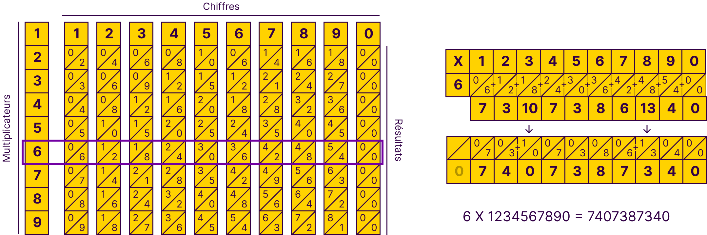
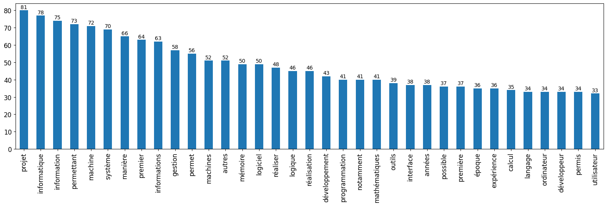

# Origines et Évolution de l'Informatique

## Comment repenser la gestion de l'information pour&nbsp;moderniser&nbsp;l'expérience&nbsp;développeur ?


Dorian Blanchard

Mémoire de fin d'étude pour la validation du diplôme résultant de mon parcours en Mastère Architecture des Systèmes d'Information à l'École Hexagone.


## Bienvenue

Ce document PDF a été généré avec du code Markdown édité en temps réel à l'aide du logiciel Typora. [Les textes en violet foncés sont des liens.](#Remerciements) La bibliographie sera indiquée avec des annotations comme suit.[^b1] L'usage du pronom impersonnel "on" est proscrit, et je souhaite éviter l'usage d'annexes et de lexique / glossaire pour expliciter mon texte. Si vous êtes un(e) relecteur(ice), et que vous constatez quelque chose de tel ou ne comprenez pas une certaine partie, je vous remercierai de me l'indiquer afin que je puisse essayer retravailler le texte pour le rendre explicite et ainsi éviter aux futurs lecteurs de devoir aller chercher une définition, ou une page tierce afin de poursuivre sa lecture en ayant compris. Si un terme de vocabulaire vous pose problème ou vous à demandé l'usage d'un dictionnaire, j'adapterai le texte pour l'expliciter si possible, autrement, je le rajouterai au lexique, ou l'expliquerai en note de bas de page. 

<div style="page-break-after: always;"></div>

## Sommaire

| Sous-titre                                                   | Page |
| ------------------------------------------------------------ | :--: |
| 0.1 - [Bienvenue](#bienvenue)                                |  1   |
| 0.2 - [Sommaire](#sommaire)                                  |  2   |
| 0.3 - [Résumé](#résumé)                                      |  4   |
| 0.4 - [Préface](#préface)                                    |  4   |
| 0.5 - [Remerciements](#remerciements)                        |  7   |
| 0.6 - [Introduction](#introduction)                          |  8   |
| 0.7 - [Comprendre la problématique](#comprendre-la-problématique) |  9   |
| 1.0 - [Histoire](#histoire)                                  |  12  |
| &nbsp;&nbsp;&nbsp;&nbsp;1.1 - [Préhistoire](#préhistoire)    |  12  |
| &nbsp;&nbsp;&nbsp;&nbsp;1.2 - [Antiquité](#antiquité)        |  13  |
| &nbsp;&nbsp;&nbsp;&nbsp;&nbsp;&nbsp;&nbsp;&nbsp;1.2.1 - [Mésopotamie](#mésopotamie) |  13  |
| &nbsp;&nbsp;&nbsp;&nbsp;&nbsp;&nbsp;&nbsp;&nbsp;1.2.2 - [Grèce](#grèce) |  15  |
| &nbsp;&nbsp;&nbsp;&nbsp;&nbsp;&nbsp;&nbsp;&nbsp;1.2.3 - [Égypte](#égypte) |  17  |
| &nbsp;&nbsp;&nbsp;&nbsp;1.3 - [Moyen-Âge](#moyen-âge)        |  19  |
| &nbsp;&nbsp;&nbsp;&nbsp;1.4 - [Époque moderne](#époque-moderne) |  24  |
| &nbsp;&nbsp;&nbsp;&nbsp;&nbsp;&nbsp;&nbsp;&nbsp;1.4.1 - [Révolutions informationnelles](#révolutions-informationnelles) |  25  |
| &nbsp;&nbsp;&nbsp;&nbsp;1.5 - [Époque contemporaine](#époque-contemporaine) |  29  |
| &nbsp;&nbsp;&nbsp;&nbsp;&nbsp;&nbsp;&nbsp;&nbsp;1.5.1 - [De la mécaniques à électronique](#de-la-mécaniques-à-électronique) |  29  |
| &nbsp;&nbsp;&nbsp;&nbsp;&nbsp;&nbsp;&nbsp;&nbsp;1.5.2 - [Genèse de la programmation informatique](#genèse-de-la-programmation-informatique) |  34  |
| &nbsp;&nbsp;&nbsp;&nbsp;1.6 -  [Guerres mondiales](#guerres-mondiales) |  37  |
| &nbsp;&nbsp;&nbsp;&nbsp;&nbsp;&nbsp;&nbsp;&nbsp;1.6.1 - [Guerre informationnelle et Anticipation](#guerre-informationnelle-et-anticipation) |  37  |
| &nbsp;&nbsp;&nbsp;&nbsp;1.7 - [Guerre froide](#guerre-froide) |  43  |
| &nbsp;&nbsp;&nbsp;&nbsp;&nbsp;&nbsp;&nbsp;&nbsp;1.7.1 -  [Genèse de l'informatique moderne](#genèse-de-linformatique-moderne) |  43  |
| &nbsp;&nbsp;&nbsp;&nbsp;&nbsp;&nbsp;&nbsp;&nbsp;1.7.2 - [Temps réel](#temps-réel) |  46  |
| &nbsp;&nbsp;&nbsp;&nbsp;&nbsp;&nbsp;&nbsp;&nbsp;1.7.3 - [Âge d'or d'IBM](#âge-dor-dibm) |  48  |
| &nbsp;&nbsp;&nbsp;&nbsp;&nbsp;&nbsp;&nbsp;&nbsp;1.7.4 - [Émergence de l'Intelligence Artificielle](#émergence-de-lintelligence-artificielle) |  50  |
| &nbsp;&nbsp;&nbsp;&nbsp;&nbsp;&nbsp;&nbsp;&nbsp;1.7.5 - [Du circuit électronique au microprocesseur](#du-circuit-électronique-au-microprocesseur) |  52  |
| &nbsp;&nbsp;&nbsp;&nbsp;&nbsp;&nbsp;&nbsp;&nbsp;1.7.6 - [Course à l'espace](#course-à-lespace) |  53  |
| &nbsp;&nbsp;&nbsp;&nbsp;1.8 - [Bilan passé](#bilan-passé)    |  53  |
| 2.0 - [Pratiques actuelles](#pratiques-actuelles)            |  54  |
| &nbsp;&nbsp;&nbsp;&nbsp;2.1 - [Genèse d'internet](#genèse-dinternet) |  54  |
| &nbsp;&nbsp;&nbsp;&nbsp;2.2 - [Interfaces graphiques et périphériques de pointage](#interfaces-graphiques-et-périphériques-de-pointage) |  56  |
| &nbsp;&nbsp;&nbsp;&nbsp;2.3 - [Ordinateurs personnels et jeux](#ordinateurs-personnels-et-jeux) |  57  |
| &nbsp;&nbsp;&nbsp;&nbsp;2.4 - [Logiciel libre, open source, et cadriciels](#logiciel-libre-open-source-et-cadriciels) |  58  |
| &nbsp;&nbsp;&nbsp;&nbsp;2.5 - [Décisions et gestion de projet](#décisions-et-gestion-de-projet) |  59  |
| &nbsp;&nbsp;&nbsp;&nbsp;2.6 - [Apprentissage et développement personnel](#apprentissage-et-développement-personnel) |  64  |
| &nbsp;&nbsp;&nbsp;&nbsp;2.7 - [Metagame](#metagame)          |  69  |
| &nbsp;&nbsp;&nbsp;&nbsp;2.8 - [Bilan actuel](#bilan-actuel)  |  70  |
| &nbsp;&nbsp;&nbsp;&nbsp;2.9 - [Concepts et outils de programmation](#concepts-et-outils-de-programmation) |  72  |
| &nbsp;&nbsp;&nbsp;&nbsp;&nbsp;&nbsp;&nbsp;&nbsp;2.9.1 - [Réalisation et mise en ligne d'un site web](#Réalisation-et-mise-en-ligne-d'un-site-web) |  72  |
| &nbsp;&nbsp;&nbsp;&nbsp;&nbsp;&nbsp;&nbsp;&nbsp;2.9.2- [Langage logique](#langage-logique) |  76  |
| &nbsp;&nbsp;&nbsp;&nbsp;&nbsp;&nbsp;&nbsp;&nbsp;2.9.3 - [Principes SOLID](#principes-solid) |  80  |
| &nbsp;&nbsp;&nbsp;&nbsp;&nbsp;&nbsp;&nbsp;&nbsp;2.9.4 - [Problèmes et solutions](#problèmes-et-solutions) |  81  |
| &nbsp;&nbsp;&nbsp;&nbsp;&nbsp;&nbsp;&nbsp;&nbsp;2.9.5 - [UML](#uml) |  82  |
| 3.0 - [Comment repenser la gestion de l'information pour moderniser l'expérience développeur ?](#comment-repenser-la-gestion-de-linformation-pour-moderniser&nbsp;lexpérience&nbsp;développeur-) |  83  |
| &nbsp;&nbsp;&nbsp;&nbsp;3.1 - [A priori](#a-priori)          |  86  |
| &nbsp;&nbsp;&nbsp;&nbsp;3.2 - [A posteriori](#a-postériori)  |  90  |
| &nbsp;&nbsp;&nbsp;&nbsp;3.3 - [Quelles sont les conditions de succès d'un logiciel ?](#quelles-sont-les-conditions-de-succès-dun-logiciel-) |  93  |
| 4.0 - [Postface : Rétrospective et métacognition](#postface--rétrospective-et-métacognition) |  94  |
| 5.0 - [Annexes](#annexes)                                    |  97  |
| &nbsp;&nbsp;&nbsp;&nbsp;5.1 - [Bibliographie](#bibliographie) |  97  |
| &nbsp;&nbsp;&nbsp;&nbsp;5.2 - [Webographie](#webographie)    |  98  |
| &nbsp;&nbsp;&nbsp;&nbsp;5.3 - [Code](#code)                  | 100  |
| &nbsp;&nbsp;&nbsp;&nbsp;5.4 - [Lexique](#lexique)            | 101  |
| &nbsp;&nbsp;&nbsp;&nbsp;5.4 - [Table des illustrations](#table-des-illustrations) | 101  |


## Résumé

Dès la préhistoire, l'humanité avait déjà des méthodes de gestion de l'information. L'histoire de l'information est celle de l'ensemble des individus de notre espèce, qui y contribuent durant leurs vie au travers de leurs actes, lectures, écrits, et dires. Cet ouvrage, conformément à son titre et aux recherches qu'il a nécessité, énonce donc le passé, le présent, et mon anticipation concernant le futur de la gestion de l'information. L'étude des connaissances existantes sur ce sujet vous replongera sûrement dans vos cours d'Histoire. Cet état de l'art mettra en situation le présent avec un abrégé allant de la préhistoire jusqu’à l'état actuel de la science de la gestion de l'information qu'est l'informatique. En tant que développeur, j'ai pu voir en quoi cette discipline récente permet désormais de solutionner et automatiser beaucoup de tâches pénibles, mais aussi que sa pratique en elle même reste fastidieuse. C'est pourquoi j'en ai fait le cœur de ma problématique, et que la dernière partie se nomme "Comment repenser la gestion de l'information pour moderniser l'expérience développeur ?". À l'aide des parties précédentes analysant son origine, la conclusion proposera ainsi une solution informatique innovante, combinant des technologies existantes pour se simplifier elle même en utilisant de la rétro-action, et de la méta-programmation à travers une interface graphique simple et agréable.


## Préface

> Avant que je ne me présente et doive en venir à aborder les notions de *front* et de *back* pour mes intitulés de postes, il s'agit des deux principaux métiers de la réalisation de logiciels. Ils se définissent respectivement et simplement comme le service client et l'administration, comme la scène et les coulisses, comme la gestion de l'affichage utilisant le matériel du client d'une part, et se qui se passe dans les boites noires logiques que sont les serveurs de l'autre.

Pour pouvoir contextualiser cette œuvre qui se questionne sur l'évolution de l'informatique et son apprentissage, je vais brièvement vous parler de la mienne en toute vulnérabilité, abordant surtout le contexte de mon apprentissage de cette discipline. De cette manière vous pourrez mieux comprendre mon identité, et les raisons qui m'ont poussé à effectuer des recherches sur l'Histoire de l'informatique, pour finir par conclure sur les possibles améliorations de l'expérience développeur.

Après l'obtention de mon Baccalauréat scientifique en 2015, débarquant alors en DUT informatique, je n'avais programmé qu'en BASIC sur une calculatrice Texas Instrument. À cette époque je n'étais qu'un gamin ayant sauté la grande section et le cours primaire pour avoir su lire à 2 ans et demi grâce au logiciel éducatif Lapin malin. Je débarque donc à Clermont-Ferrand du haut de mes de 16 ans, découvrant l'indépendance dans un 9m² fibré du [CROUS](#Lexique) pendant 2 ans, durant pendant laquelle j'ai utilisé un réseau privé virtuel ([VPN](#Lexique)) pour contourner les limitations du réseau [RENATER](#Lexique), et pouvoir ainsi jouer à League Of Legends avec 5 millisecondes de latence. Je n'avais alors jamais vraiment travaillé de ma vie, je ne faisais pas mes devoirs, et malgré cela j'obtenais toujours la moyenne tant bien que mal, voyant cette dernière chuter année après année. Je n'étais évidement pas prêt à la complexité et la rigueur du C ou de Bash. Jusque là, mon apprentissage de cette discipline sur ma calculatrice était purement empirique. Lors de la première année de [DUT](#Lexique), l'enseignement de la programmation nous a été introduit sur papier, en commençant donc par la théorie que les étudiants n'avaient pour la majorité jamais pratiquée et donc du mal à conceptualiser. Comme je n'avais pas encore l'habitude de travailler régulièrement, j'ai logiquement été noyé par la quantité d'information et ne les comprenais souvent qu'après les contrôles, lors de la correction, me rendant compte de mes erreurs et réajustant ma version de ce qui était correct en fonction. J'étais tellement largué en contrôle que lorsque j'ai réalisé mon premier projet d'études en langage C, comprenant alors pleinement la théorie en me l'appropriant par la pratique, réalisant 80% du logiciel par moi même. Le professeur en question m'a attribué une note bien moindre qu'au camarade ayant réalisé les 20% restants, donnant malgré tout la moyenne au dernier de notre trinôme. Malgré tout à raison car mon niveau au moment du partiel théorique était relativement faible.

[Ce projet est toujours disponible sur mon GitHub](https://github.com/hedocode/StudentResidenceManager), il s'agit d'un gestionnaire de résidence étudiante. Moi qui haïssait alors la ligne de commande toute moche et très peu conviviale ou facile à utiliser, étais alors le seul étudiant de la promotion à avoir eu la fantaisie de réaliser les affichages en changeant la couleur de fond et du texte. J'ai ainsi simuler une interface graphique plus agréable, à l'instar des premiers BIOS et des interfaces console interactives que nous avons encore aujourd'hui comme `dpkg-reconfigure` sur Linux, qui est soit dit en passant car j'ai eu le cas récemment : le meilleur moyen de changer la langue de son clavier pour passer de QWERTY à AZERTY de façon permanente en utilisant la ligne de commande.

<a name="dpkg-keyboard-configuration-vs-residence-manager"></a>


| F1 : Comparaison dpkg keyboard-configuration VS residence-manager |
| :----------------------------------------------------------: |

J'ai rapidement découvert les compilateurs, qui indiquent les erreurs tant bien que mal, qui ont parfois eux même des erreurs ou manques de précisions, nécessitant de comprendre pleinement son fonctionnement et son propre code pour arriver à trouver et corriger le problème. Cela peut être décourageant pour beaucoup, et c'est d'ailleurs certainement une des raisons pour lesquelles une bonne partie des élèves abandonnent en première année.

En deuxième année, j'ai dirigé et développé en grande partie un projet libre de fin d'année. Comme beaucoup d'étudiants en informatique je voulais réaliser un jeu, et me suis lancé dans son développement en utilisant C# et MonoGame, un outil logiciel facilitant la création d'un jeu en fournissant de quoi afficher des rectangles, remplis de couleurs ou d'images, et les règles leur appliquer à chaque itération, avant mise à jour de l'affichage. Pour compléter les fonctionnalités fournies, j'ai développé mes propres outils logiciel pour gérer la vitesse et les collisions entre les entités. À cet effet, le calcul d'angles et de distances, la trigonométrie ou le théorème de Pythagore, m'ont tous été très utiles.

Après l'obtention de mon DUT, je n'ai pas trouvé d'alternance et donc pas été pris en licence professionnelle. Je me suis donc dirigé vers une deuxième année de licence en informatique dans le but de réaliser un master par la suite. Lors de cette année, il nous a été demandé de réaliser un projet de client-serveur employant des sockets pour une communication en temps réel, j'ai pu réutiliser mon projet de C et les connaissances de mon DUT avec bien entendu la technique pour simuler une interface graphique dans un environnement console, créant avec succès [Ohen, un jeu multijoueur en ligne](https://github.com/hedocode/ohen/blob/master/ohen-c/README.md).

Pour autant, je me suis vite rendu compte qu'il me manquait des bases pour aller au bout de ce cursus, notamment le vocabulaire mathématique enseigné dans la première année de licence que je n'avais pas réalisé, et la motivation nécessaire pour réussir dans cette formation plus théorique, nécessitant par la suite d'entrer en master pour aboutir un Bac + 5. J'ai donc abandonné. En attendant la fin de l'année scolaire, j'ai failli être défaillant dans la seule matière qui me plaisait. Me rendant compte de cela, j'ai travaillé intensément pendant une semaine pour effectuer le projet demandé, codant ainsi le [*Jeu de la vie* de John Horton Conway](#Ordinateurs personnels et jeux) en utilisant Monogame et C#, deux outils que je maîtrisait bien. J'ai alors pu retourner voir le professeur de cette matière avec un projet fini, bien que rendu en retard, et n'ai ainsi pas été considéré défaillant. Ce projet est également disponible sur mon GitHub dans une [compilation de mes projets MonoGames](https://github.com/hedocode/MyMonoGames/tree/main), avec un [installeur Windows fonctionnel](https://github.com/hedocode/MyMonoGames/releases/tag/v0.0.0).

Cette année a été à la fois la pire et la meilleure de ma vie, une fois que j'eus abandonné, j'étais complètement perdu mais résolu à trouver une solution et aller de l'avant. J'avais du mal à savoir ce que j'allais faire, j’étais atterré par mon échec ainsi que le manque de volonté qui aurait pu me permettre de rattraper les lacunes de la première année de licence informatique que je n'avais pas réalisé. Je suis content d'avoir eu la jugeote nécessaire, ainsi qu'un bon ami qui m'a permis d'avoir une alternance en tant que Développeur Full-Stack chez l'éditeur de logiciel [CRM](#Lexique) nommé SoEMan Group, et ainsi finir par intégrer la licence professionnelle web, après un an d'incertitude et de remise en question. Cette première alternance m'a permis de mieux comprendre [SQL](#Lexique) et [PHP](#Lexique) que pendant de mes cours, j'ai même pu reprendre un projet de refonte graphique de l'affichage de l’application web pour la rendre fonctionnelle sur toutes tailles d'écrans, ce projet a lui même été repris et aboutit par la suite. J'ai beaucoup apprécié cette première expérience de développement front-end car j'ai moi-même maquetté les affichages avant de les réaliser, pouvant voir concrètement l'effet du code sur l'affichage, sans avoir cette sensation de boite noire incompréhensible que procure le développement de la gestion de l'information dans le back-end. Durant cette année de Licence professionnelle web, que j'ai obtenue en bout de course avec un minable 9.96, j'ai eu l'idée d'un projet informatique qui me permettrait de réaliser tous les autres plus facilement. J'ai donc, le 27 octobre 2019, commencé un prototype d'environnement de développement intégré (IDE) alors nommé KIDE.

Après obtention de mon diplôme de niveau Bac + 3, j'ai été embauché le 25 décembre 2019 par l'agence web clermontoise De Bussac Multimédia, en tant que développeur Front-End. J'y ai travaillé pendant 2 ans et 6 mois, finissant Lead Dev sur un projet React important et complexe. Ce premier CDI m'a permis d'apprendre à maîtriser des compétences qui ne nous avaient pas été enseignées lors de mon cursus plus orienté Back-End. Les dates limites et l'exigence du rendu était très importantes, j'ai du améliorer ma productivité et ma rigueur pour arriver à mes objectifs. Sans cette expérience je n'aurais pas connu l'École Hexagone, ni eu la volonté et la rigueur nécessaire à l'aboutissement cette fin d'étude que j'ai réalisée en alternance chez ABGX de nouveau sur un poste de développeur Full-Stack. J'ai ainsi pu travailler sur une solution logicielle de gestion de la radioprotection tout en continuant mon éternel apprentissage et obtenant ainsi un Bac + 5 avec la réalisation de ce mémoire. Depuis le 27 octobre 2019 et durant toutes ses années, ma détermination à développer un IDE convivial et intuitif n'a cessé de grandir. Je sais d'or et déjà que je vais prochainement créer une entreprise et réaliser des missions de prestations pour financer la réalisation de ce projet. Le problème auquel il répondra sera celui de ce mémoire.

## Remerciements

Je ne remercierai jamais assez mes proches, amis, et membres de ma famille, notamment mes parents et mes grand parents paternels, qui ont eu la chance d'être propriétaires d'ordinateurs et d'une connexion d'internet, avant ma naissance en 1999. Grâce à cela il ont eu la démarche raisonnée de m'introduire à cette technologie, sur des logiciels éducatifs qui m'ont permis de savoir lire à l'âge de 2 ans. Merci également à mes grands parents maternel qui m'ont transmis les bases de la musique et du chant grâce à leurs dévotion à la chorale et l'orchestre des messes de Rouffignac.

Merci à toutes les personnes et enseignants des entreprises et écoles qui m'ont accueillis, lors de ma scolarité, et de mon début de carrière, me transmettant une majeure partie ce que je sais aujourd'hui, et ce dans la bienveillance, grâce à des processus itératifs d'amélioration continue.

Merci tout particulièrement à l'*École Hexagone* et à *ABGX* sans lesquels je n'aurais sans doute pas pris le temps d'écrire ce mémoire et donc ni découvert toutes les informations qu'il contient, ni affuter mon esprit, ma volonté, détermination et rigueur. Merci aux logiciels libres, à l'open source, à Wikipédia et tous leurs contributeurs. Merci à toutes et tous, car nos métiers et découvertes ne sont que rarement le fruit d'un génie isolé, mais bien d'une collaboration et de l'amélioration d'idées antérieures.

Enfin, merci à toute personne qui lit actuellement ce texte. Demandez vous pour qui vous le faites, la réponse devrait toujours être  `∀ (soi ∧ autrui)`. La réponse est mathématique et logique. Si elle ne vous est pas évidente, je vous donnerai de quoi déchiffrer cette syntaxe dans ce livre.[^p35]

[^p35]: Solution page 35

## Introduction

La transmission d'information s'est fiabilisée au fil des époques, avec l'usage d'outils physique ; notamment des tablettes, plaques permettant de dessiner, d'écrire, lire, compter ; et ce jusqu'à pouvoir automatiser son traitement et son stockage, à l'aide de l'informatique, dont l'histoire ne commence concrètement qu'à la fin du 19<sup>ème</sup> siècle. De nos jours, nous interagissons quotidiennement avec des ordinateurs, que ce soit à l'aide de la programmation, ou des interfaces hommes-machines qui en sont issues. Pourtant, la grande majorité des utilisateurs, et même des personnes travaillant dans le domaine des Technologies de l'Information et de la Communication, ne connaissent pas la plupart des événements majeurs de son histoire. Moi même n'ayant pas cette connaissance lorsque j'ai entrepris la rédaction de ce mémoire, j'ai décidé de me documenter et de rédiger un format accessible, avec ce qui m'a semblé être nécessaire pour comprendre le sujet, et ainsi le partager à vous, lecteurs de cet ouvrage. Pour la rédaction de ce dernier, j'ai donc acquis trois livres sur l'histoire de l'informatique qui ont chacun leurs avantages grâce à une approche différente d'un même sujet, sur lequel je m'attendais à trouver plus de bibliographie. Contrairement à ceux-ci, qui apportent une vision globale de l'évolution de l'informatique et des machines, j'ai aborder une démarche axée sur la gestion de l'information dans le sens large qui finira par se concentrer sur la programmation, le tout avec des pointes de philosophie, ainsi que mon humble analyse subjective car j'aime penser. L'apprentissage des mathématiques et de l'informatique ont changé ma manière de concevoir le monde dans lequel nous vivons. Ce sont selon moi des philosophies à part entière, apportant des syntaxes et un vocabulaire, nécessitant un apprentissage constant de schémas de pensés dignes d'un logicien.

Dans ce mémoire, je vais donc revenir aux racines les plus ancestrales de la gestion de l'information, au vocabulaire et champ lexical qui y sont liés ou en découlent, ainsi qu'à leurs étymologies à travers leur [Histoire](#Histoire), qui représente toute la première partie de ce livre. J'y présenterai quelques philosophes et penseurs, mais surtout des scientifiques variés. De l'Antiquité aux époques plus modernes, les idées qu'ils ont amenées ont permis des inventions et progrès technologiques avec un développement de plus en plus rapide. Pourtant, les inventions qui ont le plus impacté l'humanité, resteront toujours les plus anciennes, avec pour origine l'écriture et surtout l'art. J'aborderai un sujet qui m'est cher, la programmation. Elle n'est pas forcement liée à l'informatique, c'est l'art de planifier et mettre en œuvre des étapes à suivre pour obtenir un résultat. Cela dit, elle passe inévitablement par de la gestion de l'information, à l'aide d'écriture, lecture, chiffrement, déchiffrement, émission, et réception. Je m’intéresserai également à l'apprentissage, qui représente l’acquisition et l'assimilation d'une information ou d'un système, très présent dans les technologies comme l'intelligence artificielle ; ainsi qu'à la pédagogie, propre à "l'animal social émotionnel" qu'est l'humain ; et à la compréhension du rapport maître / élève en tant que canal de la transmission de compétences.

L'ensemble de ces domaines, et l'information en général, prennent une place de plus en plus importante dans nos quotidien. Cela s'accompagne d'un volume exponentiel de données mondialement échangées. Nous avons développés une relation symbiotique avec la technologie, qui nous permet aujourd'hui de communiquer et de jouer presque instantanément au niveau mondial, améliorant globalement les conditions de vie humaines. Pour autant, comme toutes les technologies récentes ayant un impact majeur, vient un rejet et une techno-phobie d'une certaine partie de la population pas encore convertie à son usage. Avec mon point de vue de développeur web, je dresserai ensuite un [bilan de l’état actuel de l'informatique](#Pratiques-actuelles), de son marché, ses opportunités, ainsi qu'une étude de sa pratique moderne ; et ce afin d'en [identifier les problèmes](#Comprendre-la-problématique) que nous y rencontrons pour en dégager de possibles solutions. En tant qu'acteur et éditeur de logiciels, j'aboutirais ainsi ce mémoire avec [la mise en place technique d'une solution informatique](#Réalisation-et-mise-en-ligne-d'un-site-web), pour ensuite finir par présenter ma vision pour le futur de cette discipline, plus particulièrement [la pratique que je souhaite en avoir en tant que créateur de services et contenus web](#comment-repenser-la-gestion-de-linformation-pour-moderniser&nbsp;lexpérience&nbsp;développeur-).

## Comprendre la problématique

L'informatique, étymologiquement "automatisation de la gestion de l'information", est un domaine récent et complexe, qui soulève beaucoup d'avancés technologiques mais également de craintes et de questionnements. En 2022, la programmation à l'origine des logiciels qui nous permettent d'utiliser le matériel informatique, n'était pratiquée que par 0.35% de la population. Elle requiert une rigueur suffisante pour dans un premier temps passer la compilation si elle a lieu, puis l'exécution du programme en résultant, et enfin les tests du comportement voulu dont le but est de vérifier que nous avons correctement implémenté la solution à notre problème informationnel. Une fois que tout cela est satisfait, il faut rendre le programme robuste afin d'assurer sa pérennité tout au long du développement des nouvelles fonctionnalités qui s'accumuleront inexorablement, et ce afin que toutes les existantes restent fonctionnelles. C'est ce que l'intégration et le développement continu solutionne, en assurant la qualité d'un logiciel au fil de son développement. Dans la deuxième partie de ce mémoire, je montrerai ainsi les avantages et inconvénients des outils de développement actuels et les biais introduits dans leurs pratiques, constituée des étapes décrites précédemment, avec des solutions. Actuellement, l'apprentissage de ces étapes et les coûts de formation d'un nouvel employé en informatique sont importants. Simplifier la prise en main d'un projet informatique me semble être une opportunité technologique intéressante, qui permettrait à l'industrie informatique de se concentrer sur la création et l'innovation. Dans cette dernière, la matière première est la pensée du développeur, c'est l'acteur principal à l'origine des algorithmes qui régissent la gestion de l'information.

Nous réalisons des logiciels pour de multiples industries et sommes pourtant les cordonniers les plus mal chaussés. Nous parlons souvent d'expérience utilisateur, mais l'expérience développeur reste à désirer, voire archaïque. Nous sommes encore temporellement proche de la genèse du logiciel et des interfaces utilisateurs. La question fondamentale à laquelle je répondrait dans le troisième chapitre sera donc "*Comment repenser la gestion de l'information pour moderniser l'expérience développeur ?*". Avant d'y apporter une solution technique, il est important de comprendre l'évolution de la pensée, des outils, des machines et de la technologie, pour savoir comment l'humanité en est arrivée là. Comment elle calculait, automatisait des actions, et gérait l'information avant l'invention des ordinateurs ?


<a name="dx-meme"></a>


| F2 : meme sur l'expérience développeur |
| :------------------------------------: |

<div style="page-break-after: always;"></div>

## Histoire

Pour tout être vivant, la première manière de marquer l'Histoire est universelle, c’est celle des fossiles et des dinosaures, celle d’avoir existé et laissé une trace, une information, stockée sur un support physique, quelque part sur sa planète. La deuxième est l’art de sculpter des outils, actuellement estimé 3 millions d’années avant notre ère. La troisième est le dessin, au travers de la peinture ou de la gravure, dont les plus anciennes preuves sont rupestres, et âgées de 65 millénaires. Relativement aux dates précédentes, l’écriture ne vient que récemment, elle a été attestée en Mésopotamie il y a 5 millénaires. Pourtant, c'est elle qui nous permettra à nous, humains, d'écrire notre Histoire, de transmettre des volumes d'informations variées, véridiques comme les faits, ou de qualité comme des idées. Écrire permet de faire naître une information et potentiellement de la rendre éternelle. Les paroles s’envolent les écrits restent, c'est pourquoi la littérature est importante. D'un point de vue historique, notre génération laissera toujours une trace. Que ce soit sur un disque dur quelque part dans un grenier, dans un datacenter ou une archive internet. Et même si tous les humains disparaissaient, il y en aurait toujours une trace immuable et indestructible à échelle de la Terre. Les isotopes lourds que nous avons créés avec l'apparition des industries nucléaire seraient, même dans le cas d'un retour à l'âge de pierre causant un rude hiver civilisationnel, une preuve de l'existence de la nôtre.

### Préhistoire

Avant même la naissance de l'écriture qui marque la fin de la préhistoire, les humains avaient déjà besoin d'informations quantitatives, c'est à dire de compter et d'effectuer des calculs. Le premier réflexe à sûrement été de compter sur ses doigts, raison pour laquelle la base 10 est si présente dans l'histoire. Pour des nombres plus importants, il a fallu inventer d'autres stratagèmes et outils. Un **abaque** est un instrument facilitant le calcul. C'est un outil mnémonique de numération, c'est à dire qu'il permet d'enregistrer un nombre pour se libérer de la mémoire. Son étymologie est un mélange de grec et d'hébreu qui explique bien sa représentation et son usage. La poussière (de l'hébreu abaq), et la tablette (du grec akos), servaient de support pour l'écrit. Même sans dépôt de poussière naturelle, il est possible de volontairement recouvrir une tablette, et ainsi réécrire à volonté avec du sable, ou toute autre poudres. À la préhistoire, le mot abaque n'existait pas, les humains n'avaient pas encore de tablettes, de nombres ni de textes leurs permettant de représenter une quantité. Ils ont pourtant inventé le plus vieux système de quantification connu. Le **bâton de comptage**, daté à **-40000**, est un système unaire. C'est à dire qu'il permet de quantifier des unités, représentées par la répétition d'un symbole, généralement un trait, aussi appelé marque de dénombrement. Le plus ancien est l'Os de Lebombo, mais l'ensemble d'Os d'Ishango est cependant plus connu. Il serait hypothétiquement une des premières preuves de connaissance humaine des mathématiques et de l'arithmétique. Sur un des os, les 4 nombres premiers entre 10 et 20 sont présents, soit 11, 13, 17, et 19. Un autre semble démontrer les additions et les multiplications, notamment la duplication, avec la juxtaposition des nombres 3 et 6 puis 4 et 8. Cette méthode unaire est longtemps restée, à l'époque, un berger pouvait s'assurer que l'intégralité de son troupeau était rentré en comparant deux comptages, à l'aide de cailloux par exemple, chacun représentant une bête. J'ai également eu l'opportunité de visiter la grotte de Thaïs, où a été retrouvé un os de quelques centimètres aux multiples gravures. Daté en **-12 500**, il a été nommé **Os coché**. En 1991, l’archéologue américain Alexander Marschack, démontra qu’il ne s’agit pas d’une représentation décorative comme les historiens le pensaient alors, mais d’un système d’enregistrement du temps, possiblement un calendrier basé sur des observations astronomiques. Cette hypothèse est actuellement, en 2024, le sujet d'une étude européenne menée par un groupe de chercheur à l'université de Bordeaux.

L'homme préhistorique avait donc sûrement déjà des systèmes de comptage des unités et du temps, bien qu'il ne nous en reste que peu de traces, ne permettant donc pas d'affirmer cela avec certitude. À cette période, l'humain était un chasseur-cueilleur nomade, et contrairement à ce que nous pourrions croire, il aurait rarement été hostile à ses congénères lorsqu'il les croise, ayant déjà bien assez de problèmes avec la nature.

La **sédentarisation** prends place en **-9000**, l'**agriculture** apparaît à la même période dans le *croisant fertile* situé au Proche et Moyen Orient actuel, avec par conséquent un besoin de stockage grandissant auquel répondra la démocratisation de la vannerie, du tissage et surtout de la poterie. Jusqu'alors la terre cuite était principalement utilisée pour des figurines décoratives. À partir de **-7000** fleurirons alors **villes et cités** comme Urkesh, Ninive, ou Assur ; capitale Assyrienne, et Guzana capitale du royaume antagoniste Araméen. Suivis par Uruk et Lagash vers -5000, puis Ur vers -4000. Les **premières civilisation** apparaîtrons plus tard comme celle de Sumer vers **-3500**, ou celle de la vallée de l'Indus (à qui l'humanité doit entre autre les égouts) vers -2600, bien que son développement ai commencé à l'apparition des premières villes et cités. L'arrivé du stockage de biens a causé l’apparition des premiers conflits d'envergure. Avant cela, les scientifiques estiment que les humains avaient une densité de population trop faible pour que cela n'arrive, le rapport gain / perte n'en valant que rarement le coût. L'humanité à donc du, suite à la sédentarisation, trouver des moyen de réguler son jeu de la vie humaine, et trouver des systèmes composés de règles, permettant de conserver l'ordre et éviter la discorde.

C'est ici qu'intervient la **bulle enveloppe ∨ comptable**. Il y a presque 6000 ans de cela, en Mésopotamie, vers l'an **-3900**, étaient utilisées des sphères d'argile. Des calculs, du latin "calculus", signifiant petit cailloux, étaient stockés en son sein, pour en comptabiliser le contenu. La signature se faisait en déroulant un sceau-cylindre, orné de motifs représentant des dieux ou le pouvoir. Il servait à imprimer les motifs creusés dessus afin de pouvoir les imprimer sur de l'argile. Ce motif indiquait généralement le possesseur à la manière d'une signature. Certains étaient en matériaux plus ou moins précieux, et comportaient parfois des écritures cunéiformes. Les Mésopotamiens avaient donc inventé un système de gestion de l'information permettant de garantir le transport et l'échange de marchandises par un transporteur, tout en garantissant des informations comme sa provenance et la quantité de marchandise. En effet, un destinataire pouvait ainsi faire confiance à un transporteur concernant la provenance, grâce à la signature ; et la quantité, en comparant le nombre de marchandises au nombre d'unités présentes dans la bulle après l'avoir cassé. Si elle l'était avant d'arriver à son destinataire, alors la livraison pouvait être invalidée.

### Antiquité

#### Mésopotamie

Marquée par l'invention la plus importante de notre histoire, la naissance de **l'écriture** datée vers l'an **-3250**, a permis une transmission d'informations complexes sur un support théoriquement permanent. Des lois, qu'elles soient juridiques, mathématiques, ou autres, ont alors pu être rédigées et transmises de manière plus fiable que par la transmission orale, pratiquée jusque là en plus du dessin. Malgré cela, beaucoup de penseurs ont continués à transmettre leurs savoirs exclusivement à l'oral, n'ayant donc jamais rien écrit de leurs vivant. Bien que des gens l'ont fait pour eux, comment être sûrs que les informations de leurs discours n'ont pas été déformés, par des siècles de copies et réécriture, de ragots et légendes. Pour autant, ce qu'il en reste est une facette de la réalité, c'est ce qui a persisté jusque là grâce à ce que les auteurs ont jugés important de transmettre aux générations futures et Historien(ne)s Archéologues.

Dès l’Antiquité, les égyptiens et les babyloniens avaient déjà rédigé des textes comportant des problèmes, et des manières mathématiques pour les solutionner, tels que le Papyrus Rhind, qui explicite notamment des opérations comme la division, la multiplication, et bien d'autres. **L'algèbre babylonienne** datée vers **-3000**, précède le Papyrus Rhind d'un siècle et utilisait un système sexagésimal. Ce système potentiellement emprunté aux sumériens, était de base 10, fondation du système décimal ; et 60, encore utilisée de nos jours pour le temps, ou les angles. Cet algèbre possédait plus de distinctions d'opérations logiques que les simples additions, multiplications et divisions, certains concepts peuvent aujourd'hui se retrouver en programmation. Ils avaient deux manières d'additionner : L'empilement qui donne un troisième nombre à partir de deux autres : `a = b + c`, et l'ajout par fusion d'un autre nombre, à un premier : `a += b`, qui équivaut à l'empilement `a = a + b`. Idem pour la soustraction : `a = b - c`,  `a -= b` qui équivaut à `a = a - b`. Avec de surcroît la notion de comparaison et d'équation : si après la soustraction `a - b` il reste `c` , alors `a > b` car `a = b + c`[^page13].

[^page13]: (voir syllogisme page 13)

Les usages de la multiplication, sont également multiples, il y avait des méthodes permettant de répéter un nombre, ou de calculer une aire comme un volume. Afin d'avoir le résultat d'un calcul plus rapidement, les mathématiciens du début de l'antiquité ont tout simplement calculé toutes les combinaisons de multiplications entre les chiffres. Créant ainsi ce que toute personne introduite aux mathématiques a du apprendre par cœur un jour, **les tables de multiplications**, comparables à un cache informatique permettant de ne pas refaire le calcul pour obtenir un résultat ([complexité](#Lexique) `O^1`). Les historiens pensent que la division se pratiquait avec la multiplication par l'inverse car les archéologues en ont retrouvé de multiples tables dans la Mésopotamie. La racine carrée était obtenue grâce aux tables de carrés, et pour les valeurs manquante, les mathématiciens de l'époque devaient pratiquer une approximation par interpolation linéaire, c'est à dire une estimation de la valeur sur une courbe entre deux points connus. Cette discipline qu'est l'Algèbre est donc à ce moment de l'histoire avérée, mais pas encore nommée, du moins pas en tant que telle, il faudra attendre le [Moyen-Âge](#Moyen-Âge) pour cela.

Le **quipou** est un outil utilisé par les incas qui signifie "nœud", ou "compte" en quechua. Il est en effet possible de faire un nœud simple avec plusieurs boucles, permettant ainsi d'enregistrer un chiffre correspondant au nombre de boucle, et donc des nombres, en base 10. Le plus ancien connu à été retrouvé sur le site archéologique de Caral, au Pérou. Il est daté vers l'an **-2500**. Le climat chaud et sec a contribué à sa bonne conservation. L'empire Inca ayant été constitué de plus de 12 millions d'individus, cet outil a été au cœur de son administration et a permis le stockage des informations nécessaires au recensement de la population et à la gestion de l'économie. Des experts du quipou dont Gary Urton[^gu], professeur d'Anthropologie américain spécialisé en civilisation pré-colombienne, se sont même rendus compte que plus d'un tiers comportaient des informations autres que des chiffres, aussi appelées informations qualitatives, en opposition aux informations quantitatives. Cet outil à donc également servi à transmettre des messages, composé d'un vocabulaire créé à partir de différentes couleurs, types de fils, de nœuds, ainsi que leurs positions et orientations. Notez qu'en mathématique il existe une branche très intéressante appelée *théorie des nœuds*, elle fait partie de la sous branche de la *topologie*, c'est à dire l'étude de la déformation d'un objet sans arrachage ni recollage.

Le quipou nous montre qu'à travers la manipulation des fils et des nœuds, certaines civilisations ont pu écrire et lire des informations, autrement qu'en inscrivant des symboles sur une surface. Le dernier abaque antique est le boulier, qui a été utilisé par de nombreux peuples séparés. Il voit le jour possiblement vers l'an **-2000**, et utilise le système de numération décimale (10), ou en base alternée (5, 2) pour certains modèles. C'est un outil physique composé de plusieurs rangées d'unités sphériques, des perles empilées glissant autour de tiges, permettent un calcul rapide, même récemment. Bien utilisé, il arrive en tête de compétitions contre des opérateurs électroniques. Cet outil répandu à été démocratisé dans de multiples peuples. Romains, chinois, japonais, russes, mexicains, français, et bien d'autres, l'utilisent et l'enseignent.

[^gu]: Gary Urton, Signs of the Inka khipu : Binary coding in the Andean knotted-string records, Austin, University of Texas Press, 2003, 1re éd., 202 p. (ISBN 978-0-292-78539-7, Online Computer Library Center : [50323023](https://worldcat.org/fr/title/50323023))

Le Code de Hammurabi, un texte babylonien daté vers **-1750**, est à ce jour le texte de loi connu le plus complet de la Mésopotamie Antique. Il démontre l'existence de lois, notamment concernant les salaires, indiquant qu'il existait des corps de métiers bien définis ; mais inscrivant également le droit de la famille, de la propriété, le système judiciaire, et bien d'autres. Ces lois décrivent des situation problématique auxquelles elles proposent des solution, elle sont *casuistique*. À l'époque où Hammurabi succède à son père, il possède un petit territoire comportant tout de même des grandes villes, mais entouré de puissants royaumes qu'il finira par vaincre et annexer, pour finir par dominer la région et fonder le royaume babylonien tel qu'on le connaît en tant que puissance culte du Proche Orient. La politique rédigée à sa gloire dans ce code éponyme à donc certainement eu un rôle dans le développement de la société babylonienne jusqu’à son apogée.


#### Grèce

Les premiers écrits philosophique et scientifiques de référence occidentales viennent de la **Grèce antique**. Les bases de la physique ont été posées par Thalès, celles des mathématiques par Pythagore, de la géométrie par Euclide, et de la biologie par **Aristote**, qui est également à l'origine des raisonnements logiques appelés **syllogismes**, étymologiquement ensemble de discours logiques. Ce sont des raisonnements constitués d'au moins trois propositions cohérentes, la dernière étant une conclusion déduite, précédée de prémisses qui doivent s'avérer vraies pour que la conclusion le soit également. Soit (A ∧ B ⇒ C). Son exemple le plus connu est "*Tout les hommes sont mortels, or Socrate est un homme, donc Socrate est mortel*". (H⇔M ∧ S⇔H ⇒ S⇔M). Socrate est la première figure philosophique dont l'influence a marqué un avant et un après, il a été enrôlé en tant qu'hoplite lors de la guerre du Péloponnèse qui à opposé Spartes à Thèbes et Athènes. Dans le cadre de cet affrontement, les humains ont eu besoin de communiquer des messages à de longues distances, sans qu'ils ne se fassent intercepter, et encore moins décoder et lus, voire pire, compris. Le plus ancien système de **chiffrement** connu est ainsi la **scytale** spartiate, datée vers **-600**[^b1]. Utilisée pour transmettre des messages chiffrés par transposition sur un bande, généralement une ceinture en cuir portée pendant le transport, que l'on enroule autour d'un bâton pour l'écriture et la lecture. Le diamètre du bâton étant ainsi la clé de chiffrement, deux bâtons de même diamètres pouvaient donc chiffrer et déchiffrer les mêmes messages. Les lettres correspondaient encore à leur propre valeur, et leur ordre dans le mot était conservé, malgré la présence de lettres entre chacune d’entre elles. Ces dernières étaient simplement mélangées, et l'enroulage permettait de les réaligner afin d'en permettre la lecture. Quelques années avant Jésus Christ, Jules César encodait ses messages grâce à un procédé similaire en utilisant un code éponyme. Ce chiffrement simple utilisait un décalage d'un certain nombre de lettres de l'alphabet. A vaut D, B vaut E, Z vaut C, etc... Remarquez que le chiffrement était dès le début utilisé pour transmettre des informations sensibles, notamment liées à la guerre. Cet outil a d'ailleurs été considéré comme arme de guerre jusqu’à récemment, où la plupart des techniques de cryptographies issues du domaine militaire sont devenues publiques. Malgré cela, encore aujourd'hui, les gouvernements appellent à retirer l'anonymat sur internet ou à avoir des portes dérobées dans les chiffrements afin d'en permettre la lecture par une autorité certifiée en cas de besoin.

[^b1]: https://www.google.fr/books/edition/Les_vies_des_hommes_illustres/iYFZAAAAcAAJ?hl=fr&gbpv=1&pg=PA142&printsec=frontcover

La transmission de messages, le chiffrement, la programmation et l'informatique, reposent tous sur les **mathématiques**. Étymologiquement, ce mot signifie en latin « qui aime apprendre », ou en grec, « qui provient d’une leçon », autrement dit : du savoir d’autrui. Sa définition moderne, présente dans le Larousse, comme sur Wikipédia, vient corroborer cette étymologie, indiquant que c’est un ensemble de connaissances abstraites résultant de raisonnements **logiques**, appliqués à des objets tangibles, telles que les formes physiques, les structures qu’elles constituent, et leurs transformations possibles à l’aide des relations existantes entres ces objets. Ces connaissances abstraites, ce sont les nombres, ainsi que les opérations, formules et théorèmes qui nous permettent de les utiliser. Cette abstraction mathématique basée initialement sur des axiomes tangibles, c'est à dire règles admises comme vraies sans démonstration, s’est petit à petit détachée de toute contrainte physique, et a ainsi donné naissance à deux disciplines, les mathématiques *appliquées*, et les mathématiques *pures*. 400 ans avant J.-C., Platon à contribué à cette distinction, séparant la technique de calcul ; "*appropriée pour l’homme d’affaire et de guerre*", qui doit quantifier et gérer ses troupes, gains et pertes ; de la théorie des nombre "*nécessaire au philosophe pour surplomber la mer des changements et s’emparer de ce qui est véritable*". Les **mathématiques pures**, tendent à la généralité, ou en langage de mathématicien, vers la factorisation, c’est à dire la simplification d’un concept sous une forme plus courte et facile à comprendre, donc à transmettre et réutiliser. Notez que c'est également une notion très présente en programmation, la refactorisation. Elle fait parti des bonnes habitudes et de l'amélioration continue. Les **mathématiques appliquées**, quant à elles, utilisent ces concepts sur des domaines très spécifiques, pour exemple, la **géométrie**, étymologiquement "science de la mesure du terrain", à été développée dans l’Égypte antique pendant les trois siècles avant J.-C. , à partir du besoin de mesurer la superficie d’un champ, aussi appelée arpentage. En définitive, cette discipline que sont les mathématiques est une philosophie en soit, c'est à dire un système d'idées permettant de conceptualiser et visualiser le monde tout en le quantifiant. Même étymologiquement il y a une proximité entre les deux mots pour le savoir, par le partage de connaissance, dispensé lors d'une leçon d'autrui. Entre temps apparaît la **sténographie**, du grec ancien "écriture courte", c'est un procédé de tachygraphie, autrement dit d'écriture rapide. Ce processus de réécriture syntaxique trouve ses plus vieilles traces connues à la même période, le langage SMS a ainsi été avéré grâce au bibliographe et doxographe Diogène Laërce qui a documenté beaucoup d'informations sur les personnalités grecques antiques. Les premières traces d'abréviations remontent ainsi à **405 avant J.-C**., date à laquelle Xénophon, élève de Socrate, a usé de sténographie pour transcrire les discours de son maître, face au besoin d'écrire rapidement et idéalement à la vitesse de la parole.[^b2]

[^b2]: https://gallica.bnf.fr/ark:/12148/btv1b84470700/f95.item.zoom


#### Égypte

En **-336**, un disciple d'Aristote connu sous le nom d'**Alexandre le Grand**, hérite alors, à l’instar d'Hammurabi, du puissant royaume macédonien avec sa forte armée qui lui permis de devenir l'un des plus grand conquérant. Il s'empara de l'Empire Perse et arriva jusqu'en Égypte où il fut proclamé pharaon. Véritable Roi-bâtisseur, il a fondé une vingtaines de cités nommées **Alexandrie**, dont la plus connue et importante sera celle d’Égypte, fondée en **-331**. Il décédera en **-323**, et l'humanité assiste alors à une transmission des informations de la culture Grecque en Égypte. La mort d'Alexandre le Grand marque le début de la période hellénistique, des Mouseîon apparaissent alors dans toute l'Égypte antique. Ce sont des sanctuaires consacrés aux muses, déesses des arts. Celle d'Alexandrie abritera la célèbre **bibliothèque** éponyme fondée vers **-288**. Elle réunissait à son apogée environ 400 000 des plus importants ouvrages antiques, sous la forme de rouleaux de papyrus. Bien qu'une partie des œuvres ai été acheté, Ptolémée Ier qui succède alors à Alexandre le Grand, aurai demandé à tous les navires arrivant à Alexandrie de transmettre les ouvrages qu'il transportait pour recopie, gardant l'original à la bibliothèque d'Alexandrie. Ce mode d’acquisition de l'information est l'ancêtre du dépôt légal incitant ou obligeant les producteurs et diffuseurs de déposer leurs œuvres pour les compiler dans le bien commun. Par la suite Ptolémée II demanda aux rois et grands de ce monde de transmettre leurs œuvres. Enfin, Ptolémée V interdira l'exportation d’œuvres afin que la bibliothèque d’Alexandrie en ai l'exclusivité. C'est une preuve flagrante que l’acquisition et la rétention d'information est un pouvoir à part entière.

Le troisième siècle avant J.-C. est celui des origines de la logique mécanique. Les **mécanismes** en résultant sont en effet des assemblages d'éléments constituant des processus logiques. Une force en entrée provoque une chaîne d'actions mécaniques qui facilite voire automatise le résultat en sortie. **Archimède** de Syracuse né en **-287**, fut élève d'Euclide avant d'être considéré comme le plus grand mathématicien de l'Antiquité. Il a beaucoup apporté à la géométrie et à la mécanique pour lesquelles il a étudié et rédigé des multiples traités. Il a entre autre rédigé le fameux théorème de la poussée d'Archimède et l'explication du principe du levier, respectivement à l'origine du "Eurêka" et du fameux "Donnez-moi un levier, un point fixe, et je soulèverai la Terre". Il est l'inventeur de mécanismes comme le palan qui permet de soulever des charges à l'aide d'un double système de poulies. Moins connu mais pas des moindres, **Ctésibios** est un ingénieur né en **-284** à Alexandrie, où il aurait fondé l'école des mécaniciens. Il s'intéressa dès son plus jeune âge à la mécanique et aux machines hydrauliques. À seulement seize ans, il inventa un monte-charge hydraulique. Par la suite il eu perfectionné la clepsydre en ajoutant un réservoir intermédiaire maintenu à un niveau constant, permettant un flux qui l'est également et offrant ainsi une mesure du temps plus précise. S'ajoute à cela l'invention du premier orgue de l'histoire, à l'aide des pistons, soupapes et **claviers** dont il est aussi à l'origine, à une époque où les moyens techniques sont pourtant limités.

Né en **-280**, **Philon de Byzance** est le plus ancien mécanicien dont les historiens aient retrouvés la majorité de ses œuvres, qui seront utilisées de l'Empire romain au 10<sup>ème</sup> siècle. Il rédigera moult traités, sur les leviers, pneumatiques, automates, clepsydres, constructions, roues et machines de guerres. Il a documenté beaucoup de choses dans ces domaines et c'est grâce à lui que l'humanité connaît les réalisations de Ctésibios. Il est également inventeur, ou du moins a été le premier à décrire le thermoscope, permettant de visualiser les différences de températures. Il réalisa également des automates sonores et des systèmes d'approvisionnement automatique de liquides, dont un automate de servante, permettant à l'utilisateur d'y déposer un verre, déclenchant un système faisant s'écouler du vin puis de l'eau, avec la possibilité de retirer son verre avant ou pendant l'écoulement de l'un ou de l'autre pour arrêter le mécanisme. 

Peu après cette époque où fleurissent les premiers mécanismes d'automatisations, les archéologues ont retrouvé ce qui est actuellement le plus ancien calculateur analogique attesté. **L'Anticythère**, daté vers **-150**, est également le plus vieux mécanisme à engrenage connu. Réalisé en bronze, il servait à prédire les éclipses solaires et lunaires. Il est constitué d'un cadran de 233 positions correspondant au nombre de mois espaçant deux éclipses, soit un cycle nommé Saros ; d'un cadran métonique pour indiquer le mois et l'année ; et d'un cadran de 365 positions, correspondant au nombre de jours d'une année civile du calendrier Égyptien, décrit dans le [Papyrus Rhind](#Mésopotamie). Ainsi, en actionnant les engrenages à l'aide d'une potentielle manivelle non retrouvée sur l'Anticythère, l'utilisateur pouvait retrouver les différentes dates des éclipses. L'existence d'un artefact aussi unique et complexe que celui ci reste un mystère pour les historiens. À cette même période, se développent les **routes de la soie**, une des voie de transport et d'échange de marchandises les plus importantes de l'Histoire. À partir de **-130**, ce réseau passant par l'Europe, le Moyen-Orient, l'Asie et l'Afrique de l'Est, permet des échanges culturels et scientifiques.

Marcus Vitruvius Pollio aussi connu sous le nom de **Vitruve**, est un architecte romain qui a œuvré pendant le **1er siècle avant J.-C.** Il a étudié et relaté les travaux architecturaux de l'Égypte antique, notamment la construction d'Alexandrie par Dinocrate[^b3], compilant les travaux des savants de cette période. Bien qu'il ne soit pas de l'Égypte Antique, sans lui l'humanité aurait perdu beaucoup d'informations de cette époque. À travers ses recherches et réalisations, il a œuvré à l'essor de la Rome Antique[^b4]. Héritant des savoirs d'Archimède, il nous a transmis beaucoup d'informations liées à ce dernier. Il eu également décrit multitudes de machines utilisées de son temps pour la construction, mais aussi pour la guerre, comme la catapulte, la baliste, et bien d'autres. D'un point de vue de l'information, Vitruve a réalisé un travail de recherche et de retransmission très efficace dans le domaine de la construction liée à l'eau, notamment sur les aqueducs et les siphons. Son livre "*De architectura*" est le seul qui nous reste sur l’architecture de l’Antiquité classique. Malgré ses quelques innovations il a surtout posé les codes de l'architecture, devant être solide, utile et belle. Les six principes théoriques qui la régissent sont l'ordonnance, la disposition, l'harmonie, la symétrie, la convenance, et la distribution. En effet pour mener de telles réalisations architecturales à bien, il faut naturellement que la création soit bien disposée dans son environnement, afin d'avoir une certaine harmonie et un design symétrique, autant par praticité que pour la beauté imitant la nature. Enfin, l'ordonnance, la convenance, et la distribution ; sont nécessaires pour gérer les équipes travaillant sur un projet, afin que tout le monde y trouve son compte dans sa réalisation.

[^b3]: https://www.ancientportsantiques.com/wp-content/uploads/Documents/AUTHORS/Vitruve-Maufras%20-%20Edit%20Panckoucke%201848-Livres%20I%C3%A0V.pdf
[^b4]:  https://hal.science/hal-01609504

Originaire d'Alexandrie, **Héron** serait né et aurait vécu pendant le **premier siècle après J.-C**. Cet ingénieur a utilisé les principes mécaniques pour automatiser certaines tâches grâce à des automates, notamment pour des scènes de théâtres. Certains historiens lui attribuent la création de la première machine à vapeur, l'Éolipyle, qui servait uniquement à distraire ses utilisateurs car l'énergie dégagée était négligeable. Pour autant, Vitruve aurait déjà eu mentionné de telles machines à l'époque, et il s'est avéré par la suite qu'Héron était postérieur à ce dernier, qui décéda en -20. Il a donc potentiellement abouti ou juste démocratisé ce genre de machine à eau et à vapeur, qu'il aurait, selon ses explications dans son livre *Pneumatica*, perfectionné au point de pouvoir ouvrir les portes d'un temple à la force de la vapeur, obtenue en chauffant de l'eau à l'aide du feu d'un autel. Cette technologie antique est à l'origine de multiples machines à vapeur, dont la [Machine Analytique de Charles Babbage](#Genèse-de-la-programmation-informatique), premier ordinateur digne de ce nom.

Pour clôturer cette partie sur l'Antiquité, je vous présente **Claude Ptolémée**, un astronome, mathématicien, et géographe grec qui a vécu à Alexandrie. Tout comme Aristote, il pensait que nous étions dans un système géocentrique, où les planètes et le Soleil tournerait autour de la Terre. Malgré cela, son traité d'astronomie "*L'Almageste*" est le seul ouvrage complet connu de l'Antiquité, il eu décliné cette œuvre en rédigeant "*les tables faciles*" très utilisés à l'époque, elles permettaient de calculer la position des astres et les éclipses avec une précision alors suffisante. Il faudra par la suite attendre [Copernic](#Époque-moderne) pour que ses travaux soient remis en question et ne fassent plus référence.

### Moyen-Âge

Les civilisations antiques ont alors introduit le calcul et la gestion de l'information à travers l'écrit de multiples textes, certains se perdant au fil du temps, d'autres étant conservés grâce à des personnalités qui les ont repris et fait vivre en les appliquant voire les améliorant. Les différents penseurs de l'Antiquité ont donc défini, catégorisé et classifié les informations de la connaissance humaine en modules. Ce concept omniprésent a permis une standardisation des idées et une base permettant d'avoir un langage commun. À l'aube du Moyen-Âge, les savants ont alors découvert et transmis les règles fondamentales des mathématiques, de la biologie, de la physique, et surtout de la mécanique permettant l'amélioration de l'agriculture par un meilleur approvisionnement en eau, ou encore la création d'automates et de machines de guerre. En -47, [Jules César](#Grèce) ordonne d'incendier la flotte d'Alexandrie. Détruisant une grande quantité de richesses et potentiellement de savoirs, contenu dans la bibliothèque ou dans ses alentours. Sous la Rome Antique, les maîtres artisans n'enseignaient qu'à leurs apprentis pour minimiser la surface d'attaque sur leur systèmes de connaissances, et ainsi avoir de la renommée. C'est également pour cela que les textes de Vitruve ont été si précieux pour les historiens de cette période. Et c'est potentiellement pour une raison antérieure semblable, que l'Anticythère est le seul mécanisme de précision daté vers la fin de l'antiquité à avoir été retrouvé par les archéologues.

Bien que le début du Moyen-Âge soit marquée par un déclin avec la **chute de l'Empire romain** en **450**, il se passera bien des choses dans le domaine des mathématiques, de la cryptographie et de l'imprimerie. **Aryabhata** est un mathématicien et célèbre astronome indien né en **476**. Contrairement à Aristote, Ptolémée, et aux autres philosophes de l'époque précédente, pensants que la Terre serait immobile ; Aryabhata quant à lui, affirma la rotation de cette dernière. Dans son traité de mathématiques nommé *Aryabhatiya*, il explicite des algorithmes permettant de trouver la racine carrée et cubique, découvert par Héron auparavant. Il serait aussi le premier à avoir utilisé la demi-corde, ancêtre du sinus, pour le calcul d'angles dans un triangle. Pour solutionner plus rapidement ces calculs, il réalisa une table de calcul trigonométriques précise de 0 à 90 degrés.

Après la chute de l'Empire Romain, c'est celui des Perses qui s’étend et provoque un **âge d'or de l'islam** qui dura du 8<sup>ème</sup> au 13<sup>ème</sup> siècle. Je vais donc introduire plusieurs savant arabes de cette époque qui ont eu accès aux textes antiques grâce à la conquête d'Alexandrie ou d'Antioche vers 650. Ils ont transmis et développé les sciences à la manière de leurs prédécesseurs, jusqu’à ce que les espagnols reprennent peu à peu leurs territoires lors de la Reconquista.

L'*algèbre* est l'ensemble de règles qui permet d'écrire des formules et équations mathématiques afin de structurer un problème en un système calculable. Un algorithme quant à lui est une suite finie et claire de tâches à réaliser pour résoudre un problème. Le plus ancien algorithme connu est la recette de cuisine. Les premières recettes « publiées » datent de l'époque babylonienne : trois tablettes, conservées à l'université Yale et datant d'environ 1600 ans avant J.-C. Elles comportent de manière plus ou moins précise une série de recettes de cuisine. De la même manière, les mathématiques de l'époque ont également détaillé des procédures permettant de résoudre des problèmes étapes par étapes. Il a fallu cependant attendre le 9<sup>ème</sup> siècle, vers l'an **800**, pour que **Al-Khwarizmi** définisse clairement l’**algèbre**, qui signifie réparer une fracture, et sert par définition à la résolution d’un problème. Le livre qu'il a écrit, *Abrégé du calcul par la restauration et la comparaison*, avait pour vocation d'apporter des solutions à l’héritage, l'arpentage, et les échanges commerciaux. Il a également démocratisé le concept d’équation, égalité entre deux expressions mathématiques, ainsi que sa manière de les rédiger en langage mathématiques, permettant la traduction d’un problème en une formule courte, avec la solution représentée en tant que variable inconnue. La résolution de l’équation passe par une suite d’opération, résultant idéalement en un ensemble ou système d'équations de la forme `variable_inconnue = [résultat_numéraire]`. Le mot **Algorithme** est d'ailleurs né d'une longue déformation du nom "Al-Khwarizmi" par les traducteurs latin en "Algoritmi" au 12<sup>ème</sup> siècle. Hormis l'algèbre et les algorithmes, il nous a transmis la base même de nos mathématiques. Le **système de numération indo-arabe** est la notation des chiffres telle qu'on la connaît aujourd'hui. Elle proviennent du monde Arabe oriental, qui à partir de la fin du 7<sup>ème</sup> siècle, entreprends un mécénat scientifique s’intéressant principalement aux sciences indiennes. Des bibliothèques se forment alors, et beaucoup de textes anciens sont alors traduits.

Trois frères appelés **Banou Moussa** sont des savants arabes ayant étudié les mathématiques, l'architecture, la mécanique et l'astronomie. Deux de leurs ouvrages nous sont parvenus, le *Livre sur la détermination des surfaces des figures planes et sphériques*, ainsi que le *Livre des mécanismes ingénieux*, qui ont été publiés à la **Maison de la sagesse** ouverte en **832** à Bagdad. Cet établissement est à l'origine du mécénat décrit précédemment. Pendant le 9<sup>ème</sup> siècle, plusieurs savants y travaillerons dont **Al-Kindi**. Ayant côtoyé Al-Khwarizmi et les frères Banou Moussa lors de la traduction de multiples œuvres grecques en arabe, il sera imprégné par la pensée aristotélicienne. Son œuvre la plus notable est son *Manuscrit sur le déchiffrement des messages codés*, première œuvre connue à traiter le sujet de la **cryptanalyse**. Il y indiquera notamment l'analyse de fréquence d'un caractère, permettant de facilement retrouver la clé d'un chiffrement par décalage comme le [Code César](#Grèce). Enfin vient **Al-Battan**, un astronome et mathématicien arabe souvent considéré comme le "Ptolémée arabe". Il a en effet repris les travaux de Ptolémée pour les compléter afin de constituer des tables de calculs pour la position du Soleil et de la Lune. Ses tables ont longtemps été utilisées et elles ont influencé l'astronomie européenne, y compris les travaux de Kepler, [Copernic](#Époque-moderne) et Galilée. Il a entre autre découvert le mouvement de l'apogée du Soleil, recensé plus de 500 étoiles, calculé les équinoxes et l'inclinaison de l'axe terrestre, puis démontré que la distance entre le Soleil et la Terre varie lors d'une révolution, et enfin affiné les calculs de Thalès en montrant qu'une année est constituée de 365 jours, 5 heures, 48 minutes, et 24 secondes.

Alors que cet âge d'or est proche de son apogée, ses savoirs se sont petit à petit occidentalisés. Sylvestre II, né en **950** et mort en 1003, aussi connu sous le nom de Gerbert d'Aurillac, aurait demandé à l'astronome Lupitus de Barcelone, un traité sur les calculateurs analogiques permettant de mesurer la hauteur des étoiles, aussi appelés **astrolabes**. Les historiens ne savent pas si elle lui est parvenue mais il a introduit des concepts de la science arabe en Occident. Lors d'un séjour de 3 ans en Catalogne, il aurait en effet consulté des manuscrits traduits de l'arabe, dans lesquels il aurait pu avoir pris connaissances des chiffres indo-arabes, ainsi que l'écriture décimale positionnelle. Il a inventé un abaque dont une version pourrait avoir été réalisée avec cette notation des chiffres. Après lui, Hermann Contract, né en **1013** et mort en 1054, aboutira ses travaux sur l'Astrolabe et en concevra même un. Malgré une paraplégie spastique familiale, handicap de naissance affectant sa parole et sa lecture tout en l'empêchant de marcher, il a permis, à l'instar de [Vitruve](#égypte), la transmission de beaucoup d'informations concernant autant la musique, l'histoire, les mathématiques, l'astronomie et la poésie.

Apprenti forgeron né à Tolède en **1027** et mort en 1087 à Cordoue, **Al Zarqali** s'intéressera à l'astrologie et grava des astrolabes. Il effectua des observations du ciel et réalisa des tables sur le mouvement des planètes nommées **Tables Tolédanes**. La précision de ses tables permettait la prédiction d'éclipses. Il aurait également repris les travaux de Ptolémée et Al Khawarizmi pour en corriger leurs résultats. Deux siècles après sa mort, Alphonse X de Castille ordonnera la traduction de toutes ses œuvres littéraires et commandita la réalisation de tables alphonsines permettant le calcul de la position des astres tels que le Soleil, la Lune et les planètes. Ces travaux seront également repris par [Copernic](#Époque-moderne).

De 722 à 1100 l'Espagne reprends jusqu'à la moitié de ses territoires occupés jusque là par les peuples Arabes. Probablement né en **1070**, **Abraham bar Hiyya Hanassi** y a vécu jusqu'au début du 12<sup>ème </sup>siècle et s'y éteindra vers l'an 1140. Rabbin, mathématicien, astronome et philosophe, il est parfois considéré comme le véritable pionnier des sciences mathématiques en Europe. Il a traduit l'*Algèbre* d'Al Khawarizmi en latin, avec l'aide de Platon de Tivoli, dans une œuvre nommée *Liber embadorum*, qui servira à Fibonacci.

**Averroès** était un médecin philosophe né en **1126**. Très influencé par Aristote, il sera un fervent défenseur de la pensée logique et de Galien. Ce dernier déclarait lui même s'appuyer à la fois sur la raison et l'expérience qu'il surnommait "ses deux jambes". À la manière de ce dernier, il rédigea des traités dont un de pharmacologie, mais surtout beaucoup de commentaires de textes antiques pour lesquelles il sera considéré comme un compilateur commentateur. Il succède à Avicenne, un autre philosophe médecin perse qui rédigea trois encyclopédies, une de philosophie, de sciences, et de médecine. Ses travaux seront repris en tant que livres de connaissances, et ceux d'Averroès comme des livres d'exercices car ses commentaires était remplis de questions pouvant servir d’entraînement à des élèves.

Comme beaucoup, les historiens ne savent pas grand chose de sa vie, mais **Al-Jazari** fut actif vers **1206**, où il aurait écrit, après 25 ans d'études, le "*Livre de la connaissance des procédés mécaniques*", à la demande de Nasir Al-Din Mahmoud, le prince artukide de l'époque. Sûrement inspiré du *Livre des mécanismes ingénieux* des frères Banou Moussa, eux même inspirés des travaux des mécaniciens de l'Antiquité ; il transmettra à travers ce qui sera le traité de mécanique le plus important du monde arabe, des informations sur les pompes et machines hydrauliques, les automates, la manivelle, et bien d'autres ; illustré notamment avec un automate verseur de vin, qui n'est pas sans rappeler la servante de [Philon de Byzance](#Égypte).

Ayant vécu de **1170** à **1250**, **Leonardo Fibonacci** serait le "chaînon manquant" qui aurait importé la notation indo-arabe aux mathématiques occidentales, à une période où les chiffres romains prédominent. Il a en effet été éduqué à Béjaïa en actuelle Algérie, et aurait ramené entre autre cette fameuse notation à Pise, où son père était marchant et notaire public des douanes. Il est réputé pour sa fameuse suite, liée au nombre d'or, proportion qu'il n'a pas évoquée mais commune à beaucoup de choses, y compris des structures produites par la nature.

Opposé à Averroès, le philosophe espagnol **Ramon Llull**, né en **1234**, est parfois considéré comme un illuminé. Il dira avoir rencontré Dieu, qui lui aurait donné un système lui permettant de mémoriser l'ensemble de sa connaissance. Ce système fait de disques concentriques comportant des symboles est une création épistémologique relationnelle, basé sur des paires et des triples. C'est à dire qu'elle représente le savoir ou du moins des idées, grâce à des combinaisons. [Trois siècles après, Leibniz](#Révolutions-informationnelles) adoptera cette idée qu'il repensera comme un "alphabet de la pensée logique". Cet alphabet sera repensé en binaire par [George Boole au 19<sup>ème</sup> siècle](#Genèse-de-la-programmation-informatique). Ramon Llull découvrit également beaucoup d'idées reprises dans l'informatique comme la théorie des graphes, l'alphabet et ses logiques combinatoires. De plus, en 2001, la découverte des manuscrits perdus *Ars notandi*, *Ars eleccionis* et *Alia ars eleccionis*, sera reconnu comme l'origine du paradoxe de Condorcet qui ne sera popularisé qu'au 18<sup>ème</sup> siècle par le marquis du même nom.

D'un point de vue social et économique, l'humanité a connu une forte croissance démographique à cette période, avec un doublement de la population passant de 35 à 80 millions d'individus entre l'an 1000 et 1350, malgré la grande famine de 1316 et la peste noire de 1347. Ce développement fut en grande partie du à un climat plus favorable et à l'agrandissement des surfaces cultivés, qui a été accompagné par le développement des techniques agricoles comme la rotation des cultures ou l'apparition de la charrue. L'introduction du rouet chinois en Europe permettra la réalisation de textiles de meilleure qualité. Les moulins à vents et à eau vont également proliférer, permettant une automatisation et la réduction de l'utilisation de forces manuelles au profit des forces hydrauliques, thermiques, éoliennes et animales. Les techniques navales vont également se développer avec les coques bordées en clin à la manière des tuiles d'un toit, puis à franc bord ou les planches sont jointes comme du parquet ; mais aussi avec la popularisation des voiles latines triangulaires et des gouvernails d'étambot articulés. La réalisation de cathédrales et de châteaux ont accéléré le développement des techniques de construction, des armures, et des armes, notamment de siège. Vers la fin du 13<sup>ème</sup> siècle, les hauts fourneaux permettant une meilleure production et qualité de métal apparaissent en Suède, un peu avant la poudre à canon et les armes à feu.

Concernant les outils informationnels, cette période à également eu son lot d'inventions, dans la continuité des claviers inventés par [Ctésibios](#Égypte). En grec, *týpos* signifie frappe, coup, ou pression, et peut également indiquer la marque qui en résulte. La **typographie** est donc l’art d'écrire en appliquant des caractères mobiles, tampons munis d'un symbole appelé glyphe. Un ensemble de glyphes représentant un alphabet complet forme une fonte, ou police de caractères. Avec ces derniers il est donc possible de créer des mots, des phrases, et de les imprimer. Cette technique a été détaillée vers **1440** par **Gutenberg**, qui n’a pas inventé l’imprimerie mais l'a popularisée avec l'ensemble des techniques mécaniques liées. En effet, les caractères mobiles existaient depuis leur invention en 1040 par un inventeur chinois nommé Bi Sheng ; et la xylographie permettait déjà l'impression à l'aide de gravures sur bois, malgré son usure après plusieurs utilisations. La popularisation de l'imprimerie a permis l'automatisation d'une transmission écrite qui était alors manuelle, réduisant les erreurs et les coûts tout en améliorant la vitesse de production et de diffusion des informations. La lecture qui était alors un privilège réservé aux plus riches devient alors accessible, la transmission orale ne prévaut plus et chacun peut avoir un libre examen des œuvres littéraires.

La fin de cette époque à également été florissante pour les italiens, le polymathe **Leon Battista Alberti** est considéré par certains comme le père de la cryptographie occidentale, il a en effet étudié et inventé un système de chiffrement par substitution, le cadran chiffrant, et rédigé un texte prouvant que l'analyse de fréquence d'apparition des lettres dans les textes en permet le déchiffrement. Il finira donc logiquement par inventer le sur-chiffrement codique, l'innovation cryptographique la plus significative depuis [la période de César](#Grèce). Cette méthode consiste à utiliser plusieurs alphabets désordonnés en alternant entre eux lors du chiffrement. Il aurait également imaginé le premier anémomètre permettant d'évaluer précisément la force du vent, et finira par décéder en 1472 à Rome. À la fin du 15<sup>ème</sup> siècle, un autre habitant de Rome nommé **Luca Pacioli**, vulgarise les mathématiques et reprends le concept de *nombre d'or* dans un livre qui participera au mythe qui lui est lié. Cette œuvre appelé "*De divina proportione*" sera illustrée par le peintre polymathe **Leonard de Vinci**, qui de son vivant réalisera plusieurs machines de théâtre comme de guerre, transmettant par la même occasion des prototypes de machines volantes à ses successeurs. L'avancée la plus significatrice que Luca Pacioli ait apporté à l'humanité est cependant la comptabilité par partie double, toujours utilisée aujourd'hui en entreprises. Il a également traduit *Éléments* d'Euclide en Latin, et publié un résumé d’arithmétique de proportion et de géométrie, à Venise en 1492.

### Époque moderne

Le début en étant marqué par la découverte occidentale d'un nouveau continent en **1492**, cette période sera notamment celle du développement des empires coloniaux et des grandes découvertes maritimes, permis par les développement technologiques du Moyen-Âge, notamment concernant la navigation, la cartographie, l'imprimerie et les techniques agricoles. L'import de la pomme de terre américaine permettra d’atténuer le problème des famines. C'est à ce moment que s'amorce un changement sociétal, avec le très lent déclin des monarchies, du clergé et de la noblesse, au profit de la bourgeoisie qui développa le commerce, notamment dans les villes et leurs abords, causant une urbanisation progressive. L'Église perd petit à petit de son pouvoir, et ses biens entrent progressivement dans le domaine public grâce à la sécularisation. La pensée scientifique logique va également connaître un tournant, des informations connues depuis l'Antiquité vont alors s'imposer difficilement mais finir par être démocratisées. Aristarque de Samos eu vécu vers -280. C'est la première personne connue à envisager que le Soleil soit au centre de notre univers et que la Terre tourne autour. Mais c'est Nicolas **Copernic** qui vers **1513** proposa un modèle héliocentrique viable. Par la suite, Johannes **Kepler** a étudié et complété ce système en ajoutant que les trajectoires des planètes autour du soleil sont en réalités elliptiques. Il rédigera également trois lois éponymes régissant les orbites, les aires, et les trajectoires. **L'héliocentrisme** a ensuite été confirmé par **Galilée** qui a perfectionné des lunettes astronomiques grâce auxquelles il réalisa les observations nécessaires, et à partir desquelles il rédigea les premiers principes mécaniques permettant de justifier ce système. Enfin, dans son ouvrage *Philosophie naturelle et principes mathématiques[^b5]* créé en 1680 et paru en 1687, **Isaac Newton** a abouti les travaux de Copernic, Kepler, et Galilée pour établir les **lois de la gravitation universelle**. C'est ainsi le fondateur de la mécanique classique et des trois lois portant son nom. Il prouvera également la décomposition de la lumière et ainsi son spectre lumineux à l'aide d'un prisme[^b6]. Après cela il faudra attendre **1757** pour que trois calculateurs français, Alexis Clairaut, Jérôme Lalande, et Nicole Lepaute aboutissent le travail d'un polymathe Anglais qui répondait au nom d'Edmond **Halley**. Ce dernier expliqua dans un livre que ce que l'on croyait être des **comète**s distinctes n'en sont en réalité qu'une seule, ayant une périodicité de 76 ans pour effectuer une révolution autour du soleil. Ce travail conjoint à permis l'abandon définitif de la théorie des tourbillons de Descartes au profit de la mécanique Newtonienne. Copernic est ainsi à l'origine du mouvement philosophique des Lumières, dont feront parti la plupart les philosophes lui succédant comme Descartes, Spinoza, Newton, et cetera... Ce mouvement a donné lieu au siècle des **Lumières**, qui a vu émerger beaucoup d'innovations technologiques, avec un détachement de l'Église et de son enseignement théologique inspiré de la philosophie d'Aristote, c'est à dire la scolastique, au profit de la raison et des sciences.

[^b5]: https://archive.org/details/newtonspmathema00newtrich/page/n7/mode/2up
[^b6]: https://archive.org/details/optickstreatise00newta/page/n9/mode/2up


#### Révolutions informationnelles

**Giambattista della Porta** était un écrivain polymathe fasciné par l'ésotérisme derrière les miracles et mystères de la nature. Il œuvra à les opposer au divinatoire, et ainsi convertir des croyances en savoirs scientifique. Comme beaucoup de philosophes et esprits polymathes, sa pensée était dirigée par les principes préscientifiques de la *théorie des analogies et de la correspondance*. Il eu étudié l'optique et le magnétisme, à travers les lentilles et l'attraction du fer sur un aimant, ainsi que la propriété de nombreux métaux. Également cryptographe, il rédigea en **1563** un ouvrage[^b7] détaillé résumant les connaissances de **cryptanalyses** connues à l'époque, traitant du chiffrement et déchiffrement de messages, avec quelques ajouts de sa part, comme le système littéral à double clef qui sera longtemps utilisé, et dont il est potentiellement l'inventeur. Il a également aidé à aboutir les travaux de [Leon Battista Alberti](#Moyen-Âge) pour en faire un système cryptographique complet. Il s'intéressa également à la psychologie et notamment la mémoire, domaine qu'il étudia jusqu’à concevoir des astuces mnémoniques utilisées par les acteurs de théâtre pour mémoriser leurs textes. Blaise de **Vigenère**, né le 5 avril 1523 à Saint-Pourçain-sur-Sioule, était secrétaire d’ambassade. Il n'a pas inventé le **code** portant son nom, qui a été introduit par Giovan Battista Bellaso. Cependant, Vigenère le popularisa dans son *traité des chiffres* publié en **1586**, décrivant précisément son chiffrement avec une table qui sera également utilisée pour déchiffrer les messages, jusqu'à ce que le code ne soit rendu obsolète par le major prussien Friedrich Kasiski qui l'a cassé dans une publication datée de 1863. Au lieu d'utiliser un simple décalage comme le ferais un [Code de César](#Grèce), une clé-mot est utilisée pour chiffrer le message en associant un chiffre à chaque à un caractère du mot, indiquant le décalage à réaliser. Cette suite de décalage obtenue à partir de la clé-mot cryptographique est ainsi répétée pour chiffrer l'intégralité du texte.

[^b7]: https://books.google.fr/books?id=DcI9AAAAcAAJ&pg=GBS.PT3&printsec=frontcover&redir_esc=y#v=onepage&q&f=false

La base de l'informatique repose également sur un chiffrement de la donnée. Le **binaire** est pratiqué depuis l'an -750 avec les hexagrammes chinois. Vers l'an -200, le poète et mathématicien indien **Pingala** rédigea *Chandahsastra*, étymologiquement "Code de la prosodie". Il y étudiera mathématiquement la construction des phrases des poèmes sanskrits, par combinaisons de syllabes longues ou brèves. Formulant ainsi le texte connu le plus ancien traitant des nombres binaires, et de la métrique ou versification poétique. Ce n'est pourtant qu'au **17<sup>ème</sup> siècle** que **Juan Lobkowitz** sera considéré comme le fondateur de la mathématique binaire, dont le concept et ses opérations tels qu'ils sont utilisés aujourd'hui, n'ont étés formalisées qu'en **1690** par **Leibniz Wilhelm Gottfried**. Il a popularisé ce système en démontrant sa facilité d'écriture et d'usage, notamment pour la division qui était à ce moment compliquée à automatiser. Il eu également projeté son utilisation future en émettant l'idée que des machines plus élaborées puissent en tirer pleinement profit. À la manière de René Descartes et Baruch Spinoza, **Leibniz** était rationaliste, par définition il s'opposait donc à l'empirisme. C'était également un grand polymathe allemand qui traita pléthore de sujets comme la Géologie, Biologie, Médecine, Physique, Philosophie, Logique et les Mathématiques. Son invention la plus notable lié à l'informatique est le **cylindre cannelé**, élément mécanique strié avec des barres longitudinales de plus en plus grandes. Plus il est enfoncé, plus il y a de barres qui s'enclencheront dans une roue juxtaposée, servant ainsi de mémoire pour stocker un nombre de barre qui servira de **multiplicateur**. Enfin, il a également inventé une langue logique universelle et formelle voire mécanisable, la *characteristica universalis*. 

Le terme "computer" à été écrit pour la première fois par le poète Richard Brathwaite dans le livre The Yong Mans Gleanings en **1613**, sauf que le terme ne faisait pas référence à une machine, vous devriez pouvoir à ce stade de la lecture, constater que les ordinateurs d'antan étaient des gens, qui calculaient et rédigeaient des tables de calcul (logarithmiques, trigonométriques, et cetera...), et ce afin d'avoir la réponse à un calcul de manière directe c'est à dire avec une [complexité constante en O^1](#Lexique). Les premières machines à calculer sont apparues au courant du 17<sup>ème</sup> siècle, mais avant cela apparaissent de nouveaux outils de calcul non-mécanisés. C'est ainsi en **1617** que John Napier, un mathématicien écossais qui a donné son nom au *logarithme népérien*, invente un abaque du même nom nommé **Bâtons de Napier**. Il facilite le calcul des produits, quotients, puissances et racines. Cet outil permet, à l'aide d'un **tableau**, ayant pour lignes les chiffres de 1 à 9, et pour colonnes les chiffres du nombre sur lequel on désire faire une opération, d'obtenir une liste de cases donnant le résultat de l'opération.

Son affichage se matérialise par des cases séparant les dizaines, situées en haut à gauche, des unités, placées en bas à droite et toutes deux séparées par un trait. L'utilisateur obtient le résultat de l'opération avant application des retenues. Il suffit alors d'additionner les nombres situés dans les mêmes diagonales pour finir le calcul. Sur la figure ci-dessous, je multiple 1&nbsp;234&nbsp;567&nbsp;890 par 6 et obtient ainsi 7&nbsp;407&nbsp;387&nbsp;340.

<a name="batons-de-napier"></a>



| F3 : Bâtons de Napier |
| :-------------------: |

Pour clôturer la présentation d'abaques, c'est en **1621** que **William Oughtred**, qui est a l'origine de la notation de π et "x" pour la multiplication, se base sur les travaux de Napier et invente une **règle coulissante** destinée à calculer des multiplications, divisions et également des exponentielles, racines, puissances et calculs trigonométriques, laissant l'addition et la soustraction à de plus simples abaques. Aujourd'hui obsolètes, elles ont pendant longtemps été, à la manière des tables de calcul, une solution suffisamment précise, abordable et facile à créer.

C'est au début du 17<sup>ème</sup> siècle que **Wilhelm Schickard** inventa une **horloge à calculer** avec l'aide des travaux de Napier à qui il dédia un éphéméride. Malheureusement, lors de sa conception un incendie vint détruire ses avancés, et une reproduction fonctionnelle montra qu'il manquait certains moyens technique pour finaliser son œuvre et la rendre opérationnelle. Son invention ne sera donc pas retenue par les historiens comme la première machine à calculer, mais plus comme un prototype avancé. En **1650**, le clermontois polymathe **Blaise Pascal**, invente la **Pascaline** trois ans après son traité de géométrie projective, alors qu'il n'a que 19 ans. Cet outil est aujourd'hui considéré comme **la première machine à calculer**. Elle a été réalisée dans la volonté de soulager le travail de son père, nommé premier président à la Cour des aides de Normandie à Rouen. Cette machine a permis de réaliser additions, soustractions, et multiplication, ainsi que divisions, par répétitions. C'était la seule machine à calculer fonctionnelle au 18<sup>ème</sup> siècle, elle marque le début d'une période de développement de machines à calculer de plus en plus sophistiquées. C'est la première fois que l'humanité remarque un impact de l'automatisation notable sur l'emploi et la société, associée à une technophobie, partiellement justifiée par la création de machines de guerre dans le passé.

Les **cartes perforées** sont des morceaux de papier ou de carton, souples ou rigides, avec des grilles dont la présence ou l'absence de trou corresponds à une information binaire. Son utilisation la plus ancienne est avérée dès **1502** avec la première **orgue de Barbarie**, ancêtre de la boite à musique. À partir du 16<sup>ème</sup> siècle, des automates sont réalisés avec cette technologie. En **1725**, le lyonnais Basile Bouchon, met au point le premier système de programmation d’un **métier à tisser** semi-automatique à l'aide d'un fragile ruban de papier perforé permettant de le programmer. Trois ans après, en 1728, son assistant nommé Jean-Baptiste Falcon, à l'idée de remplacer le ruban par une série de solides cartes en cartons perforées reliées entre elles, améliorant la robustesse de cette machine. De 1745 à 1755, le célèbre Grenoblois inventeur d'automates Jacques Vaucanson, automatise la machine à l'aide de système hydrauliques, en remplaçant les cartes perforées par un cylindre métallique à pointes.

De 1751 à 1772, Diderot et Alembert ont rédigés l'*Encyclopédie* ou le *Dictionnaire raisonné des sciences des arts et des métiers*. On y retrouve l'une des première personnalité connue à inventer une nouvelle signification au mot **système**. Mort en 1707, Sébastien Le Prestre, plus connu sous le nom de **Vauban**, dont il était le marquis, à établi le système dans le sens de l'art militaire, le décrivant comme l'arrangement d'une armée ou la disposition de toutes les parties d'une fortification par un général ou un ingénieur[^b8]. De manière générale, l'étude des systèmes est celle des ensembles complexe d'interactions entre des sous-groupes. Dans cette même Encyclopédie, se trouvent également les définitions du système en anatomie, poésie, musique et en finance. Après Vauban, Étienne Bonnot de **Condillac** a définit les prémices de l'approche systémique dans le cadre de la science politique à l'aide de son *Traité des Systèmes* en **1749**, repris par la suite par Vilfredo **Pareto** qui l'appliqua à l'économie politique au début du 20<sup>ème</sup> siècle. Le 18<sup>ème</sup> siècle est donc la source de la théorie générale des systèmes et de la systémique, qui étudient des phénomènes comme faisant partie d'un tout desquels ils émergent, c'est à dire qu'ils abordent les situations et acteurs comme étant imbriqués et interconnectés dans un réseau ou une organisation complexe.

[^b8]: https://gallica.bnf.fr/ark:/12148/bpt6k505471/f682.item

Pour faire la transition avec l'époque suivante, je vais brièvement parler du journalisme. Dans l'Antiquité, les gens le pratiquait à l'oral, des crieurs, messagers ou troubadours, annonçaient les faits importants sur la place publique. Le journalisme écrit trouverai potentiellement ses racines dans l'Empire Romain avec les *Acta Diurna*, traductible en l'ordre du jour. La République de Venise ou La Dynastie Han ont également publié des bulletins d'information. Cependant le journal comme on l'entend aujourd'hui, imprimé en masse, périodique et populaire naîtra en **1622** avec le *Weekly News* de Nathaniel Butter. Il sera rapidement copié et récupéré en France, où le journalisme est né grâce à Théophraste Renaudot et sa Gazette de **1631**. L'histoire du journalisme est très liée au courant philosophique libéral introduit par Bernard Mandeville, puis John Locke, et Adam Smith. La liberté de la presse s'imposera contre la censure royale et sera même inscrite dans les droits de l'Homme et du citoyen de 1789. Les journaux et publications se développeront alors énormément jusqu'à la période suivante, nécessitant des "grossistes" de l'information. *L'Agence des feuilles politiques, correspondance générale* à été créée en 1835 par Charles-Louis Havas. C'est la première agence de presse qui deviendra par la suite la fameuse Agence France Presse encore existante et faisant référence, gage de qualité et de véracité de l'information. La liberté de d'expression et de la presse sera réellement actée avec les lois de 1881. Au delà de ses droits, le journalisme a aussi le devoir de fournir une information fiable en vérifiant les faits et protégeant ses sources afin de permettre aux lanceurs d'alerte de ne pas être persécutés.

### Époque contemporaine

C'est la période actuelle, le début en est défini par la révolution industrielle qui a commencée en **1760** au Royaume-Unis, le besoin de calcul, de gestion et d'automatisation est alors grandissant. La France aboli la monarchie en 1792, les États deviennent pour la plupart des républiques, l'ancien régime et les empires coloniaux prennent fin, l'esclavage est aboli, et les deux guerres mondiales prendront lieu par la suite. Depuis la fin de l'[époque moderne](#époque-moderne) et pendant tout le 19<sup>ème</sup> siècle s'est développé l'éducation nouvelle et la **pédagogie**, avec ses variantes laïques, gratuites, actives et mutuelles. Je ne pourrais pas détailler ses principaux acteurs que sont Charles Démia, Jean Jacques Rousseau, Johann Heinrich Pestalozzi, Grégoire Girard, Andrew Bell, Joseph Lancaster, Francisco Ferrer, Adolphe Ferrière, Maria Montessori, Nicolas de Condorcet, Louis-Joseph Charlier et bien évidement Jules Ferry. Je tiens juste à les mentionner pour que vous puissiez vous y (ré)intéresser. Ceux qui m'ont le plus marqué sont Célestin Freinet avec la correspondance et son journal, ainsi que John Dewey auteur de *The School and Society*[^b9], qui à été imprégné par la théorie de l'évolution de Charles Darwin, et le pragmatisme du logicien [Charles Sanders Peirce](#Guerre-informationnelle-et-Anticipation) dont je parlerai dans ce chapitre.

[^b9]: https://archive.org/details/schoolsociety00deweiala/page/n8/mode/1up

#### De la mécaniques à électronique

La dactylographie est, comme son étymologie grecque l'indique, écrire avec les doigts. En 1714, Henry Mill breveta la première machine à écrire mais les historien ne savent pas si elle a été construite et utilisée. Par la suite, William Austin Burt créé The Typographer en 1829, mais je n'ai trouvé que peu d'information là dessus. Il faudra attendre **1837**, année à laquelle un italien nommé Guiseppe Rivezza réalise le **clavesin scribe**. Cette machine inspirée des pianos sera la plus complète jusqu'à l'apparition de la Remington. Entre temps Jean Claude Pingeron et François Pierre Foucault, ami de Louis Braille, vont respectivement en 1780 et 1839, inventer deux raphigraphes. Ce sont des machines permettant aux aveugles de taper des textes en braille avec leurs doigts. Cette technologie a facilité le dialogue entre les voyant et les non-voyants, permettant notamment aux aveugles de communiquer plus facilement avec des membres de leurs familles. L'entreprise Remington Arms créée en 1816, fabriquait initialement, comme son nom l'indique, des armes à feu, puis du matériel agricole et des machines à coudre. En **1874** cette entreprise créera la **"type-writter" Remington**, elle nous à apporté les claviers QWERTYUIOP, et la suite alphabétique présente sur beaucoup de claviers, FGHJKL. Une vingtaine d'années plus tard, la pratique sera assez démocratisée pour que Georges Buisson alors sténographe à l'Assemblée Nationale, organise et réalise des concours de vitesse dactylographique. Enfin, *Les aventures de Tom Sawyer* de Mark Twain, sera la première œuvre littéraire à être écrite intégralement sur machine à écrire lors de sa publication en 1872.

Depuis **1766**, l'Almanach nautique est édité chaque année, cette bible du marin est le premier projet de **table permanent**. Avant d'être automatisée, elle était calculée par deux personnes différentes et validée par un dernier qui comparait les résultats. Lorsque deux des auteurs principaux, les astronomes Malachy Hitchins et Nevil Maskelyne meurent respectivement en 1809 et 1811, l'ouvrage sombre pendant 20 ans, croulant sous les erreurs. [La pascaline](#révolutions-informationnelles) a longtemps été la seule machine à calculer fonctionnelle, beaucoup de prototypes seront construits pendant le 18<sup>ème</sup> siècle, mais ce n'est qu'au début du 19<sup>ème</sup> que s'opère la production industrielle de calculateurs mécaniques, qui viendra répondre aux problèmes d'éditions de tables et en faciliter la création comme la vérification. L'**Arithmomètre** développé par Thomas de Colmar en **1820**, sera la première machine à addition commercialisée. Elle n'a cependant jamais été produite en grande quantité car elle était réalisé à la main à raison d'un ou deux exemplaires par mois. De plus, le procédé de calcul était très lent, la plupart des utilisateurs ni voyaient pas de gain de temps lors de petit calculs, rendant son utilisation quasiment exclusive aux assurances et ingénieurs, qui ont recours à des calculs mettant en œuvre des grands nombres, supérieurs au million. Malgré son bas coût de 150$, la demande pour ce produit resta donc faible. Une vingtaine d'année plus tard apparait l'**Arithmaurel**, créé en **1842** par Timoleon Maurel, avec l'Arithmomètre et [le cylindre de Leibniz](#Révolutions-informationnelles) pour inspiration. Cette machine à calculer était utilisable en renseignant simplement les valeurs (opérandes) et les opérateurs. C'est une grande avancée en termes d'expérience utilisateur. Malheureusement sa conception à grande échelle n'as pas été possible à cause des limitations techniques de l'époques. La division quant à elle restait fastidieuse car elle demandait à l'utilisateur d'effectuer un ensemble de soustraction avec beaucoup d'attention. Plusieurs calculateurs analogiques très spécifiques feront également leur apparition, comme des planétaires, ou la **machine à prévoir la marée** de Lord Kelvin créée en **1872**. Elle a permis de réaliser des tables de marées pour divers ports, évitant ainsi aux bateaux de s'échouer sur les rochers ou les plages. Pour reprendre sur les calculateurs mécaniques, Dorr E. Felt dévoile le **comptomètre** en **1887** aux États-Unis. Il l'a réalisé en reprenant l'idée du clavier à touches de l'arithmomètre. En **1889**, le mécanisme des **calculatrices à crosse** est breveté par le Français Louis Troncet, sous le nom **d'Arithmographe**. Pour finir, la plupart de ses machines auront leur version américaine réalisée à partir de la fin du 19<sup>ème</sup> siècle. En effet **William S. Burroughs** fonda l'American Arithmometer Company en 1886, entreprise qui finira par s'appeler éponymement Burroughs. Cette entreprise aura un grand succès avec la réalisation de **caisses enregistreuses**. Ces machines à calculer encore primitives ont rapidement changées avec le développement de tout un champ de recherche qui nait dans l'époque contemporaine. 

Depuis les penseurs grecs de l'Antiquité, l'humanité a connaissance de **l'électricité** statique que l'on peut obtenir en frottant de l'ambre. En effet *êlektron* signifie ambre jaune en grec ancien, et le mot magnétisme viendrai de la magnésie, pierre servant d'aimant naturel depuis la nuit des temps. En **1745**, juste avant l'époque contemporaine, **Pieter van Musschenbroek**, professeur de physique dans la ville de Leyde aux Pays-Bas, découvre qu'il est possible de stocker des charges électriques dans deux électrodes opposées par un isolant, créant ainsi un ancêtre du **condensateur** nommé **Bouteille de Leyde**. Ce composant électrique est capable de renvoyer des décharges spectaculaires qui ont été utilisées pour divertir les gens dans les foires, ou des centaines de courtisans de Louis XV et lui même à Versailles. Plusieurs appareils de mesure des charges électriques voient alors le jour, comme l'électroscope puis l'électromètre. **Charles Coulomb** étudie à son tour les phénomènes électrostatiques, en 1785 il découvre la **formule de l'intensité de la force électrique** entre deux particules chargés, représenté par le produit de leurs charges et le segment entre elles, plus sa distance et courte plus la force sera grande. La découverte de la **pile électronique** de **Volta** en **1800** a quant à elle instantanément reçue une renommée internationale. L’intérêt pour ce domaine de recherche se développe alors à une vitesse folle. En 1820 Hans Chistian Orsted montre qu'un courant électrique peut dérégler une boussole, dont le principe est connu depuis le premier siècle et l'utilisation popularisée vers le 10<sup>ème</sup> siècle. Onze ans plus tard, en 1831, **Michael Faraday** énonce une loi éponyme permettant de relier le courant électrique aux champs magnétiques, cette loi fut complétée par les travaux d'**André-Marie Ampère** qui proposa un théorème reliant le champ magnétique aux courants électriques. Enfin, en 1873 **James Clerk Maxwell** unifie définitivement les champs électriques et magnétique dans la **théorie de l'électromagnétisme**. Entre temps, apparaissent des applications concrètes comme la roue de Barlow, premier moteur électrique créé en 1822, le premier électroaimant en 1825, l'induction en 1831, et l'année suivante, le premier **alternateur** nommé machine de Pixii. Ces technologies seront améliorés à force d'itérations, ouvrant nombres de possibilités comme la suppléance des machines à vapeur par des machine dynamoélectrique.

**Thomas Edison** récupère le brevet pour la lampe à filament en 1879, qu'il n'a donc pas inventé mais démocratisé et amélioré, devenant malgré ceci le pionnier dans les lampes électriques. Il était donc essentiellement un homme d'affaire, considéré comme l'inventeur le plus prolifique. Il est également à l'origine des premiers bureaux de recherches industriels, ainsi que des films vidéos. **Nikola Tesla** a travaillé avec lui, il finit pourtant par finir son aventure en indépendant. Il a inventé le moteur asynchrone comme l'**alimentation polyphasée**[^p1], et a travaillé sur le **réseau de distribution d’électricité** basé sur cette même technologie alternative. Après quoi il s'est fortement intéressé à la très haute fréquence et à la **technologie sans fil**, espérant un jour pouvoir transmettre de l'électricité à travers l'océan Atlantique. Il s'est brièvement intéressé aux **rayons X**, faisant de lui un des pionniers de l'**imagerie radio**, peut être même le premier. Mais après avoir appris que **Wilhelm Röntgen** avait découvert les rayons X quelques mois après lui, et que les dangers de ce type de rayonnement se fasse sentir chez lui et son assistant, il décide alors de s'orienter dans les automates radio-contrôlés, qui feront de lui le premier concepteur de robot télécommandé. **Lucien Gaulard** viendra par la suite améliorer les travaux de Tesla sur l'alimentation polyphasée en inventant le **transformateur**, capable d'augmenter la tension d'un alternateur pour faciliter le transport de l'énergie dans des lignes à hautes tensions.

Enfin, **Albert Einstein** naquis l'année où Edison déposa son brevet pour la lampe. Il popularisa son concept de la **relativité générale** et tentera d'unifier les interactions gravitationnelles et électromagnétiques. Bien qu'il décéda avant d'y arriver, cette approche fait encore l'objet de recherches car elle aurait pu initier une théorie du tout factorisant et simplifiant les formules et calculs physiques en plus de permettre de concevoir plus simplement le monde.

[^p1]: https://patents.google.com/patent/US359748

De la même manière que pour l’électricité, l'humain à depuis longtemps eu besoin de **transmettre des informations à distance** en usant de stratagème sonores comme les tambours parlants (tama) ou visuels comme des feux placés en hauteur sur des montagnes ou des tours, ainsi que les signaux de fumée pouvant en émaner. Vers la fin du 18<sup>ème</sup> siècle, en **1794**, **Claude Chappe** met au point des tours surplombées par des sémaphores constituées de trois barres reliés entres elles, et attachées à un mat par le centre de celle du milieu, permettant de réaliser des figures représentant des caractères et ainsi transmettre des messages à distance grâce à un **télégraphe**. Ce réseau de télécommunication avait déjà été victime de piratage par deux hommes d'affaires bordelais, dans le but de connaître les cours de la bourse de Paris avant le reste de la population. À cette période, l'idée d'un télégraphe électrique est déjà présente, mais il faudra attendre 1837 pour que naisse le télégraphe électrique commercial de Cooke et Wheatstone, suivi de peu par celui de Samuel Morse en 1840, accompagné du fameux code éponyme qui deviendra la norme des télécommunications internationales en 1865, 15 ans après les premières installations de câbles sous marins pour relier les continents. Bien après Robert Hooke, qui inventa le **téléphone** à ficelle en 1665 ; le physicien **Antonio Meucci**, originaire d'Italie, débarque en Amérique lors de l'année 1850 dans le but de promouvoir ses inventions, dont le *Telettrofono* qu'il aurait utilisé pour parler avec sa femme immobilisée par l'arthrite. En 1871 il fonde même une entreprise et tente de protéger ses inventions, mais n'a pas assez de fonds financiers pour s'offrir un réel brevet. La personne reconnue comme l'inventeur du téléphone en aurait donc subtilisé l'idée lors d'une visite aux bureaux de Western Union Telegraph, où Meucci aurait entreposé son Télettrophone. C'est ainsi qu'**Alexander Graham Bell**, professeur de diction à l'université de Boston, mari et fils de femmes sourdes, dépose le brevet du téléphone[^p2]. Quelques heures avant, Elisha Gray voulu déposer un brevet similaire et pour lequel l'invention du téléphone à été refusée. Dans la même année, il inventa un télégraphe musical, ancêtre du synthétiseur.

[^p2]: https://patents.google.com/patent/US174465A/en?inventor=Alexander+Graham+Bell&sort=old - https://patents.google.com/patent/US178399A/en?inventor=Alexander+Graham+Bell&sort=old

L'époque contemporaine est également celle des **prémices de l'affichage numérique**. En 1857 apparaît le *Tube de Geissler*, ancêtre de la lampe à décharge et des néons. Son inventeur est un physicien et mécanicien du même nom qui voulait démontrer la capacité d'un courant électrique à traverser un gaz sous basse pression pour créer un plasma dans une décharge luminosant. Entre 1869 et 1875, **William Crooke** découvre les **rayons cathodique** lors de la réalisations de lampes thermoïoniques, ou tubes à décharge électrique portant son nom. Une vingtaine d'année plus tard, c'est **Ferdinand Braun** qui en 1897 développa également un tube cathodique éponyme.

Enfin, **Boris Rosing**, un scientifique russe d'origines néerlandaises, a utilisé des tubes cathodiques de Braun, le système de disques de l'ingénieur Paul Nipkov et des cellules photoélectriques, réalisant ainsi les fondations d'un **système de télévision mécanique** lors de l'année **1907**. Après quoi il s'est empressé de déposer des brevets et démontrer le principe de fonctionnement en détail à l'aide de schémas expliquant l'hystérésis magnétique. Ces travaux ont par la suite étés démocratisés par un de ses élèves et assistant de travail nommé **Vladimir Zvorykine**, qui à inventé l'**iconoscope** permettant de capter les images qui seront retransmises sur ces écrans et qui devint rapidement pionnier de la télévision aux États-Unis et en Allemagne, bien que rapidement concurrencé par **Philo Farnsworth** qui fut le premier à réaliser une **chaîne de télévision avec émission-réception**. Les tubes cathodiques ont longtemps fait partis de nos écrans de télévisions qui affichaient une image à l'aide d'une cellule photoélectrique, dont le faisceau était dévié, augmentant ou diminuant le nombre d'électrons qui passait, faisant ainsi varier la luminosité du faisceau avant qu'il atteigne l'écran, en résultant ainsi une image faite de nuances de gris.

Entre temps, **Louis Lumière** invente les plaques photographiques sèches instantanées prêtes à l'emploi, aussi appelées *Étiquettes bleues*, dévoilés en l'an 1881. Trois ans après, **Georges Eastman Kodak** inventa le premier **appareil photo**. S'en suivra, **Georges Demenÿ** qui en 1895 invente une **caméra** de prise de vues animées nommée biographe, puis viendra le Kinétographe d'Edison en 1890, et enfin, en 1895, le Cinématographe des frères lumières avec l'aide de Jules Carpentier. Pour faire la transition entre l'affichage numérique et les composants électroniques, je vous présente **André Blondel**, ingénieur polytechnique français et inventeur de l'**oscillographe bifilaire** en **1893**. C'est une machine électromécanique permettant d'étudier des courants alternatifs à l'aide de graphiques, et plus largement toute évolution d'un signal électronique dans le temps. Il inventera de nombreux autres dispositifs de mesures électriques comme un hystérésimètre et un wattmètre. Par la suite, l'outil se perfectionnera avec l'ajout d'un écran cathodique, puis sa numérisation par LeCroy, Phillips et Tektronix.

Le principe du semi-conducteur à été découvert en **1874** par **Karl Ferdinand Braun**, le même qui inventa les tubes cathodiques de Braun une vingtaine d'année après. Il s'est rendu compte qu'il était possible de faire passer un courant électrique dans une direction donnée à l'aide d'un fin fil de métal et d'un crystal de galène, inventant ainsi la **diode**. Au début du 20<sup>ème</sup> siècle, c'est en **1904** que **John Ambrose Fleming** se base sur des travaux de Thomas Edison datant de 1883 et de Frederick Guthrie en 1873, pour appliquer leurs technologie dans le but de remplacer les détecteurs magnétique des radio et permettre d'amplifier leurs signaux. Il invente ainsi le *kénotron*, premier **tube à vide, ancêtre des diodes et semi-conducteurs**. Par la suite **Lee De Forest** inventera l'Audion en **1906** avec l'ajout d'une électrode intermédiaire à une diode, permettant de convertir une variation de courant en variation de tension et de puissance. **William Eccles** renommera cette invention **triode** en 1919. Tous ont contribué pour beaucoup dans le développement des circuits électroniques et de la transmission sans fil avec la naissance de la radio.


#### Genèse de la programmation informatique

Maintenant que la base matérielle est en place, je vais introduire la partie théorique de la logique qui régit l'informatique. **Bolzano** est un philosophe logicien né en 1781 qui proposa son œuvre "*Théorie de la science*" pour tenter d'unifier la logique globale, pensant la chose telle un système, un tout composé de parties distinctes de ce dernier. Il a introduit le mot objet comme quelque chose qui est représenté par une idée. À l'inverse, une idée abstraite qui serait irréalisable, ne possède donc pas d'objet, et ne représente ainsi rien de concret. L'idée du "rien" n'a d'ailleurs par définition pas d'objet. Ce concept d'objet de Bolzano me fait étrangement penser à la notion de classe abstraite en programmation objet, qui est une idée ne pouvant être instanciée en objet tant qu'elle n'est pas étendue par une autre classe non-abstraite permettant quant à elle la création d'un dit objet.

Entre **1844** et **1854**, **George Boole**, invente un algèbre binaire éponyme. Basé sur vrai et faux, 1 et 0, l'**algèbre booléen** formule les variables, opérations et fonctions logiques. Il a ainsi posé les bases de la logique moderne, qui sera reprise par les personnalités suivant ce paragraphe.   Un peu plus d'une dizaine d'années après la naissance de l'algèbre de Boole, **Charles Sanders Peirce**, en enseignera et répandra les concepts aux États-Unis à partir de 1867. Il a introduit le pragmatisme comme philosophie mais aussi méthode scientifique, partant d'axiomes intuitifs pour en dégager un raisonnement logique, sa philosophie pragmatique influença à son tour [John Dewey](#Époque-contemporaine) et bien d'autres. Dans ce cadre, Peirce a élaboré une catégorisation en trois niveaux de clarté, la priméité qui est de l'ordre de la sensation permettant d'avoir une vague idée de la chose perçue. Vient ensuite la secondéité, en tant qu'idée singulière reliée ou corrélée à une autre. Et enfin la tiercéité, qui est l'interprétation ou la représentation du concept en lui même comme quelque chose d'habituel. Philosophe mais surtout scientifique et logicien, il a contribué à la notation logique et il est le premier a avoir réalisé une table de vérité.[^b10] Aujourd'hui encore, sa notation dite flèche de Peirce (A↓B) est utilisée pour induire une porte NOR (ni A ni B) entre deux proposition logiques.

**Gottlob Frege**, plus jeune d'une dizaine d'année, fit correspondre plusieurs principes mathématiques à la logique et l'arithmétique, dont celui du philosophe David Hume. À cet effet, il a développé la pensée selon laquelle les principes mathématiques ont un équivalent en logique et même que la logique serait un domaine incluant les mathématiques en son sein, ce mouvement de pensée a été nommé **logicisme**. Il eu également repris [la caractéristique universelle de Leibniz](#Révolutions-informationnelles) et développé une **notation logique** qu'il a décrit dans un ouvrage nommé *Idéographie* (*Begriffsschrift* en allemand) publié en 1879. Il y fait correspondre des notations mathématiques à ses notations logique. C'est alors que **Bertrand Russel** lui envoie un paradoxe empêchant d'aboutir son œuvre, paradoxe qu'il solutionnera lui même par la suite. Frege, se basant potentiellement sur *How To Make Ideas Clear*[^b11] de [Charles Sanders Peirce](#Genèse-de-la-programmation-informatique), et avec l'aide Bertrand Russel, fonda également le mouvement de la philosophie analytique dans le but de clarifier les pensées. Russel a par la suite co-publié une œuvre de 1910 qui est au fondement de la logique mathématique. Elle est nommée *Principia Mathematica* et à été réalisée avec l'aide d'**Alfred North Whitehead** qui sera quant à lui le fondateur de la philosophie des **processus**. Par la suite, les travaux des logiciens cités précédemment seront repris et aboutit par le mathématicien et professeur d'université **Ernst Schröder** dans son *Vorlesungen über die Algebra der Logik*, puis par le philosophe Ludwig Wittgenstein dans *Tractatus Logico-Philosophicus*. Enfin, des suites d'un groupe de travail de **Xerox** voulant standardiser les charactères de code, la norme **Unicode** a petit à petit posé les bases des charactères logiques. De nos jours, nous pouvons donc écrire des propositions et des tables de vérités avec les principaux caractères logiques suivants : 

<a name="definition-syntaxe-logique"></a>

|    A ⇒ B     |   A ⇔ B    |       **¬** A       | A ∧ B  | A ∨ B  |     A ⊻ B     |   A ↓ B   |                       ∀A : B                        |     A ⊢ B      |
| :----------: | :--------: | :-----------------: | :----: | :----: | :-----------: | :-------: | :-------------------------------------------------: | :------------: |
| Implique que | Equivaut à | Négation ou inverse | A et B | A ou B | Soit A soit B | Ni A ni B | Pout tous éléments de A,<br />on réalise l'action B | A prouve que B |

| F4 : Définitions de la syntaxe logique |
| :------------------------------------: |

[^b10]: Irving H. Annelis, « Peirce's Truth-functional Analysis and the Origin of the Truth Table »
[^b11]: https://courses.media.mit.edu/2004spring/mas966/Peirce%201878%20Make%20Ideas%20Clear.pdf

<a name="table-de-verite"></a>

| *A*  |  B   | A ∧ B | ¬ (A ∧ B) | ¬ A  | ¬ B  | (¬ A) ∨ (¬ B) |
| :--: | :--: | :---: | :-------: | :--: | :--: | :-----------: |
| Vrai | Vrai | Vrai  |   Faux    | Faux | Faux |     Faux      |
| Vrai | Faux | Faux  |   Vrai    | Faux | Vrai |     Vrai      |
| Faux | Vrai | Faux  |   Vrai    | Vrai | Faux |     Vrai      |
| Faux | Faux | Faux  |   Vrai    | Vrai | Vrai |     Vrai      |

| F5 : Table de vérité |
| :------------------: |

Dans la section "[Premières machines à calculer](#Premières-machines-à-calculer)" du chapitre "époque moderne", j'ai introduis Basile Bouchon, Jean-Baptiste Falcon, et Vaucanson qui ont prototypé le métier à tisser automatisé. Pour finir de tisser cette partie de l'histoire, **Joseph Marie** Jacquard invente en **1800** le **métier à tisser Jacquard**, complètement automatisé. Cette machine inspirera **Charles Babbage**, la première personne à avoir automatisé l'édition de tables de calcul. Il a initialement travaillé avec des calculateurs humains, pour lesquels la conception de telles tables étaient fastidieuses à superviser et encore plus à calculer et réaliser. À cette date il n'y avais pas encore d’électronique, c'est pourquoi il a œuvré à développer [une machine mécanique](#égypte) basée sur les méthodes de calcul de l'époque. Les calculateurs humains effectuaient alors essentiellement des additions et des soustractions, sous la supervision de mathématiciens qui leurs prépareraient les formules, d'après la méthode des différences finies. D'où le nom de la machine que Babbage a inventé en **1834**, "la **machine à différences**". Ayant l'expérience du milieu, il voulait réaliser un système fiable, résilient à l'erreur. Cette dernière pouvait provenir du calcul, mais arrivait le plus souvent lors de l'impression. Il a donc fait en sorte, dès la phase de design, que sa machine prépare directement le texte en résultant pour l'impression. C'est une approche très intéressante, qui réduit les intermédiaires et automatise toute la chaîne de création. La machine est un outil qui peut guider et réduire les erreurs, ce qui à l'époque était crucial, notamment en mer, où une erreur de calcul ou d'impression sur [l'almanach du navigateur](#De-la-mécaniques-à-électronique) pouvait mener à la perte de tout un navire et de son équipage. De 1820 à 1830 il a visité beaucoup d'usines européennes dans le but de chercher des idées pour sa machine à différences. Il ne parvint pas à son objectif initial mais devint un économiste des machines industrielles de son époque. À peine eu t'il conçu la machine à différence, qu'il eu oublié la finalité de base : réaliser des tables de calcul, et il embrassa alors l'idée d'**une machine à vapeur capable de calculer tout ce qu'un humain pourrait lui demander, la Machine Analytique**. De son vivant, seul le concept existait, elle ne vu le jour que grâce à son fils, qui après une tentative infructueuse en 1888, revint à la charge en 1906 et réalisa une machine fonctionnelle qu'il eu présenté devant l'académie royale anglaise d'astronomie, après quoi il en fit don au musée des sciences de Londres en 1910.

Le métier Jacquard et les travaux de Charles Babbage sont donc à l'origine de la programmation. Un programme est une prévision écrite, c'est ce qui permet de répondre à la question "Quoi faire quand ?". Le tout **premier programme informatique** à été imaginé par **Ada Lovelace** en **1842**, alors qu'elle a 27 ans. 10 ans auparavant, elle rencontra Charles Babbage, avec qui elle travailla, notamment sur la Machine Analytique, pour laquelle elle conçu ce dit programme. Héritant de toutes les technologies et concepts énoncés précédemment dans cette section, **Hermann Hollerith** inventera la **mécanographie** 50 ans après qu'Ada ai écrit le premier programme informatique. Cet ingénieur américain a été recruté en tant que statisticien au Bureau de **recensement** des États Unis. Dans la fin du 18<sup>ème</sup> siècle, en 1790, le premier recensement estimait la population des États-Unis à 3.9 millions d'individus. En 1840, 28 greffiers ont travaillés à la réalisation d'une estimation de 17.1 millions. Enfin, le recensement de 1880 a nécessité 1495 greffiers qui devaient scrupuleusement pointer avec une couleur d'encre propre à chaque statistique effectuée. Avec la méthode automatisée par cartes perforées d'Hermann Hollerith dévoilée l'an **1890**, la création d'un tableau statistique à été accélérée de **10 fois par rapport à ses concurrents**, remplaçant bon nombre de greffiers. Il a construit une **machine statistique à cartes perforées** qui exploite des cartes 12x6cm regroupant les 210 cases nécessaires pour recevoir toutes les informations nécessaires. Son invention a permis d'effectuer le recensement auparavant manuel en seulement six ans. Par la suite, sur une idée de l'un de ses collègues, il améliora le fonctionnement de cette machine en utilisant un métier à tisser Jacquard pour mécaniser la lecture des fiches de recensement et améliorer son efficacité. Enfin, il finit par quitter l'administration et fonde la Tabulating Machine Company en 1896 qui fusionnera par la suite avec 3 autres entreprise pour fonder la Computing-Tabulating-Recording Company (CTR). 


### Guerres mondiales

Des suites de la période contemporaine, la relation entre le peuple et la religion à beaucoup changée, l'État étant constitué de représentants du peuple, sa relation avec l’Église a donc suivi la même logique. C'est ainsi que le 9 décembre **1905**, le régime concordataire qui définissait certains des cultes les plus pratiqués comme services public depuis 1802, a été abrogé, séparant notamment l'État et l'Église, qui avait alors des avantages par rapport aux autres institutions religieuses. L'évènement déclencheur de cette abrogation est la fameuse affaire Dreyfus, pour laquelle Emile Zola à écrit "J'accuse !". À partir de cette abrogation, la République garantit la liberté de conscience et de culte mais ne finance plus aucune religion. Il faudra tout de même attendre la fin des deux guerres pour que la laïcité soit démocratisée dans les année 1960.


#### Guerre informationnelle et Anticipation

Le conflit qui débute officiellement en 1914 est la première guerre à impliquer simultanément tous les pays, les machines de bureau deviennent électromécaniques, l'humain peut désormais rapidement transmettre des messages sur de longues distances à ses congénères à l'aide des télégraphes. Cette naissante industrie de l'information qu'est l'informatique cherchera à vendre des machines mécanographiques dans le monde entier. Elles serviront les gouvernement les plus puissant mais aussi les pires de cette époque, pendant laquelle une entreprise en particulier se démarquera des autres. Sa genèse en est marquée par la nouvelle technologie qu'est la mécanographie, et c'est **Thomas Watson**, qui après avoir travaillé à la récente et bien portante Nationnal Cash Register company (NCR), est embauché en 1914 pour diriger la regroupement d'entreprise de la CTR, et finira par fonder l'International Business Machines Corporation (**IBM**) après la guerre, en **1924**.

Dans les **ateliers de mécanographie**, de multiples stations composées d'outils appelées machines à statistiques étaient présentes. Les opérateurs de ses machines devaient à chaque fois les reprogrammer à l'aide du tableau de connexion. Ce dernier représente un programme à l'aide de câbles qui permettent d'envoyer les données d'entrés dans les différents modules de calcul, puis de l'exécuter et récupérer le résultat affiché sur des roues totalisatrices gravées, pour enfin le recopier à la main et produire de nouveaux programmes en cartes perforés à partir de ces résultats. Ce processus était aussi long que mes phrases, c'est pourquoi en l'an **1920**, **Hollerith** présente la première machine avec module d'impression et tableaux de connexion amovibles interchangeable, permettant ainsi de rapidement changer le programme d'une machine, qui sera désormais appelée **tabulatrice**. 11 ans plus tard, en 1931, IBM sort le modèle 601, ce calculateur électromécanique est la première machine d'IBM capable de multiplier deux nombres provenant de cartes en entrée puis de perforer la valeur résultant de ce calcul. Elle est d'ailleurs surnommée la Multiplying Punch. Les **téléscripteurs** auparavant utilisés par les opérateurs télégraphiques ont étés rendus obsolètes par le téléphone. Ils seront cependant réutilisés pour encoder des caractères qui seront convertis en binaire dans le but de travailler et **perforer des cartes à distance**. En 1935 né le réseau Telegraph Exchange ou **TELEX** qui permettra à deux téléscripteurs ou plus de communiquer par **ondes radios**, une technologie au cœur des avancés de l'entre deux guerres.

Le radar est un outil de détection et d'estimation de la distance utilisant les ondes radio (RAdio Detection And Ranging). Sa création découle des travaux de James Clerk Maxwell et Heinrich Rudolf Hertz ainsi que ceux d'Albert Hull, l'inventeur du magnétron, une machine capable de convertir l'énergie cinétique des électrons en ondes électromagnétiques à l'aide de tubes à vide. En **1934**, la Compagnie générale de télégraphie Sans Fil française (CSF) étudie le magnétron et développe les premiers radars décimétriques. Dans le début des années 1900 le sonar était déjà bien étudié et mis en application, et pour cause, il utilise le son audible par l'oreille humaine, comme onde permettant le calcul de distances. Rudolf Kühnhold était spécialiste du domaine mais décida en 1931 de se consacrer aux ondes électromagnétiques. C'est ainsi qu'il abouti simultanément et indépendamment du dépôt de brevet de la CSF, la création d'un système de télémètre radio. L'année suivante, c'est en **1935** que **Robert Watson-Watt**, sera retenu comme l'**inventeur officiel du radar**, en déposant un brevet[^p3] avec des indications pour l'améliorer. Il a prouvé l'efficacité de son système en détectant des avions à 27 km puis en l'améliorant jusqu'à 100 km, mettant ainsi fin aux développement concurrents comme le sonar, il commence la mise en place d'un réseau de radar côtier nommé Chain Home. En 1937 les premières stations étaient opérationnelles et elle jouerons un rôle crucial en 1940 lors de la bataille d'Angleterre, durant laquelle les britanniques ont même monté des radars sur des engins volants dans le but de détecter les bombardiers.

[^p3]: https://worldwide.espacenet.com/patent/search/family/001739501/publication/GB593017A?q=pn%3DGB593017

Pour revenir sur l'informatique, en **1936** Alan Turing invente une expérience de pensée présentant une machine nommée d'après son nom. Cette **machine de Turing** est à la base de l'informatique théorique, c'est une métaphore du fonctionnement de tout appareil de calcul, elle à posé les bases de la complexité algorithmique et de la calculabilité. Imaginez un **ruban infini** composé de cases numérotées, toutes ces cases possèdent initialement un zéro. Sur ce ruban est situé un **agent** capable de lire et écrire les symboles sur le ruban, ainsi que de se déplacer sur la case précédente ou suivante. Un **registre** viendra mémoriser la suite d'**états** allant de celui initial, jusqu'à actuel, le nombre d'état est limité et fini. Enfin, cet état permet grâce à une **table d'action** indiquant quoi faire à la machine, de ce déplacer avant ou après sur le ruban, ainsi que d'effectuer une lecture ou une écriture, pour enfin mémoriser le nouvel état après réalisation de l'action donnée. Si aucune action ne correspond à l'état actuel et au symbole qui vient d'être lu, alors la machine s'arrête. Avec ses quatre simples composant, il est possible, tout comme Alan l'indique dans sa publication, de créer une Machine de Turing universelle, capable de simuler le comportement de n'importe quelle autre machine de Turing, Un tel système est **Turing-complet**. C'est ainsi la raison pour laquelle il est possible d'utiliser un ordinateur pour simuler une machine virtuelle, ou utiliser des jeux Turing-complete comme Minecraft[^v1], Terraria[^v2], ou Factorio[^v3] pour reproduire une processeur, un affichage graphique, et ainsi une version simplifié du jeu à l'intérieur de son propre monde virtuel. Il existe également un ludiciel du même nom qui guide le joueur ou l'élève pour lui apprendre l’électronique pas à pas. Ce logiciel simule sa logique et permet de reproduire des circuits complexes. Le joueur peut ainsi expérimenter et comprendre les portes logiques mais également le [langage assembleur](#Âge-d'or-d'IBM) qui naquit 13 ans après l'expérience de pensée de Turing.[^g1]

[^v1]: https://www.youtube.com/watch?v=-BP7DhHTU-I
[^v2]: https://www.youtube.com/watch?v=7lVAFcDX4eM
[^v3]: https://youtube.com/watch?v=zXPiqk0-zDY 
[^g1]: https://store.steampowered.com/app/1444480/Turing_Complete/

Pionnier de l'intelligence artificielle il proposera également le **Test de Turing** permettant de tester la faculté d'une machine à imiter une conversation humaine. Il la décrivit dans sa publication *Computing Machinery and Intelligence* comme un *jeu d'imitation* qui donnera le titre du film récent abordant une partie de sa vie. Enfin, alors que la série de machines Allemandes **Enigma** ; dont le brevet à été déposé à la fin de la première guerre mondiale, chiffre des messages de guerre depuis des dizaines d'années en utilisant le chiffrement par substitution poly-alphabétique de Vigenère, et dont une énième version sert en cette période de seconde guerre mondiale ; Alan Turing s'est consacré à son déchiffrement en se basant sur les travaux du cryptologue polonais **Marian Rejewski**, qui a étudié un **exemplaire d'un manuel** d'Enigma montrant le chiffrement d'un texte en clair à l'aide d'une clé et de son résultat chiffré. Pour arriver à ses objectifs, Alan Turing conçu une **Bombe cryptologique électromécanique** qui utilise la **force brute**, de l'anglais brute-force, c'est à dire qu'elle vérifie toutes les combinaisons. Cette machine sera capable de casser les codes d'Enigma utilisé pendant la période de seconde guerre mondiale évoquée dans cette section. Il est estimé que le déchiffrement d'Enigma à réduit d'au moins deux ans la durée de la guerre.

Dans l'autre camp, l'ingénieur allemand **Zuse Konrad** commença à travailler sur une série de quatre calculateurs éponymes nommés Zuse. La première version, le Z1, était un calculateur mécanique qui sera abouti en **1938**. Bien que peu fiable car certaines pièces ont étés réalisés manuellement à la scie, dans la chambre de ses parents qui l'ont soutenu financièrement. La deuxième version en sera une version améliorée sortie en 1940, réutilisant la mémoire mécanique qui était très fiable, mais en remplaçant l'unité arithmétique avec l'utilisation de relais électriques. Le **Z3**, achevé en **1941**, est un calculateur électromécanique qui sera considéré comme le **premier ordinateur numérique**, il était entièrement automatique et programmable, utilisant le calcul binaire et à virgule flottante. Cette troisième version s’avérera être théoriquement Turing-complet, mais ne fut pas considéré pleinement comme tel car elle ne fournissait pas de branchements conditionnels permettant de ne pas aller à l'adresse mémoire suivante, mais vers une adresse spécifique en fonction de la satisfaction ou non d'une condition. La quatrième et dernière version de **1953** sera le **premier ordinateur commercial au monde**, avant même le Ferranti Mark I et l'UNIVAC 1. Konrad sera d'ailleurs plus considéré comme un scientifique de production et d'affaire qu'un chercheur, contrairement à Alan Turing ou Von Neumann qui conceptualisaient et publiaient avant de passer aux applications. Cela ne l'empêcha pas d'être un pionnier de l'informatique qui conçut également, de 1942 à 1946, le **premier langage de programmation** haut niveau théorique nommé **Plankalkül**, bien qu'il fut oublié de son temps, et repris qu'en 1975 puis compilé en 2000 cinq ans après sa mort.

Pour permettre les inventions de ces deux antagonistes, les moyens de détection, de communication et de calculs se sont améliorés, de même que le stockage de l'information. En effet, l'*enregistrement **magnétique*** à été inauguré *sur **fil*** en 1900 à l'Exposition universelle de Paris, **Valdemar Poulsen** y présenta son invention nommée *télégraphone*. Inspiré par ces travaux **Fritz Pfleumer** invente la ***bande magnétique*** en 1928 dans le but d'enregistrer du son, comme ça sera le cas la même année avec le ***magnétophone*** de **Karl Stille**, lui même inspiré du *télégraphone*. Quelques années après  la bande magnétique sera perfectionné en acier, et une dizaine années plus tard, vers 1940, en plastique. Entre temps, l'ingénieur **Gustav Tauschek** invente une nouvelle méthode de **mémoire vive magnétique** possédant un temps de lecture de seulement quelques millisecondes contre plusieurs centaines auparavant. Cette technologie dite ***mémoire tambour*** sera utilisée dans la conception de plusieurs machines dont le Manchester Mark I, l'ENIAC, l'IBM 650, l'IBM 701, et l'UNIVAC 1103 (version scientifique). Plusieurs calculateurs seront également construit pour l'effort de guerre, que se soit pour effectuer différents calculs balistiques ou pour la cryptanalyse. Le Colossus Mark 1 sera par exemple utilisé pour **déchiffrer** les messages produits par les **machines de Lorenz**, utilisés par l'Allemagne nazie pour faire communiquer les haut dirigeants de Berlin et ceux des différents corps d'armée en utilisant un chiffrement de flux en continue. La version 2 du Colossus sera quant à elle utilisé pour le débarquement de Normandie.

**Howard Aiken**, un doctorant de physique américain de l'université d'Harvard, eu besoin de calculer des équations différentielles. Ne pouvant les résoudre manuellement, il s'inspira de [la Machine Analytique de Charles Babbage](#Genèse-de-la-programmation-informatique) et obtint un financement d'IBM pour réaliser l'Automatic Sequence Controlled Calculator (**ASCC**). Datant de **1944**, c'est le **premier calculateur entièrement automatique**, il est aussi connu sous le nom de **Harvard Mark I**. Une fois lancé, il calculait pendant des heures en suivant le programme qui lui était donné à l'aide de cartes perforées. Ces avancés lui ont valu une couverture médiatique dans la presse, voyant cette machine comme un robot intelligent pouvant trouver toutes les réponses mathématiques. Ce calculateur ne possédait pourtant pas encore de branchement conditionnel, alors que la Machine Analytique de Babbage, bien que jamais construite, stipulait déjà cette fonctionnalité. Les programmes était alors très long et ils possédaient des Relay Switches qui pouvaient casser. L'ASCC a permis la réalisation de tables et la réalisations de premières expérimentations notamment par [Grace Hopper](#Genèse-de-l'informatique-moderne).

La **théorie des jeux**, comme son nom l'indique, étudie les jeux et plus notamment le comportement des joueurs ainsi que leurs décisions. Elle se base sur l'hypothèse qu'ils effectuent toujours un choix rationnel en fonction des connaissances à leur disposition, et ce dans le but de maximiser leurs gains et à minimiser leurs pertes. La plus ancienne démonstration de la sorte que je connaisse est le Pari de Blaise Pascal, déclarant que si Dieu n'existe pas, alors y croire comme le renier n'as pas d'importance. Mais dans l'hypothèse où il existe, alors il vaut mieux y croire pour ne pas finir en enfer. Le choix rationnel permettant les gains potentiels maximum serait ainsi selon lui de croire en Dieu. Avant même les deux guerres mondiales, **Ernst Zermelo**, un assistant de Max Planck, a jeté les bases de la formalisation mathématique des jeux à somme nulle avec un article "*Sur une application de la théorie des ensembles à la théorie du jeu d'échecs*" publié en 1913. Enfin, Émile Borel, pionnier de la théorie des mesure, des probabilités, et des jeux, publiera un article sur ce dernier domaine dans les *Comptes rendus hebdomadaires des séances de l'Académie des sciences* du 1er juillet 1921[^b11]. Puis en 1940 il publia également un guide de "*Théorie mathématique du bridge à la portée de tous*" coécrit avec l'aide d'André Chéron.

[^b11]: https://gallica.bnf.fr/ark:/12148/bpt6k31267.image.r=Comptes+rendus+hebdomadaires+des+s%C3%A9ances+de+l.f1304.pagination.langFR

Ces théories seront également appliqués au jeux économiques, **Antoine Augustin Cournot** fut pionnier en 1838 dans ses "*Recherches sur les principes mathématiques de la théorie des richesses*" dans lesquelles il analysa un duopole et vint à être l'un des premier à déclarer qu'il existe un équilibre entre l'offre et la demande. Il faudra attendre 1944 pour qu'Oskar Morgenstern et John von Neumann formalisent ce domaine de recherche dans leur ouvrage "*Théorie des jeux et du comportement économique*". Enfin, **John Forbes Nash**, aboutira les travaux de Cournot et inventera lui aussi un équilibre à son nom, le fameux équilibre de Nash. De la même manière que le radar à permis d'anticiper la venue d'ennemis, la théorie des jeux permet d'analyser et de prédire les actions qui sont les plus intéressantes ou probables d'arriver.

**Vannevar Bush** était chercheur en électrotechnique au MIT, il a participé à la réalisation de machines résolvant des équations différentielles ainsi que d'autres destinés au traitement automatique de microfilms de stockage analogique. Titulaire d’une chaire à l’ancêtre de la NASA, alors nommé NACA, il sera également conseiller scientifique de Roosevelt et parmi les chercheurs du projet Manhattan de **1945**. En **juillet** de cette même année, il anticipe l'avenir de l'information dans l'article *As we may think*[^b12] paru dans le mensuel The Atlantic. Le même mois, il assistera aux premiers essais de bombe nucléaire, qui sont arrivés à peine un mois avant les bombardements atomiques d'Hiroshima et Nagasaki, la seconde guerre mondiale se termine alors. Cet article est un appel aux scientifiques, qui ont jusque là mis leurs savoirs au service de la guerre, semblant à juste titre arriver à sa fin ; de désormais partager la connaissance, trouver des moyens d'inscrire une information de manière quasi-permanente, et de la retrouver plus facilement. Il déplore notamment que les travaux de certaines personnes comme le concept des lois de la génétique de Mendel, aient été perdus pendant toute une génération du fait que sa publication n'ai à l'époque pas atteint un public capable de reprendre ses travaux. Il indique que contrairement à [Babbage](#Genèse-de-la-programmation-informatique) et [Leibniz](#Révolutions-informationnelles), la situation technologique et économique nous permet désormais de stocker et gérer l'information scientifique afin qu'elle soit conservée, transmise et surtout consultée, à l'aide de machines de moins en moins chères et de plus en plus fiables, dont ils sont tous deux pionniers. Il parlera des avancés de la photographie, de la capture vidéo, et de la compression utilisée sur les microfilms qu'il a longuement étudié. Il introduit alors la possibilité qu'à l'avenir, une machine puisse enregistrer et convertir la parole d'un auteur en texte, comme le faisait alors les sténographes ; ajoutant qu'une machine des laboratoires Bell nommée *Voice Operating Demonstrator* (Voder), présentée lors d'une exposition internationale, était actuellement capable de convertir du texte en une voix humaine synthétique ; et qu'une autre était capable de l'opposé, c'est à dire de convertir une voix en caractères phonétiques (à la manière d'une sténotype), appelée quant à elle Vocoder. Vannevar Bush projette alors que les auteurs du futurs pourront utiliser des machines non plus analogique mais électroniques, utilisant des signaux radio pour communiquer à distance à une vitesse éclair, traitant des informations bien plus variées, avec des usages plus versatiles, conjointement à une possibilité de suppression et de réécriture.

D'un point de vue de l'information, il énonça plusieurs concept dont la sélection, avec pour exemple les numéros de téléphone permettant de sélectionner un destinataire parmi des millions de stations possibles ; mais aussi l'indexation, indiquant que l'information est stockée à un endroit unique, suivant un chemin de groupes et sous groupe se finissant généralement par une liste triée alphabétiquement. Il introduit alors la notion d'association et de liens entre les informations, formant une toile, dans laquelle l'utilisateur pourrais se balader, gardant un historique du chemin qu'il a emprunté pour passer d'un article ou d'une idée à une autre. Pour illustrer ses propos, il fini par introduire un outil fictif de son invention, le **memex**, permettant à tout un chacun de stocker ses livres, enregistrements, communications, suppléant ainsi sa mémoire. Il l'image comme un bureau, composé d'écran translucides, d'un clavier, de leviers et de boutons, potentiellement utilisables à distance ; et évoque alors la possibilité d'acheter du contenu sous forme de microfilms à insérer dans la machine. Il imagina également des interactions utilisateurs, comme l'utilisation de leviers pour faire défiler les pages d'un document, ou d'un stylet pour ajouter des notes de marges. Ces concepts seront sources d'inspiration pour la construction du [World Wide Web](#Genèse-d'internet) avec l'hypertexte, les sélecteurs [HTML](#Lexique), et même Wikipédia dont l'usage du memex décrit en réalité parfaitement le fonctionnement, formant comme il l'indique "*une nouvelle forme d'encyclopédie formée de chemins associatifs interconnectés*".

[^b12]: https://www.w3.org/History/1945/vbush/vbush.txt

Dans le sous-chapitre précédent, j'ai brièvement parlé de calculateurs capables d'effectuer des calculs balistiques, l'anticipation du résultat d'un tir à longtemps été la préoccupation des militaires. Il est tout aussi important de toucher sa cible que d'éviter une balle perdue qui pourrait toucher des civils. Je vais donc brièvement développer sur l'automatisation du calcul balistique avec la présentation de la Moore School, un établissement universitaire de Pennsylvanie dédié à la formation d'ingénieur en électronique, qui voit le jour en 1923. À la même période apparaît le Ballistic Research Laboratory, qui comme son nom l'indique, est un établissement de recherche en balistique. Ces deux établissement auront une importance cruciale dans le développement de l'informatique. En **1937**, un professeur de mathématiques et de physique nommé **John Vincent Atanasoff** entreprends, avec l'aide de **Clifford Berry** un de ses étudiants diplômé, la création d'une machine à calculer électronique. Deux ans plus tard, en 1939 une machine rudimentaire est alors existante mais incomplète, elle sera nommée **Atanasoff Berry Computer** (ABC). Pendant son développement, ils ont apporté des idées pionnières et innovantes comme l'arithmétique binaire, l'utilisation d'éléments de commutation électronique, ou encore la parallélisation. La construction de cette machine est d'ailleurs la première à intégrer des tubes à vides et elle sera considérée comme la **première unité arithmétique logique** qui compose aujourd'hui les processeurs. En 1940 Atanasoff et Berry présentent leur machine à **John William Mauchly**, qui a voulu apporter une solution à la réalisation de tables de tir, permettant de régler correctement une arme balistique pour atteindre sa cible avec si possible un seul réglage plutôt que de devoir faire un essai approximatif et réajuster en fonction de la trajectoire observée comme c'était le cas jusque là. Après 5 ans de conception, c'est en 1942 que la machine est testé avec succès, elle sera dès lors utilisée pour trouver des solutions à des équations linéaires. Par la suite, Mauchly s'allie à **John Adam Presper Eckert**, et à partir de juin 1943 ils travaillent sur la réalisation de l'**ENIAC** à la Moore School, afin de pouvoir calculer des trajectoires balistiques. Il sera quant à lui le premier ordinateur électronique Turing Complet. Même si il a été pensé par 2 hommes, l'ENIAC à été programmé par 6 femmes, qui ont documenté, codé et branché des millions de câbles. Des suites de la réalisation de l'ENIAC, Mauchly et Eckert formeront la Eckert-Mauchly Computer Corporation en 1946. Malheureusement, la mort de leur investisseur principal lors d'un trajet en avion les poussera à revendre leur entreprise à Remington par la suite. Elle sera ensuite racheté par Sperry Corporation après fusion avec la Burroughs Corporation en 1986, et deviendra Unisys, 100 ans après sa création en 1886.

### Guerre froide

La seconde guerre mondiale prends fin et c'est officiellement l'époque contemporaine pour les anglo-saxons. C'est l'avènement du nucléaire, de l'ère de l'informatique, mais aussi de la décolonisation et de la guerre froide. Les besoins de calculs sont plus importants que jamais. Aéronefs, nucléaire militaire, civil, et gestion de l'énergie sont au cœur des réflexions et stratégies des pays du monde. L'arrivé du calcul et de la simulation informatique offrent un meilleur contrôle, ainsi qu'une prise de décision plus efficace, permettant de gérer de grandes structures, qu'elles soient civiles, militaires, ferroviaires, aériennes, ou autres. De grands projets à forte complexité en découlent, ils amènent à un besoin de communication multimédia mondiale, pour que les gens puissent s'organiser et faire coopérer des spécialistes de tous les domaines concernés. Internet viendra résoudre ce problème à partir de 1970, amenant à la période de mondialisation intense que nous vivons encore actuellement en 2023.


#### Genèse de l'informatique moderne

Beaucoup d'ordinateurs ont été réalisés en **1945**, au crépuscule des deux guerres mondiales. Parmi eux, l'EDVAC, l'ENIAC, le SSEC succédant au ASCC, et le [Z4](#Guerre-informationnelle-et-Anticipation). **John Von Neumann** lors de ses travaux sur l'EDVAC, a décrit une architecture qui a permis au stockage de posséder les instructions du programme ainsi que la donnée à traiter sur le même support, permettant également aux instructions du programme d'être traités comme de la donnée, et donc de pouvoir être lu et réécrite. Cette **architecture dite de Von Neumann** sera réutilisée par Alan Turing et tous les ordinateurs à partir de cette date. Mauchly et Eckert modifieront également l'ENIAC pour implémenter son concept avec l'aide de Von Newmann lui même. 

Le tube de Williams-Kilburn, développé en 1946 ou 1947 par Frederic Calland Williams et Tom Kilburn, utilise les tubes cathodiques de [Boris Rosing](#De-la-mécaniques-à-électronique) pour enregistrer des données binaires. La **Small-Scale Experimental Machine (SSEM)**, premier ordinateur à architecture de von Neumann, les utilisait pour sa mémoire vive. Le test de cette nouvelle technologie sur la SSEM, aussi appelé Manchester Baby étant concluant en **1948**, la production d'un autre ordinateur à été lancé. C'est ainsi que la réalisation du Manchester Mark I commence, pour voir le jour seulement un an après, en **1949**. Cette machine sera décrite comme un cerveau électronique par la presse, des neuro-scientifiques s'y intéressent rapidement, à une période où naît la cybernétique. En effet, quelques années avant, plus précisément en **1947**, le mathématicien **Norbert Wiener** publie *La cybernétique*, il y introduit ce qui deviendra un domaine d'étude non seulement des mécanismes d'informations, mais également des systèmes complexes ainsi que leurs analogies entre les organismes vivants et les machines. Mettant notamment en avant la capacité d'un système de se réguler lui même, et les moyens mis en œuvre pour atteindre une finalité, soit respectivement la *rétroaction*, et la *téléologie*, deux notions aussi importantes que présentes dans ce domaine. La cybernétique trouve son origine étymologique du grec *kubernêtikê* qui signifie gouverner dans le sens de diriger un navire. L'une des premières machines pourvues de rétroaction est le régulateur à boules de James Watt de 1788, qui permettait de réguler la vitesse de rotation d'une machine à vapeur. Ce mouvement de pensée et la doctrine qui y est liée ralliera de nombreux scientifiques, penseurs et mathématicien, dont John Von Neumann.

**Warren Weaver**, né le 17 juillet 1894 est principalement connu comme un des pionniers de la traduction automatique, il a également assisté Claude Shannon dans le développement de son article nommé *A Mathematical Theory of Communication*, paru en **1948**. Il y introduit la théorie de l'information qui traite de comment coder l'information, si possible en la compressant voire la chiffrant en utilisant la cryptographie, et ce afin d'optimiser les transmissions d'informations au travers d'un moyen de communication, qu'il soit oral, téléphonique, électronique, ou autre. Son approche étant mathématique, il utilise beaucoup de notions de probabilité et d'incertitude, représentant tout ce qui pourrait interférer avec la transmission du message, ou encore les chances même que l'information qu'il véhicule soit véridique. C'est à partir de ce moment que sera employé le terme de **bits**, contraction de **bi**nary digi**ts** ou nombre binaire en français. C'est l'unité de base de la science de l'information aujourd'hui connue sous le nom d'informatique.

Jusqu'alors, les instructions des premiers langages de programmation étaient donc écrites en binaire, difficiles à lire et interpréter par un humain. **Maurice Wilkes** et **David Wheeler**, qui travaillèrent en **1949** sur l'Electronic Delay Storage Automatic Calculator (**EDSAC**), et le Binary Automatic Computer (**BINAC**), ont alors récupérés l'idée d'une notation utilisée par Von Neuman et Herman Goldstine. Pour exemple, un ingénieur pouvait indiquer la notation `A 25 S` sur papier pour décrire l'instruction d'ajouter dans l'emplacement mémoire de numéro 25 l'entier court (**S**hort type) pouvant stocker un nombre entiers entre -32 767 et 32 767. Cette instruction était alors récupérée par un technicien qui le convertissait en binaire, obtenant `1110000000110010`. Une fois inscrite en binaire dans le système, il était compliqué de "debugger" et voir où était située une potentielle erreur. Wilkes, se rendant compte que l'ordinateur, capable de manipuler les nombres et les lettres de l'alphabet grâce au binaire, pouvait théoriquement lui même stocker `A 25 S` et le convertir en `1110000000110010`, décida alors de confier la rédaction d'un programme capable de convertir les instructions symboliques d'un téléscripteur en un code binaire à Wheeler, qui passait alors son doctorat. Cette avancée formidable a permis les fondation des langages de deuxième génération comme [l'**assembleur**](#Âge-d'or-d'IBM), dont les instructions sont simples, lisibles par l'humain, mais spécifiques à une certaine famille de processeur dont elle permet de manipuler les commandes principales à l'aide de mot clés mnémoniques. Ils ont ainsi automatiser une tâche tout en mettant en exergue un autre problème. Les programmes en résultants devaient s’exécuter correctement et produire les résultats escomptés. Pour cela des techniciens devaient relire attentivement le programme. Or la provenance des erreurs semblait venir de la répétition et ré-implémentation de la même fonctionnalité de manières différentes. La solution, également proposée par Von Neuman et Herman Goldstine a donc été de mettre en place une bibliothèque de petit programmes spécifiques alors appelées routines. Ainsi, les "développeurs" de l'époque pouvaient juste y faire appel plutôt que de les réinventer à chaque fois. L'idée de factorisation et de code réutilisable est alors née, permettant d'améliorer la productivité et la fiabilité. 

Le premier ordinateur commercial sort en **1951** et s'appelle l'Universal Automatic Computer I ou **UNIVAC**. C'est alors une filiale de Remington Rand. Sa mémoire était gérée par une bande magnétique qui défilait rapidement avec l'aide de servomoteurs. Cette dernière était initialement en plastique, mais des suites de sa déformation, la bande était souvent rompue. Son matériau de réalisation à donc été changé pour du métal résistant, bien qu'il fallu du travail pour pouvoir écrire et lire dessus. Pour la réalisation de cet ordinateur, **Grace Hopper**, docteur en mathématiques, officier de la marine, et informaticienne américaine ; créé le **premier compilateur** en **1951**, le Arithmetic Language ou **A-0** system. Il y eu plusieurs versions jusqu’à arriver au **B-0** Flow-matic, développé entre 1955 et 1959. Comme tous les compilateurs, il prends un code composé d'instructions textuelles et le convertit en instructions binaire exécutable par la machine, ce que le A-0 réalisait déjà en établissant des liens entre les programmes et sous-programmes ainsi que leurs paramètres. En **1957**, **John Backus** ingénieur d'IBM, invente le Formula Translator ou **FORTRAN**, un langage de programmation haut niveau de troisième génération qui produira des programmes binaires aussi performants que ceux des programmeurs expérimentés. Il a initialement conçu ce langage comme une solution à un problème. Il a constaté que plus de la moitié des coûts d'un centre informatique étaient dus aux salaires des développeurs, qui passent jusqu’à la moitié de leurs temps à tester et debugger plutôt qu'a produire du code. À cela s'ajoute le fait que le coût des machine devenant de moins en moins cher, ce pourcentage ne ferait alors qu'augmenter si rien n'était fait. C'est en présentant cette logique à son supérieur qu'il obtint l'autorisation de travailler sur ce projet qui n'a eu à son début que peu de reconnaissance, considéré comme un projet de recherche tentant de réaliser l'impossible, et n'ayant aucune garantie de résultats. Lorsque Backus et son équipe ont présenté le projet à des développeurs, ils étaient tous sceptiques. Leurs attentes étaient hautes et le FORTRAN encore approximatif et inabouti. Cela faisait en effet plusieurs années que les salariés d'IBM entendaient parler de "programmation automatique". Ce concept permet d'automatiser la programmation bas niveau en utilisant un langage de plus haut niveau d'abstraction pour ainsi factoriser les instructions à la manière de programmes comme les assembleurs, interpréteurs, compilateurs et générateurs de programmes. Ce type de programme s’exécutant sur d'autre programmes voire dans certains cas sur eux même sont du domaine de la **méta-programmation**. La réalisation comme la popularité du FORTRAN ont donc pris du temps à se mettre en place. Son développement et son adoption ont été accéléré par l’édition de manuels simplifies comme le *Programmer's Primer* de Grace E. Mitch. Par la suite, le **Lisp** sera inventé en **1958** par **John Mc Carthy**, et **Grace Hopper** inventera le **COBOL**, un langage haut niveau qui verra le jour en **1959**. Dans ce langage, les instructions étaient moins technique et plus lisible, donnant l'illusion aux décisionnaires que n'importe qui pourrait comprendre les programmes qui en découlent, pour preuve, celle pour calculer le salaire net d'un employé à partir de son salaire brut était ainsi :

```cobol
SUBSTR TAX FROM GROSS-PAY GIVING NET-PAY
```

Des langages de plus haut niveau seront ensuite développés, la quatrième génération et ses abstractions encore plus hautes permettent de facilement interconnecter et manipuler des outils logiciels tiers, comme une base de donnée, une interface graphique, ou un serveur web. La plupart des langages de la troisième génération se sont dotés de ces fonctionnalités et ont évolués vers cette quatrième génération. Ce genre de langage est désormais assez haut niveau pour permettre un développement rapide de programmes dans un domaine spécifique. C'est entre autre la raison pour laquelle Python s'est spécialisé dans le traitement de la donnée et JavaScript dans les interactions utilisateurs. Enfin, une cinquième génération de langages apparaîtra. Dans ce paradigme, l'ordinateur trouve lui même les solutions pour nous. Très lié à l'intelligence artificiel, l’exemple le plus concret est Prolog.


#### Temps réel

Initialement chiffré à deux ans de développemen et 200'000 dollars, pour finalement atteindre les 8 millions de dollars pour huit ans ; un projet américain top secret nommé *Project Whirlwind* visait à simuler l'espace aérien des États-Unis. Bien qu'il ai coûté une fortune, cet ordinateur constitué initialement de tubes à vides, puis par la suite l'un des premiers à avoir utilisé de la mémoire à tores de ferrites, mais surtout ayant permis des sorties en **temps réel** ; a influencé cette technologie et battit les fondations de l'industrie informatique jusqu'à aujourd'hui. Cette machine devait simuler un avion, et même potentiellement n'importe quel avion sur le territoire américain. Il est évident que pour que les opérateurs de cette simulation ai une expérience réaliste, les affichages et donc les valeurs en sorties de l’ordinateur doivent toujours être à jour, nécessitant logiquement du temps réel. C'est pourquoi **Jay W. Forrester**, la personne en charge du projet, fit la rencontre de **Perry O. Crawford Jr.** Ce pionnier de l'informatique était alors l'un des premier si ce n'est le premier, à avoir réalisé et promu les mérites des ordinateurs numériques au profit des analogues, avant même que de tels ordinateurs ne soit construit. En effet le premier ordinateur numérique est l'ENIAC de 1945. Crawford et Forrester l'ont découvert à la fin de la guerre, lorsque les projets secret militaire ont alors été révélés, à l'occasion d'une conférence du MIT sur les Techniques de Calcul Avancés. Mais alors que les budgets sont revus à la baisse à cause de la fin de la guerre, le projet Whirlwind est mis en danger, et sa faisabilité à court terme remise en cause. Arrive alors la guerre froide, avec la menace de bombe nucléaire, missiles et bombardiers russes, capables d'arriver aux États-Unis en passant par le pôle nord.

George Valley, professeur de physique au MIT, alors membre du conseil scientifique de l'armée de l'air américaine, fit en 1950 un rapport déclarant que le système de défense anti-aérienne américain était catastrophique. Les informations du [système de radar](#Guerre-informationnelle-et-Anticipation) étaient à ce moment traités manuellement avant d'être relayées à un centre de contrôle et de commande. Les problèmes de communication et de couverture radar rendaient impossible une alerte rapide en cas de tentative d'attaque par le pôle nord. Valley fut par conséquent responsable du projet qui sera nommé **Semi-Automatic Group Environment (SAGE)**, ayant pour but de solutionner ces problèmes. Pour la réalisation de ce projet, il chercha alors un moyen informatique pour améliorer la récupération, les communication et le traitement des données radar. Bien qu'il eu écho du Projet Whirlwind en mal, il décida de se renseigner par lui même. Il se rendit vite compte des progrès impressionnant qui avaient été réalisés, et qui par chance avait enfin permis l’exécution de programmes de tests. Il relança donc le projet avec les fond nécessaires, rendant le système opérationnel l'année suivante, en 1951. À partir de ce moment, le Whirlwind fusionne avec SAGE. Un réseau de 23 centres de directions est alors distribué dans tout le pays, et des opérateurs commencent à analyser les engins volants, qu'ils soit civils ou militaire, alliés ou ennemis, sur des écran cathodiques. Ce système en temps réel donnera lieu, dans les années suivantes, au projet SABRE de réservation aériennes, jusqu'alors manuel et fastidieux, qui sera lui même généralisé à bien d'autres système comme le bancaire avec l'apparition des cartes de crédits, distributeurs automatiques, codes barres, et plus tard paiements en ligne. Plus récemment, les États-Unis ont déclarés que les ovnis sont un problème de sécurité nationale, cela laisse penser qu'un tel système est surement encore dans les tuyaux. Enfin, Perry Crawford avait prédit que le temps réel ne permettrait pas seulement la simulation d'un avion, mais la visualisation en temps réel de tout le trafic aérien, comme c'est le cas aujourd'hui en source ouverte. Les circuits imprimés, écrans cathodiques et mémoire à tores seront grâce à ce projet, et aux intervenant comme IBM, Burroughs, ou Bell ; rapidement démocratisés et vendus aux particulier dans les années 1960. Le développement des écran causera également la naissance de nouvelles interfaces bien plus pratiques.


#### Âge d'or d'IBM

IBM était initialement une entreprise qui réalisait des calculateurs comme l'IBM 602 & 603 en **1946**, le modèle 604 deux ans après en 1948, ou encore l'IBM 407 et son imprimante capable d'imprimer 150 lignes par minutes. Vint également l'IBM Card-Programmed Electronic Calculator, rival historique de l'EDSAC et du BINAC, qui fait son apparition la même année que le 407, en **1949**. Mais en 1951, la livraison de l'UNIVAC I fit grandement peur à IBM qui craignait de perdre une partie importante du marché civil, bien que cela ne fut pas le cas. Leur réponse à été de confier la réalisation d'un ordinateur à **Nathaniel Rochester**, qui a travaillé sur la technologie [Radar](#Guerre-informationnelle-et-Anticipation), les éléments arithmétiques du projet Whirlwind I, les prémices de l'intelligence lors de travaux d'études sur la reconnaissance de schémas et la théorie de l'information qu'il a dirigé. IBM dévoila ainsi le modèle **IBM 701** en **1952**, premier ordinateur scientifique produit en masse, aussi connu sous le nom de Defense Calculator. Il possédait une mémoire tambour, utilisant le **premier langage [assembleur](#Genèse-de-l'informatique-moderne)**, conçu par Rochester. L'année d'après en **1953**, John Backus, alors ingénieur d'IBM, créé le Speedcoding, un interpréteur qui a été le premier langage de programmation de haut niveau créé pour un ordinateur IBM. Bien qu'il s'appelle Speedcoding, et qu'il ai facilité le développement en fournissant des instructions pour les fonctions mathématiques, le fait que ce soit un interpréteur le rendait particulièrement lent, 10 à 20 fois plus que du code machine. De plus, il prenait 30% de la mémoire à lui seul. Malgré cela, il a permis la prise en charge des nombres à virgule flottante sur les ordinateurs IBM 701. **L'IBM 702** lui succédera la même année, il est le premier ordinateur muni de dérouleurs de bandes magnétiques. Il était moins puissant que le 701 ou le ERA 1103 mais avait contrairement à eux, les civils pour cible commerciale. Contrairement à l'UNIVAC, sa mémoire n'était pas constituée de ligne à retard analogiques, mais elle était électrostatique grâce à des [tubes de William](#Genèse-de-l'informatique-moderne), deux fois plus rapide et plus fiable. De plus, contrairement au monolithe qu'était l'UNIVAC, son design étant modulaire et composé de boites reliées entre elles, le 702 pouvait ainsi être transporté dans la majorité des ascenseurs. Après son annonce, IBM arrive à réalisé 50 commandes en 10 mois. Toujours en **1953**, est développée la mémoire à tores magnétique qui a révolutionné pendant une vingtaine d'année la mémoire vive. Constitué d'anneaux de ferrite polarisés, correspondant à un bit de 0 ou 1 en fonction du sens du champ magnétique, tous traversés par des fils conducteurs. Cette technologie d'anneaux se base sur l'hystérésis pour faire passer un courant dans un fil afin de lire, ou d'écrire la valeur des tores si le courant est assez élevé. Cette technologie poussa IBM à rééditer ses modèles 701 et 702 avec ce type de mémoire, en plus de la création de nouveau modèles l'utilisant comme le 650, 704 et 705 EDPM. L'année suivante, sortira l'**IBM 650** de **1954**, modèle le plus populaire des années 50, et pour cause, il coûtait seulement un quart du prix d'un 701. Il a été vendu à de nombreuses universités, créant toute une génération de programmeurs. Faisant de lui le premier ordinateur produit en masse dans le monde et la première machine d'IBM à réaliser un profit significatif.

Créé aux États-Unis en **1955**, le TRAnsistor DIgital Computer des laboratoires Bell sera le premier ordinateur à transistors. Le grand public retiendra quant à lui l'IBM 1401, fabriqué entre **1959** et 1965. Il fut l'ordinateur à transistor le plus vendu, notamment grâce à la politique marketing d'IBM qui a adopté une vision globale, dans l'objectif de prendre en compte le maximum d'utilisateurs et donc clients potentiels. Cette politique avait déjà fait ses preuves avec le modèle 650. IBM a ainsi créé plus qu'un ordinateur, un système complet, avec une imprimante pouvant imprimer 600 lignes par minutes, principale raison d'achat ayant fait son succès. En plus de cela, avec ses transistors flambants neufs et bien plus fiables que les tubes à vide, il rendit obsolète les ordinateurs en étant munis, en même temps que les machines électromécaniques qui étaient encore utilisées par soucis monétaires. Par la même occasion, IBM invente le **Report Program Generator** (RPG), un langage de programmation haut niveau facile à comprendre, permettant aux comptables et [techniciens de tabulatrices](#Guerre-informationnelle-et-Anticipation) de se "reconvertir" en utilisant des concepts qu'ils connaissent et utilisaient déjà sur les panneaux de contrôles, où ils branchaient des câbles pour implémenter les entrées, calculs, et sorties. Ils pouvaient ainsi programmer sans apprendre toutes les arcanes de l'assembleur, du COBOL, ou encore du FORTRAN. Malgré cela, beaucoup de clients préféraient demander les logiciels directement à IBM, qui avait un monopole si important qu'ils pouvaient se permettre de les livrer "gratuitement" avec les machines qu'ils louaient.

Alors que Control Data Corporation (CDC) s'attaque au marché scientifique, fournissant des ordinateurs avec un meilleur rapport performance / prix, les plaçant 3<sup>ème</sup> derrière UNIVAC et le leader IBM ; General Electric annoncent 3 ordinateurs, un bas, un moyen et un haut de gamme ; la Radio Corporation of America (RCA) et Honeywell décident quant à eux de réaliser un ordinateur compatible avec le 1401 et d'autres machines IBM ; cette dernière se rends compte que ses concurrents ont déceler une opportunité et qu'ils doivent réagir à cette menace mettant en danger leur domination sur le marché. IBM lance alors une gamme d'ordinateurs compatibles entre eux, ayant la même architecture, et capables d’exécuter les mêmes logiciels ; ce qui n'était à ce moment pas le cas, posant problème autant à ses clients qu'à IBM même. Ces machines alors très spécialisées n'offraient pas une grande interopérabilité ou possibilité de changements de logiciel comme de matériel et périphériques, voire chaîne de production, nécessitant des experts de la machine en question. Contrairement aux machine à cartes perforées, les ordinateurs n'avaient donc à ce moment pas de normes et standards, nécessitant parfois de recoder un même programme sur N machines différentes, un processus très onéreux. IBM décide alors de concevoir le **System/360** en **1962**. Il n'a pas été économe pour autant, 5 billion de dollars, c'est plus que le budget du projet Manhattan. Cela provoqua des différent monumentaux dans leurs équipes, au point où les dirigeants ont été obligés d'isoler celle en charge du 360. Niveau marketing ils auraient pu tout annoncer d'un coup mais ont décidés d'annoncer machine par machine, de manière à avoir une adoption progressive comme cela avait été le cas pour le passage des machines électromécaniques aux ordinateurs dans les années 50. En 1963 Honeywell lance le modèle 200 compatible IBM 1401, qu'IBM décida de rendre progressivement obsolète, pour ensuite lancer la communication du System/360 en **1964**, dans 63 villes des États Unis et 14 pays étrangers, composée de 6 ordinateurs et 44 périphériques. S'en suit plus de 5 billions de chiffre d'affaire, 30 ans de croissance. Cet "*ordinateur a été fait par IBM et a fait IBM*". Il avait pourtant bien des défauts, il ne supportait pas le temps partagé, permettant d'être utilisé par plusieurs utilisateurs en même temps. Mais la stratégie et le marketing à su palier au côté technique suffisant.


#### Émergence de l'Intelligence Artificielle

Comme je l'ai évoqué précédemment, depuis la parution de *La cybernétique* de Norbert Wiener qui a contribué à l'analogie entre êtres vivants et machines, la capacité des ordinateurs à prendre de la donnée en entrée, la traiter et obtenir un résultat en sortie, a rapidement amené la presse à décrire cette technologique comme des machine pensantes, avec une vitesse de traitement bien plus rapide que celle d'un cerveau humain. L'idée d'une intelligence artificielle était donc présente depuis les premières machines capables de suppléer ou remplacer les calculateurs humains. Mais la démocratisation du terme et la naissance de l'intelligence artificielle comme domaine de recherche, est considérée comme ayant eu lieu durant l'**été 1956**, avec la **conférence de Darthmouth** qui eu lieu au collège du même nom. **John Mc Carthy**, du haut de ses 28 ans, y est à ce moment professeur de mathématique assistant. Après avoir cherché un financement pour l'organisation de cet évènement, il parvint à rallier de grands noms du domaine comme Marvin Minsky, Claude Shannon, [Nathaniel Rochester](#Âge-d'or-d'IBM), lui même, et bien d'autres, pour un total de 11 conférenciers. 

L'année qui suit, c'est en **1957** que le psychologue **Frank Rosenblatt** publie son livre *Le **Perceptron***. Initialement prévu pour être une machine, l'idée en a été abstraite à une représentation mathématique et informatique d'un neurone biologique. Le perceptron représente désormais un algorithme d'apprentissage supervisé qui prends plusieurs entrées, généralement quantitative, c'est à dire des nombres, et retourne toujours un booléen en sortie (1 ou 0, vrai ou faux). Le perceptron simple n'est constitué que d'une seule couche ne peut classifier que les ensembles de valeurs ou disons de points, qui sont clairement séparable par une ligne entre elles. Pour les problèmes de classification de plus de deux ensembles séparés par des lignes courbes, il faudra attendre **1965** pour qu'**Alexey Ivakhnenko**, étende ce simple concept en chainant plusieurs couches de perceptrons, donnant ainsi naissance au **deep-learning**. À partir de cette date, d'autres procédés comme la descente de gradient ou la backpropagation ont permis d'améliorer cette technologie et de répondre à des problèmes de plus en plus complexes.

C'est également en **1965** que deux informaticiens, un médecin et un chimistes inventent **Dendral**. Ce programme permet d'identifier des structures moléculaires en se basant sur les connaissances d'experts et des techniques d'analyses telles que la spectrométrie de masse. Le fait que ce programme interactif puisse imiter le raisonnement d'un expert du domaine fait qu'il est considéré comme le premier de la famille d'intelligences artificielles dites "*systèmes experts*". Dendral fut par la suite utilisé comme outil d'aide à la décision. En effet, pour déterminer des molécules complexes, le nombre de possibilités est important et donc difficile à définir par un humain, il offrait ainsi l'avantage de rapidement donner les différentes combinaisons réalisables, en se basant sur les règles de la chimie et la masse moléculaire obtenue par spectrométrie.

L'année suivante, le programme **ELIZA** sera révélée. C'est une intelligence artificielle conversationnelle crée en **1966**, ayant pour but de simuler un psychothérapeute, notamment en tournant des affirmations de l'utilisateur en questions. Ce logiciel prenait les phrases de l'utilisateur en entrée, essayait d'identifier des tournures de phrases communes et potentiellement en extraire un ou plusieurs mots à réutiliser dans la réponse. Il était programmé pour utiliser des phrases comme "Je comprends." ou "Je suis désolé d'entendre que tu est [insérer un adjectif négatif]" dans le but de donner une illusion d'empathie qui poussera certains utilisateurs à ne pas faire la différence avec une conversation humaine, faisant ainsi d'ELIZA l'un des premiers robots conversationnels à passer le test de Turing.

Entre temps, de la même manière que la presse a comparé les machines au cerveau humain, **Hilary Putnam**, philosophe de l'esprit, du langage et des sciences a établit le **computationnalisme** en **1960**. À cette époque, l'approche en vogue était le comportementalisme qui assumait que les individus réagissait aux stimuli extérieurs uniquement en fonction de reflexes ou de leurs expériences passées. Le computionnalisme quant à lui consiste à penser l'ensemble des capacité du cerveau humain, c'est à dire l'esprit, comme un système complexe de traitement de l'information. Ce système biologique est en effet capable de dérouler des étapes et passer par plusieurs états, à la manière d'un algorithme ou d'un automate, convertissant une entrée, en l'occurrence une pensée ou des sensations, en une réaction en sortie. Cette théorie est englobée dans le cognitivisme qui ne se cantonne pas qu'au traitement de l'information, mais inclue notamment tout le système de perception, d'attention, et même de motricité ou d'affects. Ces deux théories aboutiront au connexionnisme des années 1980 qui aborde les phénomènes mentaux en les modélisant avec des réseaux de neurones issus du simple perceptron. L'intelligence artificielle est alors lancée autant en temps que technologie que de concept et se développera rapidement. Deep Blue vaincra le champion du monde d'échec Gary Kasparov en **1997**, IBM Watson remporte le jeu télévisé Joepardy en **2011**, et Alphago devient le meilleur joueur de Go au monde en 2016.


#### Du circuit électronique au microprocesseur

Le microprocesseur est un circuit intégré, tous deux sont également des circuits imprimés, dont l'origine est plusieurs dizaines d'années avant leur démocratisation. C'est pourquoi j'ai besoin de faire un léger retour en arrière, avant même les deux guerres mondiales, à la période où apparaissent les [semi-conducteurs](#semi-conducteurs). En effet, les premiers prototypes de **circuits imprimés** apparaissent au début du 20<sup>ème</sup> siècle, composés de métal conducteurs appliqués sur une carte faite d'un matériau isolant aussi appelé *diélectrique*, ils ont été des premières tentatives de circuits électroniques complexes. En 1903 Albert Hanson dépose un premier brevet[^p4] pour coller des fils conducteurs sur un papier de paraffine dans le but d'améliorer les branchements téléphoniques, posant les bases de cette technologie. Une vingtaine d'année plus tard, Charles Ducas déposa un brevet datant de 1925, pour un procédé utilisant la galvanoplastie électrolytique afin de graver un circuit électronique grâce à un pochoir, décrivant par la même occasion la possibilité de réaliser des cartes ayant plusieurs couches de circuits conducteurs.[^p5] Deux ans après, César Parolini réalisera également un brevet sur l'impression de motifs adhésifs en poudre de cuivre sur un diélectrique, suivant un procédé de Ducas et une idée de Thomas Edison.[^p6] Enfin, c'est en 1943 que Paul Eisler dépose un autre brevet de gravure de motif conducteur, utilisant cette fois ci des feuilles de cuivre plaquées sur une base isolante servant de support au circuit électriques.[^p7] 

[^p4]: https://worldwide.espacenet.com/patent/search/family/009975642/publication/?q=pn%3DGB269729A
[^p5]: https://patents.google.com/patent/US1563731A/en?inventor=Ducas+Charles | https://worldwide.espacenet.com/patent/search?q=pn%3DUS1563731A

[^p6]: https://worldwide.espacenet.com/patent/search/family/009975642/publication/GB269729A?q=pn%3DGB269729A
[^p7]: https://worldwide.espacenet.com/patent/search/family/032233881/publication/GB639178A?q=pn%3DGB639178

En 1958, **Jack Kilby** ingénieur chez **Texas Instruments**, réalise le **premier circuit intégré**, qui sera plus tard connu sous le nom de puce électronique, en reliant manuellement deux transistors grâce à du germanium. Bien qu'il fut longtemps oublié, Kilby finira par obtenir le prix Nobel de physique en 2000. La même année, toujours en 1958, **Robert Norton Noyce** travaille alors à **Fairchild Semiconductor** qu'il a cofondé un an avant, il y réalise indépendamment la même découverte et popularise les circuits intégrés en **silicium** à la base de l’électronique encore utilisée aujourd'hui, éclipsant ainsi Kilby. Suite à un désaccord au sein des dirigeants de Fairchild, il décide avec Gordon Earle Moore, également cofondateur, de quitter cette entreprise pour fonder Intel. De la même manière que Backus avait constaté que le matériel devenait de plus en plus fiable et de moins en moins cher pour de meilleures performances, Gordon inventa par la suite la **loi de Moore** postulant que les semi-conducteurs aurait une progression linéaire de leur performances, qui doublerai ainsi tout les deux ans. Entre temps, des améliorations comme les trous traversants plaqués, initialement brevetés en 1961 par la Hazeltine Corporation, ont permis des cartes plus fiables et complexes. Aujourd'hui, les cartes électroniques peuvent avoir une centaines de couches de circuits imprimés.

Pour réaliser des processeurs, il faut des **transistors**. Le principe de ses derniers est connus depuis un brevet datant de l'année 1925[^p8], soumis par un doctorant dont la thèse à été tutorée par Max Planck, j'ai nommé **Julius Edgar Lilienfeld**. Il y décrit la méthode et un appareil capable de contrôler la tension, c'est à dire le voltage, d'un courant électrique. Cependant, la réalisation effective du transistor se fera en **1947** par des chercheurs américains du Laboratoire Bell. Un an après, des français réalisent indépendamment un composant similaire nommé transistron. La presse spécialisée leur donnait l'avantage technique d'être plus stable et résistant, mais le gouvernement français était alors focalisé sur les recherches nucléaires. [^w1] Avant les années 70, les composants des processeurs était trop volumineux pour tenir sur les circuits imprimés fraichement créés une dizaine d'année avant. Mais en **1969** Federico Faggin et Marcian Hoff, respectivement ingénieur et physicien d'Intel, réalisent cet exploit et inventent le **microprocesseur**.

[^p8]: https://worldwide.espacenet.com/patent/search/family/035202468/publication/US1745175A?q=pn%3DUS1745175
[^w1]: https://spectrum.ieee.org/how-europe-missed-the-transistor Michael Riordan - How Europe Missed The Transistor


#### Course à l'espace

**Spoutnik** 1 à été lancé et mis en orbite par les russes en **1957**. C'est le **premier satellite d'origine humaine** et il n'a pas eu d'autres rôle que celui d'envoyer un signal sonore par ondes radio, un simple "bip-bip", l'espace de seulement 3 mois. Pourtant, dans le contexte de la guerre froide, cette prouesse russe a marquée les esprits, notamment américains, qui y voyaient la menace d'une attaque nucléaire par voie spatiale. D'autant plus qu'en 1961, les russes enchériront avec la mission Vostok 1, faisant de Youri Gagarine le premier homme à aller dans l'espace. L'Amérique et ses services spatiaux se sont alors mis pour objectif d'être le premier peuple humain à aller sur la lune. Dix ans après la mise en orbite de Spoutnik 1, suite à un incendie lors des tests censés précéder son lancement, la mission **Apollo 1** de **1967** est malheureusement un échec et la lune parait de nouveau inaccessible aux américains. Deux ans après, sous la direction de Charles Stark Draper ; Margaret Hamilton, qui a travaillé sur le projet SAGE, réalise avec l'équipe qu'elle supervise, le programme qui sera utilisé par le premier ordinateur à circuit intégré, le Apollo Guidance Computer (AGC), ce programme écrit en [Assembleur](#Âge-d'or-d'IBM) a été numérisé et rendu disponible sur [GitHub](https://github.com/chrislgarry/Apollo-11). C'est notamment grâce à ce logiciel et aux calculs de trajectoires et de fenêtres de lancement réalisés et vérifiés par Katherine Johnson, que le 21 juillet 1969, Apollo 11 fut finalement une réussite. Le bien connu Niels Armstrong deviendra ainsi le premier homme à marcher sur la lune et les États-Unis ont rattrapé leur retard dans la course à l'espace jusqu'alors menée par l'URSS.

### Bilan passé

J'ai pu remarquer à travers l'Histoire que les inventions de savants et créateurs ne sortent que rarement de nulle part. Leurs origines proviennent souvent de (re)découvertes des principes existants, qu'ils compilent et les réutilisent à leur manières, améliorant les idées de leurs prédécesseurs et réalisant de meilleurs outils à force d'itérations innovantes. Des inventions comme [le Radar](#Guerre-informationnelle-et-Anticipation) ou [la pile de Volta](#De-la-mécaniques-à-électronique) ont trouvés leur inspiration dans des observations de la nature, notamment des animaux avec les chauves souris qui se guident à l'aide de l'écholocalisation, ou les anguilles électriques capables de produire des courants allant jusqu'à 860V et 2A. Les personnes pionnières dans leur domaine sont généralement suivies par foule de passionnés car les idées naissent d'une combinaison d'autres déjà existantes dans le contexte mondial à un moment donné. Il est en effet impossible de savoir qui à eu l'idée d'une chose pour la première fois, l'Histoire ne retiendra naturellement que la première personne à avoir popularisé le terme ou l'idée, parfois à travers la commercialisation d'un produit, d'autre fois grâce à une publication scientifique ou un dépôt de brevet. Certaines informations plus ésotériques ne se transmettrons que par la parole, conservant ainsi un secret relatif.

Bien que les prémices de la gestion de l'information automatisée viennent du 17<sup>ème</sup> siècle lors de l'[Époque moderne](#époque-moderne), période avec un besoin grandissant de calcul ; l'informatique naquit après la révolution industrielle, au 19<sup>ème</sup> siècle lors de l'[Époque contemporaine](#Époque-contemporaine), et ne commence à réellement émerger qu'après la seconde [guerre mondiale](#guerres-mondiales) qui marque le début d'une nouvelle ère de progrès technologiques, accompagnée d'une forte augmentation de la démographie mondiale causée par le baby boom. Les machines à calculer ne datent pas d'aujourd'hui, le premier programme quant à lui à été imaginé en 1842, pour autant, il a fallu attendre 1950 pour voir apparaître l'assembleur et les premiers langages de haut niveau.


## Pratiques actuelles

Jusqu'alors, l'informatique était essentiellement réservée aux domaines privés comme le militaire, le spatial et l'administration des États. À partir des années 70, l'informatique va commencer à arriver dans le quotidien des particuliers les plus aisés et finir par être dans une grande majorité des foyers. Internet commence à se développer petit à petit. L'humanité assiste alors à la popularisation et à la mondialisation de l'information ainsi que de ses systèmes de gestions.

### Genèse d'internet

Un an après le lancement russe de Spoutnik, c'est en 1958 que le président américain de l'époque, Dwight David Eiseinhower, déclare le lancement d'un projet initialement nommé **Advanced Research Projects Agency**, soit ARPA ou DARPA après que le nom du projet ai été préfixé par le mot Defense. Le premier projet de cette agence fut de faire face aux besoins d'amélioration de la couverture et de la précision des réseaux de détection terrestres comme le radar, et de permettre à des sous-marins de la marine américaine de se géo-localiser précisément pour ainsi mieux calculer leurs tirs. La solution technique de ce projet du début des années 60 est un système de navigation par satellite nommé Transit, précurseur du projet **NAVSTAR** lancé en 1973, et opérationnel une vingtaine d'année plus tard. Ce projet donnera finalement le système **GPS**, popularisé grâce à l'autorisation de libre diffusion de ses signaux par Bill Clinton en 2000, permettant un usage civil avec une précision à 10 mètres près. Mais revenons brièvement en **1969**, année où le premier réseau informatique nommé **ARPANET** fit son apparition, notamment grâce à l'aide de scientifiques ayant travaillés sur le projet SAGE comme Joseph Licklider. Leur expérience sur le projet SAGE a apporté des connaissances en temps réel et partagé, ainsi qu'en interconnexions d'ordinateurs en réseau, permettant de mener à bien la réalisation de ce qui deviendra internet. Alors qu'elle travaille à l'institut de recherche de Stanford, **Elisabeth Jocelyn Feinler ou "Jake"** est recrutée par Douglas Engelbart pour travailler un guide des ressources d'Arpanet en vue d'une conférence. En **1974**, elle fut la principale instigatrice du **Network Information Center** (NIC), organisme de gestion du réseau informatique ARPANET. Le NIC est à l'origine du système de nom de domaine (**DNS**), permettant de ne retenir qu'un mot comme `google.fr` qui sera traduit en adresse IP (`172.253.122.94`) ; ou encore du ***WHOIS***, l'annuaire permettant de savoir à qui appartient un nom de domaine. Toujours en 1974 et pour les besoins d'ARPANET, Bob Kahn et Vinton Cerfs inventent le protocole **TCP/IP** pour palier au manque de gestion d'erreur du Network Control Protocol, matériellement restreint aux premiers routeurs, les Interface Message Processor.

Quelques années avant, c'est en 1971 que le français Louis Pouzin, travaillant alors à l'Institut National de Recherche en Informatique et en Automatique (INRIA), recrute Hubert Zimmermann pour développer le concept de paquet de données transmises sur un réseau, plus connu sous le nom de datagramme. Ce concept technologique a fortement contribué au développement d'ARPANET. L'année suivante, **Louis Pouzin** commence le développement de **Cyclades**, le premier réseau informatique Français. Par la suite l'ARPANET français sera abandonné au profit de **Transpac**, sorti en **1978**, et utilisé par le **Minitel**. La même année aura lieu la finalisation du standard représentant les niveaux de communication réseau, j'ai nommé **le modèle OSI de Charles Bachman**, à qui les développeurs doivent également les Systèmes de Gestion de Bases de Données (**SGBD**). Enfin, depuis sa création en 1980, la version 4 du protocole IP est le protocole standard, et ce malgré le fait que le nombre d'adresse IPv4 soit récemment arrivé à ses limites, auxquelles IPv6 pallie désormais grâce à une cohabitation des deux versions sur le réseau. C'est également dans les années 1980, dans le cadre de son travail au CERN, que **Tim Berners-Lee** réalise le projet **ENQUIRE**, avec pour objectif de réaliser un système compatible avec différents réseaux capables de gérer du contenu hypertexte éditable directement depuis le serveur, comportant des hyperliens et des données venant d'une base. Tim Berners Lee est l'inventeur du web sémantique, c'est à dire un réseau de données traités et fournies par les machines dans le but d'aider ses utilisateurs à assimiler, créer, et partager des connaissances. La française d'origine sénégalaise Rose Dieng Kuntz travailla longtemps sur ce sujet pour lequel elle édita un ouvrage nommé *Méthodes et outils pour la gestion des connaissances*. Dans les années **1990**, le **World Wide Web** succède à ENQUIRE. C'est alors que le navigateur internet **Netscape** apparaît, suivi du World Wide Web Consortium ou **W3C** en **1994**. Également fondé par Tim Berners-Lee, cet organisme de standardisation va favoriser l'inter-compatibilité des technologies du web telles que [HTML, CSS, PNG, SVG](#Lexique), et j'en passe. Avec ces solides bases qui se mettent en place, **Ward Cunningam** créa le premier **wiki** en **1995**. Il est encore disponible tel quel sur internet[^w2].

[^w2]: http://wiki.c2.com/

### Interfaces graphiques et périphériques de pointage

Inspiré par le memex décrit par [Vannevar Bush](#Guerre-informationnelle-et-Anticipation), **Ivan Sutherland** inventa un logiciel d'édition d'images vectorielles pour la présentation de sa thèse de doctorat au MIT de **1963**. L'écran affichait directement les formes dessinées par l'utilisateur à l'aide d'un crayon optique. Pour l'époque, le fait d'avoir une interface graphique et de pouvoir dessiner directement dessus en ayant le rendu en temps réel était une prouesse technique révolutionnaire. Il appellera son œuvre **Sketchpad** et obtiendra à cet effet bien des honneurs et récompenses, dont un Turing Award en 1988. Cela inspirera à **Douglas Engelbart** la réalisation du **oN-Line System** (NLS), le premier système d'exploitation multi-utilisateur à utiliser la **souris** qu'il a lui même inventé en **1963**, mais également les liens hypertextes, écrans à balayage, les interfaces graphiques et leurs fenêtres. Ce projet sera présenté vers la fin de l'année 1968 lors d'une conférence de 90 minutes décrite comme la "Mère de toutes les démonstration" (Mother of all demos), mais il sera rapidement abandonné à cause de sa difficulté d'apprentissage. Beaucoup de personnes ayant travaillé sur le projet décident alors d'aller travailler pour Xerox, qui en **1970**, met en place le **P**alo **A**lto **R**esearch **C**enter, plus connu sous le nom de **Xerox PARC**.

Ce laboratoire d'études travailla sur les premières interfaces graphiques et éditeurs permettant de modifier un document directement depuis son rendu visuel, c'est une technologie qui est communément appelée "What You See Is What You Get" ou **WYSYWYG**. Le premier logiciel à implémenter cette technologie et permettre le repositionnement du curseur ainsi que la sélection de texte à l'aide d'une souris fut l'éditeur de documents Xerox Bravo sorti en 1974, peu après l'ordinateur Xerox Alto, qui fut révélé le 1er Mars 1973. Cet ordinateur est le premier à fournir une interface graphique, et ainsi à ne plus être dépendant de la ligne de commande. Il introduira également les métaphores de bureau, documents, classeurs, et corbeille, familiers à tout employé de bureau. L'ensemble interface graphique et son pointeur favorisa grandement l'adoption et la démocratisation des ordinateurs, cela deviendra un standard omniprésent dans nos interactions avec machine.

Alan Kay à dirigé le développement de Smalltalk, créé en 1972 au Xerox Parc, c'est un langage de programmation objet et surtout le premier à avoir un environnement de développement complétement graphique, indépendant de la ligne de commande ou d'un éditeur de texte. Il fut intégré au Xerox DoRADO, héritié du Xerox Alto, avec pour objectif d'être un système bien plus performant. Plus tard, en 1996, Smalltalk deviendra Squeak encore disponible et utilisé aujourd'hui. Squeak est inspiré de Logo, qui est à la fois une famille de langages de programmation et une philosophie de l'éducation. C'est le résultats de travaux sur le cognitivisme promu par [Marvin Minsky](#Emergence-de-l-Intelligence-Artificielle) et les travaux sur l'éducation de Jean Piaget promus par Seymour Pagert. Son successeur est Pharo[^w3], il est utilisé par des universités pour apprendre la programmation orientée objet, sa syntaxe est simple et efficace.

[^w3]: https://pharo.org/web/

### Ordinateurs personnels et jeux

L'usage des ordinateurs devenant plus accessible au grand public, le marché a commencé à produire des ordinateurs dédiés au grand public, parmi eux, le Programma 101 de 1965, Amstrad en 1968, Altair 8800 en 1975, le Commodore PET en 1977, l'Apple II paru la même année ; le Minitel, dont j'ai parlé précédemment, l'Osborne 1, l'IBM PC 5150 et le et le Xerox Star[^w4], tous disponibles au tout début des années 1980. Ou encore le Macintoch 128K sorti quelques années après en **1984**, avec des icônes en skeuomorphisme, imitant des objets réels que l'ordinateur à remplacé en abstrayant leurs fonctions, telle la disquette qui représente une sauvegarde, ou la corbeille indiquant l'endroit où se retrouvent les fichiers qui vont être détruits. À cette même période apparait la mémoire flash et le stockage optique sur disque dans les années 1980.

[^w4]: http://toastytech.com/guis/star.html

L'informatique devenant plus accessible et fun, des jeux vidéos ont rapidement fait leur apparition. Les premiers furent essentiellement des jeux simples comme le morpion, implémenté par le premier jeu vidéo connu daté en 1950. Bertie the Brain, permettait pour la première fois aux joueurs d'affronter "l'intelligence artificielle". Il est rapidement suivi d'une implémentation du jeu de Nim qui consiste à partir de 20 unités pour que deux joueurs en retirent une, deux ou trois chacun leurs tours, et ce jusqu'à ce que le joueur qui doive retirer la dernière unité ne perde. Suite à cela les deux premiers jeux vidéos multijoueurs, Tennis for Two de 1958 qui inspirera par la suite Pong, et *Spacewar!* qui fut inventé en **1962** avant même les interfaces graphiques ou que l'ordinateur ne devienne grand public, et dont l'influence fut également retentissante.

En 1970, John Horton Conway, célèbre mathématicien ayant travaillé sur la théorie des jeux, et des nœuds[^v4] ; invente un jeu pas comme les autres qu'il appella "jeu de la vie". C'est en réalité un automate cellulaire dont les règles sont très simples, il y a une grille constituée de cases blanches et noires, si une case blanche a 3 cases noires voisines, elle deviendra elle même noire au tour d'après, si une case noire n'a pas 3 ou 4 cases noires voisines, elle meurt et devient blanche au tour d'après. Ces règles permettent des patterns inattendus qui n'étaient pas prévus initialement par son créateur. Mais comme [Leonard de Vinci](#Moyen-Âge) l'aurai déclaré : "La simplicité est l'ultime sophistication". À force de tests et d'itérations, il est possible d'observer des structures stables, d'autres qui se déplacent, et bien d'autres. Les utilisateurs ont fini par les utiliser pour recréer une [machine de Turing](#Guerre-informationnelle-et-Anticipation) à l'intérieur de ce jeu[^w5], et même réimplémenter le jeu de la vie, dans le jeu de la vie.[^w6] Enfin, les bien connus Atari Pong en 1972, Pac man en 1980, ou Tetris en 1984 ont fait leur apparition aux prémices de l'industrie du jeu vidéo.

[^v4]: https://www.youtube.com/watch?v=8DBhTXM_Br4
[^w5]: http://rendell-attic.org/gol/utm/index.htm
[^w6]: https://oimo.io/works/life/


### Logiciel libre, open source, et cadriciels 

À partir de 1975, des amateurs d'électroniques et d'informatique se rejoignent et forment le Homebrew Computer Club. Ils éditent des newsletter et organisent des présentations ou expositions de nouveautés, matérielles comme logicielles. Parmi eux, les fameux Steve Wozniak et Jobs, cofondateurs d'Apple, mais aussi **Richard Stallman**, qui annonce le projet **GNU** le 27 Septembre **1983**. En **1985** il fonde le FSF, la Free Software Foundation. Où Free ne signifie pas (seulement) gratuit dans le sens de prix mais (également) dans le sens de liberté. Le langage C est alors grandement utilisé. Il invente également la licence GNU General Public Licence en 1989, plus connu sous le nom de GPL. Entre temps Andrew S. Tanenbaum invente Minix, un système d'exploitation UNIX avec une architecture 16 bit. Inspiré par le Minix de 1987, Linus Torvald a par la suite créer **Linux en 1991**, avec un nouveau noyau (kernel) nommé lineage, sous licence GPL. La coopération entre Stallman et Torvald donnera GNU/Linux qui est une suite embarquée d'éditeurs comme bash, emac, la GNU C Library et le compilateur GCC, et pleins d'autres.

Aujourd'hui la grande majorité des entreprises utilisent du code Open Source dans leur business, certains utilisent même à tord des logiciels GPL sans savoir que cette licence est contaminante et peut faire que leur logiciel devrait légalement être libre de facto. D'autres licences permettent aux entreprises d'utiliser des librairies pour un usage commercial. Certains projets en sources ouvertes comme Symfony ont donné naissances à multitudes de business à commencer par le leur. SensioLabs, l'entreprise derrière Symfony, organise des conférences et formations payantes, en plus de sponsoriser certaines entreprises expertes dans cette technologie, dont eux même. Symfony est un outil logiciel facilitant la réalisation d'application webs. En l'utilisant je me suis rendu compte qu'il ne permet pas de surcharger l'attribut "name" d'un champ de formulaire, ou que le retrait de requêtes expires ne marche pas. L'installation d'un de leurs plugin React m'a également causé défaut. J'ai eu, par la force des choses, à contacter la personne chargée de la documentation de Symphony. Un certain [Ryan](https://github.com/weaverryan), qui est "Symfony docs lead, writer at SymfonyCasts". Ce fût une expérience riche ou j'ai découvert un environnement qui m'est familier, bien que je n'ai pas souvent réalisé de l'open source avant. Une pipeline qui sors des erreurs à des lignes qui n'existent pas sur ma version, et qui malgré cela permet d'assurer la qualité de la documentation rédigée en RST ou DOCtor-RST, à l'aide de tests de compilation.

L'open source permet à tout le monde de bénéficier d'outils logiciels standardisés dont il est possible de vérifier le code afin de s'assurer qu'il ne comporte pas de faille, et éventuellement de remonter tous problèmes aux développeurs, voire de contribuer directement à les résoudre en proposant des solutions ou améliorations en tous genres. Cela permet également, sous réserve de respecter les licences, de modifier le logiciel pour en faire sa propre version. Le logiciel libre, quant à lui est un pied de nez aux logiciels propriétaires. Grâce à la standardisation et à l'ouverture du code source des logiciels, les développeurs ont vus apparaître de multiples langages et cadriciels de ces derniers. Par exemple le langage CSS a permis de diversifier l'apparence des sites webs, et ses frameworks ou thèmes comme Foundation ou Bootstrap ont regénéralisé et harmonisé l'affichage des sites, réduisant la créativité au profit de accessibilité. Tout cadre vient limiter la liberté, généralement pour le bien commun.

Dans la continuité des éditeurs de textes open sources comme vim ou emacs, l’environnement de développement le plus utilisé de nos jours est open source. Suite à Atom publié par GitHub le 26 février 2014, Visual Studio Code est révélé un peu plus d'un an après par Microsoft qui a en quelques sorte refait Atom, avec des performances bien meilleures et un écosystème plus actif. Après avoir englouti Atom, Microsoft a même fini par racheter GitHub.

### Décisions et gestion de projet

Toute entreprise ou groupe d'humains travaillant sur un même projet doit en avoir une gestion planifiée. Cela se met en place avec divers outils mais repose essentiellement sur une bonne veille suivie de décisions adaptés, permettant finalement de découper le projet en tâches simples, délégables à des techniciens pour leurs réalisation. Il convient de préparer suffisamment le travail pour qu'il soit réalisable facilement, plus l'information sera claire et précise, moins l'équipe aura besoin d'aller-retours entre les pôles. Il n'est pas souhaitable d'éviter ces allers-retours pour autant. Il convient de travailler main dans la main et communiquer efficacement pour se répartir les tâches en fonction des responsabilités de chacun.

Quand [Charles Babbage](#Genèse-de-la-programmation-informatique) a visité des maison d'échanges bancaires, et autres établissement de gestion, comme le bureau du cadastre qui du réaliser des cartes à jour pour établir une taxation, il était fasciné par la division mentale du travail qui s'y opérait. La personne en charge du cadastre était le Baron Gaspard De Prony qui a réalisé les *Grandes tables de logarithme* en seulement deux ans grâce à ses lectures des travaux d'[Adam Smith](#Révolutions-informationnelles), notamment de son œuvre "*Recherches sur la nature et les causes de la richesse des nations*". Ce dernier à été le premier à décrire le principe de division du travail. Ce principe est utilisé depuis la nuit des temps pour optimiser les temps de formations du personnel et de réalisation d'un produit. 

Le marché du logiciel s'est vite organisé pour diviser le travail en pôles. Comme évoqué en préface, l'équipe back corresponds aux développeurs en charge de la gestion de la donnée et de la logique de traitement. Les développeurs front quant à eux sont en charge de récupérer de la donnée depuis le serveur et l'afficher selon les maquettes résultant de l'équipe conceptrice d'interface. Cette équipe est généralement aussi séparée en deux, l'équipe expérience utilisateur (UX) met en place le squelette de l'interface (wireframe) et les interactions possibles par l'utilisateur. Les concepteurs d'interface utilisateur (UI) représentent quant à eux la direction artistique donnée à ce squelette en l'agençant proportionnellement et en lui donnant des couleurs. Enfin viennent parfois les rédacteurs qui choisissent et testent les meilleures phrases possible pour attirer le lecteur et avoir un meilleur référencement sur les moteurs de recherche. 

On comprends donc facilement que le management moderne à eu besoin de pouvoir former et guider efficacement ses employés. Pour cela il à fallu trouver des outils et moyens mnémotechniques afin de facilement analyser les facteurs influant sur l'activité d'une entreprise. Une des plus ancienne technique est la carte heuristique plus connue sous le nom de carte mentale. Née de l'arbre de Porphyre, un philosophe néoplatonicien du 3<sup>ème</sup> siècle, elle représente visuellement le cheminement de la pensée et l’interconnections des idées afin d'en extraire les toutes les informations importantes. Prendre une décision n'est pas chose aisée, il est parfois difficile de mesurer les tenants et aboutissants de nos choix. C'est pourquoi il est important de prendre du recul pour poser sur la table les différentes possibilités et acteurs de la situation. Beaucoup d'outils comme la carte mentale heuristique analysent d'abord un panel d'informations variés, parmi eux l'analyse **P**olitique, **É**conomique, **S**ocioculturel, **T**echnologique, **É**cologique, et **L**égal nommée PESTEL, permet de se poser des question sur les influences externes, et par la suite réaliser une analyse plus fine des parties prenantes. Elle peut également permettre de trouver des opportunités ou menaces à mettre dans une matrice multicritère ou dans un SWOT (Strenght Weakness Opportunity Threat). Une fois que nous avons analysé l'environnement du projet, ses avantages et inconvénients, internes et externes ; nous pouvons être amenés à choisir entre plusieurs fournisseurs ou solutions. Pour cela il est possible d'utiliser une matrice multicritère. Chaque été, avec des amis, nous l'utilisons pour choisir dans quel AirBnb nous allons partir. Nous y renseignons une note pour le prix, l'emplacement géographique, la qualité du logement, et cetera... et obtenons ainsi un score moyen permettant de déterminer où nous partirons en vacances.

Après les décisions préliminaires, il est préférable de définir clairement le projet. S'il s'agit d'une entreprise, il convient de réaliser un plan d'affaire. Autrement et de manière générale, il est possible de réaliser une simple charte de projet. Son rédacteur y indique les dates de début et de fin, les principaux acteurs du projet et son nom, suivi de son périmètre et de ses objectifs. Un objectif est dit SMART s'il est **s**pécifique, **m**esurable, **a**tteignable, **r**éaliste et **t**emporel. Une fois que c'est fait, nous sommes en capacité de réaliser une planification grossière comportant les étapes clefs en réalisant une feuille de route ou "roadmap" en anglais. Il convient ensuite d'affiner cette planification en découpant les grandes parties d'un projet en petites tâches. Certaines dépendent d'autres et doivent par conséquent être réalisées à postériori. Hormis l'interdépendances des tâches, il est parfois compliqué de savoir quoi faire en premier parmi une grande liste de tâches. Pour les planifier et ordonnancer, la matrice d'Eisenhower est un outil élémentaire. Très proche des matrices de faisabilité et de priorisation, elle permet de classifier les tâches importantes et/ou urgentes, celles qui ne le sont pas, ainsi qu'à qui les confier. On peut également peser les tâches pour pouvoir les répartir dans des livrables de poids similaires et également faire les plus "lourdes" et importantes en premier pour être sur qu'elles soient fonctionnelles à leur sortie.

Lorsque les prérequis ainsi que les conditions de réalisations des tâches et leurs priorités sont clarifiés, il est possible de définir un diagramme de GANTT pour les planifier précisément et visualiser leur déroulé attendu dans le temps sur un calendrier. Il ne reste plus qu'à suivre cette planification au mieux, bien que les estimations ne peuvent que rarement anticiper les risques imprévus. Si un problème apparaît lors de la réalisation d'une tâche, une méthode simple et efficace nommée "5 Why" indique que se poser 5 fois d'affilée la question "Pourquoi ?" permet généralement de trouver la source d'un problème. Dans le même genre nous avons également le diagramme d'Ishikawa qui permet de schématiser les différentes causes possible d'un événement ou effet. Inspiré des quatre causes d'Aristote, il est généralement construit en analysant les 5 M : **M**atière première constituante, **M**atériel utilisé, **M**éthode employée, **M**ain-d’œuvre intervenant, et **M**ilieu dans lequel l’événement apparaît. Ce n'est pas la seule méthode qui est inspirée d'Aristote, QQOQCCP est un acronyme compliqué résumant une méthode interrogative empirique simple qui trouve ses origines dans L'Éthique à Nicomaque.[^b13] Elle corresponds aux 7 questions fondamentales à se poser pour faire de tour d'une situation : Qui, Quoi, Où, Quand, Comment, Combien, Pourquoi. Cela est très utilisé en journalisme pour découper l'information en priorité.

[^b13]: Livre III, Chap. 2, fragment 1111a 2-20 - https://remacle.org/bloodwolf/philosophes/Aristote/nicom2.htm#II

Pour la réalisation du projet en lui même, il y a trois principales méthodologies de gestion, la cascade (Waterfall), le cycle en V, et Scrum. Le modèle en cascade est très linéaire, il part d'un début pour arriver à une fin en passant par des étapes très définies. Le cycle en V fait correspondre les étapes préliminaires de définition du projet avec des étapes de tests et de validation qui ont lieu après l'implémentation. Scrum quant à lui est une méthode flexible plus appropriée aux projets complexes remplis d'imprévus. À la manière des autres méthodes, elle découpe le projet en différentes parties nommés "sprints", mais elle le fait tout au long du projet, et non pas de manière définitive à l'initialisation de ce dernier. Dans le cas de la réalisation d'un simple site web vitrine, le cycle en V est généralement la méthode utilisé, la complexité étant moindre, il est envisageable de dérouler sa réalisation de manière linéaire, bien qu'il soit théoriquement possible de l'améliorer à postériori, c'est généralement comme un magazine, une fois qu'il est imprimé, il n'est plus modifié, mais il est éventuellement possible d'en faire une autre version quelques temps plus tard. Pour une application ou un logiciel, l'utilisation est plus dynamique, l'utilisateur à plus d'interactions possibles avec le produit et par conséquent plus d'envies, de demandes, de besoins, et de potentiellement de problèmes. C'est pourquoi la méthode Scrum est plus appropriée dans ce cas. L'équipe peut, à toute étape du projet, recueillir les retours clients, définir un objectif, réfléchir aux manières d'y répondre, puis prototyper la meilleure solution retenue, pour enfin la tester. Ce processus est très proche du *design thinking*, cette méthode de création et de gestion de l'innovation permet de rapidement obtenir un produit minimal viable (MVP), sur lequel les réalisateurs peuvent par la suite itérer. Enfin, lors de ma lecture de Lean Startup, un concept de gestion de projet m'as particulièrement marqué. Lors de ces itérations, il convient arrêter toute la chaîne de production lors de l'apparition du moindre problème. Cela évite ainsi de contaminer la suite de la chaîne, et de propager une erreur jusqu'à l'étape finale de livraison.

Aujourd'hui le logiciel vient suppléer ces techniques de management. Le recueil et l'analyse de données permettent d'apporter une aide à la décision. La gestion des entreprises autrefois réalisée de têtes ou sur papiers avec de multiples dossiers est désormais centralisée dans des progiciels de gestion intégrés (Enterprise Ressource Planning ou ERP en anglais). L'apprentissage est facilité par des ludiciels comme Adibou, Lapin Malin, Duolingo, Gymglish, ou encore flexboxfroggy pour le CSS, codingame pour les langages de programmations, hackthebox pour la cybersécurité, et j'en passe. Malgré cela, l'industrie du jeux vidéo qui représente plus de 50% des 650 milliards de valeur marchande du logiciel dans le monde, occulte les logiciels éducatifs en ligne, et ce à raison de 396 milliards de dollars de marché contre 166. Les progiciels quant à eux ne représentent que 50 milliards de dollars (sources : statista 2022). 

De mon expérience, j'ai pu constater la différence entre prestation de service informatique et édition de logiciel. Le modèle économique d'une entreprise influence énormément les comportement de ses salariés. Les contraintes de temps et de budget ne sont pas les mêmes, les projets s'organisent différemment. Les prestataires vendent du temps, et ont donc naturellement tendance à avoir des délais plus courts et par conséquent plus de pression. Cela nécessite également une équipe commerciale solide capable de décrocher assez de projet pour faire travailler l'entreprise pendant les prochaines années. En contrepartie, ce n'est pas un logiciel ou site maintenable qui est demandé, mais il faut qu'il soit assez bien réalisé et fonctionnel pour être livré le plus rapidement possible afin d'en dégager une marge. Les éditeurs logiciels quant à eux le louent généralement en tant que service ou le vendent en tant que bien, le nerf de la guerre réside alors dans la maintenabilité du logiciel auquel doit être ajouté des fonctionnalités au fil du temps. Plus le logiciel grossit, plus il est compliqué de maîtriser les effets de bord ainsi que de comprendre l'intégralité du logiciel et de son historique. Ils ont cependant la chance d'avoir conçu une sorte de distributeur automatique qui n'a pas besoin d'action humaine pour fonctionner. Pour conclure, quel que soit le modèle d'entreprise, le développeur n'est que rarement en contact direct avec le client. Les chefs de projets sont en première ligne pour échanger avec eux. Les UX/UI peuvent également faire intermédiaires en consultant le client, mais ils doivent également en informer les chefs de projets.

<a name="matrice-raci"></a>

| Personne       | Réalisateur                                | Approbateurs   | Consultés      | Informés       |
| -------------- | ------------------------------------------ | -------------- | -------------- | -------------- |
| Client         | Besoin                                     | Chef de projet | UX/UI          | Développeur    |
| Chef de projet | Cahier des charges fonctionnel et planning | Client         | UX/UI          | Développeur    |
| UX/UI          | Spécifications visuelles et ergonomiques   | Client         | Développeur    | Chef de projet |
| Développeur    | Code source                                | Chef de projet | Chef de projet | Chef de projet |

| F6 : Matrice RACI d'après mes 5 ans d'expérience dans l'industrie informatique |
| :----------------------------------------------------------: |

Il convient de planifier et prendre son temps. Les deux vont de pair, il ne sert à rien d'être dans la précipitation, elle même à l'erreur. Un travailleur peut être rapide mais il ne lui faut pas oublier la rigueur, ou tenter de faire plusieurs choses à la fois. Il vaut mieux prendre une pause, que d'être happé par la réalisation d'une autre tâche et oublier de finaliser celle initiale. Et si je doit changer de tâche, alors il convient de la noter et mieux, la (re)planifier. Malgré la planification il faut aussi accepter que tout et n'importe quoi peut arriver à n'importe quel moment de la vie de chacun et donc savoir être flexible. C'est également pourquoi le partage de connaissance est important en entreprise. Lors de mon alternance chez SoeMan j'ai pu participer à des réunions d'on-boarding après quoi nous réalisions des comptes rendus. À De Bussac Multimedia, nous pouvions partager initialement des articles de blogs, et plus tard présenter des diaporamas et démonstrations de sujets techniques dans des sessions afterwork. Actuellement chez ABGX, nous avons même tous nos vendredis après midi de dédié à un projet interne et annexe de notre choix. Pour autant nous ne planifions que les tâches à faire, pas exactement quand, nous définissons un ordre, une pile des tâches à réaliser avec des priorités et urgences. Tous les workflows de travail que j'ai pu voir ont leurs avantages et leurs inconvénients, pour autant c'est chez ABGX que j'ai personnellement retrouvé ce qui me convient le plus parmi toutes mes expériences. J'ai immensément apprécié être à plein temps sur la refonte graphique de SoEMan mais je n'avais plus l'impression d'être utile dans l'avancement du logiciel durant cette période. Chez De Bussac au contraire, j'avais la sensation d'être en symbiose avec mon emploi du temps qui régissait mon activité professionnelle avec malgré tout un certain confort. Ce même confort m'a appris à prendre mon temps lors de mon travail à ABGX, m'apportant cependant une sensation de décélération qui m'a parfois frustré. Pour autant, c'est celle qui m'a remis en phase avec le travail. Dans le travail comme en voiture, il faut adapter sa vitesse à son environnement. Même sur une piste de course comme en formule&nbsp;1, les meilleures temps sont réalisés en ayant la vitesse la plus optimale selon les conditions matérielles au moment donné. J'ai souvent entendu dire "ce n'est pas ce qui est demandé ni prioritaire, on fera ça plus tard", et bien évidement, la plupart du temps cela fini par n'être jamais fait. Dans les projets informatiques c'est ainsi que la dette technique s'immisce : les fonctionnalités s’accumulent, les développements s’enchaînent, et l'équipe technique ne pallie aux problèmes qu'avec des corrections rapides, s’attaquant aux causes plutôt qu'aux conséquences. Dès que je constate un problème, je doit avoir le réflexe de réaliser la tâche dans la foulée, ou de la planifier pour que l'information ne se perde pas.

La réalisation d'un projet est donc un travail de groupe, mais aussi individuel, c'est pourquoi la formation du personnel est importante et que cette dernière passe par l'apprentissage personnel. Il convient, quel que soit votre métier, d'effectuer une veille stratégique pour vous même avoir une démarche d'amélioration continue, et ce en dehors de toute formation organisée par votre établissement. Être autodidacte vous permet d'être maître de vos connaissances et de votre travail. Cela ne signifie pas pour autant qu'il faut tout faire seul et soi-même car il y'a généralement besoin d'autrui pour apprendre, comme pour tester ou mettre pleinement en application ses compétences.

### Apprentissage et développement personnel

L'apprentissage commence généralement avec de la mémorisation, s'ensuit une compréhension qui permet la résolutions de problèmes, et enfin s'y ajoute la créativité que nous débloquons lorsque nous avons le savoir cumulé au savoir faire. La mémorisation étant le terreau de ce savoir, il est important de comprendre que les scientifiques ont aujourd'hui prouvé que les humains ont, tout comme les machines, une mémoire de travail et une mémoire à long terme. Ses deux mémoires sont comparables à la RAM et aux stockages de masse. Le cerveau possède même un mécanisme d'encodage de l'information vers la mémoire à long terme et de récupération vers la mémoire de travail, les informations les plus importantes possèdent plus d'amorces, permettant de les retrouver et s'en souvenir plus facilement, avec bien sûr certaines informations dont le signal se perd dans l'oubli, nécessaire à trier et jeter ou archiver ce qui n'est pas jugé important. Dans le cas de la mémoire à long terme, cet oubli se produit en perdant des amorces au fur et à mesure du temps. À l'aide de schémas mentaux, nous associons un ensemble de concepts ou d'idées liées, permettant de formuler facilement des phrases compréhensibles et transmissibles. L'humain à la chance d'être multimodal et d'avoir plusieurs "périphériques" biologiques. Une fois qu'il a capté une information grâce à un d'entre eux, il doit la revoir ou se la répéter à intervalles réguliers et assez courts afin de la mémoriser. D'après ce que nous avons vu précédemment cela fait sens, la répétition de la perception de cette information par l'esprit va lui permettre de créer plus d'amorces et constituer des schémas mentaux. La reformulation sous forme de questions que l'on peut se poser pour tester ses connaissance permet un apprentissage plus rapide. Reformuler dans le but de réexpliquer permet également de diversifier son apprentissage [^v5]

[^v5]:  https://www.youtube.com/watch?v=RVB3PBPxMWg

Bien que les compétences numérique, sociales et civiques, ainsi qu'apprendre à apprendre, fasse partie du socle commun des connaissances et des compétences de l'OCDE, je pense qu'elles sont négligées et que l'éducation nationale devrait enseigner en partant de choses plus concrètes comme le suggérait John Dewey dans *School and Society*. J'ai du attendre l'enseignement supérieur pour avoir un cours unique de quelques heures sur la mémorisation et l'auto-formation, et que l'on soit en situation précaire ou chef d'entreprise en devenir, je regrette qu'il ne nous soit pas systématiquement indiqué quels sont les droits et aides disponibles. Actuellement, l'éducation n'apprends pas aux gens à bien vivre dans leur environnement. Imposer un programme est nécessaire pour avoir une base commune, mais les gens ont une vie à côté qui les impacte positivement ou négativement dans le scolaire. Certaines compétences qui devraient être universelles, comme la gestion d'un budget, d'un planning, la cuisine, l'entretien d'un foyer, ainsi que les démarches administratives élémentaires comme les déclarations d'impôts ou les demandes d'aides, ne sont transmises que par les parents ou les enseignements supérieurs spécialisés. Or selon moi le rôle de l'éducation devrait être de faire en sorte que toute personne ayant un objectif soit capable d'elle même trouver les pré-requis nécessaires et les appliquer. De plus nous avons de formidables références nationales comme https://legifrance.gouv.fr/,  https://www.service-public.fr/ ou https://gallica.bnf.fr/ ou internationales comme https://fr.wikipedia.org et elle ne sont que trop peu consultées. Nul n'est censé ignoré la loi mais seuls les professionnels la lise et la connaisse. L'éducation ne doit pas fournir tous les outils existants, mais apprendre à l'élève comment trouver les outils et informations dont il aura besoin en plus de lui apprendre à apprendre, et ainsi lui indiquer comment il peut s'auto-former. L'école et l'éducation nationale n'ont pas le monopole du savoir. Elles permettent malgré tout d'avoir des bases informationnelles testés et certifiées dans un périmètre définit par le programme qu'elles proposent. Pour brièvement parler de la didactique, elle s’intéresse plus aux contenus même des cours, contrairement à la pédagogie qui représente la manière de présenter ses dits cours pour les transmettre d'un mentor à un apprenant. Les deux sont donc complémentaires, je pense que la didactique et son architecture sont fondamentales. Elle doivent être différents en fonction niveau et de la personnalité ou de l'état d'esprit de chaque élève, d'où l'intervention de la pédagogie pour diriger les étudiants vers des exercices ou conversations adaptés à leurs raisonnements, leur permettant ainsi d'en comprendre les concepts.

L'apprentissage se fait souvent par l’erreur, sans elle rien ne serais possible. Le succès ne s’obtient qu’en résolvant des micro-problèmes. Malgré le fait que l'erreur soit bénéfique, des études montrent désormais que l'apprentissage se fait mieux par la récompense que la punition.[^w6] Il est plus productif d'encourager un bon comportement que d'en réprimander un mauvais. Bien que cela soit parfois nécessaire, il vaut toujours mieux orienter sa pédagogie de manière positive. Je pense que la pédagogie active et mutuelle des pédagogues contemporains est une belle utopie inspirée de Rousseau. En réalité un bon apprentissage est avant tout du ressort de l'apprenant. C'est d'ailleurs pourquoi il est au cœur de ces techniques d'apprentissages. Depuis Montaigne, l'adage "L'enfant n'est pas un vase que l'on remplit, mais un feu que l'on allume" est couramment repris. En effet, la plus forte source de motivation est intrinsèque, c'est celle qui émane de la pensée telle la conscience. Celle qui est infinie comme l'imagination. Celle dont naît une volonté et satiété de savoir intarissable. La pédagogie active et plus généralement l'autodidaxie permettent à l'élève d'être acteur de son apprentissage, il choisit ce qu’il désire apprendre, quand, et comment ; bien que cela se passe souvent par le jeu dirigé puis libre. La motivation de l'étudiant devient intrinsèque au fur et à mesure qu'on lui donne de la liberté, ce qui favorise l'autonomie, la retenue, la prise de décision, et la gestion des conflits. L'adulte ou le mentor doit n'être qu'un médiateur entre l'élève et le savoir, un guide d'apprentissage. Il doit selon moi lui faire part de ce qu'il sait vrai, le démontrer, et admettre qu'il peut avoir tord. Le vrai respect ne s'obtient pas par l'autorité mais par le partage, tout en respectant la barrière sensible nécessaire à toute relation professionnelle. Il n'est pas grave de la franchir pour autant, la proximité permet une meilleur compréhension d'autrui, mais il faut savoir repartir de l'autre côté à n'importe quel moment.

[^w6]: https://www.inshs.cnrs.fr/fr/cnrsinfo/apprentissage-par-recompense-ou-par-punition-quelles-differences

Les logiciels éducatifs sont également un médium guidant l'apprentissage. Comme j'ai pu le dire précédemment, j'ai appris à lire à 2 ans et demi et sauté deux classes grâce à "Reader Rabbit, Learn to read with phonics"[^v6]. Je n'en suis pas un génie pour autant, et ce n'est pas pour faire preuve humilité. J'ai juste expérimenté un programme, réalisé par une équipe logicielle qui avait une conscience de l'expérience utilisateur, et qui se sont mis à la place de leurs joueurs. Ils ont alors inventé un scénario où un ordinateur propose un vœu à une petite souris, qui ne sachant ni appréciant lire, lui demande alors de ne plus jamais avoir à le faire. L'ordinateur retire alors l'intégralité des caractères écrits de sa ville, et le joueur doit retrouver les lettres de l'alphabet pour écouter le son qu'elles produisent, ainsi que les mots qu'elles permettent de former. Ce procédé guide l'élève pour qu'il construise au fur et à mesure, à travers le jeu vidéo, des associations entre les caractères visuels, les sons, et les formes qu'elles représentent dans le sens d'idées. Permettant ainsi la lecture textuelle et la compréhension qui en découle. De manière générale, le jeu développe les compétences sociales et cognitives de l'apprenti, qui n'est plus passif face à un cours qui lui est dispensé par une autorité qui sanctionne et récompense, mais découvre et s'approprie la connaissance par lui même. Bien que le jeu libre ai bien des avantages, le jeu dirigé permet de structurer l'apprentissage à l'aide d'un mentor favorisant l'acquisition de compétences, que le pédagogue transmet à ses disciples. Ce cadre réside dans l'analyse des difficultés et problèmes de l'étudiant, par la recherche des notions manquantes pour y palier, et l'élaboration d'un plan classique permettant d'y arriver, composé de cours, d'exercices, et enfin d'un examen, nécessaire à la validation individuelle de la théorie. Cette notion d'apprentissage actif "Learning by doing" se retrouve dans les tutoriels de langages de programmation comme Rust avec *Rust par l'exemple* ou le logiciel ludique *Rustlings*. Il existe d'autres langages et jeux en lignes utilisant le jeu pour faciliter l'apprentissage, parmi eux je pense notamment à Scratch, FlexboxFroggy, et CodingGame.

[^v6]: https://www.youtube.com/watch?v=Vl_S21D7j9w

La tablette pourrait remplacer les manuels scolaires, les cahiers, réduire les coûts et le poids des cartables. Malgré le fait que certains pays l'ayant essayé ai fait marche arrière comme la Suède, je pense qu'avec un ludiciel adapté couvrant l'ensemble des matières de tout niveau à l'aide d'un arbre de compétence et gérant les communications entre les familles et les écoles, il serait possible d'harmoniser les enseignements et d'appliquer les programmes tout en réduisant le temps d'apprentissage. Quand j'ai appris à écrire, les périphériques tactiles n'étaient pas encore démocratisés, j'avais alors un gros retard sur cette compétence. Il existe aujourd'hui multitude d'applications mobile pour apprendre à écrire. Sur une tablette possédant un stylet, un enfant peut jouer en toute autonomie pour acquérir cette habilité. Le problème, ainsi que la crainte réelle, des enseignants comme des parent sont essentiellement la casse, conjointe au prix du renouvellement d'un tel appareil électronique, accompagné des dérives liés aux possibilités illimitées d'un ordinateur, pouvant distraire l'élève et le détourner de ses objectifs éducatifs. Je leur répondrais que leur rôle est justement d'enseigner la précaution et la discipline, l'élève pourra ainsi se charger lui même du reste. Enfin je terminerai cette partie sur l'apprentissage avec une citation de jeu vidéo, Maitre Yi dans League Of Legends dit "*Un vrai maître est un éternel étudiant*", et je rajouterai même un conseil personnel que j'applique depuis toujours : "N'apprenez pas par cœur, comprenez et retenez la logique qui produit le bon résultat".

Pour continuer sur mon développement personnel, j'ai très tôt appris à cuisiner, et je continue aujourd'hui de pratiquer cette discipline afin d'améliorer ma propre expérience culinaire ainsi que mes connaissances annexes. L'adage que j'ai introduit à la fin du paragraphe précédent s'applique parfaitement à la cuisine, dont les recettes sont vouées à ne pas être suivies à la lettre. Nous pouvons les modifier et les adapter en fonction des goûts ou ingrédients de chacun, à condition d'avoir une observation attentive et une compréhension pluridisciplinaire. En effet la cuisine est une science combinatoire et une philosophie à part entière regroupant les mathématiques, la biologie, la physique-chimie, et plein d'autres sciences y compris sociales ou neurologique. C'est un grand tout, depuis l'antiquité, les recettes sont des formulations logiques, les ingrédients sont biologiques, leurs modifications par leurs préparations, formes, mélanges, et leurs méthodes de cuissons, sont physiques, les proportions quant à elles sont mathématiques. Nous savons aujourd'hui scientifiquement que notre alimentation conditionne notre santé, et que notre santé peut conditionner notre alimentation. En effet, tout système vivant à besoin d'une entrée d'énergie constante pour contrebalancer son activité. Sans cela ou avec une mauvaise alimentation, il parait logique d'avoir un système défaillant. C'est la source même de la vie. Pour autant, bien que ce soit un facteur pouvant influer sur les comportements, je pense qu'en dehors de scénarios très précis, les décision peuvent, si la volonté est suffisante pour cela, transcender un pseudo-déterminisme alimentaire. La cuisine a quelque chose d'universel, tout peuple de la Terre à inventé indépendamment des autres ses propres recettes, cultures, élevages, croisement d'espèces volontaire ou non. La mondialisation est venue optimiser les agriculture et permettre des échanges de nourriture et des pratiques de cultures culinaires à l'échelle de la Terre. Les scientifiques nous ont fait savoir que les bactéries, qui nous aident à digérer les aliments, représentent une partie non négligeable de notre poids, nous vivons en symbiose avec eux à travers notre alimentation. En Informatique, et notamment en intelligence artificielle, les résultats dépendent également beaucoup des information qui alimentent le système. Le résultat d'un algorithme, dépends des variables passées en entrée.

Le développement personnel est également celui d'une pensée que nous devons alimenter, je vais reprendre une citation d'un fameux logicien que j'ai introduit précédemment. Il déclare que l'action même de penser est stimulée par irritation du doute et ne s'arrête que lorsqu'elle arrive à conclure son raisonnement avec la production d'une croyance, qui est ainsi, la principale fonction de la pensée.

>"It was there noticed that the action of thought is excited by the irritation of doubt, and ceases when belief is attained; so that the production of belief is the sole function of thought."
>
>[Charles S. Peirce](#Genèse-de-la-programmation-informatique) - *How to make Ideas clear*

Selon moi la question fondamentale à se poser face à une information douteuse qui nous parvient serait "Est ce que c'est scientifiquement démontrable ?". Celle a se poser vis à vis d'une croyance serait quant à elle : "What if ?" autrement dit : "Que se passerai t'il si je me mettais à croire ça ?". Vos croyances ont une influence sur votre vie, j'ai longtemps été contre l'idée d'une pensée positive, et je la vois parfois encore comme une tentative de s'auto détourner cognitivement (gaslight). Pour autant, il a été prouvé scientifiquement que les croyances positives ont une influence positive, et que les croyances négatives ont une influence négative. Cela correspond respectivement à l'effet Pygmalion et l'effet Golem. Finalement, je pense qu'il faut faire preuve d'un réalisme optimiste, envisageant le mal comme le bien, de manière à éviter les problèmes, et améliorer ce que l'on peut. Ce rapport à la croyance permet **l'anticipation**. L'imagination nous permet de se projeter dans les différents scénarios possibles. Si je commence à croire qu'une chose va se passer, je me demande alors : "Si cela arrive, que ce passera t'il ?"

Dans le cadre du logiciel, l'anticipation se produit notamment avec la compilation, par exemple cette dernière permet au langage Rust d'empêcher les 10 erreurs les plus fréquentes dans l'industrie du logiciel. Elle peut également se manifester grâce à la gestion de projet mais surtout en travaillant en binôme comme le recommande l'*Extreme Programming* de Kent Beck. Coder en binôme permet de tester ses idées face à autrui de manière dialectique, c'est à dire communiquer en tête à tête de manière à partager des connaissances et du savoir-faire. Cette communication doit idéalement se faire de manière claire, honnête, consistante, réactive, et adaptée à l'interlocuteur. En communication comme en électronique, un ensemble de signaux faibles peuvent s'entre-interférer et créer du bruit. Un signal fort peut quant à lui perturber voire totalement stopper un système, et c'est parfois l'effet escompté. Tout étudiant l'as déjà expérimenté, nous avons tous déjà été dans une situation où un groupe bruyant se tait après qu'une autorité, généralement le professeur, ai haussé la voix ou sifflé. Si un professeur doit user de son autorité avec des signaux forts, c'est que les bavardages sont des informations parasites à son cours. De la même manière que tous les élèves d'une classe devraient être attentifs aux cours, les salariés d'une entreprise devraient tous être concernés par ce qu'ils produisent. Norbert Ellias à déclaré que l'individu et la société ne sont pas deux choses séparés, et je pense que nous sommes tous responsable de nos actes quels qu'ils soient, y compris l'acte de rester passif et ne rien faire ou dire.

### Metagame

Lorsque des joueurs poussent assez l'analyse d'un jeu, ils arrivent à en comprendre assez bien le fonctionnement pour être capable d'utiliser et de profiter des règles. Ils sont capables d'en abstraire les principes, de comprendre la logique qu'il y a derrière, et peuvent alors avoir une approche stratégique leurs permettant de dépasser les limitations fixées ou espérées par les concepteurs du jeu. L'idée du meta-jeu est d'appliquer la science et la théorie des jeux de manière à trouver une technique dont les chances de victoires sont les plus hautes possibles. Même sur les jeux les plus simples comme Tetris, les joueurs ont trouvé des technique de frappe comme "l'hypertapping" ou le "rolling", permettant d'effectuer plus d'actions par secondes avec leurs manettes, si bien qu'ils ont ainsi pu aller au delà du niveau "maximum" à partir duquel la vitesse de chute des formes s'arrête d'accélérer.

Toute forme de vie réponds à une logique très simple. Comment réussir sans me tromper ? Comment maximiser mes récompenses en minimisant mes efforts ? Comment obtenir plus de plaisir que de douleur ? La vie ne recherche que plus de plus et moins de moins. En tant que futur chef d'entreprise, comment puis-je à l'aide de l'Intelligence économique ou d'autres disciplines, analyser les situations qui se présentent à nous [sous le prisme de la théorie des jeux pour effectuer les meilleurs choix](https://ayowel.github.io/trust/) ?  Il faut s'informer, se protéger des potentielles agressions, et influencer son environnement en sa faveur. Les questions à se poser rejoignent les techniques présentées dans le chapitre "[Décisions et gestion de projet](#Décisions et gestion de projet)", elles sont très simple et au nombre de quatre : De quoi s'agit-il ? Quels sont les enjeux ? Qu'est ce que je peut faire ? Qu'est ce que je dois faire ?

Dans le cas des jeux d'argents, des paris et casinos, [la formule de Kelly](https://www.youtube.com/watch?v=uL1FF_iwpr4) peut permettre une bonne approximation de la mise à investir, généralement celle ci avoisine les un tiers du capital total. Elle permet à un joueur d'éviter un excès d'enthousiasme ou de pessimisme et ainsi raisonner scientifiquement son jeu pour l'équilibrer. Malgré tout le biais peut aider, car si j'ai été biaisé alors d'autres ont pu l'être aussi et cela peut contribuer à l'intérêt donné à une valeur financière, définie par l'offre et la demande. Mais les formules sont paradoxalement trop mathématiques pour représenter précisément le monde humain multifactoriel et imparfait. Nous ne pouvons qu'approximer la réalité. Comme décrit en fin de section précédente, la croyance à tout de même un grand pouvoir, les individus ont donc tout intérêt à croire en eux et leurs proches, ainsi qu'en leurs choix. Il faut cependant le faire rationnellement, en testant ses croyances, et si elles en deviennent négatives, il convient de les changer voire tester l'inverse. Toujours en restant tempéré et raisonné. Il n'y a aucune formule miracle, il faut juste tester et voir ce qui marche et ce qui ne marche pas, tout en gardant une approche logique itérative.

La vie est un jeu, il est donc possible d'y appliquer les mêmes notions. Jouez au jeu, et s'il le faut, suivez le pacte d’Ulysse. La métacognition et la rétroaction permettent de se comprendre soi même et d'adapter ses comportements et habitudes. Il faut perpétuellement s'efforcer d'être le plus conscient possible de sa situation, des possibilités et opportunités qui se présentent à nous. Puis faire le bon choix sans craindre de rater quelque chose d'autre. Qu'un joueur dise oui ou non, des portes s'ouvrent autant que se ferment à lui. Tout investissement profitable induit généralement une contrepartie. Les personnes les moins affectés par cette dernière sont celles qui ont déjà beaucoup de moyens ou de libertés, et qui peuvent ainsi se permettre de n'investir qu'un pourcentage faible de leur temps ou épargne, tout en ayant un avantage conséquent dans le jeu en place, sur toute la durée où le joueur effectue une mise.

### Bilan actuel

En décidant de reprendre mes études après 2 ans et demi de CDI, j'ai décidé d'investir une partie de mon temps dans l’acquisition des informations nécessaires à la réalisation de mon objectif professionnel futur. À cet effet, je me suis renseigné sur ce qui était à l'origine même de la programmation, l'informatique et plus globalement de la gestion de l'information, accumulant ainsi des informations sur l'information elle même. Avant de répondre pleinement à la problématique, je vais donc faire un bilan de l'informatique à notre époque. Comme indiqué en introduction de ce chapitre, l'informatique a été popularisée jusqu'à être désormais omniprésente. La terre est entourée de satellites en orbites, les continents sont interconnectés avec des câbles sous marins, 7 personnes sur 10 possèdent un smartphone, les demandes d'informations et démarches administratives se numérisent rapidement. La programmation est facilitée par l’apparition de langages haut niveau à la syntaxe simple avec des compilateurs plus explicites. Depuis 1950, bien que les interfaces graphiques aient permis de faciliter l'utilisation des ordinateurs, la programmation n'a plus été révolutionnée depuis les premiers langages haut niveau. Seul l'apparition du langage Rust, dont l'adoption dans les entreprises sera encore longue, a permis d'avoir un nouveau candidat avec des performances équivalentes au C et une expérience de développement plus agréable que les autres, et ce juste grâce à ses nouveaux concepts de gestion de la mémoire, évitant ainsi 70% des bugs selon Microsoft.[^w7] Pour le reste, la majorité des langages ont leur propres qualités notamment grâce à leur communautés et aux outils qu'elles ont développés, pour exemple, le Python est toujours une référence pour le traitement de la donnée, et le JavaScript a standardisé la gestion des interactions utilisateurs et la dynamisation des interfaces graphiques.

[^w7]: https://www.technologyreview.com/2023/02/14/1067869/rust-worlds-fastest-growing-programming-language/

Le matériel quant à lui, a beaucoup évolué, les ordinateurs se sont petits à petit miniaturisés, devenant portables et mobiles, offrant même désormais des expériences immersives réalistes grâce aux casques de réalité virtuelles. Depuis les années 2000, l'automatisation et la robotiques s'immiscent dans notre quotidien et dans les ménages à travers la domotique. Robots aspirateurs, drones munis de caméras, voitures autonomes, nos outils de tous les jours deviennent autonomes et réduisent notre charge de travail. Mais ce qui nous intéresse dans le cadre de la problématique, ce n'est finalement pas tant le matériel mais l'information et la logique qui en émane. La population mondiale utilise de plus en plus les technologies de l'information et internet. C'est pourquoi la grande majorité des entreprises se modernisent et veulent avoir une gestion informationnelle fiable accompagnée d'une visibilité mondiale fournie par les réseaux informatiques. Dans le domaine logiciel, la mode est aux applications no-code et low-code qui permettent notamment d'obtenir des sites et applications webs à l'aide d'interfaces WYSYWYG et de templates ou sections prédéfinies. Toute personnalisation requiert encore l'intervention de développeurs pour coder les fonctionnalités requises.

Les recherches et compréhension récentes dans le domaine de la bio-informatique ou de la physique quantique ont permis, sur les idées respectives de Richard Feynman et Rolf Landauer, de mettre en œuvre de nouvelles manières de stocker de l'information que ce soit dans de l'ADN[^b14], ou dans des bits quantiques appelés qubits. La théorie des nœuds dont j'aurais aimé plus parler a trouvé des applications dans l'étude des protéines et plus généralement des molécules. Grâce à ces études, les scientifiques ont été capables d'inventer de nouvelles structures moléculaires plus solide que le kevlar. Ces nouvelles technologies ouvrent de nouveaux horizons, repoussant les limites du possible en solutionnant de multiples problèmes, nous permettant par la suite d'en trouver de nouveaux. Les systèmes de communication sont rapidement passés du télégraphe à l'appel téléphonique, jusqu'à l’avènement d'internet à la fin du siècle dernier. Cette mondialisation de l'information et son instantanéité nous permettent aujourd'hui de collaborer n'importe quand avec n'importe qui, où que nous soyons, d'avoir accès à des connaissances et de trouver réponse à nos questions.

[^b14]: https://hal.science/hal-02970135/document

Les découvertes ne sont pas toujours l'œuvre de savants ou de personnes renommés. En 2023, de simples utilisateurs de jeux mobile découvriront ce que les mathématiciens recherchent depuis des siècles. Ça a été le cas du problème einstein essayant de trouver une forme géométrique unique dite d'*ein stein* (une tuile en allemand), que les chercheurs ne pensaient pas possible jusque là. En réalité elle est très simple et peut se construire en découpant trois hexagones liés en suivant les médiatrice de leurs côtés. Cette dernière ressemble à un t-shirt ou un chapeau et permet de réaliser un pavage apériodique à tuile unique c'est à dire de recouvrir une surface plane par un emboîtement de copies de cette forme, sans que son motif ne se répète à l'identique comme les carreaux d'une grille. Pour ce faire il faut parfois avoir recours à une tuile inversé, problème qui a été réglé avec la découverte d'une autre forme, le spectre.

Enfin l'humain est de plus en plus capable de comprendre ou restituer des faits **a posteriori**. Il est même en mesure de restaurer des informations que les experts pensaient perdue. Les technologies comme les rayons X et le Lidar sont très utilisés en archéologie afin de ne pas avoir à abîmer des œuvres scellées. Plus récemment, il s'est avéré que les techniques de peinture des grand maîtres ont étés transmises par Léonard de Vinci qui appliquait déjà une première couche à base de plomb nommée Plombonacrite[^b15]. Les intelligence artificielles ont également permis de déchiffrer des parties d'un manuscrit calciné lors du vesuvius challenge[^w8].

[^b15]: https://pubs.acs.org/doi/10.1021/jacs.3c07000
[^w8]: https://scrollprize.org/

En conclusion, l'informatique moderne comme toutes les technologies, a d'abord exploré les possibilités en créant de multiples outils et techniques, puis sa démocratisation a nécessité une standardisation. Des consensus se sont alors formés, ils ont établit des normes, simplifié et harmonisé les outils et techniques en les rendant universels. C'est le cas du web avec le W3C et HTML, CSS et JS, ou des protocoles réseaux comme TCP/IP, HTTP, et j'en passe. Tous établissent des bases communes à suivre pour établir des systèmes de communications sécurisés. C'est pourquoi je vais dès maintenant présenter les techniques de développement qui sont actuellement en place pour la réalisation de projets logiciels, et notamment de sites et applications web.

### Concepts et outils de programmation

Imaginons que vous vouliez réaliser un logiciel et qu'il soit accessible en ligne, en réalité il vous suffit d'une connexion internet, de trois fichier, d'un logiciel de serveur, et enfin d'un nom de domaine pour y accéder sans avoir à mémoriser une adresse IP. Tout le monde peut le faire et c'est basiquement ce que j'ai fait pour moderniser l'expérience développeur en réalisant une application web, que je présenterai à la suite de cette section où je vais tâcher d'expliquer son processus de création le plus simplement possible, en l'ayant factorisé afin de rendre une information usinée.


#### Réalisation et mise en ligne d'un site web

Pour un utilisateur avertit, la démarche peut ne prendre que quelques minutes. Après toute cette rédaction textuelle, une petite démonstration technique s'impose. La première étape consiste à réaliser un site web. Il suffit pour cela de trois composantes reparties dans trois fichiers, ou centralisé en un seul dans le cas de ce prototype. Cette étape est donc logiquement séparée en trois étapes, qui correspondent aux 3 parties d'un site web, le contenu structuré, l'habillage, et la réaction que doit avoir le site aux entrées utilisateur. Pour l'exemple je vais réaliser un site très simple, un mot, centré au milieu de l'écran, qui change lorsque je clique dessus.

<div style="page-break-after: always;"></div>

```html
<html>
    <!-- Ceci est un commentaire HTML qui ne sera pas interprété par le navigateur -->
    <!-- Le texte à intérieur de la "tête" du site est interprété mais sera pas affiché non plus, elle sert à préparer son contenu -->
    <head>
        <!-- Scripts de récuperation d'une police trouvée sur https://fonts.google.com/specimen/Alice -->
        <link rel="preconnect" href="https://fonts.googleapis.com">
        <link rel="preconnect" href="https://fonts.gstatic.com" crossorigin>
        <link href="https://fonts.googleapis.com/css2?family=Alice&display=swap" rel="stylesheet">
        
        <!-- Script d'habillage CSS -->
        <style>
            * { box-sizing: border-box; transition: all 0.5s ease-in-out; }

            body {
                height: 100vh;
                display: flex;
                justify-content: center;
                align-items: center;
                background-color: #FEFEFE;
            }
            body.inverted { background-color: #333; }
            
            h1 {
                font-family: 'Alice', serif;
                font-size: min(15vw, 75vh);
                transition: all 0.5 ease-in-out;
                color: #333;
                cursor: pointer;
            }
            .inverted h1 { color: #FEFEFE; }
        </style>
        <script>
            function invert() {
                const { body } = document;
                body.classList.toggle("inverted")
            }
        </script>
        <!-- Notez que j'aurais pu importer le style css et le script js depuis un fichier avec un link ayant un href="chemin/vers/fichier.ext" -->
    </head>
    <!-- Le corps du site est la partie qui décrit la structure de ce qui s'affichera à l'écran, un header de niveau 1 cliquable -->
    <body>
        <h1 id="text" onclick="invert()">Bonjour</h1>
    </body>
</html>
```

La deuxième étape est d'ouvrir les ports. Allez dans le panneau de configuration de votre box internet et ouvrez les ports qui permettent d'emmètre un site web et d'écouter les requêtes des clients en HTTPS avec le numéro 443 et en HTTP avec le numéro complémentaire 80.

<a name="ports-freebox-os"></a>


| F7 : Accès à la gestion des ports dans l'interface freebox OS 4.7 |
| :----------------------------------------------------------: |

Pour l'étape trois je vais configurer un nom de domaine, cela permet de relier une [adresse IP](#Genèse-d'internet) à un alias textuel plus simple. Pour arriver sur un site internet, nous ne retenons jamais son adresse IP mais son nom de domaine comme `google.fr`. Pour faire cette liaison entre l'adresse IP et son surnom, le plus simple serait que votre box internet possède une IP fixe ou une option pour qu'elle le soit. Si c'est le cas alors il suffit d'aller sur le site où vous avez réservé votre nom de domaine et ajouter une entrée DNS de type A si vous avez une adresse IPv4, ou AAAA si votre adresse IP est en version 6. 

<a name="dns-interface-infomaniak"></a>

| F8 : Interface de configuration DNS d'Infomaniak |
| :----------------------------------------------: |

Si votre IP est susceptible de changer, les hébergeurs proposent généralement des solutions de DNS dynamique, le concept est simple, lorsque votre adresse IP change, votre serveur doit contacter le service DNS et lui communiquer sa nouvelle adresse IP. Avant de pouvoir obtenir une IP statique par le biais de mon fournisseur d'accès internet, j'ai eu recours à ce genre de méthode en utilisant l'API d'Infomaniak. Vous pouvez retrouver mon code sur : https://github.com/hedocode/nodeInfomaniakDynamicDNS

La quatrième et dernière étape consiste à mettre un serveur HTTPS en service. Pour cela j'ai téléchargé [NGINX](https://nginx.org/en/download.html) puis Certbot en suivant les [instructions](https://certbot.eff.org/instructions?ws=nginx&os=windows). Une fois installé, je m'assure que mon serveur NGINX est à l'arrêt dans le gestionnaire des tâches (`CTRL + Shift + échap`) et je lance un terminal pour créer un certificat avec la commande `certbot certonly --standalone`, il ne me reste alors plus qu'à importer le certificat et la clé privée dans un bloc `server` de ma configuration NGINX puis je définis l'emplacement de ma page web à l'aide de la directive `root` et `location`.

```nginx
worker_processes  1;

events {
    worker_connections  1024;
}

http {
    include       mime.types;
    default_type  application/octet-stream;
    sendfile        on;
    keepalive_timeout  65;
    server_names_hash_bucket_size  64;
    
    server {
        listen       443 ssl;
        server_name  bonjour.blanchardorian.fr;

        ssl_certificate C:/Certbot/live/bonjour.blanchardorian.fr/fullchain.pem;
        ssl_certificate_key   C:/Certbot/live/bonjour.blanchardorian.fr/privkey.pem;

        root    C:/Users/admin/Desktop/bonjour;

        location / {
            index index.html;
        }
    }
}
```

L'utilisation de NGINX comme serveur me permet de l'utiliser comme reverse-proxy, c'est à dire que je peut rajouter autant de serveurs que je veut sur une même machine et y accéder avec des noms de domaines différents. Pour cela il me suffit de copier-coller un bloc `server` et de le configurer en fonction de mes besoins.

Pour finir cette démonstration je vais vous présenter deux autres mécanismes que j'utilise. Premièrement le **lancement du site au démarrage** de mon serveur. Pour un Linux, j'aurais fait un service ou daemon. Sur Windows il suffit de trouver le dossier Démarrage ou Startup, il est situé dans le dossier utilisateur, quelque part dans le fameux `AppData\Roaming` mais la solution la plus facile pour y accéder est de faire `Windows + R` de taper `shell:startup` et de valider. Vous pouvez ensuite épingler le dossier au menu d'accès rapide pour le retrouver plus facilement. Tous raccourcis que vous mettez dedans sera exécuté au démarrage. Dans mon cas je lance automatiquement NGINX et attends 90 secondes avant de lancer le script de démarrage de mon serveur NodeJS dans la fenêtre numéro 1. 

<a name="script-windows-startup"></a>

| F10 : Contenu d'un script situé dans le dossier de démarrage Windows |
| :----------------------------------------------------------: |

La dernière astuce est celle que j'utilise le plus. Je suis l'heureux détenteur d'un ordinateur portable Asus Zenbook, il est très compact mais a l'inconvénient de beaucoup chauffer. À mon arrivée à Hexagone j'ai donc décidé d'acheter un mini PC et l'utiliser à distance. Pour cela, j'ai activer le bureau à distance de Windows, cela se fait très simplement dans les paramètres. Ensuite il suffit d'activer le port 3389 comme indiqué plus tôt. Si vous le faites il faut cependant avoir un mot de passe avec assez d'entropie, pour cela il doit être assez long et contenir assez de caractères différents, incluant des minuscules, majuscules, chiffres, et caractères spéciaux. Malgré cette disposition, des botnets peuvent tenter de réaliser de multiples tentatives de connexion ou trouver une faille de sécurité dans le protocole et interférer avec votre système. Il convient donc de ne pas ouvrir le port 3389 et d'installer un VPN pour accéder au réseau local de manière sécurisée. L'avantage du **Bureau à distance** est que je peut à tout moment retrouver ma session telle que je l'avais laissée, sans affecter le travail qui est en cours dessus, et ce sur plusieurs périphériques différents. 


#### Langage logique

Nous parlons communément un *langage naturel* et spontané. Bien qu'il possède des règles de conjugaison, et de grammaire qui englobe la syntaxe commune à tous les langages ; le langage parlé ne nécessite pas pour autant de suivre ses dites règles à la lettre pour être capable de communiquer entre humains, nous sommes capables d'interpréter et de traduire si besoin. À contrario, le *langage formel* ou construit, comme le code informatique, nécessite quant à lui une rigueur stricte, sans quoi il ne peut être interprété par l'interlocuteur qui est une machine ou un autre développeur. Que la langue soit usuelle ou permette de communiquer des instructions logique à une machine, il est nécessaire d'en apprendre et respecter suffisamment la syntaxe, ses règles et concepts, pour s'en servir de manière à être comprit. Situé entre le langage naturel et le code, le Lojban est une langue construite logique qui peut être parlée et permettrait de communiquer de manière logique avec une machine.

L'interface la plus simple informatiquement parlant est la ligne de commande. Elle a un avantage, celui d'être totalement textuelle. Elle permet de dialoguer directement avec la machine en utilisant le clavier et les mots clés qu'elle comprends, c'est à dire les commandes qu'elle propose. Les langages de programmation permettant de coder comprennent quant à eux des données aux types communs. Comme évoqué précédemment, les deux grandes catégories d'informations sont quantitatives et qualitatives. Parmi les informations, nous distinguons donc les chiffres des autres données, en JavaScript que ce soit avec ou sans virgules, ils correspondent tous deux au type `number`. Les informations qualitatives peuvent être des mots, composés de caractères, c'est à dire des fils ou chaînes de caractères mis les uns à la suite des autres. Les données textuelles seront donc ici des types `string`. La majorité des langages possèdent un type pour stocker des structures de données, comme des vecteurs, ou des listes pouvant contenir des listes pour donner des tableaux ou matrices, à l'aide des `array`. Enfin si nous voulons représenter une entité capable à la fois d'avoir des attributs nommés avec les types précédents et également des actions au travers des `function`, l'`object` peut être composé de tous les types précédents, formant un **arbre** appelé **graphe** en mathématiques discrète. Je vais vous expliquer cela plus en détail dès maintenant au travers de sections écrites en Javascript. Vous pouvez tester vous même le code en faisant des copiés-collés dans la console d'un navigateur internet. Pour y accéder il suffit d'être sur ordinateur et généralement taper sur la touche F12 ou faire la combinaison `Ctrl + Shift + I`. Si vous êtes sur mobile, pour pouvez facilement trouver un Sandbox ou Playground Javascript en ligne.

Comme évoqué lors des [prémices de l'Algèbre](#Moyen-âge), et plus généralement en Mathématiques, les informations sont stockés dans des *variables* (`var`), souvent représentées par une lettre, ou dans le cas de l'informatique, sous forme de mots. Parmi les variables, nous avons aussi une variante qui limite la visibilité de la variable à son contexte (`let`) et des *constantes* (`const`), variables qui ne changerons plus une fois qu'une information leur sera affectée. Un objet, représente donc un ensemble de variables. Dans notre monde, n'importe quel objet peut être représenté par un ensemble de variables, prenons une voiture et discrétisons ses informations à une marque, un modèle, une vitesse actuelle et maximum.

```js
// Bienvenue dans du code ! Tous les textes d'une ligne situé après deux slash (//) sont des commentaires qui ne seronts pas utilisés
// par le compileur ou l'interpréteur qui permet à la machine de lire et convertir le code en langage machine pour enfin l'executer.
// Je peut ainsi l'utiliser pour communiquer avec tout lecteur de code, y compris le nous du futur qui a oublié avoir écrit ce code !

// Je vais donc déclarer une variable et lui affecter une valeur.
var ma_première_voiture = { // L'accolade ouvrante représente un objet
    "marque": "Citröen",    // J'y déclare ses attributs composé d'un nom, séparé d'une valeur par deux points ":"
    "modele": "C4",         // Je les sépare avec des virgules
    "vitesse_actuelle": 0,
    "vitesse_max": 140
}; // Quand j'ai fini de déclarer l'object, je referme l'accolade.
```

Les langages de haut niveaux permettent de déclarer des *fonctions*. Comme son nom l'indique, c'est en fonction d'une ou plusieurs variables fournies ou non en entrées, et de la logique qu'elle contient, que j'obtient un résultat en sortie. Les fonctions permettent généralement de réaliser des actions sur des objets. Dans notre cas, nous allons faire accélérer la voiture qui sera passée en paramètre.


```js
function faire_accélérer(voiture) // Les paramètres se mettent entre paranthèses
{ // < Cette accolade déclare l'ouverture d'un contexte contenant des instructions logiques
    // Je peux récupérer des variables telles qu'elles s'appellent dans l'objet définit précédement, soit une avec un point, soit plusieurs avec des accolades.
    const vitesse_de_la_voiture = voiture.vitesse_actuelle;
    const { vitesse_max } = voiture;
    
    // Si la vitesse de la voiture ne dépasse pas la vitesse maximale après accélération
    if(vitesse_de_la_voiture + 1 <= vitesse_max) {
        // J'attribue la valeur après accélération à la vitesse de la voiture
        voiture.vitesse_actuelle = vitesse_de_la_voiture + 1; 
    }    	
}

// J'utilise la variable `ma_première_voiture` déclarée dans la section de code précédante pour en afficher sa vitesse actuelle.
console.log("Vitesse initiale : %o", ma_première_voiture.vitesse_actuelle); // 0
// J'appelle la fonction en lui passant la voiture en paramètre pour qu'il la fasse accélérer
faire_accélérer(ma_première_voiture);
console.log("Vitesse après accélération : %o", ma_première_voiture.vitesse_actuelle); // 1
// Bilan : La voiture a accéléré de 1 kilomètre !
```


Dans le cas présent, je suis en train de faire avancer la voiture, c'est un peu comme si je devait la pousser. Sachant cela, je peut vérifier que sa vitesse a augmentée, mais je vais surtout créer une *classe* pour la décrire de sorte à ce qu'elle puisse se déplacer elle même, et que je puisse facilement faire pleins de voitures possédant les mêmes attributs. Vous noterez que dans le code comme dans les langages parlés, il y'a une forme passive et active. La classe est comme un schéma ou un moule permettant de décrire un l'objet qui y sera créé avec l'affectation de ses attributs et de ses fonctions. En JavaScript la classe peut faire référence à l'objet qu'elle décrit à l'aide du mot clé `this`. Toute classe a une fonction obligatoire nommée `constructor`, elle d'indique l'algorithme à suivre pour créer l'objet qui résultera d'une nouvelle création avec le mot clé `new`. L'exemple ci-dessous va donc créer une classe Voiture que je peut construire en lui passant un objet représentant une voiture telle qu'on l'a précédemment déclaré implicitement, avec la fonction vue plus haut.

<div style="page-break-after: always;"></div>

```js
class Voiture {
    constructor(
    	{ marque, modele, vitesse_actuelle, vitesse_max }
    ) {
        // J'attribue les valeurs une à une.
        this.marque = marque;
        this.modele = modele;
        this.vitesse_actuelle = vitesse_actuelle;
        this.vitesse_max = vitesse_max;
    }
    
    accélére() {
        // Je peux renommer une variable de deux manières
        const vitesse_de_la_voiture = this.vitesse_actuelle;
        const { vitesse_max: vitesse_maximum } = this;
        
        if(vitesse_de_la_voiture + 1 <= vitesse_maximum) {
            this.vitesse_actuelle = vitesse_de_la_voiture + 1;
        }
        
        // À l'instar du constructeur qui le fait par défault,
        // ici je retourne explicitement l'objet.
        return this;
    }
}

const object_premiere_voiture = new Voiture(ma_premiere_voiture).accélére;
console.log("Vitesse maintenant : %o", ma_première_voiture.vitesse_actuelle); // 2
```


La plupart les langages objets ont une notion d'interfaces, en Javascript elle n'existe pas, je pourrais utiliser Typescript, mais dans notre cas je vais juste faire une classe abstraite avec un constructeur vide et donc sans attribut. Un objet créé avec cette classe n'aurait que des méthodes, dans le cas de l'interface on ne définit normalement que le nom, les paramètres et le type de retour. Les abstractions permettent de réutiliser des fonctions et de s'assurer que plusieurs entités, dans notre cas des véhicules différant (voiture, bus, train, etc...) d'une même liste puissent tous effectuer le même calcul ou traitement donné, par exemple sur la vitesse et la position pour mettre les déplacer avant chaque affichage d'une simulation routière. Je peut ainsi redéfinir ma voiture plus simplement. De plus, en utilisant les abstractions, nos objets deviennent `super` !

<div style="page-break-after: always;"></div>

```js
class Vehicule {
    constructor(
    	{ vitesse_actuelle, vitesse_max }
    ) {
        this.vitesse_actuelle = vitesse_actuelle;
        this.vitesse_max = vitesse_max;
    }
    
    accélère() {
        const vitesse_de_la_voiture = this.vitesse_actuelle;
        const { vitesse_max } = this;
        if(vitesse_de_la_voiture + 1 <= vitesse_max) {
            this.vitesse_actuelle = vitesse_de_la_voiture + 1;
        }
        
        return this;
    }
}

class Voiture extends Vehicule {
    constructor(voiture) {
        super(voiture);
        
        const { marque, modele, vitesse_actuelle, vitesse_max } = voiture;
        this.marque = marque;
        this.modele = modele;
    }
}

const object_premiere_voiture_abstract = new Voiture(ma_premiere_voiture).accélére;
console.log("Vitesse maintenant : %o", object_premiere_voiture_abstract.vitesse_actuelle); // 3
```


#### Principes SOLID

La programmation objet offre donc la possibilité de structurer les données, les fonctions et sa logique. Il est pourtant facile de l'utiliser incorrectement et de se retrouver avec des classes gigantesques, aussi illisibles que réutilisable. C'est pourquoi les principes SOLID ont étés inventés. Robert Cecil Martin aussi connu en tant que l'Oncle Bob est un ingénieur en informatique et écrivain, et langages de modélisation en introduisant de multiples concepts de programmation, décrivant et argumentant des bonnes pratiques de cet art, comme le fait de bien nommer les variables afin qu'elles explicitent leur utilité et les valeurs qu'elles stockent, ou de ne pas faire de copier-coller modifiés mais de plutôt écrire des fonction réutilisables à appeler avec différents paramètres pour faire varier un comportement. Dans la même logique de cohérence et d'uniformisation, il énonça les cinq principes fondamentaux de la programmation orientée objet.

**S**imple responsabilité unique : une classe, une fonction ou une méthode doit avoir une et une seule responsabilité. **O**uvert / Fermé : tout élément d'une application, que ce soit une classe, une fonction ou autre, doit être fermée à la modification mais ouverte à l'extension. L'utilisateur doit pouvoir grâce à son API,  ses paramètres ou sa configuration, l'utiliser voire l'interconnecter à un autre logiciel. **L**iskov et sa substitution : Une instance de véhicule doit pouvoir être remplacée par une instance de voiture, tel que voiture est un sous-type de véhicule, et ce sans que cela ne modifie la cohérence du programme. **I**nterfaces séparées : Il vaut mieux créer plusieurs interfaces spécifiques quitte à ce qu'elles n'aient qu'une seule méthode ou fonction, plutôt qu'une seule interface générale possédant plusieurs fonctions. Cela permet d'avoir une granularité plus fine et de pouvoir à l'aide de la composition, obtenir des interfaces composés uniquement des méthodes nécessaires. **D**épendances inversés : Bien que les classes dépendent d'abstraction telles que les interfaces, il faut le plus souvent possible ne pas travailler avec mais utiliser les interfaces, cela permet notamment de respecter le principe de Liskov. Il faut partir du concept général pour traiter le plus de cas et ensuite aller vers le particulier au besoin.


#### Problèmes et solutions

Lorsqu'un développeur ne trouve pas intuitivement comment implémenter la logique de façon algorithmique, il se retrouve souvent sur des forums de discussion comme StackOverflow ou désormais sur des outils conversationnels de génération de texte comme ChatGPT. De manière générale, il ne sert à rien de réinventer la roue, si quelqu'un a la solution, autant juste l'utiliser. C'est d'ailleurs pourquoi les cadriciels et outils logiciels en tous genres sont aujourd'hui indispensables. Il est également important d'utiliser les outils logiciels adaptés. En javascript, si le fonctionnement d'un code est obscur, il est possible d'utiliser l'instruction `debugger;` pour indiquer un point arrêt. Lorsque l'interpréteur Javascript va traiter cette instruction, il va marquer une pause, ouvrir la console développeur sur le fichier contenant cette instruction et fournir au développeur la possibilité de savoir qu'elles sont les valeurs contenues dans ses variables à ce moment donné, en plus de lui permettre d'exécuter les instructions une après l'autre.

Une fois que nous avons identifié le problème, il convient d'analyser la structure du code et de l'améliorer pour obtenir la logique voulue. En programmation objet, il existe des Patrons de conceptions qui trouvent leur racines dans l'architecture. L'architecte en bâtiment Christopher Alexander publie l'essai *A Pattern Language : Towns, Buildings, Construction* en **1977**. Cette œuvre à définit de manière casuistique, à la manière du [Code de Hammurabi](#Mésopotamie), les problèmes rencontrés en architecture et leurs solutions. Cette notion a permis de catégoriser les patrons algorithmiques selon trois classes. Les *créateurs* solutionnent des problèmes d'[instanciation](https://fr.wikipedia.org/wiki/Instanciation) et de configuration des classes et des objets. Les *structuraux* indiquent comment organiser les classes d'un programme et leurs l'interfaces. Et les *comportementaux* définissent l'organisation des [objets](https://fr.wikipedia.org/wiki/Objet_(informatique)) pour que ceux-ci s'échangent des informations en fonction de leurs responsabilités.

Maintenant que nous avons le comportement voulu, nous pouvons rencontrer des problèmes de performances et d'optimisations. Pour les régler il est possible de répartir la puissance de calcul entre plusieurs cœurs de processeurs à l'aide de sous processus (voir fils / threads) [^w9]. Nous pouvons également la répartir entre plusieurs machines, c'est ce que l'on appelle le calcul distribué. De manière générale, lorsque nous découpons une tâche en sous-tâches réalisables par plusieurs acteurs, nous réduisons la charge de travail entre les acteurs dans une logique de parallélisation.

[^w9]: https://www.iso.org/obp/ui/#iso:std:iso-iec:2382:ed-1:v2:fr

La gestion permet donc d'optimiser les charges et temps de travails. Une fois que le projet est abouti, il faut le tester et s'assurer que la qualité du produit est conforme aux exigences et besoins utilisateurs. Dans une grande partie des lignes de production il a une équipe dédiée aux tests et à la vérification. Elle est chargée de s'assurer que le produit est conforme à leurs attentes ou à celles formulées dans un document dédié comme un cahier des charges idéalement technique. Dans le monde de la production logicielle, nous avons la chance de pouvoir l'automatiser à l'aide de pratiques DevOps. Intégration et déploiement continus (CI / CD) permettent non seulement de vérifier le bon fonctionnement d'une liste de fonctionnalités, mais également de les mettre automatiquement à disposition du public lorsqu'elles sont toutes valides. Assez de code pour le moment. Je suis de l'avis que ces abstractions devraient être représentées et manipulables de manière graphique, de la même manière que le reste. La syntaxe devrait être optionnelle comme c'est le cas dans l'éditeur Typora avec lequel j'ai rédigé ce mémoire en code Markdown.


#### UML

Les flowcharts, qui se traduisent en français par arbres de décisions, diagrammes de processus, logigrammes ou encore organigrammes de programmation (et non pas par diagrammes de flux), ont initialement été développés dans l'ingénierie industrielle vers 1920. Ils ont rapidement été repris par l'industrie informatique alors naissante vers 1950. La réalisation de schémas ont depuis les début de l'informatique, permit de formuler la logique la constituant pour modéliser les programmes qui en résulterait, dans le but de les présenter à toute personne sans avoir à écrire ou lire du code.

C'est ainsi qu'en **1996**, Grady Booch, James Rumbaugh et Ivar Jacobson, trois ingénieurs travaillant sur des langages de modélisation objets différents, décident de s'unir pour co-créer un Langage de Modélisation Unifié, qui avec l'inversion anglaise donne l'acronyme UML. Reprenons notre véhicule, la fantastique voiture ne pouvant qu'accélérer. Nous pouvons la modéliser ainsi en UML. <a name="UML-voiture-vehicule"></a>


| Graphique UML discrétisé d'une voiture en tant que véhicule |
| :---------------------------------------------------------: |

Bien que ce schéma représente le code que j'ai écrit plus haut, il fait cependant abstraction de toute la syntaxe textuelle propre au code, et n'offre ainsi pas une interface d'édition en direct. Ce que je propose en tant que réponse à la problématique, c'est de représenter visuellement les fichiers de code en conservant l'ordre des instruction tout en facilitant sa visualisation.

## Comment repenser la gestion de l'information pour moderniser&nbsp;l'expérience&nbsp;développeur ?

La programmation est une pratique récente dont les prérequis techniques ont pris longtemps à se mettre en place et évoluent depuis à une vitesse exponentielle. Là où les mathématiques ont permis de quantifier le monde, l'informatique étend les mathématiques et la logique en les automatisant en plus d'en permettre la représentation au travers d'une simulation informationnelle. En tant qu'artisans du code, créer une simulation reviens à fournir une interface textuelle, visuelle, et sonore. Constituant ainsi un jeu vidéo, même si celui ci ne consiste qu'à être témoin d'une scène. Les créateurs et/ou inventeurs des différentes interfaces hommes-machines (IHM) s'efforcent de réaliser de telles scènes, usant de l'informatique pour imiter la nature, notre environnement ou notre histoire. La réalité virtuelle (VR) est une interface récente nous permettant une immersion totale. Elle se démocratise lentement à raison de 85 millions d'utilisateurs en 2022 (virtuelle et augmentée confondue - Source : Statista[^w10]) . La réalité, qu'elle soit réelle, virtuelle, augmentée, ou mixte, se trouve être un outil industriel intuitif et naturel aussi intéressant commercialement que pédagogiquement. Mais ce genre de matériel est encore un luxe trop peu rependu pour espérer avoir une adhésion facile et à un large public d'utilisateurs. C'est pourquoi je me suis basé sur mes compétences en technologies web actuelles. Compétences que j'aimerai approfondir à terme en réécrivant mon projet existant en Rust, après mes études à l'École Hexagone et l'obtention d'un prototype accessible sur internet. Pour l'instant, je vais me contenter de vous présenter les fondations de ce projet que j'ai rapidement introduit [en préface de ce livre](#Préface).

[^w10]:https://fr.statista.com/infographie/28462/estimation-et-prevision-nombre-utilisateurs-casques-realite-virtuelle-augmentee-dans-le-monde/

Toute personne en dehors de l'informatique arrivant dans un projet logiciel grâce à un IDE actuel est naturellement rebutée ou surprise par toutes ses lignes de textes, qu'elle soient de commande ou de code. L'expérience développeur est aujourd'hui bien plus proche du bloc-note que des interfaces intuitives et agréable, voire fun à utiliser, que l'on peut produire avec. Les développeurs travaillent sur une technologie futuriste dont l'usage est encore archaïque. Les outils no-code fleurissent ses dernières années, ils permettent certes la réalisation de produits plus rapidement qu'en partant d'un cadriciel et en le codant soi même. Cependant dès que l'on désire un rendu différant de ce qui est proposé par le service, cela provoque un blocage, nécessitant l'intervention d'un développeur et de code. Les services proposant à la fois des outils visuels et des éditeurs de code sera alors considérée comme low-code. Ma solution se rapprocherai plus de ce mode de fonctionnement, mes interfaces vont afficher le code, mais les mots clefs et la syntaxe qui le constituent seront représentés par des symboles et n'auront plus besoin d'être appris par le développeur. Seuls les concepts clés et la logique importent. Mon motif directeur dans le développement d'EditIDE à été, est et restera de toujours plus simplifier son rétro-fonctionnement. L'interface doit se décrire elle même comme un personnage se présenterai à autrui. L'utilisateur doit, quelle que soit la page du logiciel sur laquelle il est, comprendre ce qu'il peut faire, et trouver ce qu'il cherche. Allant toujours des concepts globaux aux cas précis.

Derrière la question fondamentale de ma problématique résident plusieurs questions annexes auxquelles je vais d'abord répondre. À commencer par "*Pourquoi la programmation est-elle aussi peu démocratisée ?*" Soyons franc, tout le monde n'a pas besoin de savoir coder. La meilleur qualité d'un codeur n'est d'ailleurs pas savoir coder, c'est sa capacité à proposer une solution logique à un problème de donnée. C'est pourquoi je vais répondre à cette question avec quelques informations statistiques. En 2013, 1 personne sur 623 était développeur professionnel, soit 0,16% de la population mondiale. Et 1 personne sur 387 savait alors coder, soit 0.26%. En novembre 2022, la population a dépassé les 8 milliards d'habitants, celle des développeurs représente alors 27.7 millions d'individus, soit 0.35%. La même année, 40 % des recruteurs prévoyaient d’embaucher 50 développeurs ou plus. L’étude liée à cette information note également que le pourcentage de ceux qui recrutent de 201 à 500 personnes a doublé par rapport à 2021. Le problème le plus notable est dans le web où il y a 60 postes disponible pour 38 développeur en demande d'emploi. C'est pourquoi 57% des recruteurs se déclarent prêts à se passer du CV lors du processus de recrutement. Le pourcentage de recruteurs qui engagent des développeurs sans bagage académique a presque doublé (de 23% en 2021 à 39% en 2022).[^w12]

[^w12]: https://www.codingame.com/work/fr/codingame-coderpad-tech-hiring-survey-2022/

Il y a donc des opportunités immenses pour les autodidactes et les écoles en informatique. Mais la discipline requiert des connaissances technologiques avancées, et qui ne sont pas ou trop peu enseigné lors de l'instruction obligatoire au lycée. C'est également une discipline en constant changement, qui requiert beaucoup de veille et de pratique. C'est pourquoi il est compliqué d'être dévoué à ce domaine, nombre de personnes le quitteront pour quelque chose qui leur convient mieux. Les développeurs expérimentés sont donc logiquement très recherché car un développeur junior mal supervisé peut être source de bugs et donc d'insatisfaction client.

*En réalité qu'elle est l'origine des bugs ?* À l'exception d'une erreur matérielle venant corrompre la mémoire ou interférer avec un signal, une machine en état de marche ne fait que ce que son programme lui indique. Les bugs sont donc presque toujours dus à une erreur humaine. Elle vient soit d'un besoin initial mal compris, transmis, ou implémenté, soit d'un enchaînement d'actions causant des effets de bords et venant modifier des fonctionnalités existantes pouvant devenir incompatibles avec les nouvelles demandes et besoins. Les erreurs fatales viennent généralement de problème mémoire ou de langages non compilés, qui n'ont donc pas de programme obligeant l’absence d'erreur avant usage. Et en tant que développeur, je peut vous dire que si le processus ne force pas les utilisateurs d'un outil à faire les chose correctement et corriger tous les potentiels problèmes, ils vont juste s'accumuler et former ce que l'on appelle de la dette technique. La donnée étant la matière première d'un système d'information, elle peut être à l'origine de bugs. Par exemple si la machine attends une donnée numérique et qu'elle obtient une donnée textuelle à la place, il faut gérer le cas, autrement il y a fort à parier que cela provoquerai un plantage car il n'est pas possible d'additionner un nombre avec une cacahuète. Il convient de tester la robustesse de ses fonctionnalités en passant toute sorte de données de différents types et longueurs sans jamais que le programme ne plante. Dans la réalité, les équipes logicielle ne testent souvent que les cas qui marchent, et le jour où le format de donnée change, les développeurs corrigent le plantage avec un patch, tel une rustine sur une chambre à air, sans prendre en compte les autres usures de cette dernière.

Avec la réalisation ma solution, je souhaite automatiser et ludifier le processus de création d'une application ou d'un site web en Javascript. Ce que j'ai fait, tout le monde peut le faire, et comme l'humain ne comprends quelque chose que lorsque qu'il arrive le réexpliquer plus simplement, à le factoriser, rendre une information usinée, et bien je vais vous présenter ce qu'est concrètement EditIDE. Maintenant que j'ai détaillé l'infrastructure réseau nécessaire avec la mise en place d'un serveur NGINX, la création de certificats SSL, l'ouverture des ports HTTPS et la configuration d'un nom de domaine, je vais désormais répondre à la question "*Comment architecturer un système d'information ?*" en expliquant la structure de fichiers et de dossiers que j'utilise. À la racine d'un projet logiciel, se trouve toute sortes d'outils, qu'il convient d'organiser et de séparer dans leurs dossiers respectifs. Pour EditIDE, j'ai fait le choix d'utiliser **Cypress** pour automatiser mes tests en ayant une interface WYSIWYG ne permettant malheureusement pas l'édition, bien que fournissant des outils de sélection des éléments du site web à tester. J'ai donc un dossier `cypress`contenant toutes les informations qu'il lui faut pour simuler le comportement d'un utilisateur final. J'ai également un dossier `docker` que j'ai implémenté pour m'assurer que si le système de la personne voulant installer le projet possède des incompatibilités, alors il peut l'exécuter dans un conteneur. Cela permet également de faciliter l'installation, le seul prérequis devenant alors Docker. EditIDE étant un projet JS, à sa racine se trouve logiquement le dossier `node_modules` qui rassemble tous les outils logiciels tiers dont il dépend. J'ai également les dossiers `documentation` et `usersData`, contenant respectivement les données que leurs nom indique. Comme sur tous mes périphériques de stockage, j'organise mon dossier `medias` en fonction du type de document, les quatre types principaux et donc sous-dossier étant **texte** (ou font / police d'écriture), **images**, **audio**, et **vidéo**. Enfin, le septième et dernier dossier à être situé à la racine est `code_source`, il est toujours explicite et contient le code du `model` de donnée constitué de classes et de schémas de validation JSON, l'`admin_interface` décrivant la structure, le style et les interactions des pages webs. Enfin, comme j'utilise le cadriciel Fastify, pour lequel je développe des plugins que je range dans le dossier `fastify-plugins` en attendant de les publier sur le gestionnaire de paquets NodeJS (npm) et ainsi pouvoir les installer comme dépendances. Pour finir, le dossier `server` représente le point d'entrée de mon application logicielle, les scripts qu'il contient permettent de lancer le serveur avec différents paramètres ou plugins, et configuration en fonction de l'environnement ou des tests automatisés. Le découpage de mon application en plugin est cruciale, chacun contient son propre `model`, ses `services` ainsi que ses "handlers", "contrôleurs" ou "routes" définis dans le fichier `plugin.js` à leur racine, qui définissent comment traiter une requête. Chaque plugin corresponds à une famille de fonctionnalités que je vais désormais présenter.

### A priori

Je vais en priorité vous parler des fonctionnalités à priori, c'est à dire celles que j'ai actuellement implémentées et triées par modules. J'ai naturellement implémenter les utilitaires de gestion de tout serveur d'application web : comptes (authentification et permissions), compilateurs (gestions de langages comme pug ou scss), configuration, documentation, gestion de fichiers, composants graphiques, javascript, medias, base de donnée JSON (Mongo), pages, projets, routage, schemas (validation de donnée), shells (accès en ligne de commande), boutique e-commerce, style et thèmes, testing, et websockets (communication temps réel pour jeux, chats et autres). Avec ces modules j'ai pu réaliser différents projets d'interfaces graphiques et par conséquent d'applications. Je vais essentiellement vous présenter ceux qui répondent à la problématique, à savoir ceux qui facilitent déjà mon développement.

La documentation permet théoriquement de répondre à toute question qu'un individu pourrait se poser concernant un domaine, ou dans le cas de la programmation informatique, d'un projet logiciel. Elle doit couvrir toutes les actions que doit accomplir le développeur, de l'installation du logiciel, à son lancement, son usage, ses fonctionnalités, son code, ainsi que comment contribuer et collaborer. Malgré le fait que je travaille seul, je suis souvent reparti de zéro pour réexpérimenter ce que vivrai un nouveau collaborateur arrivant sur le projet. Cela m'as permit de rédiger des instructions claires et de me rendre compte de tous les problèmes qui peuvent être rencontrés pour y proposer les solutions associées. Le respect de cette documentation autant dans sa rédaction que dans sa lecture permet une amélioration de la qualité et de la sécurité de l'application.

Sur un serveur web, les fonctionnalités sont disponibles au travers des APIs, étant donné que ce sont des sortes de boites noire, il est essentiel de les documenter. Pour ce faire, un des outils les plus utilisé est actuellement swagger. Il permet de regrouper des ressources web identifiables par un verbe HTTP et une URL. En dépliant une section, j'obtiens un formulaire permettant d'indiquer quels sont les paramètres que je peut y passer, et la ou les réponses attendues possibles. Dans ma solution, je souhaite qu'il n'y ai pas besoin de renseigner ces informations, car je les ai en théorie déjà lors de la conception du modèle de donnée. Or pour utiliser swagger il faut répéter ses informations, généralement en utilisant un format qui plus est légèrement différant. De plus les documentations sont rarement mises à jours, je propose ainsi d'automatiquement les générer en fonction du code, pour qu'elle soient toujours représentatives de la réalité car fortement liées. Ci-dessous, vous pouvez voir la comparaison entre les deux interfaces. Swagger s'apparente plus à une immense liste tandis que mon gestionnaire d'API est plus proche du gestionnaire de fichier, avec une recherche qui fonctionne telle une ligne de commande, et une interface ne présentant que la ressource nécessaire autant en termes d'URL, de fonctionnalités ou de donnée. Lorsqu'on fait face à un problème informationnel, il convient de définir son périmètre, pour analyser et gérer précisément la zone voulue. L'informatique nous permet désormais d'avoir une interface pour naviguer précisément dans une simulation réaliste et visualiser ses ordres de grandeur. C'est pourquoi j'applique les grands principes de la modélisation contexte, conteneurs, composants, code, également appelé [c4model](https://c4model.com/), qui propose une cartographie d'un projet logiciel à l'aide de graphiques permettant une vue macro, micro, et précise à la granularité voulue. <a name="swagger-vs-api-viewer"></a>


| F11 : Comparaison d'interfaces entre celle de Swagger et ma proposition de système |
| :----------------------------------------------------------: |

Comme vous pouvez le voir dans l'illustration ci-dessus, mon gestionnaire d'API permet de tester les fonctionnalités comme sur swagger. Dans les deux outils, l'utilisateur peut renseigner ses informations dans un formulaire pour utiliser les fonctionnalités du site. La différence est que celui d'EditIDE est autogénéré en fonction du code JavaScript, et que le développeur pourra ultérieurement le paramétrer sans utiliser de code, directement depuis l'interface. L'autre différence notable dans la version actuelle d'EditIDE est que l'affichage du retour envoyé par le serveur n'est pas représenté sous forme de texte, mais sous celle d'un explorateur semblable à un gestionnaire de fichier. Une API renvoie souvent un format correspondant à un objet, dans notre cas, du JSON. Des outils de visualisation du JSON existent mais il ne me conviennent pas. Ils se contentent de l'afficher tel quel en temps que long texte brut incompréhensible. Dans mon affichage, je ne souhaite n'afficher que les clés et valeurs du chemin où je suis actuellement, à commencer par la racine. De la même manière, quand je travaille sur une fonction je n’ai pas besoin de voir autre chose que ses dépendances. Tout le reste n'est qu'une information parasite. C'est pourquoi j'ai appliquer la même logique d'arborescence pour visualiser les fichiers de code, et je la garderai dans tout le fonctionnement d'EditIDE de la même manière que les fils d'arianes (Acceuil > Page > Article > ...) sont devenus universels sur la plupart des sites webs et applications. 

J'ai donc eu, lors de mon développement de cette solution, besoin de créer un programme qui puisse lire ses propres fichiers de code et les représenter de manière abstraite. De la même manière que j'ai refait plusieurs fois le processus d'installation de mon logiciel pour le documenter, j'ai refait plusieurs fois cette fonctionnalité. C'est la première que j'ai implémenté lors de KIDE, ma preuve de concept (**P**roof **O**f **C**oncept) réalisée en 2019 dont j'ai parlé en préface. J'ai nommé ce composant d'interface graphique le `js-viewer`, il affiche un fichier de code Javascript comme si j'avais replié toutes ses fonctions dans mon éditeur de texte. Cela permet d'avoir une bonne visualisation de l'ensemble des imports, variables, et fonctions du fichier. Dans mon POC de 2019, je lisais moi même le fichier pour générer un Object JSON qui le représente. Je me suis rendu compte par la suite que les outils comme Babel, qui permettent également de compiler du TypeScript en JavaScript, font exactement cela en créant ce qui s'appelle un Abstract Syntaxic Tree ou AST. Comme vu précédemment et comme l'acronyme AST l'indique, un fichier JSON est un arbre, ou un graphe, qu'il est possible de parcourir. C'est pourquoi je l'affiche tel une arborescence de fichier, en réutilisant mon composant React ObjectViewer. Il me permet de visualiser et de modifier des objets JSON. Dans le but de faciliter mon travail sur de tels projets d'interface annexes, j'ai également développer une interface permettant de gérer les données venant de mon plugin `files`. Cette interface inclut le `js-viewer` et le `object-manager` pour pouvoir afficher les fichiers correspondants à leurs types pris en charge. Lorsque je suis dans un `package.json`, je peut ainsi exécuter les scripts qu'il contient, recompiler mes projets voire même en extraire les fichiers en un seul clic et ultérieurement de manière automatique.<a name="editide-vs-code"></a>


| F12 : Comparaison VSCode vs EditIDE |
| :---------------------------------: |

Je ne vais pas présenter tous les projets, mais face au grand nombre d'entre eux que je dois gérer et maintenir à jour, je me suis créer un `project-viewer`. Connecté à Gitlab à l'aide d'un token me permettant accéder à son API, je peut afficher la liste de mes projets à l'aide à l'aide de mon `object-viewer` que j'ai configuré pour qu'il récupère un projet lorsque je clique dessus. Je prévoit également d'ajouter une sélection et/ou d'ajouter un bouton pour récupérer tout les projets qui ne sont pas encore téléchargés. Gitlab n'affiche pas d'arborescence des projets. Par défaut elle affiche tous les projets par ordre alphabétique, et propose de voir les groupes et sous groupes dans une page à part. J'ai de même commencé à implémenter les issues Gitlab, pour avoir un système de gestion de ticket déjà populaire et gratuit, qui me permet d'avoir le stricte nécessaire en terme de gestion de projet.

<div style="page-break-after: always;"></div>


<a name="prototype-project-manager"></a>


| F13 : Prototype project-manager utilisant l'API de Gitlab |
| :-------------------------------------------------------: |

Git est un logiciel de gestion de versions décentralisé sous licence GNU GPL. C'est un logiciel libre et gratuit, initié en **2005** par Linus Torvalds le créateur de Linux, lors de la création de son noyau. Linus ne voulait pas réaliser ce projet seul et a rapidement compris que la qualité d'un logiciel viendrai des débats houleux entre ses collaborateurs et l'implémentation de la meilleure idée à la fin. J'ai commencé à implémenter une gestion graphique de cet outil notamment pour récupérer la dernière version à jour. À terme je la couplerai aux tests automatisés pour proposer à l'utilisateur de "sauvegarder" son code en faisant des commit dès ses modifications passent les tests. Je vais désormais vous présenter les fonctionnalités que je n'ai pas encore implémenté.

### A posteriori

Plus un projet a d'intermédiaires, plus il y'a de risques d'erreurs. Dès [le fondement de l'informatique](#Genèse-de-la-programmation-informatique), Charles Babbage l'avait déjà compris et sa machine faisait à la fois le calcul et l'impression car beaucoup d'erreurs arrivaient lors de l'impression. En informatique, beaucoup d'erreurs occurrent par manque d'information ou de clarté dans leur communication, le client exprime parfois mal son besoin, voire à un problème et ne sais pas ce dont il aurait besoin pour y palier. Les équipes faisant l'intermédiaire entre le client et l'équipe de production se retrouvent souvent entre deux eaux et doivent s'adapter en apprenant deux jargons au vocabulaire très différent. Idéalement ils devraient avoir été, ou du moins être capable de se mettre à la place des deux partis dont il font l'intermédiaire, dans le but de mieux les comprendre et pouvoir efficacement communiquer avec eux afin de trouver la meilleure solution. Concernant la gestion de projet informatique, des bugs et des incidents, que ce soit une nouvelle fonctionnalité ou un problème rencontré dans le logiciel, il convient d'énoncer clairement le problème afin que toute personne profane puisse le comprendre et le réexpliquer. C'est pourquoi dans le cas d'un problème rencontré dans l'application, je pense que l'idéal serait de demander à l'utilisateur d'enregistrer la suite d'action problématique et de la convertir automatiquement en test d'interface automatisé (E2E). Je souhaite automatiser ce processus dans EditIDE pour pouvoir facilement recueillir et traiter les bugs en s'assurant que le comportement restera correct après résolution.

>  For an individual, however, there can be no question that a few clear ideas are worth more than many confused ones.
>
>  [Charles S. Peirce](#Genèse-de-la-programmation-informatique) - *How to make Ideas clear*

Certains problèmes arrivent également lors de l'échange entre l'équipe design et l'équipe technique. Il arrive que des design soient validés alors qu'ils ne sont tout bonnement pas réalisable en terme de code, généralement due à des limitations CSS, ou des problèmes dues à des cas qui n'ont pas étés pensés, comme la longueur des textes pouvant varier, ou le changement de sens de lecture et d'écriture dans certains langages comme l'arabe ou le mandarin. De plus, pour la plupart des projets, plusieurs développeurs doivent collaborer et travailler ensembles sur le même code, ce qui peut entraîner des conflits de version, des problèmes d'intégration et de coordination. Tous ses problèmes arrivent car rien n'est centralisé ou documenté proprement, à une heure ou la collaboration est mise en avant comme jamais. Dans EditIDE, tout se passerait sur le site en lui même. Le design et l'intégration ne feraient désormais plus qu'un, les développeurs front ne seraient chargés que de dynamiser les design déjà intégrés avec les appels API du back qui seraient auto-générés. Idéalement, une telle solution doit donc satisfaire l'ensemble des acteurs d'un projet informatique. C'est pourquoi cette application sera éditable depuis sa propre interface, qui pourra donc s'éditer elle même. Comme dans un jeu, il sera possible de sélectionner un élément graphique pour voir uniquement ses informations, et les actions réalisables avec. Si cet élément à été généré, il sera possible de retrouver son composant, voir l'objet auquel il corresponds, fournissant autant des outils aux webmasters qu'aux designers et développeurs.

L'informatique et l'algorithmique nous permettent de répliquer à l'infini une information ou un traitement logique de donnée. Mais ce qui doit être unique c'est le code. Dupliquer du code est un problème, générer une fonction avec des paramètres pour pouvoir configurer sa logique est la solution. Un de mes objectif sera donc de proposer une interface permettant de le faire facilement. De manière générale, l'interface relie un élément graphique à une fonctionnalité. Toute interaction de l'utilisateur doit lui indiquer ce qu'il peut faire par la suite. Un utilisateur averti sait qu'il a sur son clavier des touches de modification comme `CTRL`, `SHIFT`, ou `ALT` permettant d'appliquer des effets ou réaliser des sélections multiples. Il peut même passer d'un élément au suivant avec la touche tabulation, cocher ou découcher une case avec espace, valider avec entrée, supprimer avec la touche du même nom ou la touche retour. Bien que je compte réaliser des interfaces pour programmer et gérer la réalisation d'outils logiciels, je conserverai bien évidement l'utilisation des raccourcis clavier et des commandes textuelles. Cependant, le code lui même et les actions que l'utilisateur peut réaliser doivent être visuellement explicite, et indiquer les raccourcis claviers ou commandes correspondantes dans des bulles d'aides. Tout utilisateur doit pouvoir facilement créer de nouvelles instructions sans devoir choisir dans une liste d'auto-complétions interminable remplie éléments impertinents. L'intelligence artificielle peut aider à améliorer ce problème de pertinence mais le principal désagrément vient selon moi de l'agencement et l'affichage trop brut du texte ou de trop de fonctionnalités proposés en même temps à l'écran. Vous l'avez sûrement déjà compris lors de ma présentation des fonctionnalités existantes, mais quand j'arrive dans un fichier de code, je veux savoir directement le nom des variables et fonctions qui le constitue. Je me fiche d'avoir leur contenu ou détail, ni même leurs paramètres ou leur type de retour ; bien que je doit pouvoir rechercher en fonction de ses derniers. De la même manière, quand je travaille sur une fonction je ne désire voir que ce qui concerne cette fonction. Il n'y aura pas moins de fonctionnalités pour autant. Comme sur une version mobile, l'interface devient minimaliste et s'adapte à l'utilisateur. Souhaitant cela, je ferrais en sorte que n'importe qui puisse comprendre le code. De la même manière que chaque fonctionnalité doit être documentée, et idéalement 100% du code doit être couvert par les tests. L'interface incitera les développeurs à commenter chaque ligne de code en langage naturel. Un switch sera disponible pour basculer entre le code réel et sa version en langage naturel entièrement commenté. Toute manquement déclencherai une notification sur la ligne en question et une baisse du pourcentage de couverture. Si je pense en tant que chef d'entreprise, je me fiche du langage que tu utilise, fait le en patate ou en carotte si tu veux, mais réalise les fonctionnalités demandés, interconnecte les et fait en sorte que ça marche de manière pérenne, je me fiche du temps que ça prends, quand tu aura fini ta tâche, documentée elle sera, par n'importe qui elle pourra être reprise, et optimisée tu l'aura. Enfin, testé sera l'application, et ce du point de vue de l'utilisateur.

En conclusion, ce que je souhaite réaliser, c'est un outil qui me permette de mieux visualiser mon code et gérer mes projets, de manière direct live, à l'intersection entre Elementor, Typora et un Notebook Python. Plus besoin d'alterner entre plusieurs applications ou onglets pour travailler, de nos jours les technologies web sont prédominantes et accessible. C'est comme les normes, autant les utiliser et les suivre ! Plus de ligne de commande ou de bloc-notes remplis de texte bruts. Interfaçons nos outils logiciels !

<div style="page-break-after: always;"></div>


### Quelles sont les conditions de succès d'un logiciel ?

Un ludiciel doit être vivant, animé, utilisé, collaboratif, et surtout naturel. La notion de naturel est selon moi très lié à une logique auto-descriptive. Le code lui même suit une logique qui se décrit elle même. Mon objectif dans la conception d'EditIDE en tant que ludiciel est de faire en sorte que le code soit affiché avec des symboles auto-descriptif couplé à une explication textuelle dans la langue de l'utilisateur si nécessaire. L'accessibilité, la facilité d'utilisation, l'utilité, doivent apporter une satisfaction. L'utilisation de l'application doit dépasser les désirs, attentes et promesses faites en amont. Le logiciel doit fournir à l'utilisateurs toutes les informations nécessaire à son auto-formation. Ce dernier doit pouvoir suivre son évolution et être récompensé pour sa progression. Son succès ne sera fait que si les gens adhère au jeu et le partage. La viralité étant un facteur mathématiquement calculable, c'est ainsi la moyenne du nombre de retransmissions faites par les personnes lisant une information. Une information est par conséquent virale dès que son facteur dépasse 1, autrement dis dès que la moyenne des personnes en sa possession la retransmettent à plus d'une autre personne.

Je ne sais pas encore de quoi sera fait le futur. Je pense que je vais devoir l'écrire après le présent moment qui achève ce livre. Je n'aurais nullement la prétention de dire qu'EditIDE est le futur, car pour cela il faudrait que le logiciel existe déjà de manière utilisable et utilisé. Si vous voulez participer à son succès, partager ce livre avec quelqu'un que vous pensez pouvoir y être sensible.

Encore merci de m'avoir lu. 

<div style="page-break-after: always;"></div>

## Postface : Rétrospective et métacognition

J'ai écris ce mémoire avec le même état d'esprit qu'EditIDE depuis maintenant 5 ans, c'est à dire en sous-marin. J'ai été surpris que certains de mes amis découvre le site web `bonjour.blanchardorian.fr` à travers une autre URL qu'ils connaissaient et cela me montre que mon système et quand même assez protégé pour ne pas avoir été mis à terre par des botnets comme j'avais pu l'expérimenter en laissant une base de donnée accessible sur le port 26777 sans paramétrage d'authentification, c'est à dire en libre accès de lecture et d'écriture. Je n'avais alors rien dans ma base mais si cela avait été le cas, tout aurait été chiffré par un rançongiciel.

J'ai écris *Origines et Evolution de l'Informatique* alors que j'ai longtemps haï l'écriture, surtout manuelle, et je ne l'ai que rarement pratiquée même de manière numérique. Cependant j'apprécie désormais savoir et pouvoir partager de manière claire et la plus explicite possible, mes idées et tout ce que je sais comme étant scientifiquement vrai. Quand j'écris ma pensée, je peut la relire comme si je m'entendais la prononcer, et ainsi la reformuler jusqu’à ce que son intention soit distincte. J'ai ainsi du mal à comprendre les philosophes antiques qui auraient dit ne pas vouloir transmettre leurs pensées à l'écrit car elle ne peut alors plus se défendre elle même. Bien que rappelons le, à cette époque l'imprimerie n'existe pas encore et encore moins la dactylographie, rendant la tâche plus complexe et rebutante.

J'ai écris ce mémoire en commençant par de la prise de note puis en rédigeant, reliant petit à petit toutes les idées et concepts dont je voulais parler. En soit comme beaucoup de personnalités évoqués dans mon œuvre, je n'ai rien inventé, j'ai découvert plein d'informations et me suis contenté de les compiler à la manière de Vitruve, ou d'un ordinateur. Chaque idée ou sujet que je voulais évoquer m'as fait parcourir livres et dizaines d'onglets Wikipédia, et demandé des heures de recherches et de lecture pour finir par rédiger un maigre paragraphe résumant le thème étudié aux informations que je trouvais les plus pertinentes. Dès que j'avais une idée ou une information qui pouvait se relier à mon mémoire, je dégainais mon téléphone, activais mon VPN pour me connecter au réseau de mon appartement et avait ainsi accès à un Windows à distance. Ce dernier tourne h24 sur un mini-pc à 500 euros que j'ai acheté avant d'intégrer l'École Hexagone, avec le premier salaire de mon alternance et la jolie prime obtenue pour avoir rejoint l'entreprise dès que possible un mois avant la rentrée scolaire. Encore merci à ABGX, ses salariés, et ceux d'Hexagone en postes lors de ma scolarité de 2022 à 2024.

J'ai parfois rencontré des problèmes pour retrouver des informations, pour [Raymond Lulle](#Moyen-Âge) par exemple, j'ai dû récupérer la page en catalan pour mieux comprendre le lien entre Lulle et la logique combinatoire et computationnelle qui a inspiré [Leibniz](#Leibniz), puis croiser avec le livre *Histoire de l'informatique illustrée*. En effet, certains concepts comme l'*automatic programming*, ne possède pas de page Wikipédia ni de définition en français. J'ai donc très souvent croiser les versions anglaises et françaises des pages Wikipédia que je consultaient ainsi que leurs bibliographie pour être sur de la source et de la véracité des informations.

Cela m'as permis de découvrir et lire des textes historiques fantastiques comme *School and Society* de John Dewey, *How to Make Our Ideas Clear* de [Charles S. Peirce](#Genèse-de-la-programmation-informatique) ou le texte *As we may think* de [Vannevar Bush](#Guerre-informationnelle-et-Anticipation), prouvant encore une fois que beaucoup d'inventions et informations qui n'étaient pas encore connues du grand public, étaient déjà accessible aux plus curieux. Je n'ai pas pu tout garder, et j'ai du parler de personnes qui ont dis, écrit, ou fait des choses regrettable, j'ai pourtant parlé de Joseph Lancaster qui dans lors de son enseignement a brutalisé des enfants, ou de Rousseau qui disait que "*Toute l'éducation des femmes doit être relative aux hommes, leur plaire, leur être utile, se faire aimer, honorer d'eux, les élever jeunes, les soigner grands, les consoler, leur rendre la vie agréable et douce. Voilà les devoir d'une femme dans tous les temps et ce qu'on doit leur apprendre dès leur enfance*". Personnellement je pense que ce genre d'injonction ne devrait pas être genré au féminin, au risque même d'en priver les Hommes dans le sens de l'humanité. De la même manière, Nicole-Claude Mathieu à déclarer que la féminité est "*imposée aux femmes, et de la masculinité, apprise aux hommes*", et je souhaite à tout le monde d'apprendre sans jamais ne se laisser imposer quoi que ce soit, n'hésitez pas à fuir, ça s’apprend également au même titre que le courage, qui n'est rappelons le, pas l'absence de peurs, mais sa capacité à les gérer.

La pratique du Big Data repose sur cinq piliers qui correspondent aux 5V de l'information, soit : volume, vitesse, variété, véracité, valeur. Pour la rédaction de ce mémoire le volume devait être contenu entre 80 et 85 pages d'entre 25 et 30 lignes, la progression du discours devait avoir une vitesse adaptée pour que le lecteur puisse suivre, les informations doivent être assez variées pour éviter la redondance, la véracité a aussi été au cœur de mes préoccupations lors de mes relectures de sources, et enfin chaque information doit ajouter de la valeur au texte. Comme mon mémoire a été rédigé en Markdown, son code est lisible et possède la même structure que le document en résultant. J'ai donc ainsi pu le traiter comme de la donnée pour avoir les 50 mots les plus utilisés à l'aide d'un programme Python[^c1] <a name="top-44-mots-memoire"></a>



| F14 : Top 44 des mots de plus de 5 lettres les plus utilisés dans ce mémoire |
| :----------------------------------------------------------: |

<div style="page-break-after: always;"></div>

Cette première analyse m'as permis d'être sûr que les mots les plus utilisés soient bien en rapport avec le titre, ou le sous-titre, c'est à dire le sujet. Ensuite, je me suis amusé à compter le nombre de mots de chaque parties pour m'assurer d'avoir un entonnoir allant du général vers le particulier. Et je suis personnellement satisfait de cette répartition qui m'a permis de traiter chacune des parties avec le stricte nécessaire pour comprendre et résoudre la problématique. <a name="nb-mots-par-chapitre-memoire"></a>


| F16 : Nombre de mots par chapitre de ce mémoire |
| :---------------------------------------------: |

Oui, j'ai utilisé Wikipédia et ChatGPT pour écrire cet ouvrage, mais aucun texte n'en est extrait. Pourquoi ? Je tenais à rédiger moi même, comme je vous l'aurais expliqué à l'oral. De plus les Intelligences Artificielles pourraient ne pas avoir le droit d'auteur ainsi que d'exploitation commerciale et je me prévaux de l'utiliser comme source sûre, au même titre que toutes les autres. Le passage sur Richard Stallman à néanmoins vu le jour grâce au modèle de génération de texte qu'est ChatGPT. Voici le dialogue qui en est à l'origine :<a name="chat-gpt-usage"></a>


| F17 : Identification d'un orateur présent dans le reportage "*Révoltes et révolutions technologiques*" d'ARTE |
| :----------------------------------------------------------: |

J'ai donc découvert que OpenAI n'aurais évidement pas été racheté par Microsoft s'il avait été sous licence GNU, et que le homebrew club a été autant fier que déçu qu'IBM lance un ordinateur commercial utilisant leur code.

Cela m'as prit du temps de reprendre et aboutir mes études, d'autant que ca m'en a pris de relire des faits historique et scientifiques. L'histoire est avant tout ce que l'humanité fait dans le ***temps*** que ce grand tout lui a accordé jusque qu'à présent. J'ai écrit ce mémoire assez naturellement, en le commençant en 4<sup>ème</sup> année, avec l'idée globale de ce qu'un mémoire devait comporter, recueillie auprès d'élèves de 5<sup>ème</sup> année lors des séances de sports, un an avant d'avoir eu l'ensemble des consignes données par M. Pachon. Je tiens d'ailleurs à remercier ce dernier pour ses consignes qui m'ont permis de mieux structurer mon document et de le valider auprès de lui. Je fais désormais plus attentions à mes actes et à mes dires, la communication passe par la transparence, l'adéquation, la clarté, la crédibilité, et la réactivité. Je m'engage désormais à y faire attention, en tant que futur président d'une SASU. Politesse, Respect et Bienveillance seront les maîtres mots de ma philosophie d'entreprise. Veiller à bien faire et bien communiquer, bien travailler, bien apprendre et retransmettre. Par dessus tout, essayer tous les jours, malgré les hauts et les bas, de devenir un peu meilleur que la veille, tout en célébrant les victoires et en prenant le temps de bien se reposer. Comme dis au début de cette postface, hormis les relectures qui ont commencé mi-janvier 2024, 2 mois avant la date de rendu finale, j'ai été seul acteur de la relecture et de la rédaction de cette œuvre. Et s'il y'a bien quelque chose que nous ne pouvons comprendre qu'en étant seul, c'est bien que devenir adulte concomite avec faire tous les jours un peu plus attention au soi de demain. Tout réside dans la préparation et dans l'attention accordée à son soi-futur. Tout adulte a déjà été enfant, et ne le devient que quand il arrive à être à la fois son propre parent et enfant, mentor et apprenant. Puisque j'ai beaucoup travaillé sur l'écriture de ce mémoire qui m'a tant appris, je finirai sur une citation de [Célestin Freinet](#Époque-contemporaine) parlant de l'imprimerie et plus généralement de l'écriture en tant qu'exercice pédagogique : 

> Dans la pratique, on ne se lasse jamais d’imprimer et les adultes se laissent prendre eux aussi à la minutie d’une technique qui permet la transcription en une forme magnifiée et définitive des textes auxquels on veut donner vie et harmonie. L’enfant qui compose un texte le sent naître sous sa main ; il lui donne une nouvelle vie, il le fait sien. Il n’y a désormais plus d’intermédiaire dans le processus qui conduit de la pensée ébauchée, puis exprimée, au journal qu’ils postent pour les correspondants : tous les échelons y sont : écriture, mise au point collective, composition, illustration, disposition sur la presse, encrage, tirage, groupage, agrafage. C’est justement cette continuité artisanale qui constitue l’essentiel de la portée pédagogique de l’imprimerie à l’école. Elle corrige ce qu’a d’irrationnel en éducation cette croyance que d’autres peuvent créer pour nous notre propre culture.
> *[Célestin Freinet](#Époque-contemporaine), Le journal scolaire, 1967*

## Annexes

Mon œuvre peut être vendue avec mon accord mais elle est libre et sera toujours accessible comme c'est le cas actuellement sur GitHub ! :) Si vous voulez lire cela sur un livre rien ne vous empêche d'en payer un ou concevoir un vous même. Je vous laisse également un schéma résultant du sujet initial de mon mémoire qui abordait plus en détail la philosophie et l'information de manière globale. Cela sera peut être le sujet d'un autre ouvrage, qui sait !? <a name="venn-information-diagram"></a>


| F18 : Diagramme de venn pour classifier une information |
| :-----------------------------------------------------: |


#### Bibliographie

*Computer, A History of the Information Machine* - Martin Campbell-Kelly, William F.Aspray, Jeffrey R. Yost, Honghong Tinn, Gerardo Con Diaz.

"*The history of the computer : people, inventions, and technology that changed our world*" - Rachel Ignotofsky

*Histoire illustrée de l'informatique* - Emmanuel Lazard et Pierre Mounier-Kuhn

*Transmettre* - Christophe André, Céline Alvarez, Catherine Gueguen, Matthieu Ricard, Frédéric Lenoir, Ilios Kotsou, Caroline Lesire

*Lean Startup* - Eric Ries

*Le livre des décisions* - Mikael Krogerus & Roman Tschäppeler

*Arpanet, le monde en réseau* - Tristan Gaston-Breton


#### Webographie

https://computingthehumanexperience.com/wp-content/themes/valeriya-child/timeline/aeontimeline.html

google prompt "culte du temps" - Resultat : https://www.persee.fr/doc/ista_0000-0000_1990_ant_413_1_2300

https://www.physique.usherbrooke.ca/~afaribau/essai/#:~:text=Les%20tables%20de%20calcul%20furent,aux%20cailloux%20selon%20leur%20position

https://papyrus.bib.umontreal.ca/xmlui/bitstream/handle/1866/25874/Parent_Simon_2021_these.pdf?sequence=2&isAllowed=y

https://theses.hal.science/tel-00125472/document

http://serge.mehl.free.fr/

https://groups.csail.mit.edu/medg/people/psz/Licklider.html

https://monoskop.org/images/b/b0/Floridi_Luciano_Philosophy_and_Computing_An_Introduction_1999.pdf

https://www.victorian-cinema.net/machines

http://toastytech.com/guis


https://www.amazon.fr/Computer-History-Information-Machine-Technology-ebook/dp/B07CNDC344/ref=sr_1_1?__mk_fr_FR=%C3%85M%C3%85%C5%BD%C3%95%C3%91&crid=2MCJSC0Q0UNWO&keywords=Computer%3A+A+History+of+the+Information+Machine&qid=1683623797&sprefix=computer+a+history+of+the+information+machine%2Caps%2C74&sr=8-1&asin=0813345901&revisionId=&format=4&depth=2

https://www.physique.usherbrooke.ca/~afaribau/essai/#:~:text=Les%20tables%20de%20calcul%20furent,aux%20cailloux%20selon%20leur%20position

https://www.enfant-encyclopedie.com/pdf/synthese/apprentissage-par-le-jeu

http://remacle.org/bloodwolf/erudits/Vitruve/livre1.htm

**https://dl.acm.org/doi/10.1145/12178.12180**


https://aosabook.org

http://waterbearlang.com


https://fr.mathigon.org/timeline

https://passerelles.essentiels.bnf.fr/fr/chronologie/antiquite


https://en.wikipedia.org/wiki/Timeline_of_computing

https://en.wikipedia.org/wiki/History_of_the_graphical_user_interface

https://fr.wikipedia.org/wiki/Histoire_de_la_cryptologie

https://fr.wikipedia.org/wiki/Analogies_et_correspondances

https://fr.wikipedia.org/wiki/Philosophie_de_l%27information

https://fr.wikipedia.org/wiki/%C3%89pist%C3%A9mologie

https://fr.wikipedia.org/wiki/Th%C3%A9orie_de_la_connaissance

https://fr.wikipedia.org/wiki/Formule_de_Kelly


https://www.youtube.com/watch?v=8KHuSw0W6OA

https://www.youtube.com/watch?v=FlfChYGv3Z4

https://www.youtube.com/watch?v=eMy4vSZ-J_I

https://www.youtube.com/watch?v=MQzpLLhN0fY

https://www.youtube.com/watch?v=YBnBAzrWeF0

https://www.youtube.com/watch?v=2dKG21u2aSo

https://www.youtube.com/watch?v=Yc945sNB0uA

https://www.youtube.com/watch?v=YyxGIbtMS9E

https://www.youtube.com/watch?v=9EjZVEGlk_I

https://www.youtube.com/watch?v=6TRfy70DqD8

https://www.youtube.com/watch?v=h9H6WkUeuUY

https://www.youtube.com/watch?v=eIpoA7Ir9p8

https://www.youtube.com/watch?v=7XTHdcmjenI

https://www.youtube.com/watch?v=Ag1AKIl_2GM

https://www.youtube.com/watch?v=avTMg2THEvM

https://www.youtube.com/watch?v=uL1FF_iwpr4

https://www.youtube.com/watch?v=RQYuyHNLPTQ


<div style="page-break-after: always;"></div>

#### Code

[^c1]: voir code en annexe

```python
import pandas as pan;
import numpy as np;
import io;
import matplotlib.pyplot as plt;

f = io.open("HistoirePhilosophieInformation.md", mode="r", encoding="utf-8")
initialText = f.read()
formattedText = initialText;

charactersToRemove = ["#", "*", ",", "."]
for char in charactersToRemove:
    formattedText = formattedText.replace(char, "")
    initialText = initialText.replace(char, "")

charactersToReplaceBySpace = ["'", "’"]
for char in charactersToReplaceBySpace:
    formattedText = formattedText.replace(char, " ")


def removeEmptyStrings(item):
    return item != ""

def displaySerie(serie): 
    print(len(serie.index))
    plt.figure(figsize=(20, 5))
    plt.xticks(rotation=90)
    plt.plot(serie.index, serie.values)
    plt.show()

def splitTextToWords(lines):
    return pan.Series(
        list(
            filter(removeEmptyStrings, " ".join(lines).split(" "))
        )
    )

lines = initialText.split("\n")
formattedLines = formattedText.split("\n")
wordList = splitTextToWords(lines);
formattedWordList = splitTextToWords(formattedLines);

values_count = formattedWordList.value_counts();

values_more_than_5_letters = values_count[values_count.index.str.len() > 5].loc[lambda x : x > 20]

print(f'Nombre de mots : {len(wordList)}');
displaySerie(values_more_than_5_letters)

```

<div style="page-break-after: always;"></div>

#### Lexique

| Mot        | Définition                                                   |
| ---------- | ------------------------------------------------------------ |
| CROUS      | Centre régional des œuvres universitaires et scolaires       |
| RENATER    | Réseau national de télécommunications pour la technologie, l'enseignement et la recherche |
| VPN        | Virtual Private Network                                      |
| DUT        | Diplôme Universitaire Technologique                          |
| CRM        | Customer Relation Management, c'est à dire en français, gestion de la relation client |
| SQL        | Structured Query Language, système et langage permettant de structurer et requèter une base de donnée. |
| PHP        | PHP Hypertext Preprocessor, langage objet permettant de réaliser un système de gestion de l'information renvoyant de HTML |
| HTML       | HyperText Markup Language, langage de balises structurant un document hypertexte. |
| CSS        | Cascade Style Sheet, langage définissant l'apparence des éléments d'un document hypertexte. |
| PNG        | Portable Network Graphics : Format plus léger que les Joint Photographic Experts Group (JPEG), spécialement concu pour le web |
| SVG        | Scalable Vector Graphics : Format d'image vectorielle, non définie par des pixels mais des formes mathématiques sur lesquelles ont peut zoomer à l'infini. |
| Complexité | https://fr.wikipedia.org/wiki/Analyse_de_la_complexit%C3%A9_des_algorithmes#Complexit%C3%A9,_comparatif |

<div style="page-break-after: always;"></div>

#### Table des illustrations

|  Id  | Titre                                                        | Page |
| :--: | ------------------------------------------------------------ | :--: |
|  F1  | [Comparaison dpkg keyboard-configuration VS residence-manager](#dpkg-keyboard-configuration-vs-residence-manager) |  5   |
|  F2  | [meme sur l'expérience développeur](#dx-meme)                |  10  |
|  F3  | [Bâtons de Napier](#batons-de-napier)                        |  27  |
|  F4  | [Définitions de la syntaxe logique](#definition-syntaxe-logique) | 35F  |
|  F5  | [Table de vérité](#table-de-verite)                          |  35  |
|  F6  | [Matrice RACI d'après mes 5 ans d'expérience dans l'industrie informatique](#matrice-raci) |  62  |
|  F7  | [Accès à la gestion des ports dans l'interface freebox OS 4.7](#ports-freebox-os) |  74  |
|  F8  | [Interface de configuration DNS d'infomaniak](#dns-interface-infomaniak) |  74  |
|  F9  | [Contenu d'un script situé dans le dossier de démarrage Windows](#script-windows-startup) |  76  |
| F10  | [Graphique UML discrétisé d'une voiture en tant que véhicule](#UML-voiture-vehicule) |  82  |
| F11  | [Comparaison d'interfaces entre celle de Swagger et ma proposition de système](#swagger-vs-api-viewer) |  87  |
| F12  | [Comparaison VSCode vs EditIDE](#editide-vs-code)            |  88  |
| F13  | [Prototype project-manager utilisant l'API de Gitlab](#prototype-project-manager) |  89  |
| F14  | [Top 44 des mots de plus de 5 lettres les plus utilisés dans ce mémoire](#top-44-mots-memoire) |  94  |
| F16  | [Nombre de mots par chapitre de ce mémoire](#nb-mots-par-chapitre-memoire) |  95  |
| F17  | [Identification d'un orateur présent dans le reportage "*Révoltes et révolutions technologiques*" d'ARTE](#chat-gpt-usage) |  95  |
| F18  | [Diagramme de venn pour classifier une information](#venn-information-diagram) |  98  |
